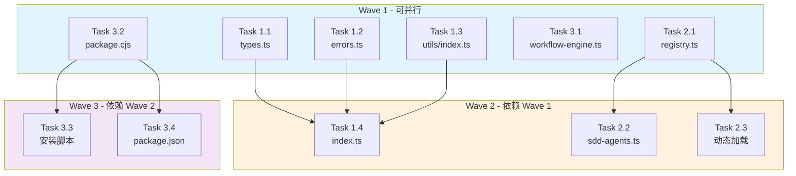

# Task Breakdown: SDD 工具系统优化

## 元数据

| 字段 | 值 |
|------|-----|
| **Feature ID** | `specs-tree-sdd-tools-optimization` |
| **Feature 名称** | SDD 工具系统优化 |
| **规范版本** | 2.3.0 |
| **状态** | tasked |
| **创建时间** | 2026-04-05 |
| **总预估工时** | 12 小时 |
| **任务总数** | 9 个 |
| **执行波次** | 3 个波次 |

---

## 执行摘要

### 任务分布

| 阶段 | 任务数 | 预估工时 | 优先级 |
|------|--------|----------|--------|
| 阶段 1: 统一导出层 | 4 个 | 4 小时 | P0 |
| 阶段 2: Agent 注册优化 | 3 个 | 5 小时 | P1 |
| 阶段 3: 集成与打包 | 2 个 | 3 小时 | P1 |

### 复杂度分布

| 等级 | 数量 | 说明 |
|------|------|------|
| **S** | 4 个 | 单一文件，<50 行代码 |
| **M** | 4 个 | 多文件，<200 行代码 |
| **L** | 1 个 | 复杂变更，动态加载逻辑 |

### 并行执行策略

```
Wave 1 (并行组 A): Task 1.1, 1.2, 1.3 ──┐
                                        ├──> Wave 2: Task 1.4
Wave 1 (并行组 B): Task 2.1 ─────────────┘
                                          │
Wave 1 (并行组 C): Task 3.1, 3.2 ─────────┼──> Wave 2: Task 2.2, 2.3
                                          │
                                          └──> Wave 3: Task 3.3, 3.4, 3.5
```

---

## Parallel Groups

### Parallel Group A: 基础类型与错误模块
**可并行执行，无相互依赖**

| Task | 文件 | 复杂度 | 工时 |
|------|------|--------|------|
| 1.1 | `src/types.ts` | S | 1h |
| 1.2 | `src/errors.ts` | S | 1.5h |
| 1.3 | `src/utils/index.ts` | S | 1h |

### Parallel Group B: Agent 注册核心
**独立模块，可与其他组并行**

| Task | 文件 | 复杂度 | 工时 |
|------|------|--------|------|
| 2.1 | `src/agents/registry.ts` | M | 2h |

### Parallel Group C: 集成与打包准备
**可并行执行，独立于其他组**

| Task | 文件 | 复杂度 | 工时 |
|------|------|--------|------|
| 3.1 | `src/discovery/workflow-engine.ts` | M | 1h |
| 3.2 | `scripts/package.cjs` | M | 1.5h |

---

## Task Details

### Task 1.1: 创建统一类型出口

**优先级**: P0  
**复杂度**: S  
**预估工时**: 1 小时  
**依赖**: 无  
**执行波次**: Wave 1 (Parallel Group A)

#### 描述
创建 `src/types.ts` 文件，作为所有类型定义的统一出口。re-export 分散在各处的类型定义，实现 ADR-011 统一类型导出架构。

#### 涉及文件
- [NEW] `src/types.ts`

#### 验收标准
- [ ] `src/types.ts` 存在且导出所有公共类型
- [ ] 原有类型文件保持兼容（不删除，仅 re-export）
- [ ] TypeScript 编译无错误
- [ ] 导出包括：Agent 相关类型、Discovery 相关类型、工具函数类型

#### 验证命令
```bash
npx tsc --noEmit
```

---

### Task 1.2: 创建统一错误处理体系

**优先级**: P0  
**复杂度**: S  
**预估工时**: 1.5 小时  
**依赖**: 无  
**执行波次**: Wave 1 (Parallel Group A)

#### 描述
创建 `src/errors.ts` 文件，定义统一的错误处理体系。实现 ADR-012 统一错误处理架构，包含自定义错误类和错误码常量。

#### 涉及文件
- [NEW] `src/errors.ts`

#### 验收标准
- [ ] `src/errors.ts` 存在且导出错误类
- [ ] 定义基础错误类 `SDDError`
- [ ] 定义具体错误类型：`AgentError`, `DiscoveryError`, `ConfigError`
- [ ] 定义错误码常量枚举
- [ ] TypeScript 编译无错误

#### 验证命令
```bash
npx tsc --noEmit
```

---

### Task 1.3: 创建工具函数统一导出

**优先级**: P0  
**复杂度**: S  
**预估工时**: 1 小时  
**依赖**: 无  
**执行波次**: Wave 1 (Parallel Group A)

#### 描述
创建 `src/utils/index.ts` 文件，统一导出所有工具函数。解决 T-001 工具函数分散问题，实现 FR-001~005 统一工具函数管理。

#### 涉及文件
- [NEW] `src/utils/index.ts`

#### 验收标准
- [ ] `src/utils/index.ts` 存在且导出所有工具函数
- [ ] 包含文件操作、路径处理、日志工具等
- [ ] 原有工具文件保持兼容
- [ ] TypeScript 编译无错误

#### 验证命令
```bash
npx tsc --noEmit
```

---

### Task 1.4: 更新主入口使用统一导出

**优先级**: P0  
**复杂度**: S  
**预估工时**: 0.5 小时  
**依赖**: Task 1.1, Task 1.2, Task 1.3  
**执行波次**: Wave 2

#### 描述
修改 `src/index.ts`，使用新创建的类型、错误、工具统一导出。确保主入口文件简洁且一致。

#### 涉及文件
- [MODIFY] `src/index.ts`

#### 验收标准
- [ ] `src/index.ts` 从 `src/types.ts` 导入类型
- [ ] `src/index.ts` 从 `src/errors.ts` 导入错误类
- [ ] `src/index.ts` 从 `src/utils/index.ts` 导入工具函数
- [ ] 公共 API 保持不变（向后兼容）
- [ ] TypeScript 编译无错误

#### 验证命令
```bash
npx tsc --noEmit && npm run build
```

---

### Task 2.1: 创建 Agent 注册表

**优先级**: P1  
**复杂度**: M  
**预估工时**: 2 小时  
**依赖**: 无  
**执行波次**: Wave 1 (Parallel Group B)

#### 描述
创建 `src/agents/registry.ts`，实现 `AgentRegistry` 类。解决 T-002 Agent 注册静态化问题，实现 ADR-013 Agent 动态注册机制。

#### 涉及文件
- [NEW] `src/agents/registry.ts`

#### 验收标准
- [ ] `AgentRegistry` 类存在且功能完整
- [ ] 支持 `register(agent)` 方法注册 Agent
- [ ] 支持 `get(agentId)` 方法获取 Agent
- [ ] 支持 `getAll()` 方法获取所有 Agent
- [ ] 支持 `unregister(agentId)` 方法注销 Agent
- [ ] 实现 FR-010~021 动态 Agent 注册需求

#### 验证命令
```bash
npx tsc --noEmit && npm test -- --testPathPattern=registry
```

---

### Task 2.2: 重构 Agent 定义使用注册表

**优先级**: P1  
**复杂度**: M  
**预估工时**: 1.5 小时  
**依赖**: Task 2.1  
**执行波次**: Wave 2

#### 描述
修改 `src/agents/sdd-agents.ts`，使用 `AgentRegistry` 替代静态导出。将原有的静态 Agent 定义迁移到注册表模式。

#### 涉及文件
- [MODIFY] `src/agents/sdd-agents.ts`

#### 验收标准
- [ ] 移除静态 Agent 对象导出
- [ ] 使用 `AgentRegistry` 注册所有内置 Agent
- [ ] 保持原有导出接口兼容
- [ ] 所有 Agent 可通过注册表获取
- [ ] TypeScript 编译无错误

#### 验证命令
```bash
npx tsc --noEmit && npm test -- --testPathPattern=agents
```

---

### Task 2.3: 实现插件目录动态加载

**优先级**: P1  
**复杂度**: L  
**预估工时**: 1.5 小时  
**依赖**: Task 2.1  
**执行波次**: Wave 2

#### 描述
实现从 `templates/agents/` 目录动态加载 Agent 插件。解决 T-006 Agent 配置分散问题，支持运行时扩展。

#### 涉及文件
- [MODIFY] `src/agents/registry.ts`

#### 验收标准
- [ ] 实现 `loadFromDirectory(path)` 方法
- [ ] 支持 `.js` 和 `.ts` 格式的 Agent 插件
- [ ] 插件自动注册到 `AgentRegistry`
- [ ] 加载错误不影响其他插件
- [ ] 提供加载日志输出

#### 验证命令
```bash
npx tsc --noEmit && ls templates/agents/
```

---

### Task 3.1: Discovery 可选状态联动

**优先级**: P1  
**复杂度**: M  
**预估工时**: 1 小时  
**依赖**: 无  
**执行波次**: Wave 1 (Parallel Group C)

#### 描述
修改 `src/discovery/workflow-engine.ts`，增加可选状态联动功能。解决 T-003 Discovery 集成度低问题，实现 FR-026~030 Discovery 集成需求。

#### 涉及文件
- [MODIFY] `src/discovery/workflow-engine.ts`

#### 验收标准
- [ ] 增加 `onStatusChange` 回调机制
- [ ] 支持状态变更时触发联动事件
- [ ] 可选状态包括：pending, running, completed, failed
- [ ] 联动事件可配置
- [ ] TypeScript 编译无错误

#### 验证命令
```bash
npx tsc --noEmit && npm test -- --testPathPattern=discovery
```

---

### Task 3.2: 创建打包脚本

**优先级**: P1  
**复杂度**: M  
**预估工时**: 1.5 小时  
**依赖**: 无  
**执行波次**: Wave 1 (Parallel Group C)

#### 描述
创建 `scripts/package.cjs` 打包脚本。实现 FR-022~025 打包优化需求，支持 `dist/sdd/` 目录结构输出。

#### 涉及文件
- [NEW] `scripts/package.cjs`

#### 验收标准
- [ ] `scripts/package.cjs` 存在且可执行
- [ ] 打包输出到 `dist/sdd/` 目录
- [ ] 包含所有必要文件（src, templates, scripts）
- [ ] 排除开发文件和测试文件
- [ ] 生成 `package.json` 包含正确依赖

#### 验证命令
```bash
node scripts/package.cjs && ls -la dist/sdd/
```

---

### Task 3.3: 更新安装脚本适配新结构

**优先级**: P1  
**复杂度**: S  
**预估工时**: 1 小时  
**依赖**: Task 3.2  
**执行波次**: Wave 3

#### 描述
修改 `install.sh` 和 `install.ps1`，适配新的 `dist/sdd/` 目录结构。确保安装脚本正确部署打包后的文件。

#### 涉及文件
- [MODIFY] `install.sh`
- [MODIFY] `install.ps1`

#### 验收标准
- [ ] `install.sh` 从 `dist/sdd/` 复制文件
- [ ] `install.ps1` 从 `dist/sdd/` 复制文件
- [ ] 保持原有安装逻辑（权限设置、环境变量等）
- [ ] 支持跨平台路径处理
- [ ] 安装后验证文件完整性

#### 验证命令
```bash
bash install.sh --dry-run
powershell -File install.ps1 -DryRun
```

---

### Task 3.4: 更新 package.json 添加打包脚本

**优先级**: P1  
**复杂度**: S  
**预估工时**: 0.5 小时  
**依赖**: Task 3.2  
**执行波次**: Wave 3

#### 描述
修改 `package.json`，添加 `package` 脚本调用 `scripts/package.cjs`。实现 ADR-014 打包分发结构优化。

#### 涉及文件
- [MODIFY] `package.json`

#### 验收标准
- [ ] 添加 `"package": "node scripts/package.cjs"` 脚本
- [ ] 添加 `"prepackage": "npm run build"` 预脚本
- [ ] `files` 字段更新为 `dist/sdd/**/*`
- [ ] `main` 字段指向 `dist/sdd/src/index.js`
- [ ] JSON 格式验证通过

#### 验证命令
```bash
cat package.json | python -m json.tool && npm run package --dry-run
```

---

## 依赖关系图



---

## 风险与缓解

| 风险 | 影响 | 缓解措施 |
|------|------|----------|
| 类型定义遗漏 | 编译错误 | Task 1.1 完成后立即运行 `tsc --noEmit` |
| Agent 注册表兼容性问题 | 运行时错误 | Task 2.2 保持原有导出接口 |
| 动态加载性能问题 | 启动延迟 | Task 2.3 添加缓存机制 |
| 打包脚本平台兼容性 | 部署失败 | Task 3.2 使用 cross-platform 路径库 |

---

## 下一步

👉 运行 `@sdd-build TASK-1.1` 开始实现第一个任务

```bash
/tool sdd_update_state {"feature": "specs-tree-sdd-tools-optimization", "state": "tasked"}
```
