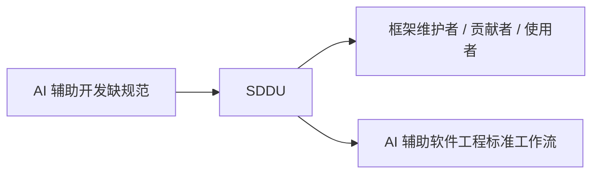
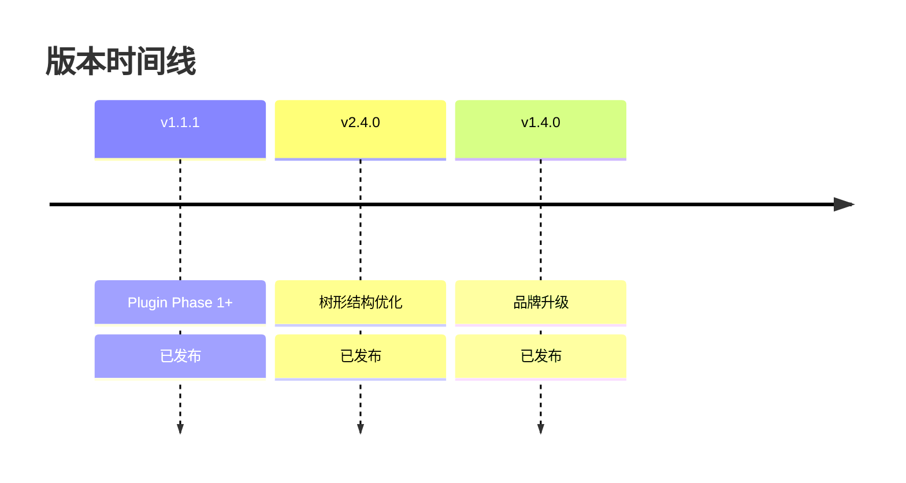
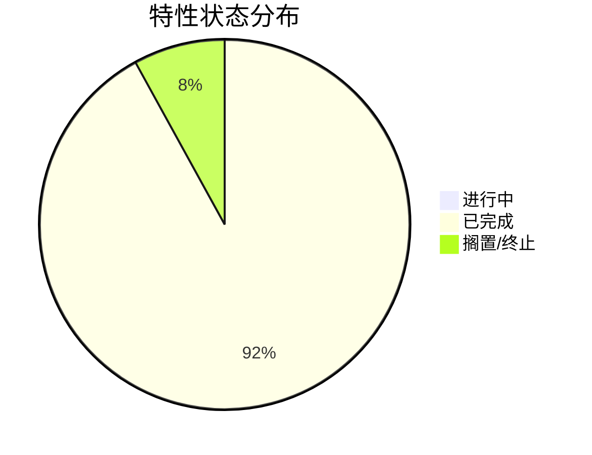
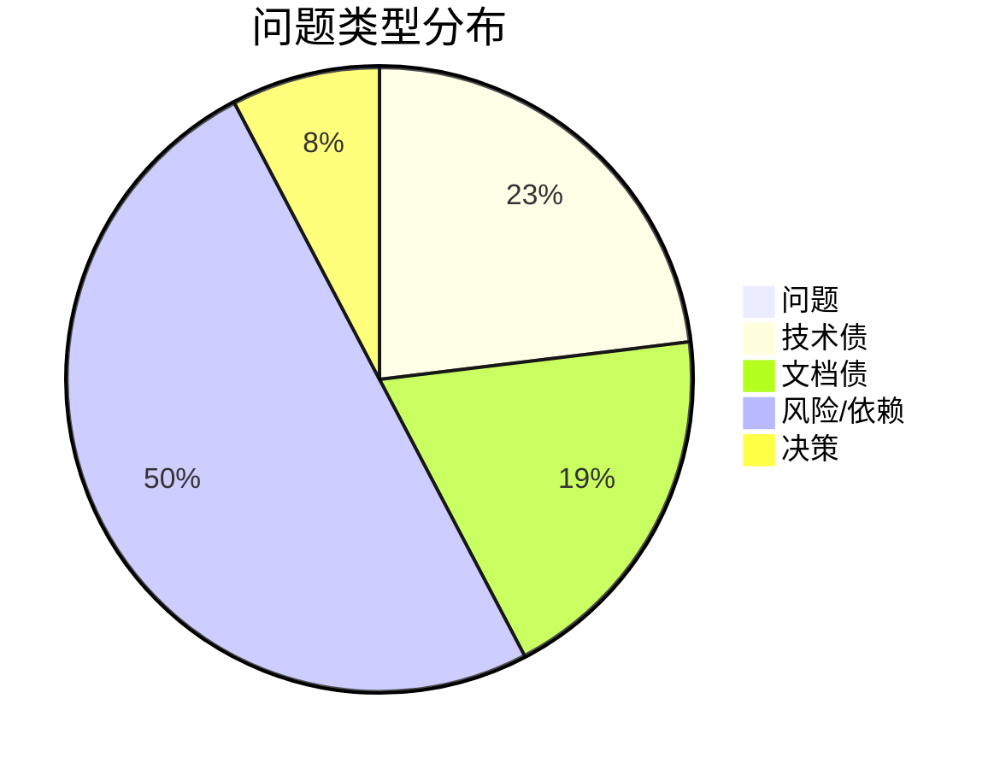
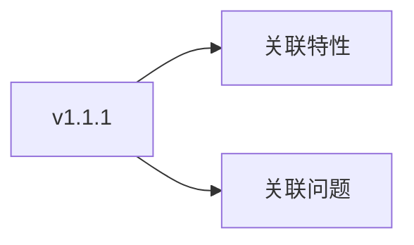
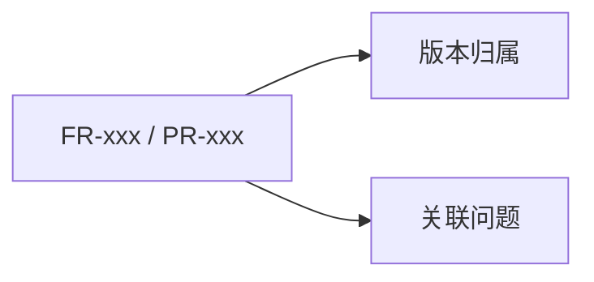
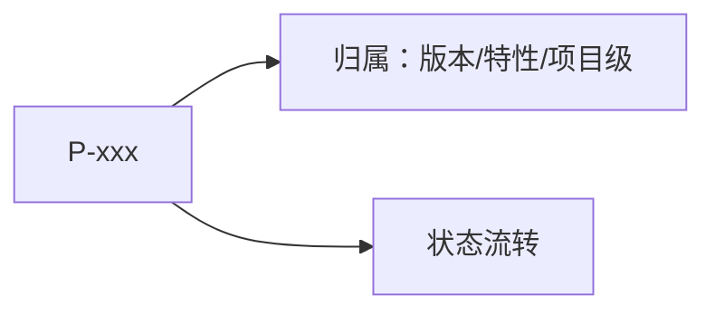
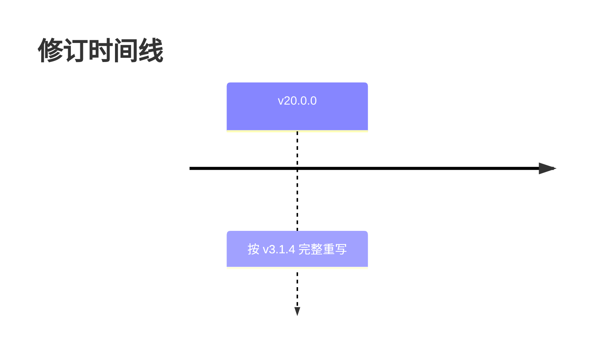

# 版本 Roadmap：SDDU

<!-- sddu:zone id="meta" mode="rewrite" -->
> **文档定位**: SDDU 版本路线图 — 跨版本 / 项目级顶层规划，是本文件格式的唯一权威来源  
> **输出文件名**: .sddu/ROADMAP.md  
> **前置依赖**: 无硬性前置依赖（可基于现有 spec/plan 或从零规划）  
> **创建人**: SDDU Roadmap Agent  
> **创建时间**: 2026-04-06  
> **版本**: v22.0.0
> **更新人**: SDDU Roadmap Agent
> **更新时间**: 2026-09-24
> **更新说明**: 按 v3.2.1 模板完整重排为概览/详情分层 8 章（含表格 preserve 区行自然键合并 R1 修复）；内容无损
> **当前项目版本**: v4.0.0
> **全局状态**: 规划中 — 25 特性（23 completed / 1 suspended / 1 terminated）
> **生成方式**: 完整生成  
<!-- /sddu:zone -->

## 1. 项目愿景与定位

<!-- sddu:zone id="vision" mode="rewrite" -->

SDDU（Spec-Driven Development Unified）是一套面向 AI 辅助开发的规范驱动工作流框架，由 12 个专业化 Agent 协同承载（7 阶段主流水线 + @sddu-fast + @sddu-roadmap / @sddu-docs 等辅助 Agent）。项目自 2026 年 3 月启动，已迭代至 v4.0.0，25 个 Feature 中 23 个完成 validated。

长期愿景是成为 AI 辅助软件工程的标准工作流框架。演进路径：v3.0.0 系列聚焦质量闭环；v3.3.0 的 FR-FAST-001 / FR-SKILL-001 使 SDDU 进入「固定引擎 + 可扩展能力」双层架构；v4.0.0 完成三域分层与平台适配器隔离。当前重心为「质量闭环 + 待办清理」，并为多平台生态扩展积累条件。
<!-- /sddu:zone -->

## 2. 版本清单

<!-- sddu:zone id="version-list" mode="rewrite" -->

| 版本 | 主题 | 时间窗 | 状态 | 特性数 | 开放问题数 |
|------|------|--------|------|:--:|:--:|
| v1.1.1 | Plugin Phase 1+ | 2026-03-30 | 已发布 | 1 | 0 |
| v2.4.0 | Feature 拆分与树形结构优化 | 2026-04-13 | 已发布 | 3 | 0 |
| v1.4.0 | SDD → SDDU 品牌升级 | 2026-04-20 | 已发布 | 2 | 0 |
| v2.5.0 | Agent 输出模板化系统 | 2026-05-25 | 已发布 | 2 | 1 |
| v2.6.0 | SDDU 特性状态增强 | 2026-06-13 | 已发布 | 1 | 1 |
| v3.0.1 | 模板质量统一 | 2026-06-19 | 已发布 | 2 | 2 |
| v4.0.0 | 源码架构重组 | 2026-06-21 | 已发布 | 1 | 0 |
| v3.3.0 | Agent 行为强化 + 轻量入口 | 2026-07-19 | 部分完成 | 2 | 3 |
| v3.0.0 | 质量与工作流改进（A-F） | 2026-09-30 | 规划中 | 2 | 4 |
| v3.1.0 | Skill 化降级验证 | TBD | 提议中 | 1 | 2 |
| v3.2.0 | 项目知识基础设施（H・I） | TBD | 部分完成 | 1 | 2 |
| v4.1.0 | 生态扩展（远期） | TBD | 远期 | 1 | 3 |

排序依据：按「时间窗」升序；精确日期取日期值，季度窗口按其覆盖区间结束日参与排序（如 2026-Q3 记为 2026-09-30），`TBD` 置末。
<!-- /sddu:zone -->

## 3. 特性清单

<!-- sddu:zone id="feature-list" mode="rewrite" -->

| Feature ID | 名称 | 类型 | 状态 | 版本归属 |
|------------|------|:--:|------|:--:|
| FR-TEMPLATE-001 | Agent 输出模板化系统 | 特性 | completed | 1.0.0 |
| FR-DIR-001 | specs-tree-root 管理目录结构命名优化 | 特性 | completed | 1.0.0 |
| FR-PLUGIN-RENAME-SDDU | Plugin Rename SDDU — 从 SDD 全面迁移至 SDDU | 特性 | completed | 1.0.0 |
| FR-SDD-PLUGIN-ROADMAP | SDD Roadmap 规划专家 | 特性 | completed | 1.0.0 |
| FR-SDD-PLUGIN-BASELINE | SDD Plugin Phase 1 基线 | 特性 | completed | 1.1.0 |
| FR-SDD-MULTI-001 | SDD 子 Feature 化并行开发支持 | 特性 | completed | 1.2.11 |
| FR-PLUGIN-RENAME-SDDU-V2 | Plugin Rename SDDU V2 — 代码清理 | 特性 | completed | 2.0.0 |
| FR-SDD-WORKFLOW-STATE-OPTIMIZATION | SDD 工作流状态优化 | 特性 | completed | 2.0.0 |
| FR-TREE-STRUCTURE-OPTIMIZATION | v2.4.0 Feature 拆分与树形结构优化 | 特性 | completed | v2.1.0 |
| FR-TREE-STRUCTURE-OPTIMIZATION-V2 | 树形结构优化 v2 — 问题修复 | 特性 | completed | v2.1.0 |
| ETD-001 | ETD（Expert Tree Design） | 特性 | terminated | 2.2.0 |
| FR-AUTONOMY-001 | 自主模式（sddu-auto 自动调度） | 特性 | suspended | v3.0.0 |
| FR-DOCS-AGENT-OPTIMIZATION | @sddu-docs Agent 补全与优化 | 特性 | completed | v3.0.0 |
| FR-TREE-SKILL | @sddu-tree Agent 技能化 | 特性 | completed | v3.1.0 |
| FR-SKILL-001 | SDDU Skill 系统（用户级 + 框架级） | 特性 | completed | 3.3.0-early |
| FR-FAST-001 | @sddu-fast 快速模式 Agent | 特性 | completed | v3.3.0 |
| FR-FRAMEWORK-ARCH-001 | SDDU 框架源码架构重组 | 特性 | completed | v4.0.0 |
| FR-ROADMAP-TPL-001 | @sddu-roadmap 输出模板补全 | 特性 | completed | v4.1.0 |
| FR-AGENT-SCOPE-001 | plan/review/validate 职责回归改造 | 特性 | completed | 不适用 |
| FR-DEP-001 | 弃用旧版 SDD 工具 | 特性 | completed | 不适用 |
| FR-SDD-DISCOVERY-001 | SDD Discovery 需求挖掘能力增强 | 特性 | completed | 不适用 |
| FR-SDD-TOOLS-OPTIMIZATION | SDD 工具系统优化 | 特性 | completed | 不适用 |
| FR-STATUS-ENHANCE-001 | SDDU 特性状态增强 | 特性 | completed | 不适用 |
| FR-TPL-001 | 预置输出模板质量统一 | 特性 | completed | 不适用 |
| FR-ROADMAP-STRUCT-001 | Roadmap 模板结构重构 v2 | 特性 | completed | v3.2.1 |
| PR-001 | Skill 化评估：FR-BUG-001 → sddu-bug | 提案 | 提案 | v3.1.0 |
| PR-002 | Skill 化评估：FR-WORKTREE-001 → sddu-worktree | 提案 | 提案 | v3.1.0 |
| PR-003 | 自主模式重启评估（FR-AUTONOMY-001） | 提案 | 提案 | v3.3.0 |
| PR-004 | 全局项目配置（FR-KB-001） | 提案 | 提案 | v3.2.0 |
| PR-005 | Feature 级共享语言 CONTEXT.md（FR-CONTEXT-001） | 提案 | 提案 | v3.2.0 |
| PR-006 | Discovery 访谈效率优化（FR-DISCOVERY-002） | 提案 | 提案 | v3.3.0 |

排序依据：按「状态（非 completed 在前）→ 版本归属升序 → specs-tree 目录字典序」。本区为实时投影（`mode="rewrite"`），随 `.sddu/specs-tree-root/` 下各 Feature `state.json` 变化整体重建；`Feature ID` 与 `版本归属` 回退取值 / 推断均已就地标注来源。
<!-- /sddu:zone -->

## 4. 问题清单

<!-- sddu:zone id="issue-list" mode="preserve" -->

| ID | 类型 | 摘要 | 影响 | 归属 | 状态 |
|----|------|------|:--:|------|:--:|
| P-001 | 风险 | 无活跃 Feature 空窗期过长 | 高 | 项目级 | 已转化 |
| P-002 | 风险 | FR-AUTONOMY-001 自主边界定义模糊（过度自主 ↔ 过度谨慎） | 高 | 项目级 | 开放 |
| P-003 | 风险 | 不可逆操作缺少统一 HARD-GATE 强制确认 | 高 | 项目级 | 开放 |
| P-004 | 风险 | 框架级自验证流程缺失（Issue C 遗留） | 中 | 项目级 | 开放 |
| P-005 | 风险 | 4 个预存测试失败（2 timeout + 1 断言 + 1 OOM） | 中 | 项目级 | 开放 |
| P-006 | 风险 | 前沿 Feature 过早承诺（含 P2 远期） | 低 | 项目级 | 开放 |
| P-007 | 风险 | TUI 界面与 MCP 集成持续延期（v2.5.0 遗留） | 低 | 项目级 | 开放 |
| P-008 | 风险 | SDD→SDDU 迁移残留可能回归 | 低 | 项目级 | 开放 |
| P-009 | 风险 | 竞品借鉴结论时效性未定期复核 | 低 | 项目级 | 开放 |
| P-010 | 技术债 | 技术债台账约 45 项（Bug/质量 10 · 增强 17 · 技术债 9 · 文档配置 7 · 搁置关注 4） | 中 | 项目级 | 开放 |
| P-011 | 技术债 | 模板校验工具命令缺失（FR-014 / FR-015 / FR-016「未来」） | 低 | 项目级 | 开放 |
| P-012 | 技术债 | 旧 schema 文件 schema-v1.2.5.ts / schema-v2.0.0.ts 待清理 | 低 | 项目级 | 开放 |
| P-013 | 技术债 | `@deprecated` FeatureStateEnum 类型别名待移除 | 低 | 项目级 | 开放 |
| P-014 | 技术债 | 仪表盘分类 / 排序 / 过滤逻辑未迁入 src/state/，缺单测 | 中 | 项目级 | 开放 |
| P-015 | 技术债 | consistency-checker 缺真实 `.sddu/` 目录结构集成测试 | 中 | 项目级 | 开放 |
| P-016 | 文档债 | root state.json `features.completed` 命名空间陈旧（T-001~T-018） | 低 | 项目级 | 开放 |
| P-017 | 文档债 | COMPLETION_CERTIFICATE.json 第 47 行 `.sdd/` 路径引用 | 低 | 项目级 | 开放 |
| P-018 | 文档债 | `.sddu/docs/` 下 17+ 冗余 Wave1 迁移文件待归档 | 低 | 项目级 | 开放 |
| P-019 | 文档债 | docs 导航是否含 v3.0.0 内容待校验（DOC4/5/6） | 低 | 项目级 | 开放 |
| P-020 | 文档债 | specs-tree-agent-output-templating 的 stale spec.json 待同步 | 低 | 项目级 | 开放 |
| P-021 | 依赖 | ETD-001 迁出后独立仓库仍为「待创建」 | 低 | 项目级 | 开放 |
| P-022 | 依赖 | 外部参考依据 docs/research/*.md 需季度复核 | 低 | 项目级 | 开放 |
| P-023 | 依赖 | 关键路径 state.json + ADR 主集合（ADR-001~017） | 低 | 项目级 | 开放 |
| P-024 | 依赖 | discover.cjs 与 sync.cjs 互相独立，需保持解耦 | 低 | 项目级 | 开放 |
| P-025 | 决策 | 确认 FR-AUTONOMY-001 与 FR-DISCOVERY-002 的 scope 关系 | 中 | 项目级 | 已转化 |
| P-026 | 决策 | 决定剩余辅助 Agent 输出模板补全范围（S9） | 低 | 项目级 | 开放 |
<!-- /sddu:zone -->

## 5. 版本详情

<!-- sddu:zone id="version-detail" mode="preserve" -->

<!-- sddu:entry id="v1.1.1" -->
### v1.1.1 — Plugin Phase 1+
- **目标**: 交付 SDD 插件 Phase 1 基线能力（基础架构、配置管理、生命周期管理、可观测性），上线 16 个 Agent。
- **关联特性**: FR-SDD-PLUGIN-BASELINE（specs-tree-sdd-plugin-baseline）
- **关联问题**: 无
- **里程碑**: 2026-03-30 发布
- **风险与依赖**: 无
<!-- /sddu:entry -->
<!-- sddu:entry id="v1.4.0" -->
### v1.4.0 — SDD → SDDU 品牌升级
- **目标**: 插件生态从 @sdd-* 全面迁移到 @sddu-*，实现双命名空间管理与向后兼容。
- **关联特性**: FR-PLUGIN-RENAME-SDDU（specs-tree-plugin-rename-sddu）、FR-PLUGIN-RENAME-SDDU-V2（specs-tree-plugin-rename-sddu-v2）
- **关联问题**: 无
- **里程碑**: 2026-04-20 发布（18 个迁移任务 T-001~T-018 完成，100% 向后兼容）
- **风险与依赖**: 迁移残留回归风险 → 见 P-008（项目级）
<!-- /sddu:entry -->
<!-- sddu:entry id="v2.4.0" -->
### v2.4.0 — Feature 拆分与树形结构优化
- **目标**: 支持无限层树形 Feature 嵌套与跨子树依赖检查，定义「轻量化父级 / 完整叶子」规范并统一 state.json schema；同步完成目录命名优化。
- **关联特性**: FR-TREE-STRUCTURE-OPTIMIZATION（specs-tree-tree-structure-optimization）、FR-TREE-STRUCTURE-OPTIMIZATION-V2（specs-tree-tree-structure-optimization-v2）、FR-DIR-001（specs-tree-directory-optimization）
- **关联问题**: 无
- **里程碑**: 2026-04-13 发布；v2 修复 2026-04-15
- **风险与依赖**: 无
<!-- /sddu:entry -->
<!-- sddu:entry id="v2.5.0" -->
### v2.5.0 — Agent 输出模板化系统
- **目标**: 将主流程 Agent 的输出固化为 Handlebars 标准化模板，支持用户自定义模板覆盖内置默认模板。
- **关联特性**: FR-TEMPLATE-001（specs-tree-agent-output-templating）、FR-SDD-PLUGIN-ROADMAP（specs-tree-sdd-plugin-roadmap）
- **关联问题**: P-020（stale spec.json）
- **里程碑**: 2026-05-25 发布（13 FR / 6 NFR / 8 EC 100% 通过）
- **风险与依赖**: TUI / MCP 集成依赖本模板系统，延期 → P-007（项目级）
<!-- /sddu:entry -->
<!-- sddu:entry id="v2.6.0" -->
### v2.6.0 — SDDU 特性状态增强
- **目标**: 状态模型从单字段混用重构为两字段隔离（phase 8 阶段 / status 5 状态），内置一致性检测、标记命令与分类仪表盘。
- **关联特性**: FR-STATUS-ENHANCE-001（specs-tree-sddu-status-enhancement）
- **关联问题**: P-014（仪表盘逻辑未迁入 src/）
- **里程碑**: 2026-06-13 发布（v3.0.0 状态模型）
- **风险与依赖**: 无
<!-- /sddu:entry -->
<!-- sddu:entry id="v3.0.1" -->
### v3.0.1 — 模板质量统一
- **目标**: 统一 17 个内置模板的格式与结构，明确全部 11 个 Agent 的职责边界；同步补全 @sddu-docs。
- **关联特性**: FR-TPL-001（specs-tree-template-quality-unification）、FR-DOCS-AGENT-OPTIMIZATION（specs-tree-docs-agent-optimization）
- **关联问题**: P-020、P-023
- **里程碑**: 2026-06-19 发布（22 FR + 3 NFR 100% 通过）；FR-DOCS-OPT-001 于 2026-07-05 完成
- **风险与依赖**: 模板质量回归风险 → 由 review/validate 结构化方法论缓解
<!-- /sddu:entry -->
<!-- sddu:entry id="v4.0.0" -->
### v4.0.0 — 源码架构重组
- **目标**: 三域分层架构重组 + 平台适配器隔离，为跨平台扩展奠定基础。
- **关联特性**: FR-FRAMEWORK-ARCH-001（specs-tree-framework-architecture）
- **关联问题**: 无
- **里程碑**: 2026-06-21 发布（全部现有测试通过，npm build/pack 验证通过）
- **风险与依赖**: scope 膨胀与回归 → 已解决（测试通过）
<!-- /sddu:entry -->
<!-- sddu:entry id="v3.0.0" -->
### v3.0.0 — 质量与工作流改进（A-F）
- **目标**: 解决 specs-tree-sddu-status-enhancement E2E 全流程验证（2026-06-13）暴露的 6 个框架级问题（A-F），并以职责回归作为 Issue F 的根本解法。
- **关联特性**: FR-AGENT-SCOPE-001（specs-tree-agent-scope-realignment，已交付 2026-08-01，替换被取消的 FR-QUALITY-003）、FR-AUTONOMY-001（specs-tree-autonomous-mode，已搁置）
- **关联问题**: P-004（框架级自验证）、P-005（预存测试失败）
- **里程碑**: 目标 2026-09-30 全部 Feature 完成；FR-AGENT-SCOPE-001 已于 2026-08-01 validated（62 项检查：58 pass / 3 warn / 0 fail）
- **风险与依赖**: v3.0.0 范围蔓延（6 问题全做）→ 严格按优先级排序；Build Wave 一体化改动大 → 提前原型验证
<!-- /sddu:entry -->
<!-- sddu:entry id="v3.1.0" -->
### v3.1.0 — Skill 化降级验证
- **目标**: 将已规划独立 Feature 降级为框架级 Skill，验证 FR-SKILL-001 定义的「Agent→Skill 降级模型」；原总 Effort 8d（M×2）→ Skill 化后约 5d（S×3）。
- **关联特性**: FR-TREE-SKILL（specs-tree-tree-skill，已交付 2026-07-22 有条件通过）、PR-001、PR-002
- **关联问题**: 无
- **里程碑**: TBD — 待复用 FR-TREE-SKILL 降级结论后启动剩余两项
- **风险与依赖**: FR-BUG-001 轻 / 重修复边界模糊、Skill 化后 scope 漂移 → discovery 阶段定义判定标准；FR-WORKTREE-001 嵌套 worktree 检测与平台兼容 → 优先平台原生工具降级 git worktree
<!-- /sddu:entry -->
<!-- sddu:entry id="v3.2.0" -->
### v3.2.0 — 项目知识基础设施（H・I）
- **目标**: 建立项目知识层 —— FR-KB-001 管「怎么做」（技术栈 / 命名规范 / 代码风格），FR-CONTEXT-001 管「说什么」（领域语言 / 术语表）；v4.0.0 三域分层为配置格式提供平台无关性参考。
- **关联特性**: FR-KB-002（已由 @sddu-docs 实现，对应 Issue H）、PR-004、PR-005
- **关联问题**: P-009、P-026
- **里程碑**: TBD — 依赖 v3.1.0 部分完成；FR-KB-001 与 FR-CONTEXT-001 可并行推进
- **风险与依赖**: FR-KB-001 全局配置 schema 争议 → 参考主流框架实践；FR-CONTEXT-001 词汇表格式不一致 → 定义标准格式模板
<!-- /sddu:entry -->
<!-- sddu:entry id="v3.3.0" -->
### v3.3.0 — Agent 行为强化 + 轻量入口
- **目标**: 轻重双模入口（@sddu-fast）+ Skill 系统双层架构（固定引擎 + 可扩展能力）+ 「自主-约束」双翼（自主模式 × 理性化对抗）。
- **关联特性**: FR-FAST-001（specs-tree-sddu-fast，已交付 2026-07-12）、FR-SKILL-001（specs-tree-skill-system，已交付 2026-07-19）、PR-003、PR-006
- **关联问题**: P-001、P-002、P-003
- **里程碑**: 2026-07-19 两项提前交付；FR-RATIONAL-001 需 v3.0.0~v3.2.0 交付后启动
- **风险与依赖**: FR-AUTONOMY-001 自主边界模糊 / 过度自主 → 已搁置，重启需四维边界模型 + HARD-GATE；Skill 运营（用户不填充 / 冗余过时）→ skill-creator 降门槛 + 门禁约束
<!-- /sddu:entry -->
<!-- sddu:entry id="v4.1.0" -->
### v4.1.0 — 生态扩展（远期）
- **目标**: 基于 v4.0.0 的 adapters/ 架构扩展到 OpenCode 之外的 AI Agent 平台，并提升 Agent 主动性。
- **关联特性**: FR-ROADMAP-TPL-001（specs-tree-roadmap-output-template，已交付）、PR-007（多平台适配）、PR-008（Agent 自动触发）
- **关联问题**: P-006
- **里程碑**: TBD（远期；每季度回顾是否达到启动评估条件）
- **风险与依赖**: FR-CROSSPLAT-001 依赖 FR-FRAMEWORK-ARCH-001（已就绪）；前瞻 Feature 过早承诺 → 标记远期、季度回顾
<!-- /sddu:entry -->
<!-- /sddu:zone -->

## 6. 特性详情

<!-- sddu:zone id="feature-detail" mode="preserve" -->

<!-- sddu:entry id="FR-ROADMAP-STRUCT-001" -->
### FR-ROADMAP-STRUCT-001 — Roadmap 模板结构重构 v2
- **定位**: 把 ROADMAP 模板从扁平 8 章重构为概览/详情分层，消除「下一步行动」杂物箱与双时间轴。
- **优先级**: P1
- **版本归属**: v3.2.1
- **关联问题**: 无
- **状态与去向**: 已交付（validated，2026-09-24；R1 修复表格 preserve 区行自然键合并后收尾）
- **详档锚点**: .sddu/specs-tree-root/specs-tree-roadmap-structure-v2/
- **风险与依赖**: Mermaid 语法陷阱 / LLM 指令遵循度 → 静态校验 + 沙箱演练
<!-- /sddu:entry -->
<!-- sddu:entry id="FR-ROADMAP-TPL-001" -->
### FR-ROADMAP-TPL-001 — @sddu-roadmap 输出模板补全
- **定位**: 为 @sddu-roadmap 建立唯一权威输出模板（zone/entry 增量合并机制）。
- **优先级**: P0
- **版本归属**: v4.1.0
- **关联问题**: 无
- **状态与去向**: 已交付（validated，含 R1~R5 修复）
- **详档锚点**: .sddu/specs-tree-root/specs-tree-roadmap-output-template/
- **风险与依赖**: 无
<!-- /sddu:entry -->
<!-- sddu:entry id="FR-AGENT-SCOPE-001" -->
### FR-AGENT-SCOPE-001 — plan/review/validate 职责回归改造
- **定位**: 收敛 plan/review/validate 三 Agent 职责边界，作为 Issue F 的根本解法。
- **优先级**: P0
- **版本归属**: 不适用
- **关联问题**: 无（替换已取消的 FR-QUALITY-003）
- **状态与去向**: 已交付（2026-08-01 validated，62 项检查 58 pass）
- **详档锚点**: .sddu/specs-tree-root/specs-tree-agent-scope-realignment/
- **风险与依赖**: 模板变更回归 → 逐个 Agent 修改 + 验证
<!-- /sddu:entry -->
<!-- sddu:entry id="FR-SKILL-001" -->
### FR-SKILL-001 — SDDU Skill 系统
- **定位**: 建立用户级 + 框架级双层 Skill 体系与三元自举闭环。
- **优先级**: P0
- **版本归属**: v3.3.0
- **关联问题**: 无
- **状态与去向**: 已交付（2026-07-19，三元自举闭环）
- **详档锚点**: .sddu/specs-tree-root/specs-tree-skill-system/
- **风险与依赖**: 混合触发准确率 → 三阶段渐进披露模型
<!-- /sddu:entry -->
<!-- sddu:entry id="FR-TREE-SKILL" -->
### FR-TREE-SKILL — @sddu-tree Agent 技能化
- **定位**: Agent→Skill 降级模型的首个实战验证案例。
- **优先级**: P1
- **版本归属**: v3.1.0
- **关联问题**: 无
- **状态与去向**: 已交付（2026-07-22 有条件通过）
- **详档锚点**: .sddu/specs-tree-root/specs-tree-tree-skill/
- **风险与依赖**: 依赖 FR-SKILL-001 三元闭环（已交付）
<!-- /sddu:entry -->
<!-- sddu:entry id="FR-FAST-001" -->
### FR-FAST-001 — @sddu-fast 快速模式 Agent
- **定位**: 提供轻量任务直接解决入口（无状态、零产物）。
- **优先级**: P1
- **版本归属**: v3.3.0
- **关联问题**: 无
- **状态与去向**: 已交付（2026-07-12）
- **详档锚点**: .sddu/specs-tree-root/specs-tree-sddu-fast/
- **风险与依赖**: 复杂度评估误判 → 模板内置复杂度评估清单 + 轻重双入口
<!-- /sddu:entry -->
<!-- sddu:entry id="FR-AUTONOMY-001" -->
### FR-AUTONOMY-001 — 自主模式
- **定位**: sddu-auto 自动调度，降低 Agent 频繁提问。
- **优先级**: P2
- **版本归属**: v3.0.0
- **关联问题**: P-002 / P-003
- **状态与去向**: 2026-09-13 长期搁置（auto 效果不稳定，无恢复期限）
- **详档锚点**: .sddu/specs-tree-root/specs-tree-autonomous-mode/
- **风险与依赖**: 自主边界定义模糊 / 过度自主不可逆错误 → HARD-GATE 强制确认
<!-- /sddu:entry -->
<!-- sddu:entry id="FR-FRAMEWORK-ARCH-001" -->
### FR-FRAMEWORK-ARCH-001 — SDDU 框架源码架构重组
- **定位**: 三域分层架构 + 平台适配器隔离。
- **优先级**: P0
- **版本归属**: v4.0.0
- **关联问题**: 无
- **状态与去向**: 已交付（2026-06-21）
- **详档锚点**: .sddu/specs-tree-root/specs-tree-framework-architecture/
- **风险与依赖**: 无
<!-- /sddu:entry -->
<!-- sddu:entry id="ETD-001" -->
### ETD-001 — ETD（Expert Tree Design）
- **定位**: 独立的多专家树设计能力探索。
- **优先级**: P2
- **版本归属**: 2.2.0
- **关联问题**: P-021
- **状态与去向**: 已终止并迁出至独立仓库
- **详档锚点**: .sddu/specs-tree-root/specs-tree-solo-team-flow/
- **风险与依赖**: 独立仓库仍为「待创建」
<!-- /sddu:entry -->
<!-- sddu:entry id="PR-001" -->
### PR-001 — Skill 化评估：FR-BUG-001 → sddu-bug
- **定位**: 把 Bug 流程框架化为框架级 Skill，验证轻量流程。
- **优先级**: P0
- **版本归属**: v3.1.0
- **关联问题**: 无
- **状态与去向**: 提案待决（Skill 化路径最成熟）
- **详档锚点**: 无（未立项提案）
- **风险与依赖**: 轻 / 重修复边界模糊、scope 漂移
<!-- /sddu:entry -->
<!-- sddu:entry id="PR-003" -->
### PR-003 — 自主模式重启评估（FR-AUTONOMY-001）
- **定位**: 在「自主-约束」双翼下重新评估自主模式。
- **优先级**: P2
- **版本归属**: v3.3.0
- **关联问题**: P-002 / P-003 / P-025
- **状态与去向**: 提案待决（当前搁置）
- **详档锚点**: 无（未立项提案）
- **风险与依赖**: 与 FR-DISCOVERY-002 scope 重叠
<!-- /sddu:entry -->
<!-- sddu:entry id="PR-004" -->
### PR-004 — 全局项目配置（FR-KB-001）
- **定位**: `.sddu/project.json` 承载技术栈 / 命名规范 / 代码风格，并为 autonomyLevel 预留载体。
- **优先级**: P0
- **版本归属**: v3.2.0
- **关联问题**: P-009
- **状态与去向**: 提案待决（需先收拢需求）
- **详档锚点**: 无（未立项提案）
- **风险与依赖**: 全局配置 schema 争议
<!-- /sddu:entry -->
<!-- sddu:entry id="PR-006" -->
### PR-006 — Discovery 访谈效率优化（FR-DISCOVERY-002）
- **定位**: 降低 Discovery 交互轮次与耗时。
- **优先级**: P2
- **版本归属**: v3.3.0
- **关联问题**: P-025
- **状态与去向**: 提案待决（scope 关系待决策）
- **详档锚点**: 无（未立项提案）
- **风险与依赖**: 批量提问导致用户信息过载 / 与 AUTONOMY-001 scope 重叠
<!-- /sddu:entry -->
<!-- sddu:entry id="PR-007" -->
### PR-007 — 多平台适配（FR-CROSSPLAT-001）
- **定位**: 扩展到 OpenCode 之外的 AI Agent 平台。
- **优先级**: P2
- **版本归属**: v4.1.0
- **关联问题**: P-006
- **状态与去向**: 提案待决（远期，依赖 adapters/ 架构）
- **详档锚点**: 无（未立项提案）
- **风险与依赖**: 依赖 FR-FRAMEWORK-ARCH-001（已就绪）
<!-- /sddu:entry -->
<!-- /sddu:zone -->

## 7. 问题详情

<!-- sddu:zone id="issue-detail" mode="preserve" -->

<!-- sddu:entry id="P-001" -->
### P-001 — 无活跃 Feature 空窗期过长
- **描述**: 当前仓库活跃（tracked / 进行中）Feature 数量长期偏低。
- **影响**: 高
- **归属**: 项目级
- **建议处置**: 立项 FR-ROADMAP-STRUCT-001 等候选 Feature，推进 discovery → spec
- **状态与流转**: 已转化（→ FR-ROADMAP-STRUCT-001，2026-09-24）
<!-- /sddu:entry -->
<!-- sddu:entry id="P-002" -->
### P-002 — FR-AUTONOMY-001 自主边界定义模糊
- **描述**: 自主模式在「过度自主 ↔ 过度谨慎」之间缺少可判定边界。
- **影响**: 高（风险类：触发条件 = 重启自主模式时；概率 = 中高）
- **归属**: 项目级
- **建议处置**: 若重启，以四维边界模型（可逆性 / 影响半径 / 置信度 / 成本）为首要决策项
- **状态与流转**: 开放（随 FR-AUTONOMY-001 搁置）
<!-- /sddu:entry -->
<!-- sddu:entry id="P-005" -->
### P-005 — 4 个预存测试失败
- **描述**: 存在 2 个 timeout + 1 个断言 + 1 个 OOM 预存失败测试。
- **影响**: 中
- **归属**: 项目级
- **建议处置**: 随质量闭环专项修复，标注为非本次引入
- **状态与流转**: 开放
<!-- /sddu:entry -->
<!-- sddu:entry id="P-010" -->
### P-010 — 技术债台账约 45 项
- **描述**: 2026-06-13 深度扫描口径 48 项，现约 45 项（Bug/质量 10 · 增强 17 · 技术债 9 · 文档配置 7 · 搁置关注 4）。
- **影响**: 中
- **归属**: 项目级
- **建议处置**: 额度随交付递减，季度回顾复核
- **状态与流转**: 开放
<!-- /sddu:entry -->
<!-- sddu:entry id="P-014" -->
### P-014 — 仪表盘逻辑未迁入 src/state/
- **描述**: 仪表盘分类 / 排序 / 过滤逻辑仍分散，缺少单元测试覆盖。
- **影响**: 中
- **归属**: 项目级
- **建议处置**: 迁入 src/state/dashboard-renderer.ts 以支持单测
- **状态与流转**: 开放
<!-- /sddu:entry -->
<!-- sddu:entry id="P-015" -->
### P-015 — consistency-checker 集成测试缺失
- **描述**: 当前仅 28 用例单元测试，未含真实 `.sddu/` 目录结构。
- **影响**: 中
- **归属**: 项目级
- **建议处置**: 补充含真实目录结构的集成测试
- **状态与流转**: 开放
<!-- /sddu:entry -->
<!-- sddu:entry id="P-021" -->
### P-021 — ETD-001 迁出后独立仓库未创建
- **描述**: specs-tree-solo-team-flow 已终止并迁出，targetRepo 仍为「待创建」。
- **影响**: 低
- **归属**: 项目级
- **建议处置**: 创建 ETD 独立仓库
- **状态与流转**: 开放（SUS1）
<!-- /sddu:entry -->
<!-- sddu:entry id="P-025" -->
### P-025 — FR-AUTONOMY-001 与 FR-DISCOVERY-002 scope 关系待拍板
- **描述**: 两项同改 discovery 模板提问行为，归属关系未决。
- **影响**: 中
- **归属**: 项目级
- **建议处置**: 拍板 Option A（并入 AUTONOMY-001）或 Option B（保留独立、明确边界）
- **状态与流转**: 已转化（随 AUTONOMY-001 搁置一并作废；如重启另立需求）
<!-- /sddu:entry -->
<!-- sddu:entry id="P-026" -->
### P-026 — 剩余辅助 Agent 输出模板补全范围待定
- **描述**: agent-output-templating 仅覆盖 6 主流程 Agent，docs / roadmap / help 等辅助 Agent 缺模板。
- **影响**: 低
- **归属**: 项目级
- **建议处置**: 决定是否按统一模板化判定标准补全（S9）
- **状态与流转**: 开放
<!-- /sddu:entry -->
<!-- /sddu:zone -->

## 8. 修订记录

<!-- sddu:zone id="revision-log" mode="preserve" -->

| 版本 | 变更说明 | 日期 | 修订人 |
|------|---------|------|--------|
| v9.0.0 | 重大更新：反映 FR-FRAMEWORK-ARCH-001（v4.0.0）已完成交付 | 2026-06-21 | SDDU Roadmap Agent |
| v17.0.0 | 新增 FR-AGENT-SCOPE-001；FR-QUALITY-003 标记 superseded | 2026-07-25 | SDDU Roadmap Agent |
| v18.0.0 | 纳入 Grillme 竞品调研：新增 FR-CONTEXT-001 与 FR-DISCOVERY-002 | 2026-08-05 | SDDU Roadmap Agent |
| v19.0.0 | 新增 FR-AUTONOMY-001（P0 战略升格）；回补三项状态 | 2026-08-15 | SDDU Roadmap Agent |
| v19.0.1 | FR-AUTONOMY-001 长期搁置 | 2026-09-13 | SDDU Roadmap Agent |
| v20.0.0 | 按输出模板 v3.1.4 完整重写（旧 1382 行 → 8 章） | 2026-09-24 | SDDU Roadmap Agent |
| v21.0.0 | 按输出模板 v3.2.0 迁移为概览/详情分层 8 章（/tmp 沙箱演练） | 2026-09-24 | SDDU Roadmap Agent |
| v22.0.0 | 按 v3.2.1 模板完整重排：概览/详情分层、章首 Mermaid、问题登记制 P-xxx、提案 PR-xxx、表格 preserve 区行自然键合并（R1） | 2026-09-24 | SDDU Roadmap Agent |
<!-- /sddu:zone -->
