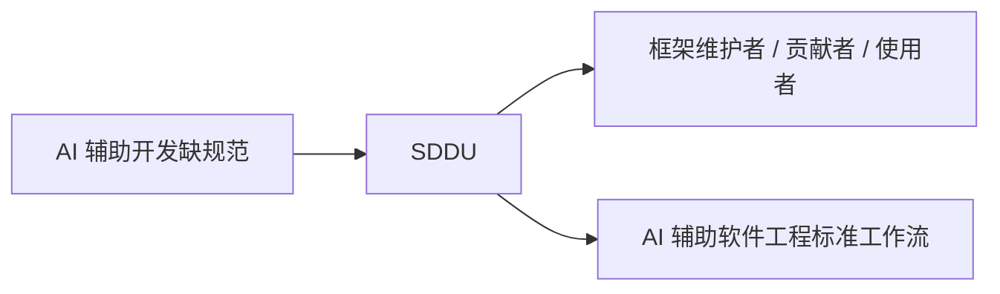
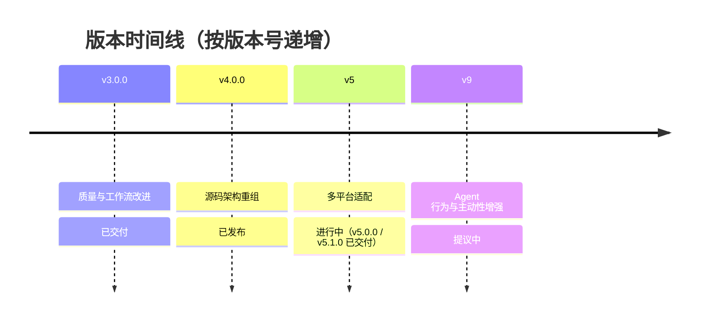
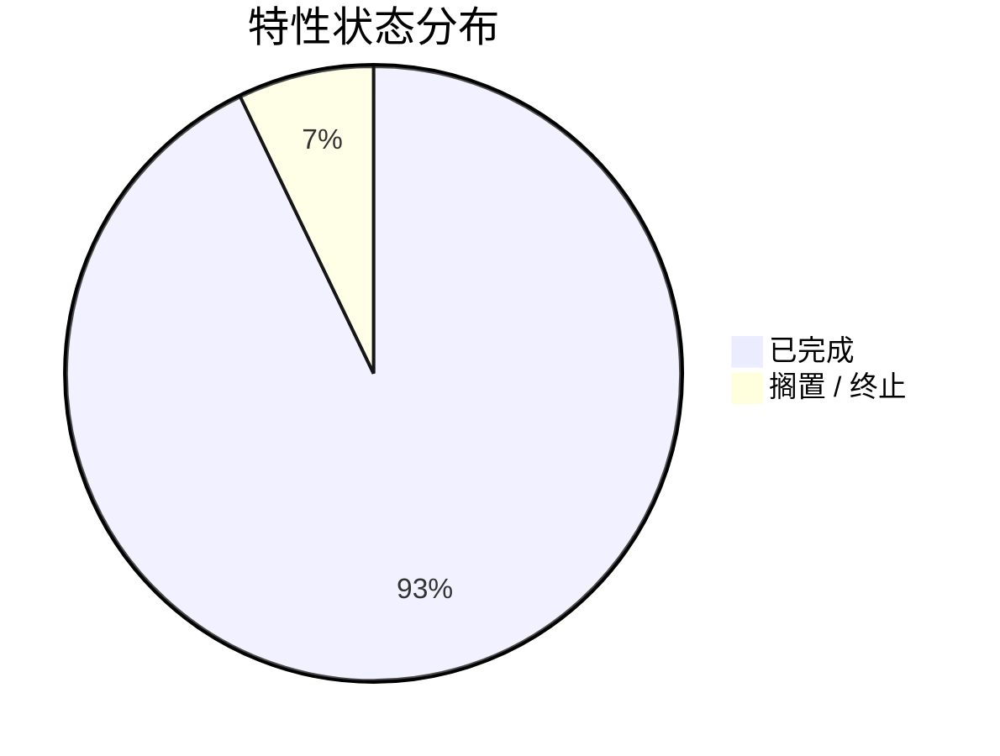
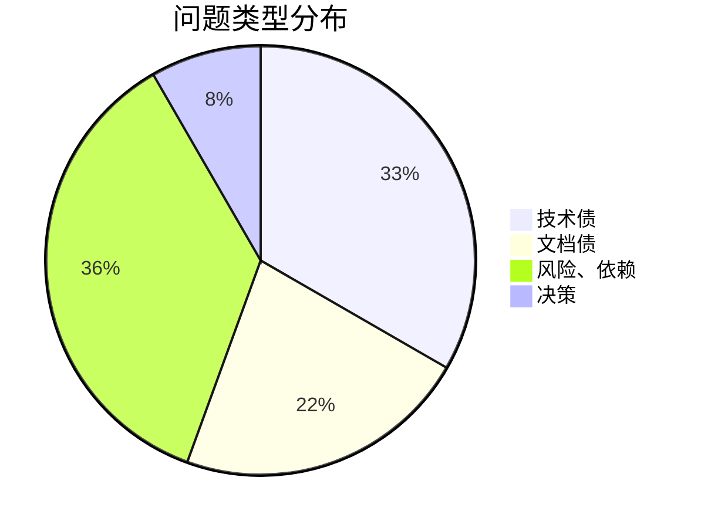
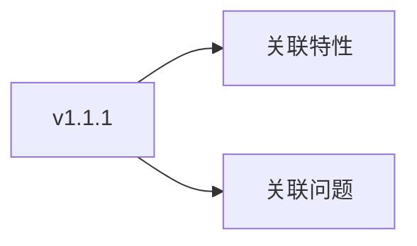
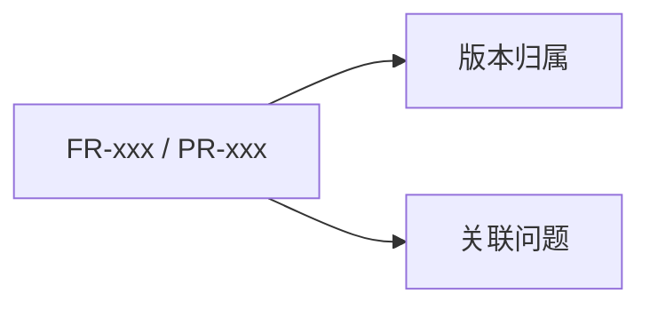
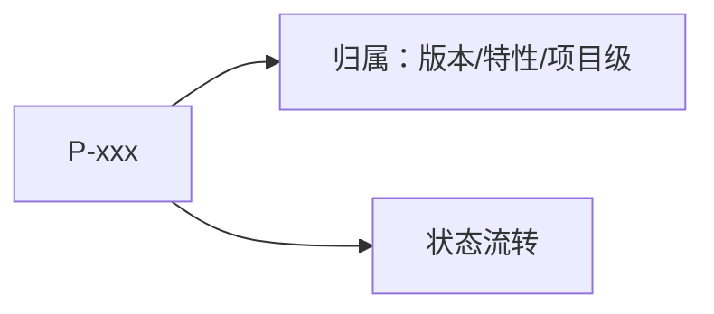
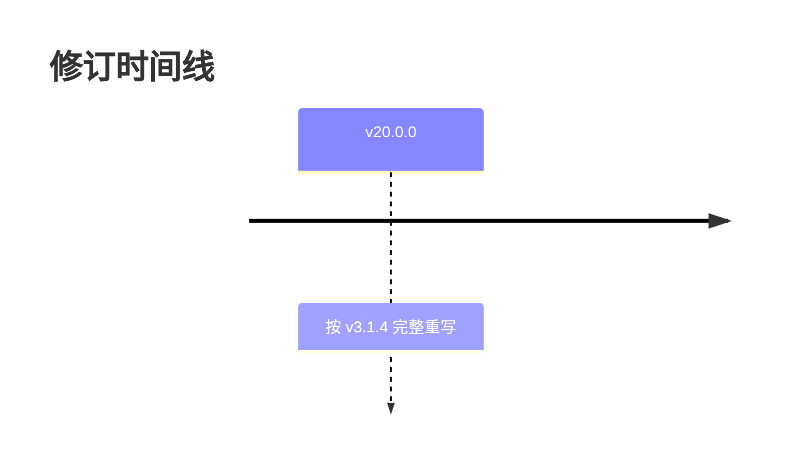

# 版本 Roadmap：SDDU

<!-- sddu:zone id="meta" mode="rewrite" -->
> **文档定位**: SDDU 版本路线图 — 跨版本 / 项目级顶层规划，是本文件格式的唯一权威来源  
> **输出文件名**: .sddu/ROADMAP.md  
> **前置依赖**: 无硬性前置依赖（可基于现有 spec/plan 或从零规划）  
> **创建人**: SDDU Roadmap Agent  
> **创建时间**: 2026-04-06  
> **版本**: v24.5.0  
> **更新人**: SDDU Roadmap Agent  
> **更新时间**: 2026-09-27  
> **更新说明**: v5.2.0「dsh 模板引擎」交付回填：PR-014 已转化为 **FR-DSH-TEMPLATE-001**（specs-tree-dsh-template-engine，completed / validated）；§3 提案行转特性行、§5 v5.2.0 entry 里程碑回填、§6 新增 FR-DSH-TEMPLATE-001 卡片（PR-014 卡转溯源）、§1 与 meta 统计同步  
> **当前项目版本**: v4.0.0  
> **全局状态**: 规划中 — 28 特性（26 completed / 1 suspended / 1 terminated）+ 12 项未立项提案（PR-001~PR-012，PR-014 已转化）  
> **生成方式**: 增量更新  
<!-- /sddu:zone -->

## 1. 项目愿景与定位

<!-- sddu:zone id="vision" mode="rewrite" -->

```mermaid
graph LR
    P[AI 辅助开发缺规范] --> R[SDDU]
    R --> U[框架维护者 / 贡献者 / 使用者]
    R --> G[AI 辅助软件工程标准工作流]
```

SDDU（Spec-Driven Development Unified）是一套面向 AI 辅助开发的规范驱动工作流框架，由 12 个专业化 Agent 协同承载（7 阶段主流水线 + @sddu-fast + @sddu-roadmap / @sddu-docs 等辅助 Agent）。项目自 2026 年 3 月启动，已迭代至 v4.0.0，27 个 Feature 中 25 个完成 validated（另 1 项 suspended、1 项 terminated）；以「树形 Feature 嵌套」「增量保留区合并」「双层可扩展架构」形成差异化优势。

长期愿景是成为 AI 辅助软件工程的标准工作流框架。演进路径：v3.0.0 系列聚焦质量闭环；v3.3.0 的 FR-FAST-001 / FR-SKILL-001 使 SDDU 进入「固定引擎 + 可扩展能力」双层架构；v4.0.0 完成三域分层与平台适配器隔离。2026-09-27 按树形三段式模型重排后，重心为「走出 OpenCode」——**v5「多平台适配」大版本**下 v5.0.0「DSH 适配」、v5.1.0「dsh 安装流程优化」、v5.2.0「dsh 模板引擎」已交付，v5.3.0「通用多平台适配」待启动；全部未实施提案重组为 v5 ~ v9 五个大版本下的特性版本（v5.3.0 ~ v9.3.0），版本清单按版本号递增排列。
<!-- /sddu:zone -->

## 2. 版本清单

<!-- sddu:zone id="version-list" mode="rewrite" -->

```mermaid
timeline
    title 版本时间线（按版本号递增）
    v3.0.0 : 质量与工作流改进 : 已交付
    v4.0.0 : 源码架构重组 : 已发布
    v5 : 多平台适配 : 进行中（v5.0.0 / v5.1.0 已交付）
    v9 : Agent 行为与主动性增强 : 提议中
```

| 大版本 | 大版本主题 | 版本 | 版本主题 | 时间窗 | 状态 | 特性数 | 开放问题数 |
|------|------|------|------|--------|------|:--:|:--:|
| v1 | 插件基线与品牌升级 | v1.1.1 | Plugin Phase 1+ | 2026-03-30 | 已发布 | 1 | 0 |
| v1 | 插件基线与品牌升级 | v1.4.0 | SDD → SDDU 品牌升级 | 2026-04-20 | 已发布 | 2 | 0 |
| v2 | 树形结构、模板化与状态增强 | v2.4.0 | Feature 拆分与树形结构优化 | 2026-04-13 | 已发布 | 3 | 0 |
| v2 | 树形结构、模板化与状态增强 | v2.5.0 | Agent 输出模板化系统 | 2026-05-25 | 已发布 | 2 | 1 |
| v2 | 树形结构、模板化与状态增强 | v2.6.0 | SDDU 特性状态增强 | 2026-06-13 | 已发布 | 1 | 1 |
| v3 | 质量闭环与能力扩展 | v3.0.0 | 质量与工作流改进（A-F） | 2026-09-30 | 已交付 | 2 | 0 |
| v3 | 质量闭环与能力扩展 | v3.0.1 | 模板质量统一 | 2026-06-19 | 已发布 | 2 | 2 |
| v3 | 质量闭环与能力扩展 | v3.1.0 | Skill 化降级验证 | 2026-07-22 | 已交付 | 1 | 0 |
| v3 | 质量闭环与能力扩展 | v3.2.0 | 项目知识基础设施（H・I） | 2026-07-05 | 已交付 | 1 | 0 |
| v3 | 质量闭环与能力扩展 | v3.3.0 | Agent 行为强化 + 轻量入口 | 2026-07-19 | 已交付 | 2 | 0 |
| v4 | 源码架构重组（三域分层与适配器隔离） | v4.0.0 | 源码架构重组 | 2026-06-21 | 已发布 | 1 | 0 |
| v5 | 多平台适配 | v5.0.0 | DSH 适配（首个特性版本，`y=0`） | 2026-Q4 | 已交付 | 1 | 0 |
| v5 | 多平台适配 | v5.1.0 | dsh 安装流程优化（对齐 OpenCode 一键安装） | 2026-09-27 | 已交付 | 1 | 0 |
| v5 | 多平台适配 | v5.2.0 | dsh 模板引擎（输出格式强约束） | 2026-09-27 | 已交付 | 1 | 0 |
| v5 | 多平台适配 | v5.3.0 | 通用多平台适配（adapters/ 接口收敛） | TBD | 提议中 | 1 | 1 |
| v6 | 质量与工程闭环收尾 | v6.0.0 | Build Agent Wave 一体化（含 phase 推断修复） | TBD | 提议中 | 2 | 2 |
| v6 | 质量与工程闭环收尾 | v6.1.0 | 框架级自验证流程 | TBD | 提议中 | 1 | 1 |
| v7 | 项目知识基础设施（续） | v7.0.0 | 全局项目配置 | TBD | 提议中 | 1 | 2 |
| v7 | 项目知识基础设施（续） | v7.1.0 | Feature 级共享语言 CONTEXT.md | TBD | 提议中 | 1 | 0 |
| v8 | Skill 化降级验证（续） | v8.0.0 | sddu-bug（Bug 流程 Skill 化） | TBD | 提议中 | 1 | 0 |
| v8 | Skill 化降级验证（续） | v8.1.0 | sddu-worktree（Worktree 隔离 Skill 化） | TBD | 提议中 | 1 | 0 |
| v9 | Agent 行为与主动性增强 | v9.0.0 | Agent 理性化对抗 | TBD | 提议中 | 1 | 0 |
| v9 | Agent 行为与主动性增强 | v9.1.0 | Discovery 访谈效率优化 | TBD | 提议中 | 1 | 0 |
| v9 | Agent 行为与主动性增强 | v9.2.0 | Agent 自动触发 | TBD | 提议中 | 1 | 0 |
| v9 | Agent 行为与主动性增强 | v9.3.0 | 自主模式重启评估（末位，风险最高） | TBD | 提议中 | 1 | 2 |

表结构（8 列）：`大版本 | 大版本主题 | 版本 | 版本主题 | 时间窗 | 状态 | 特性数 | 开放问题数`；`大版本` 列**只写版本号第一段（x 层）的具体值**，记法 `vx`（如 `v1` / `v5`），`大版本主题` 列为该段的聚合主题，二者段内各行填同一值并**前置**于版本级字段以便按大版本段阅读；`版本` 列**一律写三段全具体的版本号**（`vx.y.z`，如 `v5.0.0`）—— 规划即锁定具体发布号，后续缺陷版本按发布事实递增（`v5.0.1`、`v5.0.2` …），规划表不预排；大版本两列仅作层级导航、**不参与排序**（排序键为 `版本` 列）。

排序依据：**按「版本号」升序**（`x.y.z` 逐段数值比较：先比第一段，相同再比第二段，再比第三段），全文口径一致；**时间窗列不参与排序**，故其取值不再单调（如 v2.4.0 早于 v1.4.0 发布、v3.0.1 早于 v3.1.0 / v3.2.0 / v3.3.0 落地）——此为该版本历史穿插发布的如实呈现，不做掩饰。已发布版本（v1.1.1 / v1.4.0 / v2.4.0 / v2.5.0 / v2.6.0 / v3.0.1 / v4.0.0）与已交付版本（v3.0.0 / v3.1.0 / v3.2.0 / v3.3.0）的版本号已随 package.json / npm 发布与交付事实固化，**不重编**；v3.1.0 / v3.2.0 的「时间窗」取该版本交付项落地日（v3.2.0 = FR-KB-002 交付日；v3.1.0 = FR-TREE-SKILL 交付日），因收束后原 `TBD` 无独立发布日。

**版本号编排固定规则 —— 树形三段式模型（今后所有新版本一律遵循，2026-09-27 统一登记）**：版本号三段式 `x.y.z`，呈**树形包含**结构 —— **大版本（`x` 段，记作 `vx`）⊃ 特性版本（`x.y`，记作 `vx.y.z` 的首发基线）⊃ 缺陷版本（`x.y.z`）**。三条计数规则如下：① **`x`（大版本段）**：允许从 0 开始，即首个大版本允许写 0（`0.y.z` 合法）；② **`y`（特性版本段）**：允许从 0 开始，即大版本的首个特性版本允许写 `x.0.0`；③ **`z`（缺陷版本段）**：允许从 1 开始，即某个特性版本的首个缺陷版本写 `x.y.1`（`z = 0` 为特性版本的首发基线，不作为缺陷版本号使用）。规划表中未实施版本**同样写三段全具体的版本号**（如 `v5.0.0`，即大版本 v5 第 0 个特性版本、缺陷段取 0 作首发基线）；后续缺陷版本按发布事实递增（`v5.0.1`、`v5.0.2` …），规划表不预排。

**规则自洽性佐证（引用已发布历史，不重编）**：v3.0.0 即大版本 v3 的首个特性版本（`y = 0` 的首发基线，`z = 0`），其后的 v3.0.1 即该特性版本的首个缺陷版本（`z = 1`）—— 与① ② ③ 三条规则完全一致；v1.1.1 ~ v4.0.0 全部历史版本号均符合本模型，保持原值不动。

未实施版本编排结论（2026-09-27 按统一后规则重排）：v5「多平台适配」大版本下 —— **v5.0.0 = DSH 适配（PR-013，`y = 0` 的首个特性版本，已交付）**、**v5.1.0 = dsh 安装流程优化（FR-DSH-INSTALL-001，已交付）**、**v5.2.0 = dsh 模板引擎（FR-DSH-TEMPLATE-001，已交付）**、**v5.3.0 = 通用多平台适配（PR-007，先具体平台落地、再收敛通用接口）**；原「质量与工程闭环收尾 / 项目知识基础设施（续）/ Skill 化降级验证（续）/ Agent 行为与主动性增强」四组后移主题，按「一组特性划分到一个大版本中」重组为 **v6 / v7 / v8 / v9** 四个大版本，各特性版本自 `y = 0` 起编排。本表为全文时间轴的唯一住所；`特性数` / `开放问题数` 为 §5 关联特性与「归属本版本且仍开放」问题的投影；§5 版本详情按同一版本号升序排列。
<!-- /sddu:zone -->

## 3. 特性清单

<!-- sddu:zone id="feature-list" mode="rewrite" -->

```mermaid
pie title 特性状态分布
    "已完成" : 26
    "搁置 / 终止" : 2
```

| Feature ID | 名称 | 类型 | 状态 | 版本归属 |
|------------|------|:--:|------|:--:|
| FR-TEMPLATE-001 | Agent 输出模板化系统 | 特性 | completed | 1.0.0 |
| FR-DIR-001 | specs-tree-root 管理目录结构命名优化 | 特性 | completed | 1.0.0 |
| FR-PLUGIN-RENAME-SDDU | Plugin Rename SDDU — 从 SDD 全面迁移至 SDDU | 特性 | completed | 1.0.0 |
| FR-SDD-PLUGIN-ROADMAP | SDD Roadmap 规划专家 | 特性 | completed | 1.0.0 |
| FR-SDD-PLUGIN-BASELINE | SDD Plugin Phase 1 基线 | 特性 | completed | 1.1.0 |
| FR-SDD-MULTI-001 | SDD 子 Feature 化并行开发支持 | 特性 | completed | 1.2.11 |
| FR-PLUGIN-RENAME-SDDU-V2 | Plugin Rename SDDU V2 — 代码清理 | 特性 | completed | 2.0.0 |
| FR-SDD-WORKFLOW-STATE-OPTIMIZATION | SDD 工作流状态优化 | 特性 | completed | 2.0.0 |
| FR-TREE-STRUCTURE-OPTIMIZATION | v2.4.0 Feature 拆分与树形结构优化 | 特性 | completed | v2.1.0 |
| FR-TREE-STRUCTURE-OPTIMIZATION-V2 | 树形结构优化 v2 — 问题修复 | 特性 | completed | v2.1.0 |
| ETD-001 | ETD（Expert Tree Design） | 特性 | terminated | 2.2.0 |
| FR-AUTONOMY-001 | 自主模式（sddu-auto 自动调度） | 特性 | suspended | v3.0.0 |
| FR-DOCS-AGENT-OPTIMIZATION | @sddu-docs Agent 补全与优化 | 特性 | completed | v3.0.0 |
| FR-TREE-SKILL | @sddu-tree Agent 技能化 | 特性 | completed | v3.1.0 |
| FR-ROADMAP-STRUCT-001 | Roadmap 模板结构重构 v2 | 特性 | completed | v3.2.1 |
| FR-SKILL-001 | SDDU Skill 系统（用户级 + 框架级） | 特性 | completed | 3.3.0-early |
| FR-FAST-001 | @sddu-fast 快速模式 Agent | 特性 | completed | v3.3.0 |
| FR-FRAMEWORK-ARCH-001 | SDDU 框架源码架构重组 | 特性 | completed | v4.0.0 |
| FR-DSH-ADAPT-001 | DSH 适配 | 特性 | completed | v5.0.0 |
| FR-DSH-INSTALL-001 | dsh 安装流程优化（对齐 OpenCode 一键安装） | 特性 | completed | v5.1.0 |
| FR-DSH-TEMPLATE-001 | dsh 模板引擎（输出格式强约束） | 特性 | completed | v5.2.0 |
| FR-ROADMAP-TPL-001 | @sddu-roadmap 输出模板补全 | 特性 | completed | v5 |
| FR-AGENT-SCOPE-001 | plan/review/validate 职责回归改造 | 特性 | completed | 不适用 |
| FR-DEP-001 | 弃用旧版 SDD 工具 | 特性 | completed | 不适用 |
| FR-SDD-DISCOVERY-001 | SDD Discovery 需求挖掘能力增强 | 特性 | completed | 不适用 |
| FR-SDD-TOOLS-OPTIMIZATION | SDD 工具系统优化 | 特性 | completed | 不适用 |
| FR-STATUS-ENHANCE-001 | SDDU 特性状态增强 | 特性 | completed | 不适用 |
| FR-TPL-001 | 预置输出模板质量统一 | 特性 | completed | 不适用 |
| PR-007 | 多平台适配（FR-CROSSPLAT-001） | 提案 | 提案待决 | v5.3.0 |
| PR-010 | Build Agent Wave 一体化（FR-QUALITY-001） | 提案 | 提案待决 | v6.0.0 |
| PR-012 | auto-updater phase 推断修复（FR-QUALITY-005） | 提案 | 提案待决 | v6.0.0 |
| PR-011 | 框架级自验证流程（FR-QUALITY-004） | 提案 | 提案待决 | v6.1.0 |
| PR-004 | 全局项目配置（FR-KB-001） | 提案 | 提案 | v7.0.0 |
| PR-005 | Feature 级共享语言 CONTEXT.md（FR-CONTEXT-001） | 提案 | 提案 | v7.1.0 |
| PR-001 | Skill 化评估：FR-BUG-001 → sddu-bug | 提案 | 提案 | v8.0.0 |
| PR-002 | Skill 化评估：FR-WORKTREE-001 → sddu-worktree | 提案 | 提案 | v8.1.0 |
| PR-009 | Agent 理性化对抗（FR-RATIONAL-001） | 提案 | 提案待决 | v9.0.0 |
| PR-006 | Discovery 访谈效率优化（FR-DISCOVERY-002） | 提案 | 提案 | v9.1.0 |
| PR-008 | Agent 自动触发（FR-AUTOTRIGGER-001） | 提案 | 提案待决 | v9.2.0 |
| PR-003 | 自主模式重启评估（FR-AUTONOMY-001） | 提案 | 提案 | v9.3.0 |
| FR-KB-002 | 项目级知识自动沉淀 | 提案 | 已交付 | v3.2.0 |

排序依据：按「版本归属升序 → specs-tree 目录字典序」排列特性块（`版本归属 = 不适用` 归尾组）；提案块列于特性之后，按「版本归属升序 → PR 编号升序」；历史登记的已交付项 `FR-KB-002` 列于全部提案之后。本区为实时投影（`mode="rewrite"`），随 `.sddu/specs-tree-root/` 下各 Feature `state.json` 变化整体重建；`Feature ID` 与 `版本归属` 回退取值 / 推断均已就地标注来源；**`PR-013`「DSH 适配」与 `PR-014`「dsh 模板引擎」已分别立项转化为 `FR-DSH-ADAPT-001` / `FR-DSH-TEMPLATE-001`（均 completed / validated），原提案行已移除、不再计入提案统计**；未实施提案的「版本归属」按**树形三段式模型**（`x` / `y` 从 0 起、`z` 从 1 起）写**三段全具体的版本号**（`vx.y.z`），当前提案区间为 v5.3.0 / v6.0.0 / v6.1.0 / v7.0.0 / v7.1.0 / v8.0.0 / v8.1.0 / v9.0.0 ~ v9.3.0。
<!-- /sddu:zone -->

## 4. 问题清单

<!-- sddu:zone id="issue-list" mode="preserve" -->

```mermaid
pie title 问题类型分布
    "技术债" : 12
    "文档债" : 8
    "风险、依赖" : 13
    "决策" : 3
```

| ID | 类型 | 摘要 | 影响 | 归属 | 状态 |
|----|------|------|:--:|------|:--:|
| P-001 | 风险 | 无活跃 Feature 空窗期过长 | 高 | 项目级 | 已转化 |
| P-002 | 风险 | FR-AUTONOMY-001 自主边界定义模糊（过度自主 ↔ 过度谨慎） | 高 | 项目级 | 开放 |
| P-003 | 风险 | 不可逆操作缺少统一 HARD-GATE 强制确认 | 高 | 项目级 | 开放 |
| P-004 | 风险 | 框架级自验证流程缺失（Issue C 遗留） | 中 | 项目级 | 开放 |
| P-005 | 风险 | 4 个预存测试失败（2 timeout + 1 断言 + 1 OOM） | 中 | 项目级 | 开放 |
| P-006 | 风险 | 前沿 Feature 过早承诺（含 P2 远期） | 低 | 项目级 | 开放 |
| P-007 | 风险 | TUI 界面与 MCP 集成持续延期（v2.5.0 遗留） | 低 | 项目级 | 开放 |
| P-008 | 风险 | SDD→SDDU 迁移残留可能回归 | 低 | 项目级 | 开放 |
| P-009 | 风险 | 竞品借鉴结论时效性未定期复核 | 低 | 项目级 | 开放 |
| P-010 | 技术债 | 技术债台账约 45 项（Bug/质量 10 · 增强 17 · 技术债 9 · 文档配置 7 · 搁置关注 4） | 中 | 项目级 | 开放 |
| P-011 | 技术债 | 模板校验工具命令缺失（FR-014 / FR-015 / FR-016「未来」） | 低 | 项目级 | 开放 |
| P-012 | 技术债 | 旧 schema 文件 schema-v1.2.5.ts / schema-v2.0.0.ts 待清理 | 低 | 项目级 | 开放 |
| P-013 | 技术债 | `@deprecated` FeatureStateEnum 类型别名待移除 | 低 | 项目级 | 开放 |
| P-014 | 技术债 | 仪表盘分类 / 排序 / 过滤逻辑未迁入 src/state/，缺单测 | 中 | 项目级 | 开放 |
| P-015 | 技术债 | consistency-checker 缺真实 `.sddu/` 目录结构集成测试 | 中 | 项目级 | 开放 |
| P-016 | 文档债 | root state.json `features.completed` 命名空间陈旧（T-001~T-018） | 低 | 项目级 | 开放 |
| P-017 | 文档债 | COMPLETION_CERTIFICATE.json 第 47 行 `.sdd/` 路径引用 | 低 | 项目级 | 开放 |
| P-018 | 文档债 | `.sddu/docs/` 下 17+ 冗余 Wave1 迁移文件待归档 | 低 | 项目级 | 开放 |
| P-019 | 文档债 | docs 导航是否含 v3.0.0 内容待校验（DOC4/5/6） | 低 | 项目级 | 开放 |
| P-020 | 文档债 | specs-tree-agent-output-templating 的 stale spec.json 待同步 | 低 | 项目级 | 开放 |
| P-021 | 依赖 | ETD-001 迁出后独立仓库仍为「待创建」 | 低 | 项目级 | 开放 |
| P-022 | 依赖 | 外部参考依据 docs/research/*.md 需季度复核 | 低 | 项目级 | 开放 |
| P-023 | 依赖 | 关键路径 state.json + ADR 主集合（ADR-001~017） | 低 | 项目级 | 开放 |
| P-024 | 依赖 | discover.cjs 与 sync.cjs 互相独立，需保持解耦 | 低 | 项目级 | 开放 |
| P-025 | 决策 | 确认 FR-AUTONOMY-001 与 FR-DISCOVERY-002 的 scope 关系 | 中 | 项目级 | 已转化 |
| P-026 | 决策 | 决定剩余辅助 Agent 输出模板补全范围（S9） | 低 | 项目级 | 开放 |
| P-027 | 决策 | 下一启动 Feature 已拍板：v5.0.0「DSH 适配」（v5 多平台适配大版本首个特性版本）（原 候选确认） | 中 | v5.0.0 | 已转化 |
| P-028 | 技术债 | `src/skills/` 3 个框架级 Skill 文件 untracked 未入库（原 提交 src/skills/） | 中 | 项目级 | 开放 |
| P-029 | 技术债 | auto-updater phase 推断顺序错误：`inferCurrentPhaseFromFiles()` 中 `reviewed` 先于 `builded` 检查（原 B/FR-QUALITY-005） | 中 | 项目级 | 开放 |
| P-030 | 技术债 | coordinator bash 工具兼容性（Issue D）已修复待复核（原 D/FR-QUALITY-006） | 低 | 项目级 | 开放 |
| P-031 | 技术债 | specs-tree-sdd-workflow-state-optimization phaseHistory 去重（原 T-2） | 低 | 项目级 | 开放 |
| P-032 | 文档债 | specs-tree-sddu-status-enhancement stale spec.json（planned/tracked → validated/completed）（原 TD-5） | 低 | 项目级 | 开放 |
| P-033 | 文档债 | specs-tree-agent-output-templating plan.md 示例路径引用错误（原 TD-9） | 低 | 项目级 | 开放 |
| P-034 | 技术债 | 实机执行 `@sddu 状态` 比对 Agent 行为与模板描述一致性（原 TD-8） | 低 | 项目级 | 开放 |
| P-035 | 技术债 | 统一 validate.md / validation.md / validation-report.md 文件命名（v2.7.0 遗留）（原 S-7） | 低 | 项目级 | 开放 |
| P-036 | 文档债 | specs-tree-sdd-workflow-state-optimization 无 review/validation 文件，确认无需补（原 SUS-3） | 低 | 项目级 | 开放 |
<!-- /sddu:zone -->

## 5. 版本详情

<!-- sddu:zone id="version-detail" mode="preserve" -->

```mermaid
graph LR
    V[v1.1.1] --> F[关联特性]
    V --> P[关联问题]
```

<!-- sddu:entry id="v1.1.1" -->
### v1.1.1 — Plugin Phase 1+
- **目标**: 交付 SDD 插件 Phase 1 基线能力（基础架构、配置管理、生命周期管理、可观测性），上线 16 个 Agent。
- **关联特性**: FR-SDD-PLUGIN-BASELINE（specs-tree-sdd-plugin-baseline）
- **关联问题**: 无
- **里程碑**: 2026-03-30 发布
- **风险与依赖**: 无
<!-- /sddu:entry -->
<!-- sddu:entry id="v1.4.0" -->
### v1.4.0 — SDD → SDDU 品牌升级
- **目标**: 插件生态从 @sdd-* 全面迁移到 @sddu-*，实现双命名空间管理与向后兼容。
- **关联特性**: FR-PLUGIN-RENAME-SDDU（specs-tree-plugin-rename-sddu）、FR-PLUGIN-RENAME-SDDU-V2（specs-tree-plugin-rename-sddu-v2）
- **关联问题**: 无
- **里程碑**: 2026-04-20 发布（18 个迁移任务 T-001~T-018 完成，100% 向后兼容）
- **风险与依赖**: 迁移残留回归风险 → 见 P-008（项目级）
<!-- /sddu:entry -->
<!-- sddu:entry id="v2.4.0" -->
### v2.4.0 — Feature 拆分与树形结构优化
- **目标**: 支持无限层树形 Feature 嵌套与跨子树依赖检查，定义「轻量化父级 / 完整叶子」规范并统一 state.json schema；同步完成目录命名优化。
- **关联特性**: FR-TREE-STRUCTURE-OPTIMIZATION（specs-tree-tree-structure-optimization）、FR-TREE-STRUCTURE-OPTIMIZATION-V2（specs-tree-tree-structure-optimization-v2）、FR-DIR-001（specs-tree-directory-optimization）
- **关联问题**: 无
- **里程碑**: 2026-04-13 发布；v2 修复 2026-04-15
- **风险与依赖**: 无
<!-- /sddu:entry -->
<!-- sddu:entry id="v2.5.0" -->
### v2.5.0 — Agent 输出模板化系统
- **目标**: 将主流程 Agent 的输出固化为 Handlebars 标准化模板（模板引擎 + 7 个内置模板），支持用户自定义模板覆盖内置默认模板。
- **关联特性**: FR-TEMPLATE-001（specs-tree-agent-output-templating）、FR-SDD-PLUGIN-ROADMAP（specs-tree-sdd-plugin-roadmap）
- **关联问题**: P-020（stale spec.json）
- **里程碑**: 2026-05-25 发布（13 FR / 6 NFR / 8 EC 100% 通过）
- **风险与依赖**: TUI / MCP 集成依赖本模板系统，延期 → P-007（项目级）
<!-- /sddu:entry -->
<!-- sddu:entry id="v2.6.0" -->
### v2.6.0 — SDDU 特性状态增强
- **目标**: 状态模型从单字段混用重构为两字段隔离（phase 8 阶段 / status 5 状态），内置一致性检测、标记命令与分类仪表盘。
- **关联特性**: FR-STATUS-ENHANCE-001（specs-tree-sddu-status-enhancement）
- **关联问题**: P-014（仪表盘逻辑未迁入 src/）
- **里程碑**: 2026-06-13 发布（v3.0.0 状态模型）
- **风险与依赖**: 无
<!-- /sddu:entry -->
<!-- sddu:entry id="v3.0.0" -->
### v3.0.0 — 质量与工作流改进（A-F）
- **目标**: 解决 specs-tree-sddu-status-enhancement E2E 全流程验证（2026-06-13）暴露的框架级问题（A-F），并以职责回归作为 Issue F 的根本解法。2026-09-27 重排后本版本收束：仅保留已交付项，未实施项（PR-010 / PR-011 / PR-012）后移至 v6.0.0 / v6.1.0。
- **关联特性**: FR-AGENT-SCOPE-001（specs-tree-agent-scope-realignment，已交付 2026-08-01）、FR-AUTONOMY-001（specs-tree-autonomous-mode，已搁置）
- **关联问题**: 无（原 P-004 / P-005 随 PR-010 ~ PR-012 转入 v6.0.0 / v6.1.0）
- **里程碑**: FR-AGENT-SCOPE-001 于 2026-08-01 validated（62 项检查：58 pass / 3 warn / 0 fail）；2026-09-27 版本收束，未实施提案整体后移
- **风险与依赖**: 无（范围蔓延风险随未实施项后移，转由 v6.0.0 / v6.1.0 承接）
<!-- /sddu:entry -->
<!-- sddu:entry id="v3.0.1" -->
### v3.0.1 — 模板质量统一
- **目标**: 统一 17 个内置模板的格式与结构，明确全部 11 个 Agent 的职责边界；同步补全 @sddu-docs。
- **关联特性**: FR-TPL-001（specs-tree-template-quality-unification）、FR-DOCS-AGENT-OPTIMIZATION（specs-tree-docs-agent-optimization）
- **关联问题**: P-020、P-023
- **里程碑**: 2026-06-19 发布（22 FR + 3 NFR 100% 通过）；FR-DOCS-OPT-001 于 2026-07-05 完成
- **风险与依赖**: 模板质量回归风险 → 由 review/validate 结构化方法论缓解
<!-- /sddu:entry -->
<!-- sddu:entry id="v3.1.0" -->
### v3.1.0 — Skill 化降级验证
- **目标**: 将已规划独立 Feature 降级为框架级 Skill，验证 FR-SKILL-001 定义的「Agent→Skill 降级模型」。2026-09-27 重排后本版本收束（FR-TREE-SKILL 交付即视为完成），未实施提案 PR-001 / PR-002 后移至 v8.0.0 / v8.1.0。
- **关联特性**: FR-TREE-SKILL（specs-tree-tree-skill，已交付 2026-07-22 有条件通过）
- **关联问题**: 无
- **里程碑**: FR-TREE-SKILL 2026-07-22 有条件通过（首例降级验证完成）；2026-09-27 版本收束，剩余两项后移至 v8.0.0 / v8.1.0
- **风险与依赖**: 无（轻 / 重修复边界模糊、嵌套 worktree 兼容等风险随提案转入 v8.0.0 / v8.1.0）
<!-- /sddu:entry -->
<!-- sddu:entry id="v3.2.0" -->
### v3.2.0 — 项目知识基础设施（H・I）
- **目标**: 建立项目知识层 —— FR-KB-001 管「怎么做」（技术栈 / 命名规范 / 代码风格），FR-CONTEXT-001 管「说什么」（领域语言 / 术语表）。2026-09-27 重排后本版本收束（Issue H 交付即视为完成），未实施提案 PR-004 / PR-005 后移至 v7.0.0 / v7.1.0。
- **关联特性**: FR-KB-002（已由 @sddu-docs 实现并随 FR-DOCS-AGENT-OPTIMIZATION 交付，对应 Issue H）
- **关联问题**: 无（原 P-009 / P-026 随 PR-004 / PR-005 转入 v7.0.0）
- **里程碑**: FR-KB-002 交付（2026-07-05）；2026-09-27 版本收束，剩余两项后移至 v7.0.0 / v7.1.0
- **风险与依赖**: 无（全局配置 schema 争议、词汇表格式不一致等风险随提案转入 v7.0.0 / v7.1.0）
<!-- /sddu:entry -->
<!-- sddu:entry id="v3.3.0" -->
### v3.3.0 — Agent 行为强化 + 轻量入口
- **目标**: 轻重双模入口（@sddu-fast）+ Skill 系统双层架构（固定引擎 + 可扩展能力）已交付；「自主-约束」双翼（自主模式 × 理性化对抗）未实施部分于 2026-09-27 后移至 v9.0.0 ~ v9.3.0。
- **关联特性**: FR-FAST-001（specs-tree-sddu-fast，已交付 2026-07-12）、FR-SKILL-001（specs-tree-skill-system，已交付 2026-07-19）
- **关联问题**: P-001（已转化，2026-09-24）
- **里程碑**: 2026-07-19 两项提前交付（轻量入口 + Skill 双层架构）；2026-09-27 版本收束，剩余提案 PR-003 / PR-006 / PR-009 后移至 v9.0.0 ~ v9.3.0
- **风险与依赖**: 无（自主边界模糊、Skill 运营、版本空窗等风险随未实施提案转入 v9 大版本）
<!-- /sddu:entry -->
<!-- sddu:entry id="v4.0.0" -->
### v4.0.0 — 源码架构重组
- **目标**: 三域分层架构重组 + 平台适配器隔离，为跨平台扩展奠定基础。
- **关联特性**: FR-FRAMEWORK-ARCH-001（specs-tree-framework-architecture）
- **关联问题**: 无
- **里程碑**: 2026-06-21 发布（全部现有测试通过，npm build/pack 验证通过）
- **风险与依赖**: scope 膨胀与回归 → 已解决（测试通过）
<!-- /sddu:entry -->
<!-- sddu:entry id="v5.0.0" -->
### v5.0.0 — DSH 适配
- **目标**: 把 SDDU 适配到 DSH 平台，作为 v5「多平台适配」大版本下的**首个特性版本**（`y = 0`，即 `x.0.0`）。2026-09-27 按统一后的树形三段式规则确立。
- **关联特性**: FR-DSH-ADAPT-001（specs-tree-dsh-adaptation，completed / validated，2026-09-27 由 PR-013 立项转化并全流程交付）、FR-ROADMAP-TPL-001（specs-tree-roadmap-output-template，已交付，归属 v5 大版本容器）
- **关联问题**: P-027（已转化）
- **里程碑**: 已交付（2026-09-27 全流程 validated：discovery 12 问题 / spec 10 FR / plan 6 ADR / tasks 14 任务 / build 21 文件 / review 45 通过 / validate 层 A 17 项全过 + 层 B V1~V4 实机实测通过，V5 待 dsh 升级）；发布期首个缺陷版本为 v5.0.1
- **风险与依赖**: 依赖 FR-FRAMEWORK-ARCH-001（specs-tree-framework-architecture，已就绪，无阻塞）；dsh 侧门禁为显式软引导（FR-004b，非硬强制，与 OpenCode 能力落差已如实声明）；V5 升级跟随依赖 dsh 版本升级时机，登记为待办
<!-- /sddu:entry -->
<!-- sddu:entry id="v5.1.0" -->
### v5.1.0 — dsh 安装流程优化（对齐 OpenCode 一键安装）
- **目标**: 把 dsh 侧安装链路对齐 OpenCode 一键安装体验——统一 bootstrap 入口（`--platform` 区分 opencode/dsh）、install 脚本按平台分目录、镜像代理 gh-proxy.org、自动构建与启动引导。
- **关联特性**: FR-DSH-INSTALL-001（specs-tree-dsh-install-optimization，completed / validated）
- **关联问题**: 无
- **里程碑**: 已交付（2026-09-27 全流程 validated：6 FR / 5 NFR / 5 EC；bootstrap.sh/ps1 统一入口 + scripts/install/{opencode,dsh}/ 分目录 + bash/PowerShell 双通道与 gh-proxy 镜像全链路实机验证通过）
- **风险与依赖**: 依赖 FR-DSH-ADAPT-001（已交付）；Windows PowerShell 实机修复 4 处（iex 顶层误执行 / git clone 2>&1 / ExecutionPolicy / Test-Path 优先级）
<!-- /sddu:entry -->
<!-- sddu:entry id="v5.2.0" -->
### v5.2.0 — dsh 模板引擎（输出格式强约束）
- **目标**: 为 dsh 侧 SDDU 各流程输出建立模板强约束，解决「无模板渲染 → 输出格式不可控 → 影响体验」的问题；使 dsh 的 discovery/spec/plan/tasks/build/review/validate 各阶段产物与 opencode 侧模板输出对齐。
- **关联特性**: FR-DSH-TEMPLATE-001（specs-tree-dsh-template-engine，completed / validated）
- **关联问题**: 无
- **里程碑**: 已交付（2026-09-27 全流程 validated：30 个输出模板随 skill 落位、单一来源分发、skill-header 模板落位说明、install 自检计数；软约束方案 —— 模板文件落位 + 指令强化，未实现硬渲染）
- **风险与依赖**: 软约束效果有限（LLM 不严格遵循模板时输出仍可能漂移，约束力上限低于 opencode 代码渲染）—— 登记为已知边界；硬渲染依赖 dsh 提供模板渲染 seam（待 v5.3.0 通用适配阶段评估）
<!-- /sddu:entry -->
<!-- sddu:entry id="v5.3.0" -->
### v5.3.0 — 通用多平台适配（adapters/ 接口收敛）
- **目标**: 把「DSH 适配」的具体经验收敛为通用多平台适配能力（FR-CROSSPLAT-001），扩展到 OpenCode 之外的 AI Agent 平台。
- **关联特性**: PR-007（多平台适配 FR-CROSSPLAT-001，未立项提案，无 specs-tree 目录）
- **关联问题**: P-006
- **里程碑**: TBD — 待 v5.0.0/v5.1.0/v5.2.0 交付后启动（延续先具体平台落地、再收敛通用接口的次序）
- **风险与依赖**: 依赖 FR-FRAMEWORK-ARCH-001（已就绪）；通用化时机取决于 v5.0.0/v5.1.0/v5.2.0 适配结论，避免在单平台样本上过早抽象；前瞻 Feature 过早承诺风险 → 见 P-006
<!-- /sddu:entry -->
<!-- sddu:entry id="v6.0.0" -->
### v6.0.0 — Build Agent Wave 一体化（含 phase 推断修复）
- **目标**: 收尾原 v3.0.0 遗留的工程类议题 —— build agent 重构为单次调用完成全部 wave（Issue A），并修复 auto-updater phase 推断顺序（Issue B，缺陷修复挂靠本特性版本）。
- **关联特性**: PR-010（FR-QUALITY-001 Build Wave 一体化，未立项提案，无 specs-tree 目录）、PR-012（FR-QUALITY-005 phase 推断修复，未立项提案，无 specs-tree 目录；**缺陷修复层级**，随本特性版本发布后以缺陷版本 v6.0.1 起递增呈现）
- **关联问题**: P-005、P-029
- **里程碑**: TBD — 待 v5 大版本交付后评估启动；PR-010 先行原型验证 multi-wave 能力，PR-012 为低风险快项可先落地
- **风险与依赖**: PR-010 改动面大（build agent multi-wave）→ 提前原型验证；PR-012 须调整 `inferCurrentPhaseFromFiles()` 中 `reviewed` / `builded` 的检查顺序
<!-- /sddu:entry -->
<!-- sddu:entry id="v6.1.0" -->
### v6.1.0 — 框架级自验证流程
- **目标**: 建立标准化框架级自验证流程（Issue E）。
- **关联特性**: PR-011（FR-QUALITY-004 框架级自验证，未立项提案，无 specs-tree 目录）
- **关联问题**: P-004
- **里程碑**: TBD — 待 v6.0.0 交付后启动；分两步（最小可行 E2E runner → 完整框架）
- **风险与依赖**: 复杂度高 → 分两步推进，避免一次性铺开
<!-- /sddu:entry -->
<!-- sddu:entry id="v7.0.0" -->
### v7.0.0 — 全局项目配置
- **目标**: 承接原 v3.2.0 未实施项，以 `.sddu/project.json` 承载技术栈 / 命名规范 / 代码风格（FR-KB-001），并为 autonomyLevel 预留载体。
- **关联特性**: PR-004（FR-KB-001 全局项目配置，未立项提案，无 specs-tree 目录）
- **关联问题**: P-009、P-026
- **里程碑**: TBD — 先收拢需求并定 schema
- **风险与依赖**: 全局配置 schema 争议 → 参考主流框架实践 + v4.0.0 三域分层；为 FR-KB-002 的前提
<!-- /sddu:entry -->
<!-- sddu:entry id="v7.1.0" -->
### v7.1.0 — Feature 级共享语言 CONTEXT.md
- **目标**: 定义 Feature 级共享语言（领域语言 / 术语表，FR-CONTEXT-001）。
- **关联特性**: PR-005（FR-CONTEXT-001，未立项提案，无 specs-tree 目录）
- **关联问题**: 无
- **里程碑**: TBD — 可与 v7.0.0 并行互补推进
- **风险与依赖**: 各 Feature 词汇表格式不一致 → 定义标准格式模板（词条 + 定义）+ skill-creator 辅助生成 + @sddu-docs 聚合校验
<!-- /sddu:entry -->
<!-- sddu:entry id="v8.0.0" -->
### v8.0.0 — sddu-bug（Bug 流程 Skill 化）
- **目标**: 承接原 v3.1.0 未实施项，把 Bug 流程框架化为框架级 Skill（FR-BUG-001），验证轻量流程。
- **关联特性**: PR-001（FR-BUG-001 → sddu-bug，未立项提案，无 specs-tree 目录）
- **关联问题**: 无
- **里程碑**: TBD — Skill 化路径最成熟，建议作为该大版本首发
- **风险与依赖**: 共用 FR-TPL-001（Handlebars 模板引擎与分发机制，已交付，无阻塞）；轻 / 重修复边界模糊、Skill 化后 scope 漂移 → discovery 定义判定标准
<!-- /sddu:entry -->
<!-- sddu:entry id="v8.1.0" -->
### v8.1.0 — sddu-worktree（Worktree 隔离 Skill 化）
- **目标**: 把 Git Worktree Feature 隔离流程框架化为 Skill（FR-WORKTREE-001）。
- **关联特性**: PR-002（FR-WORKTREE-001 → sddu-worktree，未立项提案，无 specs-tree 目录）
- **关联问题**: 无
- **里程碑**: TBD — 待 v8.0.0 交付并复用 FR-TREE-SKILL 降级结论后启动
- **风险与依赖**: 共用 FR-TPL-001（已交付，无阻塞）；嵌套 worktree 检测与平台兼容 → 参考 Superpowers Step 0 检测逻辑 + 环境变量标记，优先平台原生工具、降级 `git worktree add`，E2E 覆盖多平台
<!-- /sddu:entry -->
<!-- sddu:entry id="v9.0.0" -->
### v9.0.0 — Agent 理性化对抗
- **目标**: 对抗 Agent 偷懒 / 走形式，强化理性化输出（FR-RATIONAL-001）。
- **关联特性**: PR-009（FR-RATIONAL-001，未立项提案，无 specs-tree 目录）
- **关联问题**: 无
- **里程碑**: TBD — 建议「Skill 知识库 + 模板强制约束」混合方案，作为该大版本首发
- **风险与依赖**: 需用户反馈 Agent 偷懒 / 走形式问题频发；可与 v9.1.0 并行启动
<!-- /sddu:entry -->
<!-- sddu:entry id="v9.1.0" -->
### v9.1.0 — Discovery 访谈效率优化
- **目标**: 降低 Discovery 交互轮次与耗时（FR-DISCOVERY-002）。
- **关联特性**: PR-006（FR-DISCOVERY-002，未立项提案，无 specs-tree 目录）
- **关联问题**: 无
- **里程碑**: TBD — 待 v9.0.0 交付 + 用户反馈 Discovery 交互轮次过多 / 耗时过长
- **风险与依赖**: 批量提问导致信息过载 → 每轮 ≤5 问 + 附 Agent 推荐答案 + 提供「一步步说」降级选项；与 v9.3.0（自主模式重启）scope 可能重叠 → 启动前明确边界
<!-- /sddu:entry -->
<!-- sddu:entry id="v9.2.0" -->
### v9.2.0 — Agent 自动触发
- **目标**: 提升 Agent 主动性，解决「忘记调用 @sddu」（FR-AUTOTRIGGER-001）。
- **关联特性**: PR-008（FR-AUTOTRIGGER-001，未立项提案，无 specs-tree 目录）
- **关联问题**: 无
- **里程碑**: TBD — 待用户反馈「忘记调用 @sddu」成为痛点
- **风险与依赖**: 触发误报 / 打扰用户 → 需明确触发边界
<!-- /sddu:entry -->
<!-- sddu:entry id="v9.3.0" -->
### v9.3.0 — 自主模式重启评估
- **目标**: 在「自主-约束」双翼下重新评估自主模式（FR-AUTONOMY-001）。
- **关联特性**: PR-003（FR-AUTONOMY-001 自主模式重启评估，未立项提案，无 specs-tree 目录）
- **关联问题**: P-002、P-003
- **里程碑**: TBD — 以四维边界模型（可逆性 / 影响半径 / 置信度 / 成本）+ HARD-GATE 为前提；因风险最高排于本大版本末位
- **风险与依赖**: 自主边界定义模糊 / 过度自主不可逆错误 → HARD-GATE 强制确认，任何自主级别不得豁免；与 v9.1.0 scope 可能重叠 → 启动前明确边界
<!-- /sddu:entry -->
<!-- /sddu:zone -->

## 6. 特性详情

<!-- sddu:zone id="feature-detail" mode="preserve" -->

```mermaid
graph LR
    F[FR-xxx / PR-xxx] --> V[版本归属]
    F --> P[关联问题]
```

<!-- sddu:entry id="FR-TEMPLATE-001" -->
### FR-TEMPLATE-001 — Agent 输出模板化系统
- **定位**: 主流程 Agent 输出固化为 Handlebars 标准化模板，支持用户自定义覆盖。**优先级**: P0；**版本归属**: v2.5.0；**状态与去向**: 已交付（2026-05-25）；**详档锚点**: .sddu/specs-tree-root/specs-tree-agent-output-templating/；**关联问题**: P-020
<!-- /sddu:entry -->
<!-- sddu:entry id="FR-DIR-001" -->
### FR-DIR-001 — specs-tree-root 管理目录结构命名优化
- **定位**: 统一 specs-tree-root 管理目录结构命名。**优先级**: P1；**版本归属**: v1.0.0；**状态与去向**: 已交付；**详档锚点**: .sddu/specs-tree-root/specs-tree-directory-optimization/
<!-- /sddu:entry -->
<!-- sddu:entry id="FR-PLUGIN-RENAME-SDDU" -->
### FR-PLUGIN-RENAME-SDDU — Plugin Rename SDDU
- **定位**: 插件生态从 @sdd-* 全面迁移至 @sddu-*，100% 向后兼容。**优先级**: P0；**版本归属**: v1.0.0；**状态与去向**: 已交付；**详档锚点**: .sddu/specs-tree-root/specs-tree-plugin-rename-sddu/；**关联问题**: P-008
<!-- /sddu:entry -->
<!-- sddu:entry id="FR-SDD-PLUGIN-ROADMAP" -->
### FR-SDD-PLUGIN-ROADMAP — SDD Roadmap 规划专家
- **定位**: 建立 @sddu-roadmap 跨版本规划 Agent。**优先级**: P1；**版本归属**: v1.0.0；**状态与去向**: 已交付；**详档锚点**: .sddu/specs-tree-root/specs-tree-sdd-plugin-roadmap/
<!-- /sddu:entry -->
<!-- sddu:entry id="FR-SDD-PLUGIN-BASELINE" -->
### FR-SDD-PLUGIN-BASELINE — SDD Plugin Phase 1 基线
- **定位**: 交付插件 Phase 1 基础架构、配置、生命周期与可观测性。**优先级**: P0；**版本归属**: v1.1.0；**状态与去向**: 已交付；**详档锚点**: .sddu/specs-tree-root/specs-tree-sdd-plugin-baseline/
<!-- /sddu:entry -->
<!-- sddu:entry id="FR-SDD-MULTI-001" -->
### FR-SDD-MULTI-001 — SDD 子 Feature 化并行开发支持
- **定位**: 支持子 Feature 化并行开发。**优先级**: P1；**版本归属**: v1.2.11；**状态与去向**: 已交付；**详档锚点**: .sddu/specs-tree-root/specs-tree-sdd-multi-module/
<!-- /sddu:entry -->
<!-- sddu:entry id="FR-PLUGIN-RENAME-SDDU-V2" -->
### FR-PLUGIN-RENAME-SDDU-V2 — Plugin Rename SDDU V2
- **定位**: 品牌迁移后的代码清理。**优先级**: P2；**版本归属**: v2.0.0；**状态与去向**: 已交付；**详档锚点**: .sddu/specs-tree-root/specs-tree-plugin-rename-sddu-v2/
<!-- /sddu:entry -->
<!-- sddu:entry id="FR-SDD-WORKFLOW-STATE-OPTIMIZATION" -->
### FR-SDD-WORKFLOW-STATE-OPTIMIZATION — SDD 工作流状态优化
- **定位**: 优化 SDD 工作流状态管理。**优先级**: P1；**版本归属**: v2.0.0；**状态与去向**: 已交付；**详档锚点**: .sddu/specs-tree-root/specs-tree-sdd-workflow-state-optimization/；**关联问题**: P-016 / P-031 / P-036
<!-- /sddu:entry -->
<!-- sddu:entry id="FR-TREE-STRUCTURE-OPTIMIZATION" -->
### FR-TREE-STRUCTURE-OPTIMIZATION — v2.4.0 Feature 拆分与树形结构优化
- **定位**: 无限层树形 Feature 嵌套 + 跨子树依赖检查。**优先级**: P0；**版本归属**: v2.1.0；**状态与去向**: 已交付；**详档锚点**: .sddu/specs-tree-root/specs-tree-tree-structure-optimization/
<!-- /sddu:entry -->
<!-- sddu:entry id="FR-TREE-STRUCTURE-OPTIMIZATION-V2" -->
### FR-TREE-STRUCTURE-OPTIMIZATION-V2 — 树形结构优化 v2
- **定位**: 树形结构优化的问题修复。**优先级**: P2；**版本归属**: v2.1.0；**状态与去向**: 已交付；**详档锚点**: .sddu/specs-tree-root/specs-tree-tree-structure-optimization-v2/
<!-- /sddu:entry -->
<!-- sddu:entry id="ETD-001" -->
### ETD-001 — ETD（Expert Tree Design）
- **定位**: 独立的多专家树设计能力探索。**优先级**: P2；**版本归属**: 2.2.0；**状态与去向**: 已终止并迁出至独立仓库；**详档锚点**: .sddu/specs-tree-root/specs-tree-solo-team-flow/；**关联问题**: P-021
- **风险与依赖**: 独立仓库仍为「待创建」。
<!-- /sddu:entry -->
<!-- sddu:entry id="FR-AUTONOMY-001" -->
### FR-AUTONOMY-001 — 自主模式
- **定位**: sddu-auto 自动调度，降低 Agent 频繁提问。**优先级**: P2；**版本归属**: v3.0.0；**状态与去向**: 2026-09-13 长期搁置（auto 效果不稳定，实施代码保留 feature/autonomous-mode，main 仅留设计文档）；**详档锚点**: .sddu/specs-tree-root/specs-tree-autonomous-mode/；**关联问题**: P-002 / P-003
- **风险与依赖**: 自主边界定义模糊 / 过度自主不可逆错误 → HARD-GATE 强制确认；不可逆操作（删数据 / 破坏 API / git 历史改写）任何自主级别不得豁免。
<!-- /sddu:entry -->
<!-- sddu:entry id="FR-DOCS-AGENT-OPTIMIZATION" -->
### FR-DOCS-AGENT-OPTIMIZATION — @sddu-docs Agent 补全与优化
- **定位**: 补全 @sddu-docs 并于模板质量统一中收尾。**优先级**: P1；**版本归属**: v3.0.0；**状态与去向**: 已交付（2026-07-05）；**详档锚点**: .sddu/specs-tree-root/specs-tree-docs-agent-optimization/
<!-- /sddu:entry -->
<!-- sddu:entry id="FR-TREE-SKILL" -->
### FR-TREE-SKILL — @sddu-tree Agent 技能化
- **定位**: Agent→Skill 降级模型的首个实战验证案例。**优先级**: P1；**版本归属**: v3.1.0；**状态与去向**: 已交付（2026-07-22 有条件通过）；**详档锚点**: .sddu/specs-tree-root/specs-tree-tree-skill/
- **风险与依赖**: 依赖 FR-SKILL-001 三元闭环（已交付）；降级后 TREE 格式不一致、模板引用更新遗漏、用户失去显式调用入口 → Skill body 定义严格格式模板 + validate 增 TREE 一致性检查；全局 grep 审计 @sddu-tree 引用；ROADMAP / CHANGELOG 说明变更。
<!-- /sddu:entry -->
<!-- sddu:entry id="FR-SKILL-001" -->
### FR-SKILL-001 — SDDU Skill 系统
- **定位**: 用户级 + 框架级双层 Skill 体系与三元自举闭环。**优先级**: P0；**版本归属**: v3.3.0；**状态与去向**: 已交付（2026-07-19）；**详档锚点**: .sddu/specs-tree-root/specs-tree-skill-system/
<!-- /sddu:entry -->
<!-- sddu:entry id="FR-FAST-001" -->
### FR-FAST-001 — @sddu-fast 快速模式 Agent
- **定位**: 轻量任务直接解决入口（无状态、零产物）。**优先级**: P1；**版本归属**: v3.3.0；**状态与去向**: 已交付（2026-07-12）；**详档锚点**: .sddu/specs-tree-root/specs-tree-sddu-fast/
<!-- /sddu:entry -->
<!-- sddu:entry id="FR-FRAMEWORK-ARCH-001" -->
### FR-FRAMEWORK-ARCH-001 — SDDU 框架源码架构重组
- **定位**: 三域分层架构 + 平台适配器隔离。**优先级**: P0；**版本归属**: v4.0.0；**状态与去向**: 已交付（2026-06-21）；**详档锚点**: .sddu/specs-tree-root/specs-tree-framework-architecture/
<!-- /sddu:entry -->
<!-- sddu:entry id="FR-ROADMAP-TPL-001" -->
### FR-ROADMAP-TPL-001 — @sddu-roadmap 输出模板补全
- **定位**: 为 @sddu-roadmap 建立唯一权威输出模板（zone/entry 增量合并机制）。**优先级**: P0；**版本归属**: v5（大版本容器）；**状态与去向**: 已交付（validated，含 R1~R5 修复；原 v4.1.0 → v5.0.0 容器，2026-09-27 按树形三段式模型归入 v5 大版本）；**详档锚点**: .sddu/specs-tree-root/specs-tree-roadmap-output-template/
<!-- /sddu:entry -->
<!-- sddu:entry id="FR-AGENT-SCOPE-001" -->
### FR-AGENT-SCOPE-001 — plan/review/validate 职责回归改造
- **定位**: 收敛 plan/review/validate 三 Agent 职责边界，作为 Issue F 的根本解法。**优先级**: P0；**版本归属**: 不适用；**状态与去向**: 已交付（2026-08-01 validated，62 项检查 58 pass；替换已取消的 FR-QUALITY-003）；**详档锚点**: .sddu/specs-tree-root/specs-tree-agent-scope-realignment/
- **风险与依赖**: 模板变更回归 → 逐个 Agent 修改 + 验证（不并行）。
<!-- /sddu:entry -->
<!-- sddu:entry id="FR-DEP-001" -->
### FR-DEP-001 — 弃用旧版 SDD 工具
- **定位**: 弃用旧版 SDD 工具链。**优先级**: P2；**版本归属**: 不适用；**状态与去向**: 已交付；**详档锚点**: .sddu/specs-tree-root/specs-tree-deprecate-sdd-tools/
<!-- /sddu:entry -->
<!-- sddu:entry id="FR-SDD-DISCOVERY-001" -->
### FR-SDD-DISCOVERY-001 — SDD Discovery 需求挖掘能力增强
- **定位**: 增强 Discovery 需求挖掘能力。**优先级**: P1；**版本归属**: 不适用；**状态与去向**: 已交付；**详档锚点**: .sddu/specs-tree-root/specs-tree-sdd-discovery-feature/
<!-- /sddu:entry -->
<!-- sddu:entry id="FR-SDD-TOOLS-OPTIMIZATION" -->
### FR-SDD-TOOLS-OPTIMIZATION — SDD 工具系统优化
- **定位**: 优化 SDD 工具系统。**优先级**: P2；**版本归属**: 不适用；**状态与去向**: 已交付；**详档锚点**: .sddu/specs-tree-root/specs-tree-sdd-tools-optimization/；**关联问题**: P-011
<!-- /sddu:entry -->
<!-- sddu:entry id="FR-STATUS-ENHANCE-001" -->
### FR-STATUS-ENHANCE-001 — SDDU 特性状态增强
- **定位**: 状态模型从单字段混用重构为 phase/status 两字段隔离。**优先级**: P0；**版本归属**: 不适用；**状态与去向**: 已交付；**详档锚点**: .sddu/specs-tree-root/specs-tree-sddu-status-enhancement/；**关联问题**: P-014 / P-032
<!-- /sddu:entry -->
<!-- sddu:entry id="FR-TPL-001" -->
### FR-TPL-001 — 预置输出模板质量统一
- **定位**: 统一 17 个内置模板格式与结构。**优先级**: P1；**版本归属**: 不适用；**状态与去向**: 已交付；**详档锚点**: .sddu/specs-tree-root/specs-tree-template-quality-unification/
<!-- /sddu:entry -->
<!-- sddu:entry id="FR-ROADMAP-STRUCT-001" -->
### FR-ROADMAP-STRUCT-001 — Roadmap 模板结构重构 v2
- **定位**: 把 ROADMAP 模板从扁平 8 章重构为概览/详情分层，消除「下一步行动」杂物箱与双时间轴。**优先级**: P1；**版本归属**: v3.2.1；**状态与去向**: 已交付（validated，2026-09-24；R1 修复表格 preserve 区行自然键合并后收尾）；**详档锚点**: .sddu/specs-tree-root/specs-tree-roadmap-structure-v2/
- **风险与依赖**: Mermaid 语法陷阱 / LLM 指令遵循度 → 静态校验 + 沙箱演练。
<!-- /sddu:entry -->
<!-- sddu:entry id="FR-DSH-ADAPT-001" -->
### FR-DSH-ADAPT-001 — DSH 适配
- **定位**: 把 SDDU 适配到 DSH 平台（Web 形态、无 CLI），作为 v5「多平台适配」大版本的首个特性版本 v5.0.0；承载 dsh Skill 包形态与 `/sddu` 路由及阶段命令入口的接入面适配。**优先级**: P0；**版本归属**: v5.0.0；**状态与去向**: 已交付（2026-09-27 全流程 validated；层 B V1~V4 实机实测通过，V5 升级跟随待 dsh 升级）；**详档锚点**: .sddu/specs-tree-root/specs-tree-dsh-adaptation/；**关联问题**: P-027（已转化）
- **风险与依赖**: 门禁为显式软引导（FR-004b，非硬强制，与 OpenCode 能力落差已如实声明）；V5 升级跟随依赖 dsh 版本升级时机（登记为待办）；通用化能力延至 v5.2.0。
<!-- /sddu:entry -->
<!-- sddu:entry id="FR-DSH-INSTALL-001" -->
### FR-DSH-INSTALL-001 — dsh 安装流程优化（对齐 OpenCode 一键安装）
- **定位**: 把 dsh 侧安装链路对齐 OpenCode 一键安装体验——统一 bootstrap 入口（`--platform` 区分 opencode/dsh）、install 脚本按平台分目录（`scripts/install/{opencode,dsh}/install.{sh,ps1}`）、镜像代理 gh-proxy.org、自动构建与启动引导。**优先级**: P0；**版本归属**: v5.1.0；**状态与去向**: 已交付（2026-09-27 全流程 validated）；**详档锚点**: .sddu/specs-tree-root/specs-tree-dsh-install-optimization/；**关联问题**: 无
- **风险与依赖**: 依赖 FR-DSH-ADAPT-001（已交付）；Windows PowerShell 实机修复 4 处（iex 顶层误执行 / git clone 2>&1 / ExecutionPolicy / Test-Path 优先级）。
<!-- /sddu:entry -->
<!-- sddu:entry id="PR-001" -->
### PR-001 — Skill 化评估：FR-BUG-001 → sddu-bug
- **定位**: 把 Bug 流程框架化为框架级 Skill，验证轻量流程。**优先级**: P0；**版本归属**: v8.0.0；**详档锚点**: 无（未立项提案）；**关联问题**: 无
- **状态与去向**: 提案待决（2026-09-27 由 v3.1.0 后移至 v8.0.0，隶属 v8「Skill 化降级验证（续）」大版本首个特性版本；Skill 化路径最成熟，建议作为该大版本首发）。
- **风险与依赖**: 共用 FR-TPL-001（Handlebars 模板引擎与分发机制，已交付，无阻塞）；轻 / 重修复边界模糊、Skill 化后 scope 漂移 → discovery 定义判定标准。
<!-- /sddu:entry -->
<!-- sddu:entry id="PR-002" -->
### PR-002 — Skill 化评估：FR-WORKTREE-001 → sddu-worktree
- **定位**: 把 Git Worktree Feature 隔离流程框架化为 Skill。**优先级**: P1；**版本归属**: v8.1.0；**详档锚点**: 无（未立项提案）；**关联问题**: 无
- **状态与去向**: 提案待决（2026-09-27 由 v3.1.0 后移至 v8.1.0；待复用 FR-TREE-SKILL 降级结论、并随 PR-001 之后启动）。
- **风险与依赖**: 共用 FR-TPL-001（已交付，无阻塞）；嵌套 worktree 检测与平台兼容 → 参考 Superpowers Step 0 检测逻辑 + 环境变量标记，优先平台原生工具、降级 `git worktree add`，E2E 覆盖多平台。
<!-- /sddu:entry -->
<!-- sddu:entry id="PR-003" -->
### PR-003 — 自主模式重启评估（FR-AUTONOMY-001）
- **定位**: 在「自主-约束」双翼下重新评估自主模式。**优先级**: P2；**版本归属**: v9.3.0；**详档锚点**: 无（未立项提案）；**关联问题**: P-002 / P-003 / P-025
- **状态与去向**: 提案待决（2026-09-27 由 v3.3.0 后移至 v9.3.0，因风险最高排于 v9 大版本末位；当前随 FR-AUTONOMY-001 搁置，重启需四维边界模型 + HARD-GATE）。
- **风险与依赖**: 与 PR-006（FR-DISCOVERY-002）scope 重叠 → 启动前明确边界（原 P-025 已随搁置作废，如重启另立需求）。
<!-- /sddu:entry -->
<!-- sddu:entry id="PR-004" -->
### PR-004 — 全局项目配置（FR-KB-001）
- **定位**: `.sddu/project.json` 承载技术栈 / 命名规范 / 代码风格，并为 autonomyLevel 预留载体。**优先级**: P0；**版本归属**: v7.0.0；**详档锚点**: 无（未立项提案）；**关联问题**: P-009
- **状态与去向**: 提案待决（2026-09-27 由 v3.2.0 后移至 v7.0.0，隶属 v7「项目知识基础设施（续）」大版本首个特性版本；需先收拢需求）。
- **风险与依赖**: 全局配置 schema 争议 → 参考主流框架实践 + v4.0.0 三域分层；为 FR-KB-002 的前提。
<!-- /sddu:entry -->
<!-- sddu:entry id="PR-005" -->
### PR-005 — Feature 级共享语言 CONTEXT.md（FR-CONTEXT-001）
- **定位**: 定义 Feature 级共享语言（领域语言 / 术语表）。**优先级**: P0；**版本归属**: v7.1.0；**详档锚点**: 无（未立项提案）；**关联问题**: 无
- **状态与去向**: 提案待决（2026-09-27 由 v3.2.0 后移至 v7.1.0）；**启动条件**: 与 v7.0.0 并行互补启动。
- **风险与依赖**: 各 Feature 词汇表格式不一致 → 定义标准格式模板（词条 + 定义）+ skill-creator 辅助生成 + @sddu-docs 聚合校验。
<!-- /sddu:entry -->
<!-- sddu:entry id="PR-006" -->
### PR-006 — Discovery 访谈效率优化（FR-DISCOVERY-002）
- **定位**: 降低 Discovery 交互轮次与耗时。**优先级**: P2；**版本归属**: v9.1.0；**详档锚点**: 无（未立项提案）；**关联问题**: P-025
- **状态与去向**: 提案待决（2026-09-27 由 v3.3.0 后移至 v9.1.0）；**启动条件**: v9.0.0 交付 + 用户反馈 Discovery 交互轮次过多 / 耗时过长（与 v9.3.0 明确边界后可并行）。
- **风险与依赖**: 批量提问导致信息过载 → 每轮 ≤5 问 + 附 Agent 推荐答案 + 提供「一步步说」降级选项；与 PR-003（自主模式）scope 可能重叠。
<!-- /sddu:entry -->
<!-- sddu:entry id="FR-DSH-TEMPLATE-001" -->
### FR-DSH-TEMPLATE-001 — dsh 模板引擎（输出格式强约束）
- **定位**: 为 dsh 侧 SDDU 各流程输出建立模板强约束——30 个输出模板（10 阶段 + 20 docs）随 skill 落位、单一来源分发、skill-header 模板落位说明。**优先级**: P0；**版本归属**: v5.2.0；**状态与去向**: 已交付（2026-09-27 全流程 validated）；**详档锚点**: .sddu/specs-tree-root/specs-tree-dsh-template-engine/；**关联问题**: 无
- **风险与依赖**: 软约束效果有限（无硬渲染，约束力上限低于 opencode 代码渲染）→ 登记为已知边界；硬渲染待 v5.3.0 通用适配阶段评估 dsh 模板渲染 seam。
<!-- /sddu:entry -->
<!-- sddu:entry id="PR-014" -->
### PR-014 — dsh 模板引擎（输出格式强约束）
- **定位**: 原为「dsh 模板引擎」提案（2026-09-27 登记，同日拍板为 v5.2.0），已立项转化为特性 **FR-DSH-TEMPLATE-001**。**优先级**: P0；**版本归属**: v5.2.0（承接实体：FR-DSH-TEMPLATE-001）；**详档锚点**: 见 FR-DSH-TEMPLATE-001（.sddu/specs-tree-root/specs-tree-dsh-template-engine/）；**关联问题**: 无
- **状态与去向**: 已转化（→ FR-DSH-TEMPLATE-001，2026-09-27 立项并全流程交付）；本卡片保留作溯源记录、不再计入提案统计。
- **风险与依赖**: 无（原风险与依赖已随立项迁移至 FR-DSH-TEMPLATE-001 卡片）。
<!-- /sddu:entry -->
<!-- sddu:entry id="PR-007" -->
### PR-007 — 多平台适配（FR-CROSSPLAT-001）
- **定位**: 把「DSH 适配」的具体经验收敛为通用多平台适配能力，扩展到 OpenCode 之外的 AI Agent 平台。**优先级**: P1；**版本归属**: v5.3.0；**详档锚点**: 无（未立项提案）；**关联问题**: P-006
- **状态与去向**: 提案待决（2026-09-27 按树形三段式模型编排为 **v5「多平台适配」大版本下的第四个特性版本 v5.3.0**：先由 v5.0.0/v5.1.0/v5.2.0 做具体平台落地，再收敛通用接口）；**启动条件**: 已满足 —— OpenCode 之外出现明确平台需求（用户拍板）+ adapters/ 架构成熟。
- **风险与依赖**: 依赖 FR-FRAMEWORK-ARCH-001（已就绪）；通用化的时机取决于 v5.0.0/v5.1.0/v5.2.0 适配结论，避免在单平台样本上过早抽象。
<!-- /sddu:entry -->
<!-- sddu:entry id="PR-008" -->
### PR-008 — Agent 自动触发（FR-AUTOTRIGGER-001）
- **定位**: 提升 Agent 主动性，解决「忘记调用 @sddu」。**优先级**: P2；**版本归属**: v9.2.0；**详档锚点**: 无（未立项提案）；**关联问题**: 无
- **状态与去向**: 提案待决（2026-09-27 由原 v5 规划调整后移至 v9.2.0，隶属 v9「Agent 行为与主动性增强」大版本）；**启动条件**: 用户反馈「忘记调用 @sddu」成为痛点。
- **风险与依赖**: 触发误报 / 打扰用户 → 需明确触发边界。
<!-- /sddu:entry -->
<!-- sddu:entry id="PR-009" -->
### PR-009 — Agent 理性化对抗（FR-RATIONAL-001）
- **定位**: 对抗 Agent 偷懒 / 走形式，强化理性化输出。**优先级**: P2；**版本归属**: v9.0.0；**详档锚点**: 无（未立项提案）；**关联问题**: 无
- **状态与去向**: 提案待决（2026-09-27 由 v3.3.0 后移至 v9.0.0，作为 v9 大版本首个特性版本）；**启动条件**: v9 大版本启动 + 用户反馈 Agent 偷懒 / 走形式问题频发；建议「Skill 知识库 + 模板强制约束」混合方案。
- **风险与依赖**: 版本空窗 → 可与 PR-006（v9.1.0）并行启动。
<!-- /sddu:entry -->
<!-- sddu:entry id="PR-010" -->
### PR-010 — Build Agent Wave 一体化（FR-QUALITY-001）
- **定位**: build agent 重构为单次调用完成全部 wave（Issue A）。**优先级**: P0；**版本归属**: v6.0.0；**详档锚点**: 无（未立项提案）；**关联问题**: 无
- **状态与去向**: 提案待决（2026-09-27 由 v3.0.0 后移至 v6.0.0，隶属 v6「质量与工程闭环收尾」大版本首个特性版本；P0，L，3-5d）。
- **风险与依赖**: 改动大 → 提前原型验证 build agent 的 multi-wave 能力。
<!-- /sddu:entry -->
<!-- sddu:entry id="PR-011" -->
### PR-011 — 框架级自验证流程（FR-QUALITY-004）
- **定位**: 建立标准化框架级自验证流程（Issue E）。**优先级**: P1；**版本归属**: v6.1.0；**详档锚点**: 无（未立项提案）；**关联问题**: P-004
- **状态与去向**: 提案待决（2026-09-27 由 v3.0.0 后移至 v6.1.0；P1，L，5-7d）。
- **风险与依赖**: 复杂度高 → 分两步：最小可行 E2E runner → 完整框架。
<!-- /sddu:entry -->
<!-- sddu:entry id="PR-012" -->
### PR-012 — auto-updater phase 推断修复（FR-QUALITY-005）
- **定位**: 修复 auto-updater phase 推断顺序（Issue B）。**优先级**: P2；**版本归属**: v6.0.0（缺陷修复层级）；**详档锚点**: 无（未立项提案）；**关联问题**: P-029
- **状态与去向**: 提案待决（2026-09-27 由 v3.0.0 后移至 v6.0.0 —— 按树形三段式模型属**缺陷修复**性质，挂靠该特性版本，随其发布后以缺陷版本 v6.0.1 起递增呈现；P2，S，1-2d，建议作为该特性版本内的首选修复项）。
- **风险与依赖**: `inferCurrentPhaseFromFiles()` 中 `reviewed` 先于 `builded` 检查，须调整顺序。
<!-- /sddu:entry -->
<!-- sddu:entry id="PR-013" -->
### PR-013 — DSH 适配（原提案，已转化）
- **定位**: 原为「DSH 适配」提案（2026-09-27 新登记，同日按树形三段式规则确立为 v5.0.0），已立项转化为特性 **FR-DSH-ADAPT-001**。**优先级**: P0；**版本归属**: v5.0.0（承接实体：FR-DSH-ADAPT-001）；**详档锚点**: 见 FR-DSH-ADAPT-001（.sddu/specs-tree-root/specs-tree-dsh-adaptation/）；**关联问题**: P-027（已转化）
- **状态与去向**: 已转化（→ FR-DSH-ADAPT-001，2026-09-27 立项）；本卡片保留作溯源记录、不再计入提案统计。
- **风险与依赖**: 无（原风险与依赖已随立项迁移至 FR-DSH-ADAPT-001 卡片）。
<!-- /sddu:entry -->
<!-- sddu:entry id="FR-KB-002" -->
### FR-KB-002 — 项目级知识自动沉淀
- **定位**: 由 @sddu-docs 实现项目级知识自动沉淀（Issue H）。**优先级**: P1；**版本归属**: v3.2.0；**状态与去向**: 已交付（随 FR-DOCS-AGENT-OPTIMIZATION）；**详档锚点**: .sddu/specs-tree-root/specs-tree-docs-agent-optimization/
- **风险与依赖**: 依赖 FR-KB-001（全局配置）为前提；KB-001 收拢需求后参考 v4.0.0 三域分层设计。
<!-- /sddu:entry -->
<!-- /sddu:zone -->

## 7. 问题详情

<!-- sddu:zone id="issue-detail" mode="preserve" -->

```mermaid
graph LR
    P[P-xxx] --> O[归属：版本/特性/项目级]
    P --> S[状态流转]
```

<!-- sddu:entry id="P-001" -->
### P-001 — 无活跃 Feature 空窗期过长
- **描述**: 当前仓库活跃（tracked / 进行中）Feature 数量长期偏低。
- **影响**: 高
- **归属**: 项目级
- **建议处置**: 立项 FR-ROADMAP-STRUCT-001 等候选 Feature，推进 discovery → spec
- **状态与流转**: 已转化（→ FR-ROADMAP-STRUCT-001，2026-09-24）
<!-- /sddu:entry -->
<!-- sddu:entry id="P-002" -->
### P-002 — FR-AUTONOMY-001 自主边界定义模糊
- **描述**: 自主模式在「过度自主 ↔ 过度谨慎」之间缺少可判定边界。
- **影响**: 高（风险类：触发条件 = 重启自主模式时；概率 = 中高）
- **归属**: 项目级
- **建议处置**: 若重启，以四维边界模型（可逆性 / 影响半径 / 置信度 / 成本）为首要决策项
- **状态与流转**: 开放（随 FR-AUTONOMY-001 搁置）
<!-- /sddu:entry -->
<!-- sddu:entry id="P-003" -->
### P-003 — 不可逆操作缺少统一 HARD-GATE 强制确认
- **描述**: 不可逆操作（删数据 / 破坏 API / git 历史改写）缺少统一强制确认，任何自主级别不得豁免。**影响**: 高；**归属**: 项目级；**状态**: 开放
- **建议处置**: 统一 HARD-GATE 强制确认，随 FR-AUTONOMY-001 重启时优先落地四维边界模型。
<!-- /sddu:entry -->
<!-- sddu:entry id="P-004" -->
### P-004 — 框架级自验证流程缺失（Issue C 遗留）
- **描述**: Validate E2E 设计复杂度高，Issue C 已随 v3.0.5 模板重写解决，遗留框架级自验证。**影响**: 中；**归属**: 项目级；**状态**: 开放
- **建议处置**: 分两步 — 先最小可行 E2E runner，后完整框架（对应 FR-QUALITY-004）。
<!-- /sddu:entry -->
<!-- sddu:entry id="P-005" -->
### P-005 — 4 个预存测试失败
- **描述**: 存在 2 个 timeout + 1 个断言 + 1 个 OOM 预存失败测试。
- **影响**: 中
- **归属**: 项目级
- **建议处置**: 随质量闭环专项修复，标注为非本次引入
- **状态与流转**: 开放
<!-- /sddu:entry -->
<!-- sddu:entry id="P-006" -->
### P-006 — 前沿 Feature 过早承诺
- **描述**: 前沿 / 远期 Feature（含 P2 项）在需求与启动条件未成熟时即进入路线图承诺范围。
- **影响**: 低（风险类：触发条件 = 远期项被当作近期承诺执行时；概率 = 低）
- **归属**: 项目级
- **建议处置**: 远期项保持「提议中 / TBD 时间窗」标注并季度回顾，条件未满足前不启动。
- **状态与流转**: 开放
<!-- /sddu:entry -->
<!-- sddu:entry id="P-007" -->
### P-007 — TUI 界面与 MCP 集成持续延期
- **描述**: TUI 界面与 MCP 集成自 v2.5.0 起持续延期，至今未纳入交付范围。
- **影响**: 低（风险类：触发条件 = 依赖 TUI / MCP 集成的使用场景落地时；概率 = 中）
- **归属**: 项目级
- **建议处置**: 随模板系统相关版本评估排期，或明确降级为不承诺项。
- **状态与流转**: 开放
<!-- /sddu:entry -->
<!-- sddu:entry id="P-008" -->
### P-008 — SDD→SDDU 迁移残留可能回归
- **描述**: 品牌迁移遗留的旧命名空间引用（路径 / 命令 / 文档）在新改动触及处存在回归风险。
- **影响**: 低（风险类：触发条件 = 模板 / 文档 / 脚本改动触及旧命名空间时；概率 = 低）
- **归属**: 项目级
- **建议处置**: 将迁移残留扫描纳入一致性检查项。
- **状态与流转**: 开放
<!-- /sddu:entry -->
<!-- sddu:entry id="P-009" -->
### P-009 — 竞品借鉴结论时效性未定期复核
- **描述**: 竞品借鉴所得结论缺少定期复核机制，时效性无保障。
- **影响**: 低（风险类：触发条件 = 竞品能力 / 生态发生变化时；概率 = 中）
- **归属**: 项目级
- **建议处置**: 纳入季度回顾复核范围。
- **状态与流转**: 开放
<!-- /sddu:entry -->
<!-- sddu:entry id="P-010" -->
### P-010 — 技术债台账约 45 项
- **描述**: 2026-06-13 深度扫描口径 48 项，现约 45 项（Bug/质量 10 · 增强 17 · 技术债 9 · 文档配置 7 · 搁置关注 4）。
- **影响**: 中
- **归属**: 项目级
- **建议处置**: 额度随交付递减，季度回顾复核
- **状态与流转**: 开放
<!-- /sddu:entry -->
<!-- sddu:entry id="P-011" -->
### P-011 — 模板校验工具命令缺失
- **描述**: 三项标注为「未来」的模板校验工具命令（FR-014 / FR-015 / FR-016）尚未实现。
- **影响**: 低
- **归属**: 项目级
- **建议处置**: 随模板体系后续版本排期，或明确移出承诺范围。
- **状态与流转**: 开放
<!-- /sddu:entry -->
<!-- sddu:entry id="P-012" -->
### P-012 — 旧 schema 文件待清理
- **描述**: 旧版 schema 文件 schema-v1.2.5.ts 与 schema-v2.0.0.ts 仍留在代码库中。
- **影响**: 低
- **归属**: 项目级
- **建议处置**: 确认无引用后删除。
- **状态与流转**: 开放
<!-- /sddu:entry -->
<!-- sddu:entry id="P-013" -->
### P-013 — @deprecated FeatureStateEnum 类型别名待移除
- **描述**: 已标注 `@deprecated` 的 FeatureStateEnum 类型别名尚未移除。
- **影响**: 低
- **归属**: 项目级
- **建议处置**: 清理调用点后移除该别名。
- **状态与流转**: 开放
<!-- /sddu:entry -->
<!-- sddu:entry id="P-014" -->
### P-014 — 仪表盘逻辑未迁入 src/state/
- **描述**: 仪表盘分类 / 排序 / 过滤逻辑仍分散，缺少单元测试覆盖。
- **影响**: 中
- **归属**: 项目级
- **建议处置**: 迁入 src/state/dashboard-renderer.ts 以支持单测
- **状态与流转**: 开放
<!-- /sddu:entry -->
<!-- sddu:entry id="P-015" -->
### P-015 — consistency-checker 集成测试缺失
- **描述**: 当前仅 28 用例单元测试，未含真实 `.sddu/` 目录结构。
- **影响**: 中
- **归属**: 项目级
- **建议处置**: 补充含真实目录结构的集成测试
- **状态与流转**: 开放
<!-- /sddu:entry -->
<!-- sddu:entry id="P-016" -->
### P-016 — root state.json 命名空间陈旧
- **描述**: root state.json 的 `features.completed` 仍记录 T-001~T-018 迁移任务命名空间，与当前 Feature 命名口径不一致。
- **影响**: 低
- **归属**: 项目级
- **建议处置**: 同步为当前 Feature 命名口径，或就地标注为历史归档。
- **状态与流转**: 开放
<!-- /sddu:entry -->
<!-- sddu:entry id="P-017" -->
### P-017 — COMPLETION_CERTIFICATE.json 旧路径引用
- **描述**: COMPLETION_CERTIFICATE.json 第 47 行仍引用旧 `.sdd/` 路径。
- **影响**: 低
- **归属**: 项目级
- **建议处置**: 更正为 `.sddu/` 路径。
- **状态与流转**: 开放
<!-- /sddu:entry -->
<!-- sddu:entry id="P-018" -->
### P-018 — .sddu/docs/ 冗余 Wave1 迁移文件待归档
- **描述**: `.sddu/docs/` 下仍有 17+ 个 Wave1 迁移产物文件，属冗余内容。
- **影响**: 低
- **归属**: 项目级
- **建议处置**: 归档或移出 docs 目录。
- **状态与流转**: 开放
<!-- /sddu:entry -->
<!-- sddu:entry id="P-019" -->
### P-019 — docs 导航 v3.0.0 内容待校验
- **描述**: docs 导航是否已包含 v3.0.0 相关内容（DOC4 / DOC5 / DOC6）尚未校验。
- **影响**: 低
- **归属**: 项目级
- **建议处置**: 校验 docs 导航与 v3.0.0 内容的一致性。
- **状态与流转**: 开放
<!-- /sddu:entry -->
<!-- sddu:entry id="P-020" -->
### P-020 — agent-output-templating 的 stale spec.json 待同步
- **描述**: specs-tree-agent-output-templating 的 spec.json 内容陈旧，未与当前状态同步。
- **影响**: 低
- **归属**: 项目级
- **建议处置**: 同步该 spec.json 至当前状态。
- **状态与流转**: 开放
<!-- /sddu:entry -->
<!-- sddu:entry id="P-021" -->
### P-021 — ETD-001 迁出后独立仓库未创建
- **描述**: specs-tree-solo-team-flow 已终止并迁出，targetRepo 仍为「待创建」。
- **影响**: 低
- **归属**: 项目级
- **建议处置**: 创建 ETD 独立仓库
- **状态与流转**: 开放（SUS1）
<!-- /sddu:entry -->
<!-- sddu:entry id="P-022" -->
### P-022 — 外部参考依据需季度复核
- **描述**: 竞品借鉴来源为 docs/research/superpowers-competitor-analysis.md、docs/research/grillme-competitor-analysis.md，计数 7 Feature + 2 内联改进，结论时效性需季度复核。**影响**: 低；**归属**: 项目级；**状态**: 开放
- **建议处置**: 季度回顾时同步核对结论是否仍适用。
<!-- /sddu:entry -->
<!-- sddu:entry id="P-023" -->
### P-023 — 关键路径 state.json + ADR 主集合
- **描述**: .sddu/specs-tree-root/state.json 全局状态 v1.4.1；ADR 主集合 ADR-001~ADR-017（TREE.md 记 17 篇），Feature 目录下另有 ADR-018/019/020。**影响**: 低；**归属**: 项目级；**状态**: 开放
- **建议处置**: 特性索引实时投影依赖 state.json；架构决策以 ADR 为准并保持同步。
<!-- /sddu:entry -->
<!-- sddu:entry id="P-024" -->
### P-024 — discover.cjs 与 sync.cjs 需保持解耦
- **描述**: discover.cjs 与 sync.cjs 目前为彼此独立的实现，两者解耦关系需持续保持。
- **影响**: 低
- **归属**: 项目级
- **建议处置**: 合并 / 重构任一脚本时须保留两者解耦。
- **状态与流转**: 开放
<!-- /sddu:entry -->
<!-- sddu:entry id="P-025" -->
### P-025 — FR-AUTONOMY-001 与 FR-DISCOVERY-002 scope 关系待拍板
- **描述**: 两项同改 discovery 模板提问行为，归属关系未决。
- **影响**: 中
- **归属**: 项目级
- **建议处置**: 拍板 Option A（并入 AUTONOMY-001）或 Option B（保留独立、明确边界）
- **状态与流转**: 已转化（随 AUTONOMY-001 搁置一并作废；如重启另立需求）
<!-- /sddu:entry -->
<!-- sddu:entry id="P-026" -->
### P-026 — 剩余辅助 Agent 输出模板补全范围待定
- **描述**: agent-output-templating 仅覆盖 6 主流程 Agent，docs / roadmap / help 等辅助 Agent 缺模板。
- **影响**: 低
- **归属**: 项目级
- **建议处置**: 决定是否按统一模板化判定标准补全（S9）
- **状态与流转**: 开放
<!-- /sddu:entry -->
<!-- sddu:entry id="P-027" -->
### P-027 — 下一启动 Feature 候选已拍板
- **描述**: 原候选为 FR-KB-001 / FR-BUG-001 / FR-RATIONAL-001；2026-09-27 按树形三段式模型重排，确定 v5「多平台适配」大版本下的**首个特性版本 v5.0.0 即「DSH 适配」**（PR-013）；同日经 discovery 立项为 **FR-DSH-ADAPT-001**（specs-tree-dsh-adaptation），并已全流程交付至 validated。
- **影响**: 中
- **归属**: v5.0.0
- **建议处置**: 已完成（FR-DSH-ADAPT-001 validated）；V5 升级跟随待 dsh 版本升级触发。
- **状态与流转**: 已转化（→ PR-013，2026-09-27；随后 → FR-DSH-ADAPT-001，2026-09-27 立项并全流程交付；归属经 v4.1.0 → v5.0.0 多轮记法收敛为 v5.0.0）
<!-- /sddu:entry -->
<!-- sddu:entry id="P-028" -->
### P-028 — src/skills/ 未纳入版本控制
- **描述**: FR-SKILL-001 验证发现 3 个框架级 Skill 文件仅在磁盘、未入库（untracked）。**影响**: 中；**归属**: 项目级；**状态**: 开放
- **建议处置**: `git add src/skills/ && git commit` 提交。
<!-- /sddu:entry -->
<!-- sddu:entry id="P-029" -->
### P-029 — auto-updater phase 推断顺序错误
- **描述**: `inferCurrentPhaseFromFiles()` 中 `reviewed` 先于 `builded` 检查，导致 phase 推断偏差。**影响**: 中；**归属**: 项目级；**状态**: 开放
- **建议处置**: 调整检查顺序（原 FR-QUALITY-005）。
<!-- /sddu:entry -->
<!-- sddu:entry id="P-030" -->
### P-030 — coordinator bash 工具兼容性待复核
- **描述**: Issue D 已修复（coordinator 与 sddu-roadmap.md.hbs 均 `bash: deny`），待复核确认。**影响**: 低；**归属**: 项目级；**状态**: 开放
- **建议处置**: 复核后关闭（原 FR-QUALITY-006）。
<!-- /sddu:entry -->
<!-- sddu:entry id="P-031" -->
### P-031 — 工作流状态 phaseHistory 去重
- **描述**: specs-tree-sdd-workflow-state-optimization 的 phaseHistory 存在重复记录。**影响**: 低；**归属**: 项目级；**状态**: 开放
- **建议处置**: 去重（原 T-2，XS ~10min）。
<!-- /sddu:entry -->
<!-- sddu:entry id="P-032" -->
### P-032 — status-enhancement stale spec.json
- **描述**: specs-tree-sddu-status-enhancement 的 spec.json 仍为 `phase: planned, status: tracked`，未同步为 validated/completed。**影响**: 低；**归属**: 项目级；**状态**: 开放
- **建议处置**: 同步为 validated/completed（原 TD-5）。
<!-- /sddu:entry -->
<!-- sddu:entry id="P-033" -->
### P-033 — plan.md 示例路径引用错误
- **描述**: specs-tree-agent-output-templating plan.md 的示例路径引用有误（审查报告改进项 #2，非阻塞）。**影响**: 低；**归属**: 项目级；**状态**: 开放
- **建议处置**: 修正示例路径（原 TD-9）。
<!-- /sddu:entry -->
<!-- sddu:entry id="P-034" -->
### P-034 — @sddu 状态需实机执行比对
- **描述**: 尚未在实际 opencode 环境执行 `@sddu 状态`，无法确认 AI Agent 行为与模板描述一致。**影响**: 低；**归属**: 项目级；**状态**: 开放
- **建议处置**: 实机执行 `@sddu 状态` 并比对（原 TD-8）。
<!-- /sddu:entry -->
<!-- sddu:entry id="P-035" -->
### P-035 — validate 相关文件命名待统一
- **描述**: validate.md / validation.md / validation-report.md 等命名不一致（v2.7.0 遗留）。**影响**: 低；**归属**: 项目级；**状态**: 开放
- **建议处置**: 统一文件命名（原 S-7）。
<!-- /sddu:entry -->
<!-- sddu:entry id="P-036" -->
### P-036 — 无 review/validation 文件确认
- **描述**: specs-tree-sdd-workflow-state-optimization 缺少 review/validation 文件（pre-SDDU 时代特征，功能已完成）。**影响**: 低；**归属**: 项目级；**状态**: 开放
- **建议处置**: 确认无需补交（原 SUS-3）。
<!-- /sddu:entry -->
<!-- /sddu:zone -->

## 8. 修订记录

<!-- sddu:zone id="revision-log" mode="preserve" -->

```mermaid
timeline
    title 修订时间线
    v20.0.0 : 按 v3.1.4 完整重写
```

| 版本 | 变更说明 | 日期 | 修订人 |
|------|---------|------|--------|
| v9.0.0 | 重大更新：反映 FR-FRAMEWORK-ARCH-001（v4.0.0）已完成交付 | 2026-06-21 | SDDU Roadmap Agent |
| v17.0.0 | 新增 FR-AGENT-SCOPE-001；FR-QUALITY-003 标记 superseded | 2026-07-25 | SDDU Roadmap Agent |
| v18.0.0 | 纳入 Grillme 竞品调研：新增 FR-CONTEXT-001 与 FR-DISCOVERY-002 | 2026-08-05 | SDDU Roadmap Agent |
| v19.0.0 | 新增 FR-AUTONOMY-001（P0 战略升格）；回补三项状态 | 2026-08-15 | SDDU Roadmap Agent |
| v19.0.1 | FR-AUTONOMY-001 长期搁置 | 2026-09-13 | SDDU Roadmap Agent |
| v20.0.0 | 按输出模板 v3.1.4 完整重写（旧 1382 行 → 8 章） | 2026-09-24 | SDDU Roadmap Agent |
| v21.0.0 | 按输出模板 v3.2.0 迁移为概览/详情分层 8 章（/tmp 沙箱演练） | 2026-09-24 | SDDU Roadmap Agent |
| v22.0.0 | 按 v3.2.1 模板完整重排：概览/详情分层、章首 Mermaid、问题登记制 P-xxx、提案 PR-xxx、表格 preserve 区行自然键合并（R1） | 2026-09-24 | SDDU Roadmap Agent |
| v22.0.1 | 内容补遗：恢复重排遗漏项（特性/提案卡片全覆盖、15+ 问题登记、3 风险依赖、事实恢复、旧 ID 溯源标注） | 2026-09-24 | SDDU Roadmap Agent |
| v23.0.0 | 版本重排：未实施提案统一后移（PR-001~PR-012 → v4.2.0~v4.5.0）；最近版本定为 v4.1.0「多平台适配」并新增首发特性 PR-013「适配 dsh」；v3.x 收束为已交付；P-027 转已转化 | 2026-09-27 | SDDU Roadmap Agent |
| v23.0.1 | 补齐 §7 问题详情：新增 P-006 / P-007 / P-008 / P-009 / P-011 / P-012 / P-013 / P-016 / P-017 / P-018 / P-019 / P-020 / P-024 共 13 条 entry，§4 与 §7 达成 1:1（36:36） | 2026-09-27 | SDDU Roadmap Agent |
| v23.0.2 | §2 版本清单改按「版本号」升序排列（替换原「按时间窗升序」，消除版本号穿插展示）；登记版本号编排固定三段式规则（x.x.x：大版本 / 特性版本 / 缺陷版本）；未实施版本 v4.1.0 ~ v4.5.0 经审视维持原编号；§5 详情层维持既有交付时序排列 | 2026-09-27 | SDDU Roadmap Agent |
| v23.1.0 | 按版本号编排规则升段重编号：v4.1.0~v4.5.0 → v5.0.0~v5.4.0（v5.0.0 取第一段「重大特性 / 一组特性」），全篇级联同步（§1 / §2 / §3 / §5 entry 键 / §6 卡片 / §4·§7 P-027）；§5 版本详情改为版本号升序排列 | 2026-09-27 | SDDU Roadmap Agent |
| v23.2.0 | §2 版本清单新增「大版本（聚合主题）」列（表结构 6 列 → 7 列，16 行逐行填充），为 v1.x~v5.x 各大版本段归纳聚合主题；同步更新 §2 表结构说明；其余章节未改动 | 2026-09-27 | SDDU Roadmap Agent |
| v23.2.1 | 格式纠正（v23.2.0 偏差修复）：§2 表结构 7 列 → 8 列，复合列「大版本（聚合主题）」拆为「大版本」与「大版本主题」两独立列，并按用户指定列序前置为 `大版本 | 大版本主题 | 版本 | 版本主题`，原「主题」列更名「版本主题」；表结构说明同步 | 2026-09-27 | SDDU Roadmap Agent |
| v24.0.0 | 按树形三段式模型（大版本 ⊃ 特性版本 ⊃ 缺陷版本）重排版本树：v5.x.x = 多平台适配（v5.1.x = DSH 适配 / v5.2.x = 通用多平台适配），后移主题重组为 v6.x.x ~ v9.x.x 四个大版本下的 10 个特性版本；§2 表（23 行）/ §3 版本归属 / §5 entry 键（12 个）/ §6 卡片 / §1 叙述 / §4·§7 P-027 全篇级联；规则段改写为树形模型 | 2026-09-27 | SDDU Roadmap Agent |
| v24.1.0 | 统一三段式计数规则并全篇重编号：§2 规则段改写为「`x` 从 0 起 / `y` 从 0 起 / `z` 从 1 起」三条并补 v3.0.0→v3.0.1 自洽佐证；未实施特性版本按 `y` 从 0 起重排（v5.0.x ~ v9.3.x，12 项映射，原 y 整体减 1）；§2 表（23 行）/ §3 版本归属（13 格）/ §5 entry 键（12 个）/ §6 卡片（13 张）/ §1 叙述 / §4·§7 P-027 级联；历史版本 v1.1.1~v4.0.0 零改动 | 2026-09-27 | SDDU Roadmap Agent |
| v24.1.1 | §2 记法优化（呈现缺陷修正）：大版本列由 `vX.x.x` 段记法改为 `vx`（如 v1 / v5）；版本列由特性版本记法（v5.0.x）改为**三段全具体号**（v5.0.0 等 12 项，规划即锁定具体发布号）；§2 规则段记法条 / 表结构段 / 排序依据段 / timeline 与 §1 / §3 / §5（12 个 entry 键）/ §6（13 张卡片 + 大版本容器表述）/ §4·§7 P-027 全篇级联；历史版本零改动 | 2026-09-27 | SDDU Roadmap Agent |
| v24.2.0 | 锚点回填（有新增特性）：PR-013「DSH 适配」立项转化为 **FR-DSH-ADAPT-001**（.sddu/specs-tree-root/specs-tree-dsh-adaptation，tracked / discovered）；§3 提案行转特性行（26 特性 / 12 提案）、§5 v5.0.0 entry 关联特性与里程碑回填、§6 新增 FR-DSH-ADAPT-001 卡片（PR-013 卡转溯源）、§7 P-027 流转追加、§1 与 meta 全局统计同步；版本树结构 / 编号 / 规则未变 | 2026-09-27 | SDDU Roadmap Agent |
| v24.3.0 | v5 版本交付状态回填：v5.0.0「DSH 适配」（FR-DSH-ADAPT-001）与 v5.1.0「dsh 安装流程优化」（FR-DSH-INSTALL-001，本次新增）均 completed / validated；v5.1.0 原「通用多平台适配」顺延为 v5.2.0（PR-007 版本归属同步）；§2 版本清单（+1 行）/ §3 特性清单（FR-DSH-INSTALL-001 新增 + 状态回填）/ §5 entry（v5.1.0 改安装优化 + 新增 v5.2.0）/ §6 卡片（FR-DSH-ADAPT-001 更新 + FR-DSH-INSTALL-001 新增）/ §1 与 meta 统计同步 | 2026-09-27 | SDDU Roadmap Agent |
| v24.4.0 | 规划 v5.2.0「dsh 模板引擎（输出格式强约束）」：新增提案 PR-014（P0，用户拍板为下一特性版本）；原 v5.2.0「通用多平台适配」顺延为 v5.3.0（PR-007 版本归属同步）；§2 版本清单（+1 行）/ §3 特性清单（PR-014 新增 + PR-007 顺延）/ §5 entry（v5.2.0 改模板引擎 + 新增 v5.3.0）/ §6 卡片（PR-014 新增 + PR-007 版本归属）/ §1 与 meta 统计同步 | 2026-09-27 | SDDU Roadmap Agent |
| v24.5.0 | v5.2.0「dsh 模板引擎」交付回填（有新增特性）：PR-014 立项转化为 **FR-DSH-TEMPLATE-001**（.sddu/specs-tree-root/specs-tree-dsh-template-engine，completed / validated）；§3 提案行转特性行（28 特性 / 12 提案）、§5 v5.2.0 entry 里程碑回填、§6 新增 FR-DSH-TEMPLATE-001 卡片（PR-014 卡转溯源）、§1 与 meta 统计同步；版本树结构 / 编号 / 规则未变 | 2026-09-27 | SDDU Roadmap Agent |
<!-- /sddu:zone -->
