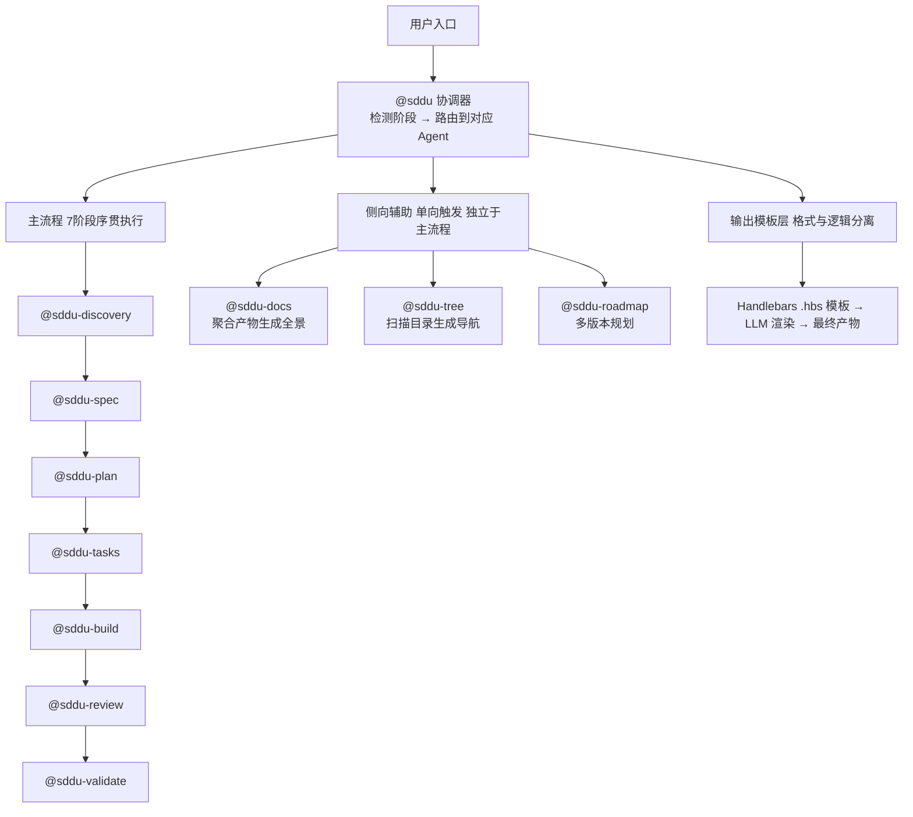

# Agent 体系 — docs-overview

> **文档定位**: Agent 体系全景入口 — SDDU 框架中全部 AI Agent 的分类、架构与核心设计原则
> **输出文件名**: docs-overview.md
> **数据来源**: 聚合自 specs-tree-root/specs-tree-docs-agent-optimization, specs-tree-root/specs-tree-sdd-plugin-roadmap, specs-tree-root/specs-tree-sdd-plugin-baseline, specs-tree-root/specs-tree-agent-output-templating, specs-tree-root/specs-tree-template-quality-unification
> **创建人**: SDDU Docs Agent
> **创建时间**: 2026-07-05
> **版本**: v1.0
> **更新人**: SDDU Docs Agent
> **更新时间**: 2026-07-05
> **更新说明**: 全量生成 — Agent 体系初始全景

## 1. 业务全景

> 描述 Agent 体系的核心组成、组件关系与边界。

### 1.1 自身概述

| 属性 | 值 |
|------|-----|
| **层级** | 系统级 |
| **职责** | SDDU 框架的核心执行单元体系，以 11 个专业化 AI Agent 覆盖需求挖掘到产物验证的完整开发生命周期 |
| **版本** | v3.1.0（代码扫描校正） |

### 1.2 概述

SDDU 的核心执行单元是 11 个专业化 AI Agent（历史峰值 16 个，当前运行时移除序号变体后精简为 11 个），每个 Agent 负责工作流中一个阶段或一项辅助能力。Agent 以 Markdown 指令模板定义（位于 `src/templates/agents/`），通过 Handlebars 构建系统编译部署到 `dist/templates/agents/`。指令模板（`.hbs` 文件）→ `build-agents.cjs` 编译 → `.opencode/agents/*.md`。模板占位符 `<<变量>>` 由构建系统替换为实际值。运行时模型统一为 `deepseek/deepseek-v4-pro`（配置于 `opencode.json`）。

### 1.3 Agent 分类

#### 主流程 Agent（7 阶段，当前运行时仅短名）

SDDU 当前运行时提供 7 个主流程 Agent（仅短名变体，序号变体已在 v1.4.0 废弃），加上 1 个入口 Agent + 3 个辅助 Agent = 共 **11 个运行时 Agent**。历史版本（v1.1.1）曾支持序号+短名双命名（14 个），但在品牌升级后精简。所有 Agent 运行时统一使用 `deepseek/deepseek-v4-pro` 模型（代码扫描确认于 `opencode.json`）。

| 阶段 | Agent | 输入 → 输出 |
|:--:|-------|------|
| 0/7 — 需求挖掘 | @sddu-discovery | 模糊想法 → `discovery.md` |
| 1/7 — 规范编写 | @sddu-spec | 问题清单 → `spec.md` |
| 2/7 — 技术规划 | @sddu-plan | 需求规范 → `plan.md` + ADR |
| 3/7 — 任务排布 | @sddu-tasks | 技术方案 → `tasks.md/json` |
| 4/7 — 代码实现 | @sddu-build | 任务清单 → 源代码 + `build.md` |
| 5/7 — 代码审查 | @sddu-review | 代码 + 规范 → `review.md` |
| 6/7 — 产物验证 | @sddu-validate | 审查报告 → `validation.md` |

#### 智能入口 Agent

| Agent | 描述 |
|-------|------|
| @sddu | 自动检测当前 Feature 阶段，路由到正确的阶段 Agent。是整个工作流的统一入口，用户通过 @sddu 启动新 Feature 或继续已有 Feature |

#### 侧向辅助 Agent（3 个）

三个辅助 Agent 以项目级视角扫描和产出文档，职责互斥不重叠：

| Agent | 描述 | 状态 |
|-------|------|:----:|
| @sddu-docs | 项目全景专家 — 扫描 Feature 过程产物，聚合为业务 + 技术全景 | ✅ 完整可执行（v3.0.0） |
| @sddu-tree | 目录导航专家 — 扫描 .sddu/ 目录，生成 TREE 导航 | ✅ 完整可执行 |
| @sddu-roadmap | 版本规划专家 — 多版本路线图、优先级排序、时间表 | ✅ 完整可执行 |

### 1.4 核心设计原则

| # | 原则 | 说明 |
|---|------|------|
| **P1** | **Agent-Native 模式** | 所有逻辑内嵌于 Markdown 指令模板，LLM 使用 glob/read/grep/bash 等工具驱动执行。无需额外脚本或中间格式 |
| **P2** | **阶段防跳过状态机** | 状态机确保无法跨阶段执行（如无法从 spec 直接跳转到 build）。状态持久化于 state.json，@sddu 协调器检验前置条件 |
| **P3** | **三 Agent 精确边界** | @sddu-docs（语义聚合—系统是什么）、@sddu-tree（结构导航—文件在哪里）、@sddu-roadmap（版本规划—系统怎么走），7 维度边界定义互斥不重叠 |
| **P4** | **单命名入口** | 当前运行时仅支持短名调用（如 `@sddu-build`），编号变体（`@sddu-4-build`）已在 v1.4.0 SDDU 品牌升级中废弃。`build-agents.cjs` 的 `AGENT_MAP` 仅生成短名版本 |
| **P5** | **输出模板化** | 所有主流程 Agent 和 docs Agent 的输出格式由独立的 Handlebars 模板文件定义，支持用户自定义覆盖（FR-TPL-001） |

### 1.5 @sddu-docs 高级特性

作为唯一从占位骨架补全的 Agent，@sddu-docs 具备以下高级能力：

| 特性 | 说明 |
|------|------|
| **双模式架构** | 默认模式扫描 specs-tree-root 过程产物；用户指令触发代码扫描模式（如"@sddu-docs 扫描代码生成全景"），产物标注「未经 SDDU 工作流验证」 |
| **20 个输出模板** | 按内容特征匹配选择，覆盖全景入口（T1）、业务对象（T2）、API 文档（T3）、数据模型（T4）、部署信息（T9）等 20 种场景 |
| **增量更新** | 首次全量生成，后续仅重写变更 Feature 所在域。使用 mtime 对比检测变更 |
| **代码 vs 设计一致性检测（C1~C4）** | 代码扫描模式下，对比 specs-tree 设计文档与代码实现，检测技术选型漂移（C1）、模块增删（C2）、API 差异（C3）、架构偏离（C4）四类冲突 |
| **产物目录树** | 按业务层级组织（子系统→模块→对象），每级统一入口 docs-overview.md 描述本级实体与子组件关系 |

### 1.6 Agent 架构

```mermaid
graph TD
    subgraph SRC["src/templates/ 模板源文件"]
        AGENTS_DIR[agents/<br/>Agent指令模板 Handlebars]
        ENTRY[sddu.md.hbs<br/>入口Agent]
        MAIN["sddu-discovery ~ sddu-validate<br/>7 主流程 Agent"]
        AUX["sddu-roadmap / sddu-tree / sddu-docs<br/>3 辅助 Agent"]
        OUTPUTS_DIR[outputs/<br/>产物模板 Handlebars]
        MAIN_OUT["sddu-discovery ~ sddu-validate<br/>7 主流程输出模板"]
        DOCS_DIR[docs/<br/>@sddu-docs专用 20个模板]
    end

    AGENTS_DIR --> ENTRY
    AGENTS_DIR --> MAIN
    AGENTS_DIR --> AUX
    OUTPUTS_DIR --> MAIN_OUT
    OUTPUTS_DIR --> DOCS_DIR

    SRC -->|build-agents.cjs 编译| DIST[.opencode/agents/*.md<br/>Agent 定义]
```

### 1.7 内部组件关系



## 2. 技术全景

> 描述 Agent 体系涉及的技术选型、架构决策和部署信息。

### 2.1 技术栈

| 技术 | 用途 |
|------|------|
| Markdown + YAML frontmatter | Agent 指令模板定义语言 |
| Handlebars (.hbs) | 模板引擎 — 编译 Agent 指令 + 渲染输出模板 |
| Node.js / TypeScript | 构建脚本（build-agents.cjs）、插件运行时 |
| Shell (bash / PowerShell) | 安装脚本（install.sh / install.ps1） |
| opencode Agent API | Agent 注册、路由、工具调用（edit/bash/webfetch/task） |
| DeepSeek V4 Pro | 所有 Agent 统一模型（运行时配置于 opencode.json） |

### 2.2 关键 ADR

| ADR | 决策 | 影响范围 |
|-----|------|---------|
| ADR-001 | Agent-Native 扫描方案 — 所有逻辑内嵌指令模板，由 LLM 驱动执行 | @sddu-docs 实现路径 |
| ADR-002 | 三 Agent 7 维度边界定义 — docs/tree/roadmap 扫描范围、输入、输出、消费方互斥 | 辅助 Agent 体系 |
| ADR-003 | 双模式架构 — specs-tree 主模式 + 用户指令代码扫描模式，不耦合不降级 | @sddu-docs 能力边界 |
| FR-ROADMAP ADR-001 | 单一输出文件原则 — ROADMAP.md 为唯一输出 | @sddu-roadmap 产物形态 |
| FR-ROADMAP ADR-002 | 灵活输入设计 — 支持多输入方式，Agent 负责信息补全 | @sddu-roadmap 用户体验 |
| FR-ROADMAP ADR-003 | 温度参数 0.4 — 创造性（规划建议）与严谨性（逻辑推理）的平衡 | @sddu-roadmap LLM 配置 |

### 2.3 版本演进

| 版本 | 里程碑 | 说明 |
|------|--------|------|
| v1.1.1 | 16 Agent 上线 | 7 阶段 × 2 命名（序号+短名）+ @sdd + @sdd-help |
| v1.4.0 | SDDU 品牌升级 | SDD → SDDU 更名，废弃序号变体，精简至 11 Agent |
| v2.5.0 | 输出模板化系统 | 7 主流程 Agent 输出模板分离 + Handlebars 模板引擎 |
| v2.6.0 | 状态增强 + Discovery | 新增 discovery 阶段（0/7），状态机扩展至 8 phase |
| v3.0.1 | 模板质量统一 | 17 模板格式统一 + 11 Agent 职责边界声明 |
| v3.0.0 | @sddu-docs 补全 | 最后一个占位 Agent 补全，双模式 + 20 模板 + 增量更新 |
| v3.1.0 | 框架源码架构重组 | 三域分层 + 平台适配器隔离 |
| *当前* | **运行时 11 Agent** | @sddu + 7 主流程 + 3 辅助，统一 deepseek-v4-pro 模型 |

## 修订记录

| 生成时间 | 变更 Feature | 生成方式 | 修订人 |
|---------|-------------|:--:|--------|
| 2026-07-05 | 初始生成 | 全量 | SDDU Docs Agent |
