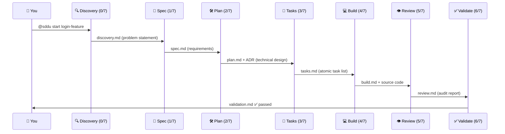
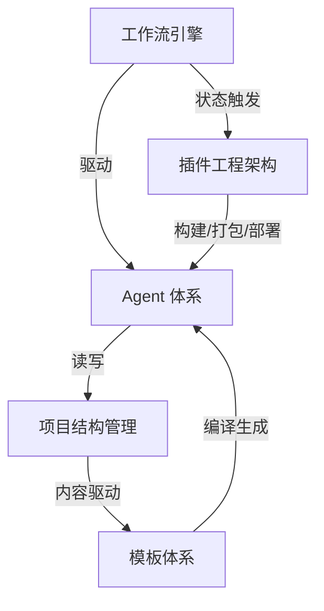
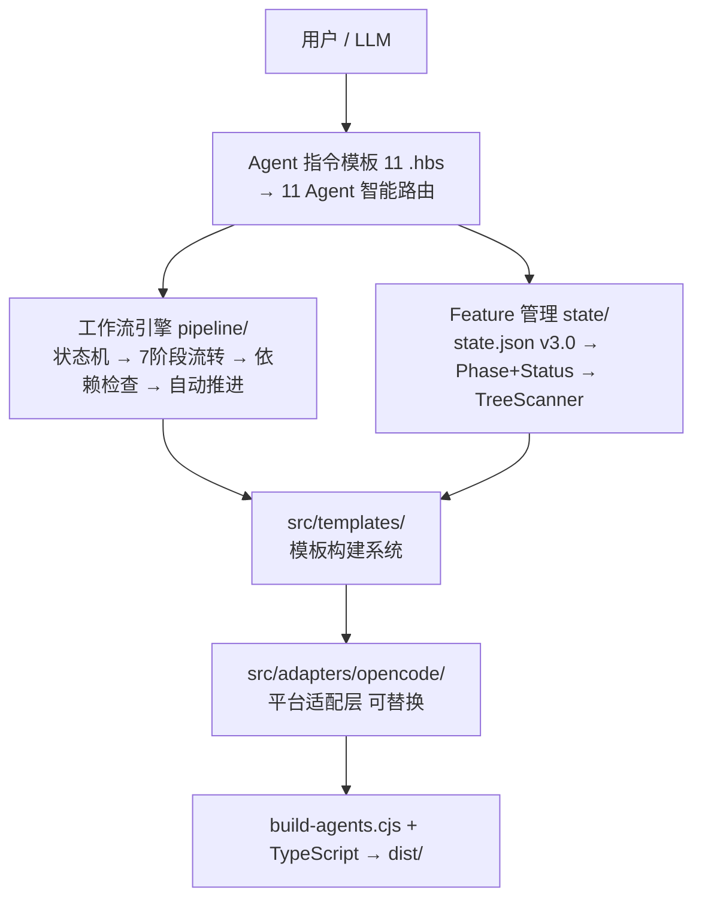
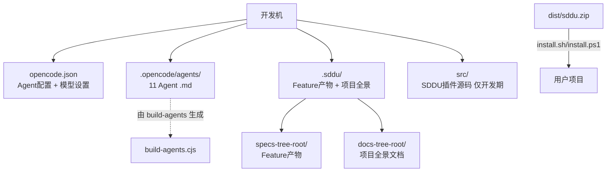

# SDDU — 项目全景

> SDDU = Specification-Driven Development Utility. An OpenCode plugin providing 7-stage AI-assisted structured development workflow. 11 specialized AI Agents. State machine prevents phase skipping. Tree-structured Feature management with distributed state.

version 1.4.1 | 17 Features | status stable | MIT

---

## 🚀 快速上手

```bash
# 1. Install
curl -fsSL https://raw.githubusercontent.com/THZSummer/sddu/main/bootstrap.sh | bash -s -- ./my-project

# 2. Enter and launch
cd ./my-project
opencode

# 3. Start first Feature
@sddu 开始 用户登录功能
```

`@sddu` 是智能入口 Agent，自动检测当前阶段并路由到正确的阶段 Agent。每个阶段自动生成结构化文档，状态自动推进。无需手动创建文件或切换 Agent — 一条命令开启完整工作流。

---

## 🔄 工作流全景



SDDU 将软件开发组织为 **7 个连续阶段**，从模糊想法到可交付验证，每个阶段由专属 AI Agent 引导，产出标准化文档产物。

| Stage | Agent | Input → Output |
|:--:|-------|------|
| 0 | @sddu-discovery | fuzzy idea → discovery.md |
| 1 | @sddu-spec | problem statement → spec.md |
| 2 | @sddu-plan | spec → plan.md + ADR |
| 3 | @sddu-tasks | plan → tasks.md/json |
| 4 | @sddu-build | tasks → source + build.md |
| 5 | @sddu-review | code + spec → review.md |
| 6 | @sddu-validate | review report → validation.md |

**三个设计原则**：

- 🚫 **No phase skipping**: 没有 spec 不能 plan，没有 plan 不能 tasks。状态机保障阶段单向流动。
- 🤝 **No boundary crossing**: 每个 Agent 只做自己阶段的事。discovery 不定义需求，plan 不写代码。
- 📄 **Documents ARE state**: 每个阶段的产出文件即状态证据。state.json 只记录 phase + status，不冗余存储产物内容。

---

## 🤖 Agent 体系

### 主流程 Agent（7 阶段 × 2 命名）

每个阶段 Agent 同时存在编号命名和语义命名两种形式：

| Agent | Phase | Input | Output | Model |
|-------|:--:|------|------|------|
| @sddu-0-discovery / @sddu-discovery | 0/7 | 模糊想法 | discovery.md — 结构化问题清单 | qwen3.5-plus |
| @sddu-1-spec / @sddu-spec | 1/7 | 问题清单 | spec.md — 需求规范（含验收标准） | qwen3.5-plus |
| @sddu-2-plan / @sddu-plan | 2/7 | 需求规范 | plan.md + ADR — 技术方案 | qwen3.5-plus |
| @sddu-3-tasks / @sddu-tasks | 3/7 | 技术方案 | tasks.md/json — 原子任务清单 | qwen3.5-plus |
| @sddu-4-build / @sddu-build | 4/7 | 任务清单 | source code + build.md | qwen3-coder-plus |
| @sddu-5-review / @sddu-review | 5/7 | 代码 + 规范 | review.md — 审计报告 | qwen3-coder-plus |
| @sddu-6-validate / @sddu-validate | 6/7 | 审查报告 | validation.md — 验证结果 | qwen3-coder-plus |

### 辅助 Agent

| Agent | Type | Description |
|-------|:--:|------|
| @sddu | 🚪 Entry | Smart routing, 6-section dashboard, status management (suspend/terminate/resume) |
| @sddu-roadmap | 📋 Independent | Multi-version roadmap, RICE prioritization, timeline planning |
| @sddu-tree | 🔄 Auto | Scans .sddu/ generates TREE.md navigation — recursive structure overview |
| @sddu-docs | 📖 Independent | Dual-mode project overview: specs-tree scan (default) + code scan (user-triggered) |

### 关键设计决策

- **Agent-Native 模式**: 所有 Agent 逻辑内嵌于 Markdown 指令模板，LLM 使用 glob/read/grep/bash 等工具直接驱动执行，无需额外脚本或中间格式。
- **双命名体系**: 每个阶段同时支持 `@sddu-0-discovery`（编号）和 `@sddu-discovery`（语义）两种调用方式，兼顾快速选择和语义记忆。
- **辅助 Agent 7 维度边界**: @sddu-docs（语义聚合—系统是什么）、@sddu-tree（结构导航—文件在哪里）、@sddu-roadmap（版本规划—系统怎么走）在扫描范围、输入、输出、消费方等 7 个维度精确互斥。
- **独立模型配置**: 主流程前 4 阶段使用 qwen3.5-plus（理解与规划），后 3 阶段使用 qwen3-coder-plus（编码与验证）。Agent 权限独立配置（edit/bash/webfetch）。

---

## 📋 常用命令

```bash
# Smart entry (recommended)
@sddu 开始 功能名称          # Start new Feature — auto-routes to discovery
@sddu 继续                  # Continue current Feature — detects current phase
@sddu 状态                  # 6-section dashboard: feature list, phase map, state overview

# Direct phase agents
@sddu-discovery "用户需要快捷登录"     # Fuzzy idea → discovery.md
@sddu-spec "用户登录"                  # Problem → spec.md
@sddu-plan "用户登录"                  # Spec → plan.md + ADR
@sddu-tasks "用户登录"                 # Plan → atomic task list
@sddu-build "实现 TASK-001"           # Task → source code
@sddu-review "用户登录"                # Code → review report
@sddu-validate "用户登录"              # Review report → validation

# Status management
@sddu 标记 feature-name suspended --until 2026-07-01
@sddu 标记 feature-name terminated

# Planning
@sddu-roadmap "Q2 上线，2 个人，做什么功能好"

# Documentation
@sddu-docs                  # Generate project overview from specs-tree
@sddu-docs 扫描代码生成全景  # Code scan mode: compare source vs design
```

---

## 🏗️ 系统架构

### 五大功能域

SDDU 系统由五个功能域组成，分层协作：

**1. 工作流引擎** — The heart. 7 阶段流水线 + v3.0 Phase（8 阶段）+ Status（5 状态）双字段状态机。保障阶段单向流动不跳过。支持子 Feature 并行执行（同父级子 Feature 组内并行，不同父级组间串行）。`session.idle` 事件驱动自动推进和一致性检测。依赖检查器确保前置条件完备。
> 📂 详见: [工作流引擎/docs-overview.md](工作流引擎/docs-overview.md) | [流程图](工作流引擎/工作流引擎-flow.md)

**2. Agent 体系** — The brain. 11 个专业化 AI Agent 覆盖所有阶段 + 辅助能力。Markdown 指令模板通过 Handlebars 编译系统（`build-agents.cjs`）生成 Agent .md 文件。智能入口 Agent（@sddu）自动路由。三辅助 Agent 以 7 维度边界精确互斥。
> 📂 详见: [Agent体系/docs-overview.md](Agent体系/docs-overview.md) | [ADR 索引](Agent体系/adr-index.md)

**3. 项目结构管理** — The skeleton. `specs-tree-root` 树形目录结构管理所有 Feature 全生命周期产物。统一 `specs-tree-` 前缀，无限层嵌套深度，父级（轻量化）vs 叶子（完整）两种模式。分布式 `state.json` + 全局聚合器，TreeScanner 递归扫描。
> 📂 详见: [项目结构管理/docs-overview.md](项目结构管理/docs-overview.md) | [Schema 演进](项目结构管理/项目结构管理-data.md)

**4. 模板体系** — The language. 35+ Handlebars 模板：11 个 Agent 指令模板 + 20 个输出文档模板 + 4 个关系模板。用户自定义模板优先加载，内置模板兜底，语法错误自动回退。Agent-Native 运行时解析，模板自声明输出文件名。输出产物禁止原文照搬（X1）和 Feature 目录名泄漏（X2）。
> 📂 详见: [模板体系/docs-overview.md](模板体系/docs-overview.md)

**5. 插件工程架构** — The body. 三层分层设计：**核心业务层**（`src/pipeline/`, `src/state/`, `src/discovery/` — 方法论实现，零平台依赖）→ **平台适配层**（`src/adapters/opencode/` — Agent注册/工具注册/生命周期）→ **共享层**（`src/shared/` — 公共类型/错误枚举/状态模式）。统一类型导出、多平台安装脚本（shell+PowerShell）、3 粒度测试（core/opencode/integration）。
> 📂 详见: [插件工程架构/docs-overview.md](插件工程架构/docs-overview.md) | [ADR 索引](插件工程架构/adr-index.md)

### 跨域数据流



**展开说明**:
- **工作流引擎 → Agent 体系**: 状态机根据当前 phase 决定可调用的 Agent，phase 未到时 Agent 拒绝执行
- **Agent 体系 → 项目结构管理**: 每个 Agent 在 specs-tree-root 下读写对应阶段产物，产物即状态
- **项目结构管理 → 模板体系**: Feature 产物内容驱动模板选择与渲染，template matching is content-aware
- **模板体系 → Agent 体系**: build-agents.cjs 将 .hbs 模板编译为 Agent .md 指令文件，存入 `.opencode/agents/`
- **工作流引擎 → 插件工程架构**: 状态变更触发构建流水线（session.idle → 自动检查 → 必要时 rebuild）
- **插件工程架构 → Agent 体系**: 构建产物 dist/ 包含所有 Agent 定义，分发到用户项目的 `.opencode/agents/`

---

## 🔧 安装

### 一行安装（推荐）

**Linux/macOS:**
```bash
curl -fsSL https://raw.githubusercontent.com/THZSummer/sddu/main/bootstrap.sh | bash -s -- ./my-project
```

**Windows (PowerShell):**
```powershell
powershell -c "iwr https://raw.githubusercontent.com/THZSummer/sddu/main/bootstrap.ps1 | iex; Install-Sddu ./my-project"
```

### 本地安装（已克隆仓库）
```bash
bash install.sh ./my-project
```

### 从源码构建
```bash
npm install && npm run build && npm run package && bash install.sh ./my-project
```

---

## 🚧 项目约束（Agent 必读）

> ⚠️ **Dogfooding 规则**: SDDU 项目自身使用 SDDU 工作流开发。所有 Agent 在定义需求/方案/任务时，修改目标只限设计态源码（`src/`, `scripts/`, `e2e/`, `docs/`, `examples/`, `package.json`, `tsconfig.json` 等）。**`opencode.json` + `.opencode/` 是编译产物（由 `src/` build 生成），`.sddu/` 是流程产物 — 二者不得列为修改/创建/删除目标。** 改运行时行为请走「改 `src/` + `npm run build`」。

---

## 📁 产出文件结构

```
.sddu/
├── TREE.md                    # 目录导航（@sddu-tree 自动生成）
├── ROADMAP.md                 # 版本路线图（@sddu-roadmap 生成）
├── COMPLETION_CERTIFICATE.json
├── specs-tree-root/
│   ├── TREE.md
│   ├── state.json             # 全局聚合状态
│   ├── architecture/adr/      # ADR 决策记录（ADR-001 ~ ADR-017）
│   └── specs-tree-<feature>/
│       ├── discovery.md / spec.md / plan.md
│       ├── tasks.md / tasks.json
│       ├── build.md / review.md / validation.md
│       ├── state.json         # Phase + Status 双字段
│       └── specs-tree-<sub>/  # 可选子 Feature（递归嵌套）
├── docs-tree-root/            # 项目全景文档（@sddu-docs 生成）
│   ├── docs-overview.md       # 本文件 — 根级入口
│   ├── 工作流引擎/            # 域文档
│   ├── Agent体系/
│   ├── 项目结构管理/
│   ├── 模板体系/
│   └── 插件工程架构/
└── docs/                      # FAQ、迁移指南等（29 个文档）
```

---

## 🗺️ 版本路线图

| 版本 | 主题 | 状态 |
|------|------|:--:|
| v3.0.1 | 模板质量统一 — 17 模板格式骨架 + 11 Agent 职责边界 | ✅ 已完成 |
| v3.0.0 | Phase+Status 双字段状态模型 — phase(8) + status(5) | ✅ 已完成 |
| v4.0.0 | 源码架构重组 — 三域分层 + 平台适配器隔离 | ✅ 已完成 |
| v3.1.0 | 工具链增强 — Bug 流程框架化（FR-BUG-001） | 📋 规划中 |
| v3.2.0 | 项目知识基础设施 — 全局配置 + 知识沉淀 | 💡 提议中 |

详见 [.sddu/ROADMAP.md](../ROADMAP.md)

---

## 🔨 开发者命令

```bash
npm install && npm run build    # 构建（Agent + TypeScript）
npm run build:agents            # 仅构建 Agent 模板（.hbs → .md）
npm run build:ts                # 仅编译 TypeScript
npm run package                 # 打包 dist/sddu.zip
npm run dev                     # 监听 TypeScript 编译
npm run clean                   # 清理构建产物

npm test                        # 运行所有测试
npm run test:core               # 仅核心层测试
npm run test:opencode           # 仅平台适配层测试
npm run test:integration        # 仅集成测试
npm run test:state:integration  # 状态机集成测试

bash e2e/scripts/basic/sddu-e2e.sh   # 基础 E2E（TypeScript + Node.js）
```

---

## Feature 索引

| # | Feature 名称 | 功能域 | 状态 |
|:--:|-------------|--------|:----:|
| 1 | SDD Discovery 需求挖掘增强 | 工作流引擎 | ✅ completed |
| 2 | SDD 子 Feature 化并行开发 | 工作流引擎 | ✅ completed |
| 3 | SDD 工作流状态优化 | 工作流引擎 | ✅ completed |
| 4 | SDDU 特性状态增强 (v3.0) | 工作流引擎 | ✅ completed |
| 5 | @sddu-docs Agent 补全与优化 | Agent 体系 | 🔄 validated |
| 6 | SDD Roadmap 规划专家 | Agent 体系 | ✅ completed |
| 7 | SDD Plugin Phase 1 基线 | Agent 体系 | ✅ completed |
| 8 | specs-tree-root 目录结构优化 | 项目结构管理 | ✅ completed |
| 9 | 树形结构优化 V1 | 项目结构管理 | ✅ completed |
| 10 | 树形结构优化 V2 修复 | 项目结构管理 | ✅ completed |
| 11 | Agent 输出模板化系统 | 模板体系 | ✅ completed |
| 12 | 预置输出模板质量统一 | 模板体系 | ✅ completed |
| 13 | SDDU 框架源码架构重组 | 插件工程架构 | ✅ validated |
| 14 | SDD 工具系统优化 | 插件工程架构 | ✅ completed |
| 15 | 废弃 SDD 工具 | *内部清理* | ✅ completed |
| 16 | Plugin Rename SDDU V1 + V2 | *品牌更名* | ✅ completed |

**已过滤的 Feature**（纯内部重构/过程性，不影响功能定义）：`specs-tree-solo-team-flow`（缺 spec/plan，已终止并迁出至独立仓库）。

---

## 跨域技术全景

### 整体架构分层



### 技术栈

| 分类 | 技术 | 用途 |
|------|------|------|
| 语言 | TypeScript | Plugin runtime, state machine, tool system |
| 模板引擎 | Handlebars (.hbs) | Agent instructions + output templates |
| 构建 | Node.js (build-agents.cjs) | Template compilation → Agent generation |
| 平台 | OpenCode Plugin SDK | Agent registration, tool calls, lifecycle |
| 分发 | Shell / PowerShell | install.sh / install.ps1 multi-platform |
| 测试 | Jest (4-project granularity) | core / opencode / integration / e2e |
| 运行时依赖 | ajv (JSON Schema 校验) + uuid (ID 生成) | state.json 校验、Feature ID |
| AI 模型 | DeepSeek V4 Pro | 所有 Agent 统一运行时模型 |

### 部署拓扑



---

## ⚠️ 代码扫描一致性报告（2026-07-05）

基于 `SCAN_MODE=CODE` 对 `src/` `scripts/` `e2e/` `package.json` `opencode.json` `tsconfig.json` 的扫描，与 specs-tree 全景文档对比：

| 类型 | 发现 | 修正 |
|:--:|------|------|
| **C1** | Agent 模型：文档记录 `qwen3.5-plus / qwen3-coder-plus` → 代码 `deepseek-v4-pro` | ✅ 已更新 Agent体系 技术栈表和概述 |
| **C1** | Agent 数量：文档 "15+" → 代码运行时 11（无序号变体） | ✅ 已更新根文档 + Agent体系 |
| **C1** | Schema 版本：文档 v1.0→v2.0→v2.1→v3.0 → 代码 v1.2.5→v2.0.0→v3.0.0 | ✅ 已标注代码文件映射 |
| **C2** | `src/agents/` 目录不存在 → Agent 实际在 `templates/agents/` + `adapters/opencode/agents/` | ✅ 已更正 Agent体系 概述 |
| **C2** | 未记录模块：`readme-generator` `subfeature-manager` `sddu-migrate-schema` `bootstrap` `examples/` `docs/` | ✅ 已补充到插件工程架构 |
| **C3** | `package.json` 子路径导出 (`./pipeline` `./state` 等) 未记录 | ✅ 已补充到工具系统章节 |
| **C3** | 辅助脚本 (`sddu-check.sh` 等) 未提及 | ✅ 已补充 |
| **C4** | 测试架构：文档 unit+e2e 两层 → 代码 unit+integration+e2e 三层 | ✅ 已更新插件工程架构 |
| **C4** | `pipeline/` 与 `discovery/` 同名文件 | ✅ 已标注（业务域独立演进） |

---

## 修订记录

| 版本 | 变更说明 | 日期 |
|------|----------|------|
| v2.1 | 代码扫描校正 — C1~C4 一致性检测 + 8 处漂移修正 | 2026-07-05 |
| v2.0 | 根文档重构为自包含入口 + 补充快速上手/命令/安装/约束/路线图 + Mermaid 可视化 | 2026-07-05 |
| v1.0 | 全量构建 — 聚合 14 Feature，5 功能域 | 2026-07-05 |

---

*本文档由 @sddu-docs 聚合生成。各功能域详情请点击上方链接深度查阅。版本规划详见 ROADMAP.md（@sddu-roadmap 生成）。目录导航详见 TREE.md（@sddu-tree 生成）。*
