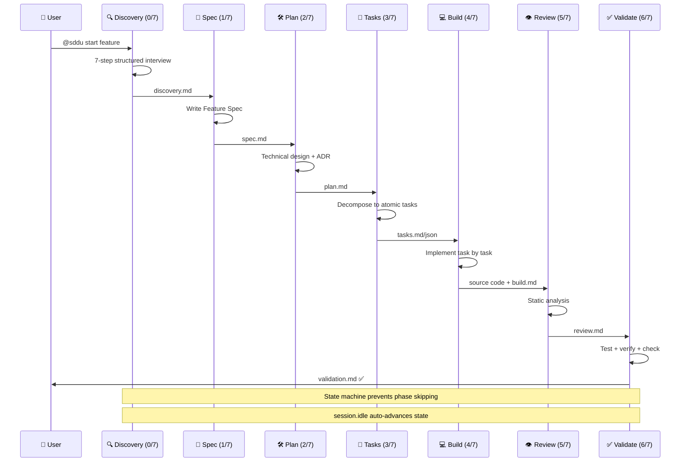
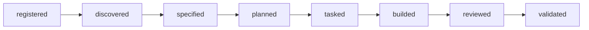
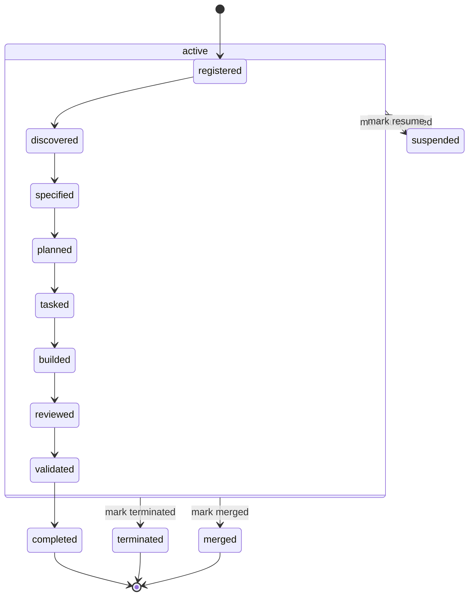

# SDDU 工作流引擎 — 概述

## 概述

SDDU 工作流引擎是框架的核心调度系统，驱动规范驱动的 AI 辅助开发全流程。它通过严格的状态机（Phase + Status 双字段模型）保障各阶段单向流动，杜绝阶段跳过或回退，从而将 AI 的开放性输出约束为可审计、可追溯、可验证的工程产物。

工作流引擎管理从**需求挖掘**到**最终验证**的完整生命周期，覆盖 7 个串行阶段 + 可选的子 Feature 并行扩展。

---

## 7 阶段工作流

| Stage | 名称 | 英文 | 核心产出 | 对应 Agent |
|-------|------|------|----------|-----------|
| 0 | 发现 | Discovery | 结构化需求文档（7 步澄清法） | sddu-discovery |
| 1 | 规范 | Specification | Feature Spec 文档 | sddu-spec |
| 2 | 规划 | Planning | 技术方案 + ADR 决策记录 | sddu-plan |
| 3 | 任务 | Tasking | 可并行执行的原子任务清单 | sddu-tasks |
| 4 | 构建 | Build | 逐项实现的代码产出 | sddu-build |
| 5 | 审查 | Review | 静态分析报告（质量/规范/一致性） | sddu-review |
| 6 | 验证 | Validate | 测试通过报告 + 接口调测结果 | sddu-validate |

### Stage 0 — Discovery（发现）

采用**7 步结构化访谈法**引导用户澄清模糊问题，输出可用于 Spec 编写的结构化需求文档。每个 Feature 必须经过 Discovery 方可进入 Spec 阶段。

### Stage 1 — Specification（规范）

将 Discovery 产出转化为完整的 **Feature Specification** 文档，包含问题陈述、目标、范围、验收标准。spec.md 是后续所有阶段的唯一需求基线。

### Stage 2 — Planning（规划）

基于 Spec 设计技术方案，产出 plan.md 及对应的 **ADR**（Architecture Decision Record）。ADR 记录关键架构决策及其上下文，形成知识库。

### Stage 3 — Tasking（任务）

将技术方案分解为可独立执行的原子任务（TASK-001 ~ TASK-N），每个任务包含明确定义、验收条件、预估工时。任务清单驱动 Build 阶段的分步实现。

### Stage 4 — Build（构建）

按任务清单逐项实现代码，每完成一个任务标记为 done。Build 阶段严格遵守"先任务、后编码"原则，不允许无任务编码。

### Stage 5 — Review（审查）

对 Build 产出进行**静态分析**：代码质量、规范符合性、架构一致性。审查通过是进入 Validate 的前置条件。

### Stage 6 — Validate（验证）

**动手验证**：跑测试、调接口、测性能。Validate 通过后 Feature 标记为 completed，可合入主分支。

---

## 状态模型（v3.0）

v3.0 引入 **Phase + Status 双字段隔离模型**，彻底解决旧版状态耦合导致的歧义问题。

### Phase（8 阶段）

phase 字段记录 Feature 所处的生命周期阶段，严格单向流动：

- 所有 phase 值统一采用 `-ed` 后缀（`builded` 保留历史命名）
- 不允许跳过任意阶段（如从 `specified` 直接跳到 `reviewed`）
- 不允许逆向流动

### Status（5 流转状态）

status 字段记录 Feature 在某一 phase 下的工作状态，独立于 phase 变化：

| 状态 | 说明 |
|------|------|
| active | 正在工作中 |
| suspended | 暂停，等待外部条件满足 |
| terminated | 终止，不再继续 |
| merged | 已合入主分支 |
| completed | 已完成（phase 到达 validated 时的终态） |

### 一致性检测器

自动校验 phase/status 组合的合法性，捕获以下异常：

- phase=validated 但 status≠completed
- phase=registered 但 status=completed
- status=merged 但 phase 未到达 reviewed
- 任意 phase 跳过

检测器在每次 `session.idle` 事件触发时自动运行。

---

## 子 Feature 并行支持

大型 Feature 可拆分为**子 Feature**，每个子 Feature 独立进行 6 阶段状态流转（不含 Discovery）。

### 执行规则

- **组内并行**：同一父 Feature 下的子 Feature 可同时处于 active 状态
- **组间串行**：不同父 Feature 之间保持串行，由全局状态机协调
- **状态聚合**：父 Feature 的 phase 由子 Feature 的完成度自动计算（例如所有子 Feature validated → 父 Feature validated）

### Task Group

引入 Task Group 概念管理子 Feature 的任务分组，每个子 Feature 对应一个 Task Group，组内任务可并行执行。

---

## 组成 Feature

工作流引擎由以下 4 个 Feature 聚合而成，均已完成（validated）：

| Feature | ID | 版本 | 优先级 | 完成状态 |
|---------|-----|------|--------|---------|
| SDD Discovery 需求挖掘能力增强 | specs-tree-sdd-discovery-feature | v2.0.0 | P0 | ✅ completed |
| SDD 子 Feature 化并行开发支持 | specs-tree-sdd-multi-module | v1.2.11 | P0 | ✅ completed |
| SDD 工作流状态优化 | specs-tree-sdd-workflow-state-optimization | v2.0.0 | P0 | ✅ completed |
| SDDU 特性状态增强（v3.0 核心） | specs-tree-sddu-status-enhancement | v1.0.0 | P1 | ✅ completed |

---

## 技术要点

- **状态机引擎**：TypeScript 实现（`machine.ts`），纯函数式状态转移，所有转换规则穷举定义
- **分布式 state.json**：每个 Feature/子 Feature 独立维护 `state.json`，全局聚合器定期收集汇总
- **事件驱动更新**：`session.idle` 事件触发自动状态扫描和一致性检测
- **依赖检查器**：在执行任何阶段转换前，自动检查所有依赖 Feature 的前置阶段是否完成

---

*本文档由 sddu-docs 聚合生成，聚合时间：2026-07-05*
