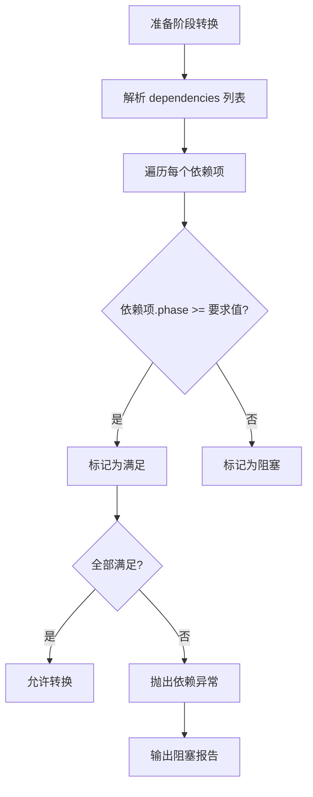

# SDDU 工作流引擎 — 流程规范

## 1. 7 阶段管道流程

### 1.1 主流程


### 1.2 阶段转换规则

每个阶段转换需同时满足以下条件：

| 条件 | 说明 |
|------|------|
| 前置阶段 completed | 前一阶段 phase=validated, status=completed |
| 本阶段产出完整 | 对应产出物（spec.md / plan.md / 任务清单等）已就位 |
| 无依赖阻塞 | 所有声明依赖的 Feature 已到达所需 phase |
| 一致性检查通过 | phase/status 组合合法，无结构性异常 |

转换由 `transition(phase, targetPhase)` 原子函数执行，失败时抛出结构化错误。

---

## 2. 状态机有效转移规则

### 2.1 Phase 转移矩阵

```
当前 phase → 目标 phase   | 允许 | 条件
--------------------------|------|------
registered → discovered   | ✅   | Discovery 7 步访谈完成
discovered → specified    | ✅   | spec.md 就位
specified → planned       | ✅   | plan.md + ADR 就位
planned → tasked          | ✅   | 任务清单非空
tasked → builded          | ✅   | 至少一个任务被 assign
builded → reviewed        | ✅   | 所有任务标记为 done
reviewed → validated      | ✅   | Review 报告无 blocking 问题
validated → (任何)        | ❌   | 终态，不可转移
```

### 2.2 非法转移

- **阶段跳过**：`specified → reviewed`（缺少 planned / tasked / builded）
- **逆向流动**：`validated → reviewed` 或 `planned → specified`
- **重复转换**：已 validated 的 Feature 再次触发任何 phase 转移

### 2.3 Status 转移规则

Status 独立于 phase 流转，允许在同 phase 内变更：

```
active → suspended    : 外部暂停指令
active → terminated   : 终止指令（不可逆）
suspended → active    : 恢复指令
active → merged       : Review/Validate 通过后合入
merged → completed    : 自动转换（终态）
```

---

## 3. Phase + Status 双字段模型

### 3.1 模型定义

```typescript
interface FeatureState {
  phase: Phase;        // 8 阶段值
  status: Status;      // 5 流转状态
}

type Phase = 
  | 'registered'
  | 'discovered'
  | 'specified'
  | 'planned'
  | 'tasked'
  | 'builded'
  | 'reviewed'
  | 'validated';

type Status =
  | 'active'
  | 'suspended'
  | 'terminated'
  | 'merged'
  | 'completed';
```

### 3.2 一致性规则矩阵

| phase \ status | active | suspended | terminated | merged | completed |
|----------------|--------|-----------|------------|--------|-----------|
| registered     | ✅     | ✅        | ✅         | ❌     | ❌        |
| discovered     | ✅     | ✅        | ✅         | ❌     | ❌        |
| specified      | ✅     | ✅        | ✅         | ❌     | ❌        |
| planned        | ✅     | ✅        | ✅         | ❌     | ❌        |
| tasked         | ✅     | ✅        | ✅         | ❌     | ❌        |
| builded        | ✅     | ✅        | ✅         | ❌     | ❌        |
| reviewed       | ✅     | ✅        | ✅         | ✅     | ❌        |
| validated      | ❌     | ❌        | ❌         | ✅     | ✅        |

说明：
- `merged` 仅在 `reviewed` 或 `validated` 阶段有效
- `completed` 仅允许在 `validated` 阶段出现，作为终态标记
- `active` + `validated` 视为非法组合（必须为 merged 或 completed）

### 3.3 一致性检测器

检测器注册在 `session.idle` 事件回调中，每次触发扫描全部 Feature：

```typescript
function consistencyCheck(features: Feature[]): Anomaly[] {
  return features
    .filter(f => !isValidPhaseStatusCombo(f.phase, f.status))
    .map(f => ({
      featureId: f.id,
      phase: f.phase,
      status: f.status,
      reason: getViolationReason(f.phase, f.status)
    }));
}
```

检测到的异常写入 `review-report-*.json`，并阻止下一次 phase 转移。

---

## 4. 子 Feature 并行执行流程

### 4.1 总体架构

```
父 Feature
├── 子 Feature A (独立状态机)
│   ├── Task Group A-1
│   ├── Task Group A-2
│   └── Task Group A-3
├── 子 Feature B (独立状态机)
│   ├── Task Group B-1
│   └── Task Group B-2
└── 全局协调器
```

### 4.2 执行规则

1. **组内并行**：同一父 Feature 下的子 Feature 各自独立运行状态机，可同时处于 builded 或 reviewed 等阶段
2. **组间串行**：不同父 Feature 的子 Feature 由全局协调器排队，同一时间只有一个父 Feature 族活跃
3. **完成聚合**：父 Feature 的 phase = 所有子 Feature phase 的最小值（取最慢的）
4. **依赖传递**：子 Feature 可声明对同一父下其他子 Feature 的依赖

### 4.3 状态聚合算法

```typescript
function aggregatePhase(subFeatures: SubFeature[]): Phase {
  const phaseOrder: Phase[] = ['registered','discovered','specified',
    'planned','tasked','builded','reviewed','validated'];
  
  const minIdx = Math.min(
    ...subFeatures.map(sf => phaseOrder.indexOf(sf.phase))
  );
  return phaseOrder[minIdx];
}
```

---

## 5. 自动更新机制（session.idle 事件驱动）

### 5.1 事件流程

```
session.idle
  → 触发 stateScanner.scan()
    → 遍历所有 Feature/子 Feature
      → 检查 state.json 是否更新（mtime 变化）
        → 若更新：重新解析并更新内存状态
        → 若未更新：跳过
    → 触发 consistencyCheck()
      → 发现异常 → 写入 review-report-*.json
    → 触发 dependencyChecker.run()
      → 发现阻塞 → 更新依赖图中对应边状态
```

### 5.2 触发时机

- 用户主动触发（`sddu scan` 命令）
- 自动定时触发（idle 超过 30 秒）
- 事件回调触发（session.end / session.error）

---

## 6. 依赖检查流程

### 6.1 依赖声明

Feature 在 `plan.md` 或 `state.json` 中声明依赖：

```json
{
  "dependencies": {
    "specs-tree-foo": "validated",
    "specs-tree-bar": "reviewed"
  }
}
```

### 6.2 检查流程



### 6.3 前置完成检测

在 transition() 函数入口处自动执行，无需手动调用。检测失败时：

1. 记录错误信息到 session 日志
2. 将 Feature 状态标记为 `suspended`
3. 输出阻塞链路（chain of block）

---

## 7. 错误处理

### 7.1 阶段跳过预防

| 防护机制 | 说明 |
|---------|------|
| Phase 顺序约束 | transition() 函数校验 `phaseOrder.indexOf(next) === phaseOrder.indexOf(current) + 1` |
| 产物 gate | 每个阶段转换前检查对应产物是否存在（如 spec.md / plan.md） |
| 审计日志 | 所有转换操作写入不可篡改的 state history |

### 7.2 前置依赖缺失

```typescript
// transition() 中的依赖检查
function transition(feature: Feature, targetPhase: Phase): TransitionResult {
  const currentIdx = PHASE_ORDER.indexOf(feature.phase);
  const targetIdx  = PHASE_ORDER.indexOf(targetPhase);
  
  if (targetIdx !== currentIdx + 1) {
    return { ok: false, error: 'PHASE_SKIP', detail: `${feature.phase} → ${targetPhase}` };
  }
  
  const missingDeps = checkDependencies(feature.id);
  if (missingDeps.length > 0) {
    return { ok: false, error: 'MISSING_DEPENDENCY', detail: missingDeps };
  }
  
  // ... 执行转换
}
```

### 7.3 错误码一览

| 错误码 | 含义 | 处理方式 |
|--------|------|---------|
| PHASE_SKIP | 阶段跳过 | 拒绝转换，提示缺失阶段 |
| MISSING_DEPENDENCY | 依赖前置未完成 | 标记为 suspended，输出依赖链 |
| INVALID_STATUS | phase/status 非法组合 | 一致性检测器修正或人工介入 |
| DUPLICATE_TRANSITION | 重复转换（已 validated） | 静默拒绝，记录警告 |
| CORRUPTED_STATE | state.json 格式错误 | 还原到上一个合法快照 |

---

*本文档由 sddu-docs 聚合生成，参考源：specs-tree-sdd-discovery-feature、specs-tree-sdd-multi-module、specs-tree-sdd-workflow-state-optimization、specs-tree-sddu-status-enhancement*
