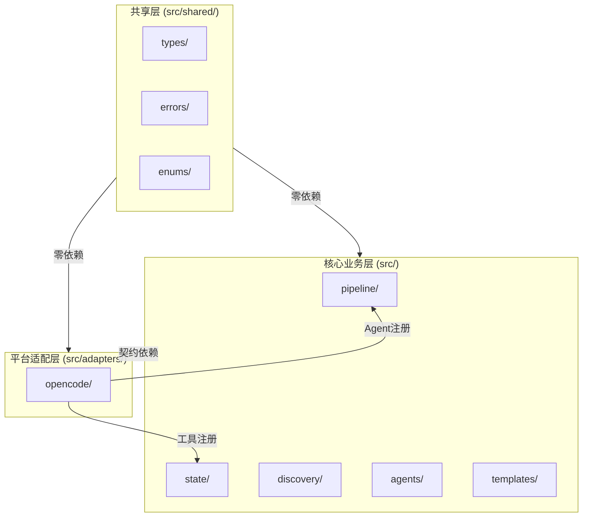
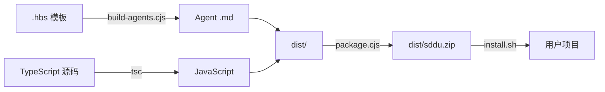

# 插件工程架构

## 概述

SDDU 插件的工程架构采用三层分层设计，将 SDDU 方法论核心与 OpenCode 平台适配层清晰分离，确保核心逻辑的平台无关性和适配层的可替换性。

## 三层架构

### 核心业务层

位于 `src/pipeline/`、`src/state/`、`src/discovery/`、`src/agents/`、`src/templates/`，包含：

- 工作流引擎
- 状态管理
- 需求挖掘
- Agent 定义
- 模板系统

该层对 OpenCode SDK **零依赖**，是纯粹的方法论实现。

### 平台适配层

位于 `src/adapters/opencode/`，包含：

- Agent 注册
- 工具注册
- 生命周期管理

该层通过契约依赖核心业务层，设计上可替换为其他 AI 平台适配器。

### 共享层

位于 `src/shared/`，包含：

- 公共类型定义
- 错误枚举
- 状态模式

该层对任何平台零依赖，是三层的公共契约基础。

### 补充模块（代码扫描发现，未在原始 spec 中逐一定义）

| 模块 | 路径 | 说明 |
|------|------|------|
| README 生成器 | `src/templates/readme-generator.ts` | 自动生成 Feature README |
| 子 Feature 管理器 | `src/templates/subfeature-manager.ts` | 子 Feature 模板与管理 |
| 子 Feature 模板 | `src/templates/subfeature-templates.ts` | 子 Feature 拆分模板定义 |
| Schema 迁移命令 | `src/adapters/opencode/commands/sddu-migrate-schema.ts` | CLI 驱动的状态格式升级 |
| 引导脚本 | `bootstrap.sh` / `bootstrap.ps1` | 一行远程安装（无需克隆仓库） |
| 项目示例 | `examples/tree-structure-demo/` | 电商平台三级嵌套树形示例 |
| 参考文档 | `docs/` (8 文件) | 迁移指南、拆分原则、E2E 指南等 |

> ⚠️ `pipeline/` 与 `discovery/` 两个域存在部分文件同名（`coaching-mode.ts`, `workflow-engine.ts`, `state-validator.ts`）—— 这是业务域独立演进的自然结果，非代码重复。

## 工具系统

- **统一类型导出架构**：所有公共类型从 `src/index.ts` 薄桶统一导出（re-export 各域 barrel）
- **子路径导出**：`package.json` 声明 4 个子导出 — `./pipeline` `./state` `./opencode` `./shared`
- **统一错误处理**：9 种错误类型（`SdduError`, `StateError`, `DiscoveryError`, `ToolError`, `AgentError`, `ConfigError`, `TreeStructureError` 等）+ 标准化错误消息
- **Agent 动态注册**：`src/adapters/opencode/agents/registry.ts` 自动发现和注册 Agent 定义
- **Schema 迁移命令**：`src/adapters/opencode/commands/sddu-migrate-schema.ts` — CLI 驱动的状态格式升级
- **打包分发**：`dist/` 扁平化 + `scripts/package.cjs` 生成 `dist/sddu.zip` 压缩包
- **多平台安装**：`install.sh` / `install.ps1`（本地）+ `bootstrap.sh` / `bootstrap.ps1`（一行远程安装）
- **辅助脚本**：`scripts/sddu-check.sh`（完整性检查）、`sddu-validation-report.sh`（验证报告）、`check-sdd-residue.sh`（残留检查）、`migrate-sdd-to-sddu.sh`（迁移工具）

## 构建流程

1. `build-agents.cjs`：从 `.hbs` 模板编译生成 Agent `.md` 文件
2. `npm run build`：TypeScript 编译 + Agent 生成 + 打包
3. 递归复制模板到 `dist/` 目录

## 测试组织

代码扫描确认实际为 **三层测试架构**（非文档原始描述的 unit+e2e 两层）：

- **单元测试**：`src/__tests__/unit/` — 按业务域组织（pipeline/state/discovery/shared/templates/agents），含 25 活跃 + 4 跳过（`.test.ts.skip`）
- **集成测试**：`src/__tests__/integration/` — 状态机集成、兼容性回归、tree-workflow
- **E2E 测试**：独立的 `e2e/` 目录 — basic（TypeScript 单项目）+ fullstack（SpringBoot+React）
- **三种粒度**独立执行：`npm run test:core` / `test:opencode` / `test:integration` / `test:e2e`

## 组成 Feature

| Feature | 状态 |
|---------|------|
| specs-tree-framework-architecture | 🔄 validated |
| specs-tree-sdd-tools-optimization | ✅ completed |
