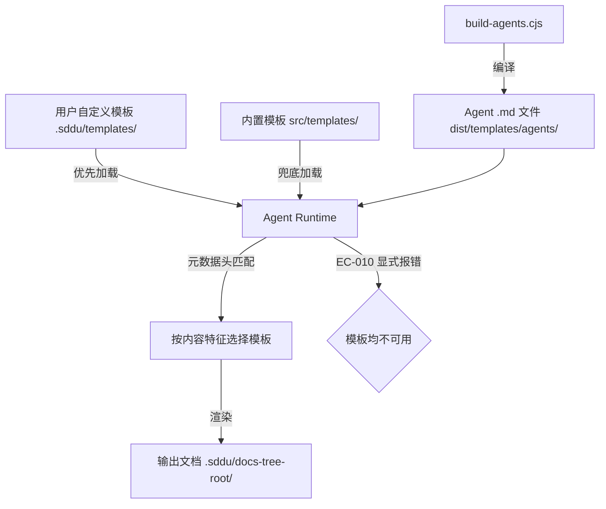
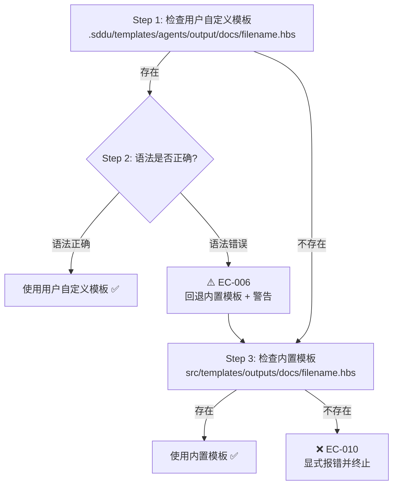

# 模板体系

## 概述

SDDU 的模板体系是所有 Agent 指令和输出文档的标准化基础设施。全系统包含 **35+ 个 Handlebars (.hbs) 模板**，统一管理 Agent 行为定义与文档生成格式。

**核心机制**：用户自定义模板优先加载（位于 `.sddu/templates/`），内置模板作为兜底（位于 `src/templates/`），两者均不可用时显式报错 **EC-010**。Agent-Native 运行时解析：LLM 在运行阶段直接读取模板元数据头，根据文档内容特征实时匹配最合适的模板，无需编译期预绑定。

**架构角色**：Agent 指令模板（11 个）定义各 Agent 的完整工作流、边界条件与异常处理逻辑；输出文档模板（20 个）统一所有生成文档的格式、章节结构与命名规范。通过 `scripts/build-agents.cjs` 构建脚本编译为 Agent `.md` 文件，由 opencode.json 调度加载。

## 模板架构图



## Agent 指令模板

位于 `src/templates/agents/`，共 **11 个模板**，覆盖主流程管线（阶段 0→6）及辅助 Agent。每个模板通过 YAML 元数据声明模式（`mode`）、温度（`temperature`）和工具权限（`permission`）。`<<变量名>>` 占位符由构建脚本在编译时替换。

| Agent | 模板文件 | 阶段 | mode | temperature |
|-------|---------|------|------|------------|
| sddu（路由调度） | `sddu.md.hbs` | 入口 | primary | 0.5 |
| sddu-discovery（问题挖掘） | `sddu-discovery.md.hbs` | 1/7 | all | 0.4 |
| sddu-spec（需求定义） | `sddu-spec.md.hbs` | 2/7 | all | 0.3 |
| sddu-plan（技术设计） | `sddu-plan.md.hbs` | 3/7 | all | 0.2 |
| sddu-tasks（任务排布） | `sddu-tasks.md.hbs` | 4/7 | all | 0.1 |
| sddu-build（实施构建） | `sddu-build.md.hbs` | 5/7 | all | 0.3 |
| sddu-review（产物审查） | `sddu-review.md.hbs` | 6/7 | all | 0.2 |
| sddu-validate（产物验证） | `sddu-validate.md.hbs` | 7/7 | all | 0.1 |
| sddu-roadmap（版本规划） | `sddu-roadmap.md.hbs` | 独立 | subagent | 0.4 |
| sddu-tree（目录导航） | `sddu-tree.md.hbs` | 触发 | subagent | 0.2 |
| sddu-docs（项目全景） | `sddu-docs.md.hbs` | 触发 | subagent | 0.3 |

各 Agent 模板自 v3.0.1 基线起持续演进，当前最新版本分布在 v3.0.3~v3.0.7 之间，每个版本解决特定的职责边界问题与一致性改进。

## 输出模板

位于 `src/templates/outputs/docs/`，共 **20 个模板**，按功能定位分为三大类别。每个模板通过元数据头（Markdown blockquote）自声明文档定位、输出文件名和数据来源。

### 定位文档模板（12 个）

| 模板文件 | 文档定位 | 输出文件名 |
|----------|---------|-----------|
| `sddu-docs-overview.md.hbs` | 本级全景入口 | `docs-overview.md` |
| `sddu-docs-api.md.hbs` | API 路由文档 — REST 端点、请求/响应 Schema、状态码 | `{subject}-api.md` |
| `sddu-docs-object.md.hbs` | 业务对象详情 | `{subject}-object.md` |
| `sddu-docs-data.md.hbs` | 数据模型文档 — 表结构、字段、索引、关联关系 | `{subject}-data.md` |
| `sddu-docs-page.md.hbs` | 前端页面文档 — 路由、组件树、交互流程 | `{subject}-page.md` |
| `sddu-docs-flow.md.hbs` | 业务流程文档 — 状态机、流转规则、异常路径 | `{subject}-flow.md` |
| `sddu-docs-config.md.hbs` | 配置项文档 — 环境变量、开关、参数说明 | `{subject}-config.md` |
| `sddu-docs-deploy.md.hbs` | 部署信息文档 — 拓扑、资源、CI/CD | `{subject}-deploy.md` |
| `sddu-docs-event.md.hbs` | 领域事件文档 — 事件类型、生产者、消费者、触发条件 | `{subject}-event.md` |
| `sddu-docs-command.md.hbs` | 命令列表文档 — 命令名称、参数说明、管道组合 | `{subject}-command.md` |
| `sddu-docs-security.md.hbs` | 安全策略文档 — 认证流程、授权矩阵、安全边界 | `{subject}-security.md` |
| `sddu-docs-integration.md.hbs` | 第三方集成文档 — 外部服务、回调、认证方式 | `{subject}-integration.md` |

### 关系文档模板（4 个）

| 模板文件 | 文档定位 | 输出文件名 |
|----------|---------|-----------|
| `sddu-docs-relation-deps.md.hbs` | 描述本级组件之间的调用依赖关系 | `{subject}-deps.md` |
| `sddu-docs-relation-flow.md.hbs` | 描述本级组件之间的数据流向 | `{subject}-dataflow.md` |
| `sddu-docs-relation-matrix.md.hbs` | 接口与能力对照关系，以矩阵形式呈现 | `{subject}-matrix.md` |
| `sddu-docs-relation-sequence.md.hbs` | 组件之间的调用时序 | `{subject}-sequence.md` |

### 元数据支撑模板（4 个）

| 模板文件 | 文档定位 | 输出文件名 |
|----------|---------|-----------|
| `sddu-docs-adr-index.md.hbs` | 汇总本级所有架构决策记录（ADR） | `adr-index.md` |
| `sddu-docs-source.md.hbs` | 列出本文档聚合的所有原始产物文件 | `{subject}-source.md` |
| `sddu-docs-export.md.hbs` | 导出符号表文档 — 类型定义、公共接口、使用示例 | `{subject}-export.md` |
| `sddu-docs-command-tree.md.hbs` | 命令树的完整层级结构 | `command-tree.md` |

每个输出模板的元数据头格式如下：

```
> **文档定位**: sddu-docs-{type} — {description}
> **输出文件名**: {target_filename}
> **数据来源**: {source_description}
> **创建人**: <<created_by>>
> **创建时间**: <<created_at>>
> **版本**: <<version>>
> **更新人**: <<updated_by>>
> **更新时间**: <<updated_at>>
> **更新说明**: <<change_description>>
```

该元数据头由 `sddu-docs` Agent 在运行时读取（前 10 行），根据 `文档定位` 字段匹配当前需要生成的文档类型，实现模板自描述与自动选择。

## 模板加载优先级流程

模板加载遵循 **FR-006a** 规则，按以下优先级链执行：



**EC-010 错误信息**：「❌ 未找到可用的输出模板 {filename}，请确保至少存在用户自定义模板或内置模板」

**EC-006 警告信息**：「⚠️ 用户自定义模板 {filename} 存在语法错误，已自动回退至内置模板」

Agent 输出模板的加载逻辑与之对称，仅路径不同：优先检查 `.sddu/templates/agents/output/sddu-{agent}.md.hbs`，兜底使用 `.opencode/plugins/sddu/templates/output/sddu-{agent}.md.hbs`。

## 核心设计原则

### Agent-Native 解析

LLM 在运行时直接读取模板元数据头，根据当前文档的内容特征（如主题词、文档类型标识）匹配最合适的模板。匹配逻辑由 `sddu-docs` Agent 的 7 步工作流驱动，无需编译期预配置。

### 模板自声明文件名

每个输出模板在元数据头中声明 `输出文件名`，文件名可含 `<<doc_subject>>` 变量。渲染时根据当前文档主题动态替换，彻底消除目录层级与文件名之间的命名耦合。

### 反歧义命名（Anti-Ambiguity）

API、数据模型、页面、事件、命令类模板统一使用 `<<doc_subject>>` 占位符，取代旧版模糊的 `<<entity_name>>`。`doc_subject` 由 Agent 根据文档上下文自动推断，避免多义词歧义。

### X1 禁止原文照搬

聚合内容必须经模板渲染后输出。禁止直接复制源文档（spec.md / plan.md / README.md）的原文片段作为输出内容。所有引用须经过概括、重组或转述。

### X2 禁止 Feature 目录名泄漏

输出子目录名由语义聚类自动生成，不得直接使用 `specs-tree-root/` 下的 Feature 目录名（如 `specs-tree-user-auth`）。聚类算法基于业务域语义（如「订单域」「用户域」），而非 Feature 结构。首次聚类结果写入根级 `docs-overview.md` 的 Feature 索引表，增量运行仅调整变更 Feature 的归属域。

### 子目录命名规则（N1~N5）

| 规则 | 名称 | 说明 |
|------|------|------|
| N1 | 业务语义命名 | 使用中文业务术语，如「用户域」「订单域」，不沿用 Feature 目录名 |
| N2 | 禁止泄漏 Feature 名 | 目录名不得包含 `specs-tree-` 前缀或 Feature 名 |
| N3 | 层级自相似 | 子系统、模块、对象目录遵循相同命名规则，仅粒度不同 |
| N4 | 版本号不参与 | `v1`/`v2` 等版本信息降级为元数据，不作为目录名 |
| N5 | 首次持久化 | 首次聚类结果写入 `docs-overview.md` Feature 索引表（含「所属域」列） |

## 用户自定义指南

用户可通过创建自定义模板覆盖任意内置模板的渲染行为，自定义规则如下：

1. **路径**：在 `.sddu/templates/agents/output/docs/` 下创建与内置模板同名的 `.hbs` 文件
2. **元数据头**：必须包含完整的元数据头（文档定位 + 输出文件名），格式与内置模板一致
3. **语法检测**：SDDU 在加载时验证模板语法，存在语法错误时自动回退至内置模板，并输出警告信息
4. **持久性**：自定义模板位于项目 `.sddu/` 目录下，不受 SDDU 版本升级影响，升级后继续有效
5. **渲染变量**：支持所有 `<<变量名>>` 占位符，可自定义变量默认值或新增逻辑段

```markdown
# 自定义示例：在 .sddu/templates/agents/output/docs/sddu-docs-api.md.hbs 中

> **文档定位**: sddu-docs-api — API 路由文档
> **输出文件名**: <<doc_subject>>-api.md
> **数据来源**: spec.md / plan.md / 代码扫描
```

## 模板质量统一里程碑

完成 specs-tree-template-quality-unification Feature 后，模板体系达成以下统一指标：

- **17 个模板**在 **10 个维度**上完成格式规范统一：章节层级结构、元数据头字段顺序、元数据头字段命名、占位符命名规则、变量引用风格、异常处理段落结构、代码块标注语言、表格格式、列表缩进、引用块样式
- **11 个 Agent** 的职责边界声明实现标准化（依据 FR-013 规范），每个 Agent 模板均包含 4 字段职责边界声明
- **7 处历史冲突**被消除：包括 sddu-discovery 越界需求分析、sddu-plan 重复需求定义、sddu-build 输出格式不统一、sddu-review 与 sddu-validate 职责重叠、sddu-tree 与 sddu-docs 的双向触发循环等

各 Agent 模板版本演进（自基线 v3.0.1）：

| 版本 | 主题 | 关键变更 |
|------|------|---------|
| v3.0.1 | 基线 | 注入 4 字段职责边界声明，骨架对齐 FR-013 |
| v3.0.2 | 一致性 | 角色标题对齐 SS 5.1，自动触发引用 @sddu-docs → @sddu-tree |
| v3.0.3 | 重构 | 统一编号体系，独立完成协议章节，格式化修订记录 |
| v3.0.4 | 边界修复 | 各 Agent 边界修正（如 discovery 移除越界章节，build 明确代码为主输出） |
| v3.0.5 | 增强 | plan-driven 验证，输出映射语义化指引，docs 全 7 步 Agent-Native 工作流 |
| v3.0.6+ | 规则修复 | 新增 EC 码、边界表、完成协议细化 |

## 组成 Feature

| Feature | 状态 | 说明 |
|---------|------|------|
| specs-tree-agent-output-templating | ✅ completed | 建立 Agent 指令模板与输出模板的完整体系，实现模板自声明、用户自定义覆盖、Agent-Native 运行时解析 |
| specs-tree-template-quality-unification | ✅ completed | 17 个模板 10 维度统一，11 个 Agent 职责边界标准化，消除 7 处历史遗留冲突 |

## 版本演进

| 阶段 | 时间 | 里程碑 | 模板数 | 核心变化 |
|------|------|--------|--------|---------|
| v1.0 | — | 初始实现 | ~10 | 基础 Agent 指令模板 + 少数输出模板，无统一规范 |
| v2.0 | — | 模板扩展 | ~20 | 输出模板扩充至 20 个，引入元数据头自声明机制 |
| v3.0.1 | — | 质量基线 | 31 | 注入 FR-013 职责边界声明，骨架对齐 |
| v3.0.2 | — | 一致性对齐 | 31 | 角色标题对齐，自动触发引用规范化 |
| v3.0.3 | — | 结构重构 | 31 | 统一编号体系，独立完成协议，标准化修订记录格式 |
| v3.0.4~v3.0.7 | — | 边界修复 | 31+ | 各 Agent 边界逐一修正，EC 码体系完善 |
| v3.1.0 | 2026-04 | 技术迁移 | 35+ | 从 `.sdd/specs-tree-root/` 迁移至 `.sddu/specs-tree-root/`，新增 11 个 specs-tree-\* 模板，更新所有 Agent 路径引用 |
