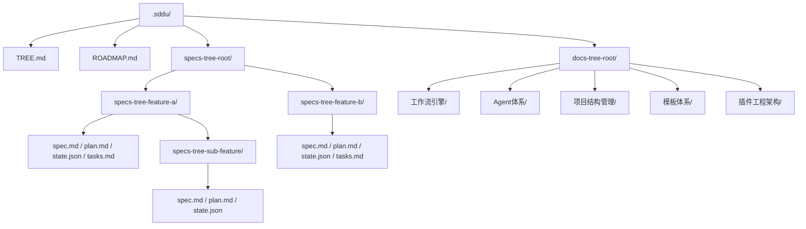

# 项目结构管理 — SDDU 项目结构管理系统

## 1. 概述

SDDU 通过 `specs-tree-root` 树形目录结构管理所有 Feature 的完整生命周期产物。系统支持无限层嵌套的子 Feature 结构，实现**分而治之**的大型项目开发模式，将复杂需求逐层拆解为可独立开发、测试的原子 Feature。

整个 SDDU 项目以 `.sddu/` 为根目录，其下包含 `specs-tree-root/`（Feature 产物）、`docs-tree-root/`（领域文档全景）和 `TREE.md`（目录导航），形成规范化的项目管理骨架。

## 2. 核心结构

## 3. Feature 目录规范

- **统一前缀**：所有 Feature 目录以 `specs-tree-` 开头，采用 kebab-case 命名，确保目录可被 TreeScanner 自动发现
- **父级 Feature（轻量化）**：仅包含 discovery、spec、plan + state.json，不含 tasks/build/review/validate 阶段产物
- **叶子 Feature（完整）**：包含 SDDU 六阶段全量产物（discovery → spec → plan → tasks → build → review → validate）
- **嵌套深度**：`state.json` 中 `depth` 字段标记嵌套层级，根层级 depth=0，每嵌套一层 +1
- **子 Feature 目录**：直接放置在父目录下，`specs-tree-{sub-name}` 格式，支持无限递归
- **目录互斥**：`specs-tree-root/` 下仅允许 `specs-tree-` 前缀的目录存在，避免扫描干扰

## 4. 状态管理

- **分布式 state.json**：每个 Feature 独立维护自身状态，摒弃集中式全局状态文件
- **父子状态聚合**：父级 `status` = 自身状态 + 子 Feature（`childrens` 数组）状态聚合
- **跨树依赖**：子 Feature 间可通过 `dependencies` 字段声明依赖关系，支持循环依赖检测
- **TreeStateValidator**：递归校验树形结构完整性，自动修复缺失字段
- **协同关系**：`TreeScanner` 负责扫描构建完整的 Feature 树（节点发现 + 层级映射），`ParentStateManager` 依赖其扫描结果执行父子状态聚合与向上传播，二者形成**发现→聚合**的管道模式
- **状态传播路径**：叶子节点 → ParentStateManager 向上逐层聚合 → 根节点，任一子状态变更自动触发父级重算

## 5. 递归扫描

- **TreeScanner**：从 `specs-tree-root/` 入口递归扫描所有 `specs-tree-` 前缀目录，构建完整 Feature 树。每个节点携带 `id`、`path`、`depth`、`childrens` 等信息，输出为扁平化的 Feature 列表
- **ParentStateManager**：消费 TreeScanner 的扫描结果，遍历 Feature 树执行父子状态聚合。父级状态 = MAX(自身阶段状态, 所有子 Feature 状态)，叶子变更触发的聚合路径自动写入父级 `state.json`
- **StateLoader**：自动加载层级状态，支持按 Feature ID、路径前缀、嵌套深度多种筛选模式，为各子 Agent 提供状态感知能力

## 6. 组成 Feature

| Feature | ID | 说明 | 状态 |
|---------|-----|------|------|
| specs-tree-directory-optimization | FR-DIR-001 | 目录结构命名优化 — 统一 `specs-tree-` 前缀，清理遗留目录 | ✅ completed |
| specs-tree-tree-structure-optimization | FR-TREE-001 | 树形结构优化 V1 — 引入父子 Feature 模型、分布式状态、递归扫描 | ✅ completed |
| specs-tree-tree-structure-optimization-v2 | FR-TREE-002 | 树形结构优化 V2 — Schema 字段强制校验、智能拆分建议、E2E 测试 | ✅ completed |
