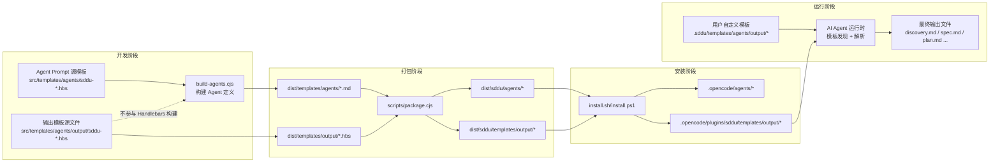

# 📋 Agent 输出模板化系统 — 技术规划文档

**Feature ID**: FR-TEMPLATE-001  
**创建日期**: 2026-05-25  
**当前状态**: planned  
**总工作量预估**: 13 单位（9×S + 4×M）

---

## 1. 架构分析

### 1.1 当前架构现状

```
src/templates/agents/
├── sddu-discovery.md.hbs   ← 硬编码输出格式（第175-222行）
├── sddu-spec.md.hbs        ← 硬编码输出格式（第107-141行）
├── sddu-plan.md.hbs        ← 硬编码输出格式（第99-136行）
├── sddu-tasks.md.hbs       ← 硬编码输出格式（第89-128行）
├── sddu-build.md.hbs       ← 硬编码输出格式（第75-118行）
├── sddu-review.md.hbs      ← 硬编码输出格式（第99-146行）
├── sddu-validate.md.hbs    ← 硬编码输出格式（第90-157行）
├── sddu-docs.md.hbs
├── sddu-roadmap.md.hbs
├── sddu-help.md.hbs
└── sddu.md.hbs

构建流水线:
  build-agents.cjs → scripts/package.cjs → install.sh / install.ps1
       ↓                    ↓                       ↓
  dist/templates/agents/   dist/sddu/agents/       .opencode/agents/
```

### 1.2 架构变更分析

**变更原则**: 保持完全向后兼容，所有新增内容不影响现有的 Agent Prompt 逻辑。

**核心变更点**:
1. **新增 `output/` 子目录**: 在 `src/templates/agents/` 下创建独立子目录 `output/`，存放从 Agent Prompt 中提取的输出模板文件
2. **Agent Prompt 修改**: 在每个 Agent 的 Prompt 中，将「输出格式」硬编码章节替换为「输出模板引用」章节，包含模板路径、查找优先级和占位符规则
3. **构建脚本排除**: `build-agents.cjs` 跳过 `output/` 目录（不将其中的 `.hbs` 文件视为 Agent 定义文件）
4. **打包脚本扩展**: `scripts/package.cjs` 将 `dist/templates/output/` 复制到 `dist/sddu/templates/output/`
5. **安装脚本扩展**: `install.sh` / `install.ps1` 将模板复制到 `.opencode/plugins/sddu/templates/output/`

### 1.3 数据流图



### 1.4 模板发现优先级算法

```
Agent 运行时查找顺序（由 Agent Prompt 中的发现规则描述）：

1. 用户自定义目录（优先）：
   .sddu/templates/agents/output/sddu-<agent>.hbs
   → 如果存在，使用此模板

2. 插件内置目录（兜底，必然存在）：
   .opencode/plugins/sddu/templates/output/sddu-<agent>.hbs
   → 内置模板随插件分发，必然存在，无需回退方案

Agent Prompt 中只描述以上两条发现规则，不硬编码任何输出格式。
```

---

## 2. 技术方案对比

### 方案 A（推荐）：AI-Side 模板解析（无 Node.js 代码变更）

| 属性 | 描述 |
|------|------|
| **描述** | 模板文件作为纯 Markdown 文本存放。AI Agent 通过 Prompt 指令读取模板文件，自主理解其结构和 `<<变量名>>` 占位符，生成符合模板格式的输出。不引入新的 Node.js 模块或模板引擎 |
| **优点** | ✅ 零新增运行时依赖<br/>✅ 利用 AI 的语义理解能力处理占位符<br/>✅ 架构极简，无需额外维护<br/>✅ 天然支持任意变量名（无预定义约束）<br/>✅ 与非功能目标一致（NFR-004）无害模板 |
| **缺点** | ⚠️ 依赖 AI 对指令的遵从度<br/>⚠️ 不同 LLM 可能对占位符解析质量有差异 |
| **风险** | AI 可能不完全遵循模板结构（中风险，通过 Agent Prompt 指令强化缓解） |
| **工作量** | M（~5 单位） |

### 方案 B：Code-Side 模板加载 + 注入 Node.js 模块

| 属性 | 描述 |
|------|------|
| **描述** | 在 `.opencode/plugins/sddu/` 下新增 JS 模块（如 `loadTemplate.js`），提供模板发现和加载函数。Agent Prompt 中插入该模块加载的结果 |
| **优点** | ✅ 模板加载确定性高<br/>✅ 可做模板缓存、格式校验等增强功能 |
| **缺点** | ❌ 需要新增插件模块和完整的加载链路<br/>❌ 与 spec 中明确聲明的「不引入独立的模板渲染引擎」矛盾<br/>❌ 增加维护复杂度<br/>❌ 需要处理异步加载、缓存、错误处理等 |
| **风险** | 引入新的插件模块需要修改 `opencode.json` agent 配置，影响安装流程（高风险） |
| **工作量** | L（~8 单位） |

### 方案对比结论

**推荐方案 A**，理由：
1. 与 spec 中的 Non-Goals 完全一致——明确「不引入独立的模板渲染引擎」
2. 架构最简——只需创建模板文件 + 修改 Agent Prompt 指令 + 调整构建/打包/安装脚本
3. 无需修改 `opencode.json` 或插件入口
4. Agent 的 Prompt 中已包含类似的结构化输出指令，AI 对此已有足够经验
5. 未来如需增强模板校验或缓存，可在不改变架构的前提下增量添加

---

## 3. 开放问题决议

| OQ-ID | 问题 | 决议 | 理由 |
|-------|------|------|------|
| OQ-001 | 模板发现路径查找在 AI 端还是代码端实现？ | **AI 端实现** | 见方案 A 推荐理由。Agent Prompt 中明确指令、模板路径和查找优先级，AI 自主读取并解析 |
| OQ-002 | 如代码端实现，JS 模块命名和接口？ | **不适用** | 已决议 OQ-001 为 AI 端实现，无需新增 JS 模块 |
| OQ-003 | docs Agent 是否纳入 V1？ | **不纳入** | 与 spec Non-Goals 一致。V1 仅覆盖 6 个主流程 Agent。docs Agent 可单独规划 |
| OQ-004 | 是否列出每个 `<<变量名>>` 的语义说明？ | **是，列出语义说明** | 参考 FR-006 示例，在模板引用指令中为变量提供语义提示，减少 AI 解析歧义 |

---

## 4. 文件影响分析

### 4.1 新增文件（7 个）

| # | 文件路径 | 说明 | 优先级 |
|---|---------|------|--------|
| 1 | `src/templates/agents/output/sddu-discovery.md.hbs` | 从 `sddu-discovery.md.hbs` 提取的输出格式模板 | P0 |
| 2 | `src/templates/agents/output/sddu-spec.md.hbs` | 从 `sddu-spec.md.hbs` 提取的输出格式模板 | P0 |
| 3 | `src/templates/agents/output/sddu-plan.md.hbs` | 从 `sddu-plan.md.hbs` 提取的输出格式模板 | P0 |
| 4 | `src/templates/agents/output/sddu-tasks.md.hbs` | 从 `sddu-tasks.md.hbs` 提取的输出格式模板 | P0 |
| 5 | `src/templates/agents/output/sddu-build.md.hbs` | 从 `sddu-build.md.hbs` 提取的输出格式模板 | P0 |
| 6 | `src/templates/agents/output/sddu-review.md.hbs` | 从 `sddu-review.md.hbs` 提取的输出格式模板 | P0 |
| 7 | `src/templates/agents/output/sddu-validate.md.hbs` | 从 `sddu-validate.md.hbs` 提取的输出格式模板 | P0 |

### 4.2 修改文件（11 个）

| # | 文件路径 | 变更内容 | 优先级 |
|---|---------|---------|--------|
| 1 | `src/templates/agents/sddu-discovery.md.hbs` | 替换「输出格式」+「完成报告」为模板引用指令 | P0 |
| 2 | `src/templates/agents/sddu-spec.md.hbs` | 替换「输出格式」为模板引用指令 | P0 |
| 3 | `src/templates/agents/sddu-plan.md.hbs` | 替换「输出格式」为模板引用指令 | P0 |
| 4 | `src/templates/agents/sddu-tasks.md.hbs` | 替换「输出格式」为模板引用指令 | P0 |
| 5 | `src/templates/agents/sddu-build.md.hbs` | 替换「输出格式」为模板引用指令 | P0 |
| 6 | `src/templates/agents/sddu-review.md.hbs` | 替换「输出格式」为模板引用指令 | P0 |
| 7 | `src/templates/agents/sddu-validate.md.hbs` | 替换「输出格式」为模板引用指令 | P0 |
| 8 | `build-agents.cjs` | 构建完成后，将 `src/templates/agents/output/` 逐字复制到 `dist/templates/output/` | P0 |
| 9 | `scripts/package.cjs` | 在 `packageSingleVersion` 中增加 `dist/templates/output/` → `dist/sddu/templates/output/` 的复制 | P0 |
| 10 | `install.sh` | Step 5 中增加 `.opencode/plugins/sddu/templates/output/` 的目标目录创建和模板复制 | P0 |
| 11 | `install.ps1` | 同上，PowerShell 版本 | P0 |

### 4.3 无变更文件

- `.opencode/` 目录下的任何文件（安装产物，禁止直接修改）
- `src/templates/agents/sddu-docs.md.hbs`（docs Agent 不在 V1 范围内）
- `src/templates/agents/sddu-roadmap.md.hbs`（roadmap Agent 不在 V1 范围内）
- `src/templates/agents/sddu-help.md.hbs`（help Agent 不在 V1 范围内）
- `src/templates/agents/sddu.md.hbs`（Entry Agent 不需要输出模板）
- `package.json`（无新增依赖）
- `src/templates/config/opencode.json.hbs`（opencode.json 源模板，无新增 agent 配置，因此无需修改）

---

## 5. 模板文件详细设计

### 5.1 模板内容规则

每个输出模板文件：
- 以 `.hbs` 为扩展名（与现有模板一致）
- 内容为纯 Markdown（无 YAML frontmatter）
- 动态内容使用 `<<变量名>>` 占位符格式
- 不包含 `{{` Handlebars 语法（避免被构建脚本混淆）
- 逐字复刻现有 Agent Prompt 中的输出格式内容

### 5.2 变量命名规则

| 规则 | 说明 | 示例 |
|------|------|------|
| 格式 | `<<snake_case_name>>` | `<<feature_name>>` |
| 中英文 | 支持中英文混合 | `<<用户故事列表>>` 或 `<<user_story_list>>` |
| 语义 | 变量名需具备语义自解释性 | 优先用 `<<core_problem>>` 而非 `<<var_1>>` |

### 5.3 Agent Prompt 模板引用指令（FR-011）

每个 Agent Prompt 的末尾新增：

```markdown
## 输出模板
你的输出格式由输出模板文件定义，优先级如下：
1. **用户自定义**: `.sddu/templates/agents/output/sddu-<agent>.hbs`（最高优先级）
2. **插件内置**: `.opencode/plugins/sddu/templates/output/sddu-<agent>.hbs`

模板中的 `<<变量名>>` 占位符需要用实际内容替换，变量名具有语义含义，
请根据上下文自动理解并填充合理值。

常见变量说明：
- `<<feature_name>>`: 当前 Feature 的名称
- `<<status>>`: 当前阶段的状态（discovered/specified/planned/tasked 等）
- `<<file_path>>`: 生成文件的相对路径
- `<<next_step>>`: 推荐的下一个操作步骤
```

---

## 6. 实施序列

### Phase 1：创建内置输出模板文件（S，P0）
1. 从 7 个 Agent Prompt 中逐字提取"输出格式"章节内容
2. 将硬编码的占位符（`...`、`[名称]` 等）替换为 `<<变量名>>` 格式
3. 写入 `src/templates/agents/output/sddu-*.md.hbs` 7 个文件

### Phase 2：修改 Agent Prompt 源模板（M，P0）
1. 删除 7 个 Agent 中已有的硬编码"输出格式"内容
2. 添加统一的"输出模板引用"章节（FR-011）
3. 保留"规则"、"异常处理"等不涉及输出格式的章节不动

### Phase 3：构建脚本适配（S，P0）
1. `build-agents.cjs`：在构建循环结束后，做 `output/` 目录的逐字复制
2. `scripts/package.cjs`：在 `packageSingleVersion` 中增加 output 模板复制

### Phase 4：安装脚本适配（S，P0）
1. `install.sh`：在第 5 步中增加 `.opencode/plugins/sddu/templates/output/` 的创建和复制
2. `install.ps1`：同上

### Phase 5：集成测试验证（M，P0）
1. 创建临时测试目录 `./temp/sddu-test-project-xxx/`
2. 执行完整构建链：`build-agents.cjs` → `scripts/package.cjs`
3. 验证 `dist/templates/output/` 目录存在且包含正确的 7 个文件
4. 在临时目录中执行 `install.sh` 测试
5. 验证 `.opencode/plugins/sddu/templates/output/` 包含 7 个模板文件
6. 清理临时目录

---

## 7. 风险评估

| 风险 | 概率 | 影响 | 缓解措施 |
|------|------|------|----------|
| AI 对 `<<变量名>>` 占位符解析不一致（如保留原样或误解析） | 中 | 高 | 1. Agent Prompt 中明确变量替换规则<br/>2. 模板内容加注释说明变量含义<br/>3. 内置模板使用语义明确的变量名<br/>4. 直接在 prompt 指令中写明：不要输出 `<<...>>` 原始文本 |
| 构建脚本兼容性（output/ 排除逻辑遗漏导致 .hbs 被 Handlebars 处理） | 低 | 高 | 1. 在 `build-agents.cjs` 中添加明确排除条件<br/>2. 验证 `dist/templates/output/` 下的文件未被转换 |
| 安装脚本模板路径不存在（`dist/sddu/templates/output/` 不存在时静默失败） | 低 | 中 | 1. 安装脚本中使用 `if [ -d ... ]` 条件判断<br/>2. 路径不存在时打印 warn 日志 |
| 用户自定义模板文件名拼写错误无法识别 | 中 | 低 | 内置模板必然存在，确保可靠兜底 |
| 模板文件编码问题导致 AI 读取异常 | 低 | 中 | 1. 所有模板使用 UTF-8 编码<br/>2. 显示报错信息（FR-007） |
| 打包后 output/ 模板未包含在插件包中 | 低 | 高 | 1. 自动化测试验证 `dist/sddu/templates/output/` 文件数<br/>2. 构建日志明确列出复制结果 |

---

## 8. 验收标准验证矩阵

| 验收项 | 验证方式 | 对应 FR |
|--------|---------|---------|
| 7 个内置模板文件存在且非空 | `ls -la src/templates/agents/output/` 检查文件数和大小 | FR-001 |
| 模板内容与现有 Agent Prompt 输出格式一致 | diff 对比 | FR-002 |
| 模板使用 `<<变量名>>` 占位符 | grep 检查无 `{{` 语法，有 `<<` `>>` | FR-003 |
| 构建后 output/ 不在 dist/templates/agents/ 中 | 构建后检查 dist 目录结构 | FR-008 |
| 打包后 output/ 在 dist/sddu/templates/output/ 中 | 打包后检查目录 | FR-009 |
| 安装后模板在 `.opencode/plugins/sddu/templates/output/` | 在临时测试目录安装后检查 | FR-010 |
| Agent Prompt 包含模板引用指令 | grep 检查 Agent 源模板文件中含 "## 输出模板" | FR-011 |
| 自定义模板覆盖后使用自定义格式 | 放置模板后在临时项目测试 | FR-004 |
| 模板加载性能 < 50ms | 模板文件读取时间测量 | NFR-001 |

---

## 9. 生成的 ADR

- **ADR-018**: `AI-Side 模板解析 — 无 Node.js 代码变更`
- **ADR-019**: `模板变量使用 <<变量名>> 格式，变量语义说明在 Prompt 中列明`
