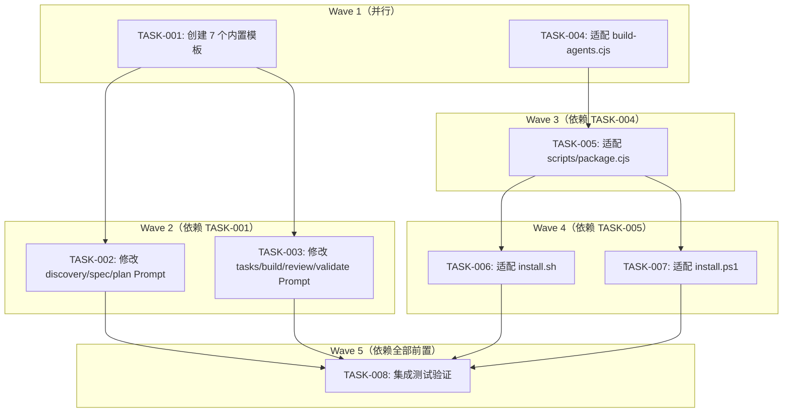

# 📋 Agent 输出模板化系统 — 任务分解

**Feature ID**: FR-TEMPLATE-001  
**Feature 名称**: Agent 输出模板化系统  
**创建日期**: 2026-05-25  
**当前状态**: reviewed  
**总任务数**: 8 个 (全部完成)  
**执行波次**: 5 个波次  
**方案类型**: AI-Side 模板解析（无 Node.js 代码变更）

---

## 任务架构概览



---

## ✅ TASK-001: 创建所有 7 个内置输出模板文件 （已完成）

**复杂度**: M  
**前置依赖**: 无  
**执行波次**: 1

### 描述
在 `src/templates/agents/output/` 目录下创建 7 个输出模板文件，从各 Agent Prompt 源模板中逐字提取"输出格式"章节内容（discovery 还需提取"完成报告"章节），将硬编码占位符替换为 `<<变量名>>` 格式。

### 涉及文件
- [NEW] `src/templates/agents/output/sddu-discovery.md.hbs`
- [NEW] `src/templates/agents/output/sddu-spec.md.hbs`
- [NEW] `src/templates/agents/output/sddu-plan.md.hbs`
- [NEW] `src/templates/agents/output/sddu-tasks.md.hbs`
- [NEW] `src/templates/agents/output/sddu-build.md.hbs`
- [NEW] `src/templates/agents/output/sddu-review.md.hbs`
- [NEW] `src/templates/agents/output/sddu-validate.md.hbs`

### 模板映射说明

| Agent | Prompt 源文件 | 提取章节 | 行号范围 |
|-------|-------------|---------|---------|
| discovery | `sddu-discovery.md.hbs` | `## 输出格式` + `## 完成报告` | L175-248 |
| spec | `sddu-spec.md.hbs` | `## 输出格式` | L107-141 |
| plan | `sddu-plan.md.hbs` | `## 输出格式` | L99-136 |
| tasks | `sddu-tasks.md.hbs` | `## 输出格式` | L89-128 |
| build | `sddu-build.md.hbs` | `## 输出格式` | L75-118 |
| review | `sddu-review.md.hbs` | `## 输出格式` | L99-127 |
| validate | `sddu-validate.md.hbs` | `## 输出格式` | L90-138 |

### 占位符替换规则
- 现有模板中的 `[名称]`、`[描述]` 等 `[...]` 占位符 → `<<变量名>>`
- 现有模板中的 `...` → `<<具体描述>>`
- 现有模板中的 `[feature 名称]` → `<<feature_name>>`
- 模板文件**不包含** `{{` Handlebars 语法
- 模板文件为纯 Markdown，无 YAML frontmatter
- discovery 模板中：`## 输出格式` 和 `## 完成报告` 合并为一个文件（保留两个章节）

### 验收标准
- [x] `src/templates/agents/output/` 目录已创建
- [x] 7 个 `.hbs` 文件全部存在且非空
- [x] 每个模板文件内容为纯 Markdown，无 YAML frontmatter
- [x] 模板中无 `{{` 语法，所有占位符为 `<<变量名>>` 格式
- [x] 内容与源 Agent Prompt 中对应章节逐字一致（占位符语法除外）
- [x] discovery 模板同时包含「输出格式」和「完成报告」内容

### 验证命令
```bash
ls -la src/templates/agents/output/ && grep -r '{{' src/templates/agents/output/ && echo "NO_HBS_SYNTAX" || echo "CLEAN"
```

---

## TASK-002: 修改 discovery/spec/plan 三个 Agent Prompt 源模板

**复杂度**: M  
**前置依赖**: TASK-001  
**执行波次**: 2

### 描述
修改 sddu-discovery、sddu-spec、sddu-plan 三个 Agent Prompt 源模板：
1. **删除**已有的硬编码"输出格式"章节（discovery 同时删除"完成报告"章节）
2. **添加**统一的"输出模板引用"章节
3. **保留**所有不涉及输出格式的章节（规则、异常处理等）

### 涉及文件
- [MODIFY] `src/templates/agents/sddu-discovery.md.hbs`
- [MODIFY] `src/templates/agents/sddu-spec.md.hbs`
- [MODIFY] `src/templates/agents/sddu-plan.md.hbs`

### 需要删除/替换的内容
- **sddu-discovery.md.hbs**: L175-248（`## 输出格式` + `## 完成报告` 两个章节）
- **sddu-spec.md.hbs**: L107-141（`## 输出格式` 一个章节）
- **sddu-plan.md.hbs**: L99-136（`## 输出格式` 一个章节）

### 新增章节内容
在每个 Agent Prompt 末尾（最后一个章节之后）插入：

```markdown
## 输出模板
你的输出格式由输出模板文件定义，优先级如下：
1. **用户自定义**: `.sddu/templates/agents/output/sddu-<agent>.hbs`（最高优先级）
2. **插件内置**: `.opencode/plugins/sddu/templates/output/sddu-<agent>.hbs`

模板中的 `<<变量名>>` 占位符需要用实际内容替换，变量名具有语义含义，
请根据上下文自动理解并填充合理值。

常见变量说明：
- `<<feature_name>>`: 当前 Feature 的名称
- `<<status>>`: 当前阶段的状态（discovered/specified/planned/tasked 等）
- `<<file_path>>`: 生成文件的相对路径
- `<<next_step>>`: 推荐的下一个操作步骤
```

### 验收标准
- [x] 三个 Agent Prompt 文件中不再包含硬编码的"输出格式"章节
- [x] 三个文件末尾均包含统一的"## 输出模板"引用章节
- [x] 引用章节中 `<agent>` 占位符已替换为对应 agent 名（如 `sddu-discovery`）
- [x] 不涉输出格式的规则/异常处理/示例章节保持不变
- [x] discovery 的"完成报告"章节已移除（内容已提取到模板文件）

### 验证命令
```bash
grep -n '## 输出格式\|## 完成报告' src/templates/agents/sddu-discovery.md.hbs src/templates/agents/sddu-spec.md.hbs src/templates/agents/sddu-plan.md.hbs
grep -n '## 输出模板' src/templates/agents/sddu-discovery.md.hbs src/templates/agents/sddu-spec.md.hbs src/templates/agents/sddu-plan.md.hbs
```

---

## TASK-003: 修改 tasks/build/review/validate 四个 Agent Prompt 源模板

**复杂度**: M  
**前置依赖**: TASK-001  
**执行波次**: 2

### 描述
修改 sddu-tasks、sddu-build、sddu-review、sddu-validate 四个 Agent Prompt 源模板：
1. **删除**已有的硬编码"输出格式"章节
2. **添加**统一的"输出模板引用"章节（与 TASK-002 内容相同）
3. **保留**所有不涉及输出格式的章节

### 涉及文件
- [MODIFY] `src/templates/agents/sddu-tasks.md.hbs`
- [MODIFY] `src/templates/agents/sddu-build.md.hbs`
- [MODIFY] `src/templates/agents/sddu-review.md.hbs`
- [MODIFY] `src/templates/agents/sddu-validate.md.hbs`

### 需要删除/替换的内容
- **sddu-tasks.md.hbs**: L89-128（`## 输出格式` 章节）
- **sddu-build.md.hbs**: L75-118（`## 输出格式` 章节）
- **sddu-review.md.hbs**: L99-127（`## 输出格式` 章节）
- **sddu-validate.md.hbs**: L90-138（`## 输出格式` 章节）

### 新增章节内容
与 TASK-002 相同的"输出模板引用"章节（模板中的 `<agent>` 替换为对应 agent 短名）。

### 验收标准
- [x] 四个 Agent Prompt 文件中不再包含硬编码的"输出格式"章节
- [x] 四个文件末尾均包含统一的"## 输出模板"引用章节
- [x] tasks 的"## 输出"章节（L130-132，输出文件列表）保持不动（非输出格式）
- [x] build/review/validate 的约束条件/审查结论/异常处理等章节保持不变
- [x] 引用章节中 `<agent>` 占位符已替换为对应 agent 名

### 验证命令
```bash
grep -n '## 输出格式' src/templates/agents/sddu-tasks.md.hbs src/templates/agents/sddu-build.md.hbs src/templates/agents/sddu-review.md.hbs src/templates/agents/sddu-validate.md.hbs
grep -n '## 输出模板' src/templates/agents/sddu-tasks.md.hbs src/templates/agents/sddu-build.md.hbs src/templates/agents/sddu-review.md.hbs src/templates/agents/sddu-validate.md.hbs
```

---

## TASK-004: 适配 build-agents.cjs — 排除 output/ 目录并复制到 dist

**复杂度**: S  
**前置依赖**: 无  
**执行波次**: 1

### 描述
在 `build-agents.cjs` 的主构建循环结束后，新增一个步骤：将 `src/templates/agents/output/` 目录下的 `.hbs` 文件逐字复制到 `dist/templates/output/`（**不经过 Handlebars 处理**，保持 `<<变量名>>` 原样）。同时确保构建过程中 `output/` 子目录不被当作 Agent 定义文件处理。

### 涉及文件
- [MODIFY] `build-agents.cjs`

### 具体变更
在 `build()` 函数的末尾、`console.log('\n✅ Build complete...')` 之前，添加：

```javascript
// ========== 复制输出模板（不经过 Handlebars 处理） ==========
console.log('\n📄 Copying output templates (raw copy, no Handlebars processing)...');
const OUTPUT_SRC_DIR = path.join(AGENT_SRC_DIR, 'output');
const OUTPUT_DIST_DIR = path.join(__dirname, 'dist', 'templates', 'output');

if (fs.existsSync(OUTPUT_SRC_DIR)) {
  if (!fs.existsSync(OUTPUT_DIST_DIR)) {
    fs.mkdirSync(OUTPUT_DIST_DIR, { recursive: true });
  }
  const outputFiles = fs.readdirSync(OUTPUT_SRC_DIR);
  outputFiles.forEach(file => {
    if (file.endsWith('.hbs')) {
      const srcPath = path.join(OUTPUT_SRC_DIR, file);
      const destPath = path.join(OUTPUT_DIST_DIR, file);
      fs.copyFileSync(srcPath, destPath);
      console.log('  ✅ dist/templates/output/' + file);
    }
  });
  console.log('\n✅ Output templates copied (' + outputFiles.filter(f => f.endsWith('.hbs')).length + ' files)');
} else {
  console.log('  🚸 Output template directory not found, skipping...');
}
```

### 验收标准
- [x] 构建过程中，`output/` 目录的 `.hbs` 文件不被 Handlebars 渲染
- [x] 构建完成后，`dist/templates/output/` 目录存在
- [x] `dist/templates/output/` 包含 7 个 `.hbs` 文件
- [x] 文件内容与 `src/templates/agents/output/` 中的源文件完全一致（diff 无差异）
- [x] 文件中的 `<<变量名>>` 保留原样，未被 Handlebars 替换
- [x] `dist/templates/agents/` 目录中不包含 `output/` 的内容
- [x] 构建过程无报错

### 验证命令
```bash
node build-agents.cjs && ls dist/templates/output/ && diff <(cat src/templates/agents/output/sddu-discovery.md.hbs) <(cat dist/templates/output/sddu-discovery.md.hbs)
```

---

## ✅ TASK-005: 适配 scripts/package.cjs — 包含 output 模板到插件包 (已完成)

**复杂度**: S  
**前置依赖**: TASK-004  
**执行波次**: 3

### 描述
在 `scripts/package.cjs` 的 `packageSingleVersion` 函数中，增加对 `dist/templates/output/` 目录的处理：将其复制到 `dist/sddu/templates/output/`，确保内置输出模板被包含在最终插件包中。

### 涉及文件
- [MODIFY] `scripts/package.cjs`

### 具体变更
在 `packageSingleVersion` 函数中 Step 1（复制构建产物）之后、Step 2（生成 package.json）之前，或在现有模板处理逻辑（特殊处理模板目录）之后，添加：

```javascript
// 复制输出模板到插件包
const outputTemplatesDir = path.join(srcDir, 'templates', 'output');
if (await fs.pathExists(outputTemplatesDir)) {
  const targetOutputDir = path.join(distDir, 'templates', 'output');
  await fs.ensureDir(targetOutputDir);
  await fs.copy(outputTemplatesDir, targetOutputDir);
  console.log(`🔄 复制 output 模板到 ${path.basename(distDir)}/templates/output/ ...`);
}
```

### 验收标准
- [x] 运行打包后，`dist/sddu/templates/output/` 目录存在
- [x] 目录中包含 7 个 `.hbs` 文件
- [x] 文件内容与 `dist/templates/output/` 完全一致
- [x] 打包过程无报错

### 验证命令
```bash
node build-agents.cjs && node scripts/package.cjs && ls dist/sddu/templates/output/ && ls dist/sddu/templates/output/*.hbs | wc -l
```

---

## ✅ TASK-006: 适配 install.sh — 安装时复制 output 模板 (已完成)

**复杂度**: S  
**前置依赖**: TASK-005  
**执行波次**: 4

### 描述
在 `install.sh` 的第 5 步（复制插件文件）中，增加对 `dist/sddu/templates/output/` 的处理：创建目标目录 `.opencode/plugins/sddu/templates/output/` 并复制所有模板文件。

**⚠️ 测试安全约束**: 禁止直接安装到当前项目。必须通过 TASK-008 在临时测试目录中验证。

### 涉及文件
- [MODIFY] `install.sh`

### 具体变更
在 Step 5 的 `copy_distribution_to_plugin` 函数执行之后、复制 agents 之前或之后，添加：

```bash
# 复制输出模板
if [ -d "${SCRIPT_DIR}/dist/sddu/templates/output" ]; then
    print_color "${GRAY}  Copying output templates...${NC}"
    mkdir -p "${TARGET_DIR}/.opencode/plugins/sddu/templates/output"
    cp "${SCRIPT_DIR}/dist/sddu/templates/output/"*.hbs "${TARGET_DIR}/.opencode/plugins/sddu/templates/output/" 2>/dev/null || print_color "${YELLOW}  [WARN] No output templates found${NC}"
    print_color "${GREEN}[OK] Output templates copied${NC}"
fi
```

### 验收标准
- [x] 安装后，`.opencode/plugins/sddu/templates/output/` 目录存在
- [x] 目录中包含 7 个 `.hbs` 模板文件
- [x] 文件内容与 `dist/sddu/templates/output/` 完全一致
- [x] 安装不中断其他功能
- [x] 如果 `dist/sddu/templates/output/` 不存在，脚本打印警告但不报错退出

### 验证命令
```bash
# 在临时目录中验证（参见 TASK-008）
ls .opencode/plugins/sddu/templates/output/ 2>/dev/null
```

---

## ✅ TASK-007: 适配 install.ps1 — 安装时复制 output 模板 (已完成)

**复杂度**: S  
**前置依赖**: TASK-005  
**执行波次**: 4

### 描述
在 `install.ps1` 的对应步骤中，增加与 TASK-006 相同的 output 模板复制逻辑的 PowerShell 版本。

**⚠️ 测试安全约束**: 同 TASK-006，禁止直接安装到当前项目。

### 涉及文件
- [MODIFY] `install.ps1`

### 具体变更
在 Step 5（复制插件和 agents）之后、Step 6 之前，添加 output 模板复制逻辑。

```powershell
# Copy output templates from dist/sddu/templates/output/
$OutputTemplateSource = Join-Path $ScriptDir "dist\sddu\templates\output"
if (Test-Path $OutputTemplateSource) {
    Write-Host "  Copying output templates..." -ForegroundColor Gray
    $OutputTarget = Join-Path $TargetDir ".opencode\plugins\sddu\templates\output"
    New-Item -ItemType Directory -Force -Path $OutputTarget | Out-Null
    Get-ChildItem "$OutputTemplateSource\*.hbs" | ForEach-Object {
        Copy-Item $_.FullName -Destination $OutputTarget -Force
    }
    Write-Host "[OK] Output templates copied" -ForegroundColor Green
}
else {
    Write-Host "[WARN] Output templates source not found: $OutputTemplateSource" -ForegroundColor Yellow
}
```

同时在最终安装摘要的 Files 列表中新增一行 `- .opencode/plugins/sddu/templates/output/ (output templates)`。

### 验收标准
- [x] 安装后，`.opencode/plugins/sddu/templates/output/` 目录存在
- [x] 目录中包含 7 个 `.hbs` 模板文件（与 TASK-006 一致）
- [x] 文件内容与 `dist/sddu/templates/output/` 完全一致
- [x] 安装不中断其他功能

### 验证命令
```powershell
# 在临时目录中验证（参见 TASK-008）
Test-Path ".opencode/plugins/sddu/templates/output/"
Get-ChildItem ".opencode/plugins/sddu/templates/output/*.hbs" | Measure-Object | Select-Object -ExpandProperty Count
```

---

## ✅ TASK-008: 集成测试 — 验证完整构建 → 打包 → 安装链路 （已完成）

**复杂度**: M  
**前置依赖**: TASK-001, TASK-002, TASK-003, TASK-004, TASK-005, TASK-006, TASK-007  
**执行波次**: 5

### 描述
创建临时测试目录，执行完整的构建 → 打包 → 安装链路，在每个阶段验证输出模板文件正确存在且内容一致。**禁止直接在当前项目目录中安装**，必须在临时目录中操作。

### 涉及文件
- 无（仅在临时目录中进行测试操作）
- 验证依据：`build-agents.cjs`, `scripts/package.cjs`, `install.sh`

### 测试步骤

1. **创建临时测试目录**
   ```bash
   TEST_DIR="./temp/sddu-test-project-$(date +%s)"
   mkdir -p "$TEST_DIR"
   ```

2. **阶段 A — 构建验证**
   ```bash
   node build-agents.cjs
   # 验证:
   # - dist/templates/output/ 存在
   # - 包含 7 个 .hbs 文件
   # - 文件内容与 src/templates/agents/output/ 一致
   # - dist/templates/agents/ 中无 output/ 内容
   ```

3. **阶段 B — 打包验证**
   ```bash
   node scripts/package.cjs
   # 验证:
   # - dist/sddu/templates/output/ 存在
   # - 包含 7 个 .hbs 文件
   # - 文件内容与 dist/templates/output/ 一致
   ```

4. **阶段 C — 安装验证**
   ```bash
   bash install.sh "$TEST_DIR"
   # 验证:
   # - $TEST_DIR/.opencode/plugins/sddu/templates/output/ 存在
   # - 包含 7 个 .hbs 文件
   # - 文件内容与 dist/sddu/templates/output/ 一致
   ```

5. **阶段 D — 功能验证**
   ```bash
   # 验证 Agent Prompt 源模板已修改:
   grep -c '## 输出模板' src/templates/agents/sddu-*.md.hbs | grep ':0' || echo "ALL_AGENTS_UPDATED"
   # 验证不再有硬编码输出格式:
   grep -c '## 输出格式' src/templates/agents/sddu-*.md.hbs | grep -v 'output/' | grep ':[1-9]' && echo "HARDCODED_FOUND" || echo "ALL_CLEAN"
   ```

6. **清理临时目录**
   ```bash
   rm -rf ./temp/
   ```

### 验收标准
- [x] 临时测试目录正确创建
- [x] 构建阶段：`dist/templates/output/` 存在且 7 个文件内容正确
- [x] 打包阶段：`dist/sddu/templates/output/` 存在且 7 个文件内容正确
- [x] 安装阶段：临时项目的 `.opencode/plugins/sddu/templates/output/` 存在且 7 个文件内容正确
- [x] 所有 7 个 Agent Prompt 源模板包含 `## 输出模板` 引用指令
- [x] 所有 7 个 Agent Prompt 源模板不再包含硬编码的 `## 输出格式` 章节
- [x] 临时目录在测试完成后被清理
- [x] 当前项目的 `.opencode/` 目录未受任何影响

### 验证命令
```bash
# 检查 install 不影响当前项目
ls .opencode/plugins/sddu/templates/output/ 2>/dev/null && echo "CURRENT_PROJECT_AFFECTED" || echo "CURRENT_PROJECT_UNCHANGED"
```

---

## ✅ 任务分解完成

**Feature**: Agent 输出模板化系统  
**状态**: reviewed  
**文件**: `.sddu/specs-tree-root/specs-tree-agent-output-templating/tasks.md`

### 任务汇总
- 总任务数：8 个
- 复杂度分布：S 级 4 个，M 级 4 个，L 级 0 个
- 执行波次：5 个波次

### Wave 分布
| 波次 | 任务 | 描述 |
|------|------|------|
| Wave 1 | TASK-001, TASK-004 | 创建模板 + 构建脚本（可并行） |
| Wave 2 | TASK-002, TASK-003 | 修改 Agent Prompt（依赖 TASK-001） |
| Wave 3 | TASK-005 | 打包脚本适配（依赖 TASK-004） |
| Wave 4 | TASK-006, TASK-007 | 安装脚本适配（依赖 TASK-005） |
| Wave 5 | TASK-008 | 集成测试（依赖全部前置） |

### 文件影响总览
| 操作 | 数量 | 文件 |
|------|------|------|
| 新增 | 7 | `src/templates/agents/output/sddu-*.hbs` |
| 修改 | 11 | 7 个 Agent Prompt + build-agents.cjs + package.cjs + install.sh + install.ps1 |

### 下一步
👉 运行 `@sddu-build TASK-001` 开始实现第一个任务

> ⚠️ **构建完成后记得运行**: `/tool sddu_update_state {"feature": "specs-tree-agent-output-templating", "status": "tasked"}`