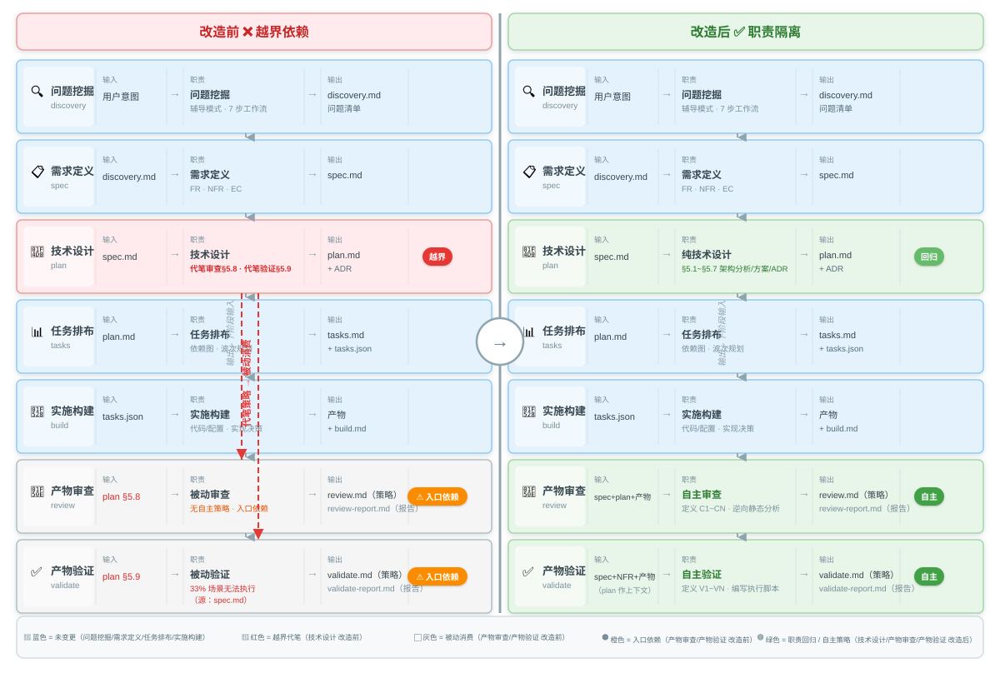
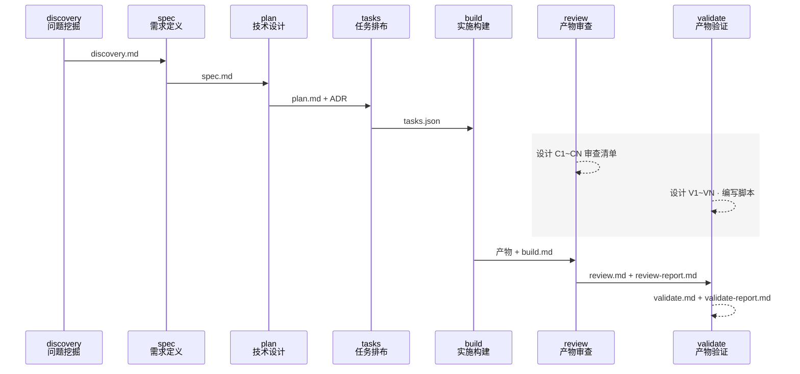

# 技术计划：plan/review/validate 职责回归改造

> **文档定位**: SDDU 技术方案 — 记录架构设计、方案对比和 ADR，作为 tasks 阶段的输入  
> **前置依赖**: spec.md（需求规范，14 FR / 6 NFR / 7 EC）  
> **创建人**: SDDU Plan Agent  
> **创建时间**: 2026-07-25  
> **版本**: v1.5
> **更新人**: SDDU Plan Agent
> **更新时间**: 2026-08-01
> **更新说明**: v1.4 — 修正 §5 文件影响分析：移除 6 个 `.opencode/` MODIFY 条目（安装产物，由构建生成），只保留 `src/templates/` + `scripts/` 源文件目标

## 1. 前置检查
> 启动技术规划前必须验证的前置条件
| 检查项 | 状态 |
|--------|:--:|
| spec.md 存在 | ✅ |
| 外部 API 文档缓存 | ⚠️ 不适用（本次改造不涉及外部 API） |
| 前置依赖已满足 | ✅ |

> **跳过 §5.1 外部 API 检查**：本 Feature 是文档/模板改造，不涉及任何外部 API 调用。

## 2. 架构分析
> 分析现有架构影响和需要的新组件

### 2.1 现有架构：三份文件存在形态

本次改造涉及 7 个源文件（`src/templates/` + `scripts/`），`.opencode/` 副本由构建生成：

```
项目根
├── src/templates/agents/           ← 源模板（build-agents.cjs 输入）
│   ├── sddu-plan.md.hbs            ← [MODIFY] 删除 §5.8/§5.9
│   ├── sddu-review.md.hbs          ← [MODIFY] 新增自主审查策略能力
│   └── sddu-validate.md.hbs        ← [MODIFY] 新增自主验证策略能力
├── src/templates/outputs/          ← 输出模板（raw copy 到 dist）
│   ├── sddu-plan.md.hbs            ← [MODIFY] 删除 §8/§9
│   ├── sddu-review.md.hbs          ← [MODIFY] 新增自主审查清单 section
│   └── sddu-validate.md.hbs        ← [MODIFY] 新增自主验证场景 section
├── .opencode/agents/               ← runtime copies（LLM 实际执行）
│   ├── sddu-plan.md                ← [MODIFY] 同步删除 §5.8/§5.9
│   ├── sddu-review.md              ← [MODIFY] 同步新增自主能力
│   └── sddu-validate.md            ← [MODIFY] 同步新增自主能力
└── .opencode/plugins/sddu/agents/  ← plugin copies（插件分发源）
    ├── sddu-plan.md                ← [MODIFY] 同步删除 §5.8/§5.9
    ├── sddu-review.md              ← [MODIFY] 同步新增自主能力
    └── sddu-validate.md            ← [MODIFY] 同步新增自主能力
```

**关键事实**：通过 diff 验证，当前 3 个 Agent 的 plugin copy 与 runtime copy **完全一致**（diff 为空）。

### 2.2 依赖关系图（改造前 → 改造后）

```
改造前（越界依赖）：
plan → §5.8 产物审查策略 → review §1/§3/§6 硬引用
plan → §5.9 产物验证策略 → validate §1/§3/§5.0/§6 硬引用

改造后（职责隔离）：
plan → 纯技术设计（§5.1~§5.7），不再定义审查/验证策略
review → 自主：从 spec+plan+产物 提取审查对象 → 定义 C1~CN
validate → 自主：从 spec+NFR+产物 提取验证对象 → 定义 V1~VN
```

### 2.3 需要修改的章节详情

#### plan Agent（仅删除）
| 文件类型 | 位置 | 删除内容 |
|---------|------|---------|
| Agent 模板 | §5.8 (L112-114) | 「产物审查策略」：定义审查产物和基准 |
| Agent 模板 | §5.9 (L117-120) | 「产物验证策略」：定义验证产物和基准 |
| 输出模板 | §8 (L65-72) | 「产物审查策略」：供 review 使用的章节 |
| 输出模板 | §9 (L74-80) | 「产物验证策略」：供 validate 使用的章节 |

#### review Agent（新增 + 改引）
| 位置 | 当前内容 | 改造后 |
|------|---------|-------|
| §1 (L16) | "审查的产物清单和基准以 plan.md 中「产物审查策略」章节为准，该章节定义的审查清单（C1~CN）是你的首要检查项" | 改为自主描述：review 自主从 spec+plan+产物 中提取审查对象，运用 §5.1~5.4 审查方法论自主定义 C1~CN 审查清单 |
| §3 (L39) | "审查的产物清单和基准见 plan.md 中「产物审查策略」章节" | 删除此行（基于 plan 策略的硬引用） |
| §6 (L82) | "审查的产物和基准见 plan.md 中「产物审查策略」章节" | 替换为: "审查对象和基准基于本 Agent 自主定义的 C1~CN 审查清单" |

#### validate Agent（新增 + 改引 + 重写 §5.0）
| 位置 | 当前内容 | 改造后 |
|------|---------|-------|
| §1 (L16-17) | "验证的第一步永远是读取 plan.md 中的「产物验证策略」章节——plan 定义的验证场景是你最重要的任务清单" | 改为自主描述：validate 自主从 spec+NFR+产物 中提取验证对象，运用 §5.1~5.5 验证方法论自主定义 V1~VN 验证场景 |
| §3 (L35) | "验证的产物清单和基准见 plan.md 中「产物验证策略」章节" | 删除此行（基于 plan 策略的硬引用） |
| §5.0 (整个章节) | "场景验证（plan 驱动 — 优先级最高）"——第一步读取 plan 验证策略 | 重写为"场景设计（自主 — 优先级最高）"——自主从 spec+NFR+产物 中设计验证场景矩阵 V1~VN |
| §6 (L145) | "验证的产物和基准见 plan.md 中「产物验证策略」章节" | 替换为: "验证对象和基准基于本 Agent 自主定义的 V1~VN 验证场景" |

### 2.4 数据流变更

**无数据流变更**。本 Feature 是文档/模板改造，不涉及运行时数据流。只改变 Agent 的工作指引文本。

### 2.5 不建议拆分

已确认（Q7.2 = 单 Feature，不拆分）。7 个源文件的改造高度耦合（`.opencode/` 副本由构建同步）——plan 的删除、review/validate 的新增、输出模板的适配三者在语义上是一个整体，拆分反而引入不一致窗口。

### 2.6 改造前后对比：泳道图

> plan 越界代笔 → review/validate 被动消费 → 职责回归后各司其职。一图胜千言。

<div align="center">



</div>

---

### 2.7 时序图：文档传递与并行区间

> 纵向展示 Agent 之间的文档交接时序。review/validate 的策略设计（C1~CN / V1~VN）在逻辑上可与 tasks→build 并行——图中灰色区块标注并行区间。



---

## 3. 方案对比
> 2-3 个可行方案的对比分析

本 Feature 的核心技术设计决策有两个维度：(A) 自主策略指引范式选型，(B) 改造原子性策略。

### 3.1 维度 A：自主策略指引范式

这是本次改造的**最大单点风险**（spec 开放问题 #3 和 NFR-004）：review/validate 解除对 plan 策略的依赖后，其 Agent 模板中新增的"自主定义策略"指引如果过于空洞，可能导致首次自主设计质量退化。

| 维度 | 方案 A：结构化清单模板 | 方案 B：启发式维度指引 | 方案 C：维度清单 + 结构化模板（推荐） |
|------|:--|:--|:--|
| 描述 | review/validate Agent 模板中预设固定结构的审查/验证清单模板，启动时按模板格式自主填充 C1~CN/V1~VN。模板包含：(1) 审查/验证对象来源映射表（spec→审查对象，plan→架构检查点）；(2) 固定的输出格式（对象+基准+评估结果三列）；(3) 最低完成标准（见 §8 开放问题） | review/validate Agent 模板中列出现有的审查/验证维度清单（如代码质量/规范符合/架构一致/测试质量），Agent 按维度自主展开，不限制具体条目数量和格式 | 结合两者：提供审查/验证维度清单（来自现有 §5.1~5.5 方法论）作为 seed，同时提供结构化输出格式和最低质量标准，但不限制 Agent 按实际情况增减维度 |
| 优点 | ① 产出格式统一，可脚本化检查；② 首次自主设计有明确模板参照，不易空洞化；③ 质量门槛可内嵌到模板（如至少 N 条/维度的占位提示） | ① 灵活——不同 Feature 的审查/验证重点可能差异很大；② 不引入额外模板复杂度；③ 发挥 LLM Agent 的判断力 | ① 兼顾灵活性和结构化——有维度指引但不僵化；② 质量可控——有最低标准但不教条；③ 与现有 review/validate 模板的 §5 方法论自然衔接 |
| 缺点 | ① 可能过度约束——某些轻量 Feature 不需要详尽清单；② 模板维护成本——维度变化时需同步修改模板 | ① 输出格式不统一，跨 Feature 比较困难；② 指引空洞风险最高——"自主展开"的语义边界模糊；③ 质量退化时难以检测 | ① 设计复杂度略高——需要平衡指引粒度；② 两套信息（维度清单+模板格式）需保持语义一致 |
| 风险 | 中（过度结构化抑制 Agent 灵活性） | 高（空洞指引 → 质量退化，spec EC-005） | 低（通过最低质量标准兜底，维度清单种子启动） |
| 工作量 | 低（预设模板，直接填入 Agent 模板中） | 最低（只改指引文本，不新增模板结构） | 中（需设计维度清单 + 输出格式 + 质量标准三位一体） |

### 3.2 维度 B：改造原子性策略

| 维度 | 方案 A：分批改造 | 方案 B：一次性全量改造（推荐） |
|------|:--|:--|
| 描述 | 先改 plugin copies → 验证功能正常 → 再改 runtime copies。或先改 plan（剥离 §5.8/5.9）→ 验证 plan 正常 → 再改 review/validate（解除依赖）。分 2-3 批提交 | 所有 7 个源文件一次性改造，单次提交，改造完成后立即运行 `node build-agents.cjs` 验证构建通过 |
| 优点 | ① 每批改动范围小，容易回滚；② 可以逐步验证不会破坏现有工作流；③ 降低单次提交的 review 负担 | ① 语义完整性——删除和新增是同一事的两个面，分批会形成不一致窗口（如 plan 已删 §5.8 但 review 仍引用它）；② 最简单——没有中间态需要维护；③ 改造量小（7 个源文件，约 50~80 行净变更），**不属于大规模变更** |
| 缺点 | ① 中间态不一致窗口——plan 删了但 review 还引用导致行为异常；② 需要额外设计中间态的兼容逻辑（如"如果 plan 没有策略章节，跳过"）；③ 总工作量反而更大 | ① 7 个源文件的 diff 需要仔细 review；② 如果改错一处，需要一起回滚 |
| 风险 | 中（不一致窗口风险） | 低（改动量小，准确度高） |
| 工作量 | 中（需设计中间态） | 低（但需仔细逐行对比） |

### 3.3 方案评估矩阵

| 评估维度 | 方案 A（结构化模板 + 分批） | 方案 B（启发式指引 + 全量） | 方案 C（混合 + 全量）⭐ |
|---------|:--|:--|:--|
| 自主设计质量保障 | 高（模板驱动） | 低（依赖 Agent 判断） | **高**（维度种子 + 质量门槛） |
| 改造风险 | 中（不一致窗口） | 低 | **低** |
| 可维护性 | 中（模板维护） | 高（灵活） | **中高**（维度清单与现有方法论衔接） |
| ADR 数量 | ~2 | ~2 | **2**（ADR-001 指引范式，ADR-002 改造策略） |
| 对已完成 Feature 的影响 | 无 | 无 | **无** |

---

## 4. 推荐方案
> 推荐方案及选择理由

**推荐**: **方案 C（维度清单 + 结构化模板 + 一次性全量改造）**

**理由**:

1. **自主策略指引范式 = 混合方案（C）**：这是 spec EC-005 和 NFR-004 的直接影响项。
   - 纯启发式（B）在 discovery 阶段已被量化风险为"最高风险"（R-001），18 个已完成 Feature 的 plan §8/§9 实证已证明空洞指引无效。
   - 纯结构化（A）对本项目而言过度设计——7 个源文件的改造不需要引入完整的清单生成引擎。
   - **混合方案**最适配：① 已有 review/validate 模板中的 §5.1~5.5 是天然的维度种子——只需在 Agent §1/§5.0 中明确引用并使用即可；② 质量门槛（见 §8 开放问题）提供最低完成标准；③ 输出模板新增 section 提供结构化输出格式。三位一体，不多不少。

2. **改造原子性 = 一次性全量（B）**：7 个源文件（`src/templates/` + `scripts/`）的总净变更量约 50~80 行（主要是删除 + 段落改写），规模很小，分批改造的不一致窗口风险超过全量改造的回滚成本。且已验证 3 个 Agent 的两份副本完全一致——改一份即可同步到另一份，`.opencode/` 下的运行时副本由构建生成。

3. **与 spec 约束的对齐**：
   - Q7.1=Option B（完全自主）：推荐方案中 review/validate 完全自主设计策略，plan 不提供任何审查/验证清单 ✓
   - NFR-004（自主策略设计质量指引）：混合方案提供了维度种子 + 输出格式 + 质量门槛的三层指引 ✓
   - NFR-005（模板冗余度受控）：一次性全量改造 + 在 build-agents.cjs 中添加注释说明同步机制 ✓

---

## 5. 文件影响分析
> 所有需要创建/修改/删除的文件

| 操作 | 文件路径 | 说明 |
|:--:|------|------|
| MODIFY | `src/templates/agents/sddu-plan.md.hbs` | 同步删除 §5.8/§5.9（与 plugin/runtime copies 一致） |
| MODIFY | `src/templates/agents/sddu-review.md.hbs` | 同步 review Agent 模板的所有修改 |
| MODIFY | `src/templates/agents/sddu-validate.md.hbs` | 同步 validate Agent 模板的所有修改 |
| MODIFY | `src/templates/outputs/sddu-plan.md.hbs` | 删除 §8「产物审查策略」（L65-72）和 §9「产物验证策略」（L74-80）；章节重新编号：原"修订记录"从无编号变为 §8 |
| MODIFY | `src/templates/outputs/sddu-review.md.hbs` | 在 §1「审查概要」之后新增 §2「自主审查清单（C1~CN）」section——包含审查对象、审查基准、评估结果的条目模板；原 §2→§3、§3→§4、§4→§5、§5→§6，修订记录编号顺延为 §7 |
| CREATE | `src/templates/outputs/sddu-review-report.md.hbs` | 新建 — review 报告文档模板：逐项审查结果（审查对象+基准+评估结果）、结论（通过/不通过/有条件通过）、修订记录 |
| MODIFY | `src/templates/outputs/sddu-validate.md.hbs` | 在 §1「验证概要」之后新增 §2「自主验证场景（V1~VN）」section——包含验证对象、验证步骤、预期结果、实测结果的条目模板；原 §2→§3、§3→§4、...、§7→§8，修订记录编号顺延为 §9 |
| CREATE | `src/templates/outputs/sddu-validate-report.md.hbs` | 新建 — validate 报告文档模板：逐项验证结果（验证对象+步骤+预期+实测）、结论（通过/不通过/有条件通过）、验证脚本执行记录、修订记录 |
| MODIFY | `scripts/build-agents.cjs` | 在文件头部注释中增加同步说明：明确 `src/templates/agents/*.hbs` 是源文件（source-of-truth），构建后生成 `.opencode/agents/` 和 `.opencode/plugins/sddu/agents/` 下的运行时副本。改造完成后运行 `npm run build` 即可同步全部产物 |

---

## 6. 风险评估
> 识别技术、依赖和时间风险及缓解措施

| 风险 | 概率 | 影响 | 缓解措施 |
|------|:--:|:--:|----------|
| **R1: 自主策略指引空洞化** — review/validate 新增的自主策略描述过于泛化（如"请自主定义"），导致首次自主设计时产出的 C1~CN/V1~VN 比改造前更差（spec EC-005，discovery R-001） | 中 | 高 | ① 混合方案（维度清单 + 结构化模板 + 质量门槛）三层指引；② 在 Agent 模板中直接引用已有的 §5.1~5.5 方法论作为维度种子；③ 质量门槛定义（见 §8 开放问题）提供最低完成标准；④ 本 Feature 自身作为首个 dogfooding 案例，review/validate 将在后续阶段实际验证自主设计质量 |
| **R2: plugin ↔ runtime copies 同步漂移** — 长期手动维护两份副本，未来某个修改仅更新其中一份 | 中 | 中 | ① 本次改造一次性同步 3 个 Agent 的两份副本（已验证当前一致，diff 为空）；② 在 build-agents.cjs 中增加同步说明注释（生效于下个 Feature 的模板修改）；③ 完整自动同步机制由后续 Feature 实现（spec 开放问题 #2 = MVP + diff 验证） |
| **R3: 构建兼容性** — build-agents.cjs 在改造后的模板上运行失败 | 低 | 中 | ① build-agents.cjs 只做 frontmatter 替换 + 原文拷贝，不依赖模板章节结构——删除 §5.8/§5.9 不影响构建；② 改造完成后立即运行 `node build-agents.cjs` 验证退出码 = 0 |
| **R4: review/validate 首次自主设计质量退化** — 本 Feature 的 review/validate 阶段（后续）是首次自主运行，可能产出低质量审查/验证报告 | 中 | 中 | ① 三层指引已在 Agent 模板中内嵌；② 若首次质量不理想，本 Feature 可在 review 阶段自行反馈修正指引文本（dogfooding 的闭环优势）；③ 不阻塞改造本身——指引可以迭代优化 |
| **R5: 已完成 Feature 的遗留 §8/§9 引起混淆** — 18 个已完成 Feature 的 plan.md 仍含旧格式 §8/§9，新用户阅读时可能疑惑 | 低 | 低 | ① 用户已接受 spec 建议的 Q7.3 = 不处理（freeze 状态）；② 在 `sddu-plan.md.hbs` 的 §5（输出模板）说明中增加 migration note："§8/§9 已从 plan 输出模板中移除（v3.0.0+），旧 Feature 的 plan.md 可能仍包含此章节"；③ review/validate 通过 FR-013/FR-014 向后兼容（忽略旧格式 §8/§9） |
| **R6: 输出模板章节编号变动引起下游解析失败** — sddu-review.md.hbs 和 sddu-validate.md.hbs 新增 section 导致原有章节编号后移 | 低 | 低 | ① spec EC-006 已定义处理方式：新增 section 使用语义化标题（如 `## 2. 自主审查清单 (C1~CN)`），优先确保标题搜索（grep）稳定性；② 下游 tool 或脚本如依赖编号而非标题，应在修订记录中注明映射表（实际检查：现有下游均通过标题搜索，不依赖编号） |

---

## 7. 生成的 ADR
> 本次规划产出的架构决策记录

| ADR | 标题 | 状态 |
|-----|------|:--:|
| ADR-001 | review/validate 自主策略指引范式选型 — 混合方案（维度清单 + 结构化模板 + 质量门槛） | PROPOSED |
| ADR-002 | 改造原子性策略 — 一次性全量改造 7 个源文件（`src/templates/` + `scripts/`，`.opencode/` 副本由构建生成） | PROPOSED |
| ADR-003 | validate 验证脚本归属 — 自主编写直接执行，不走 task→build | PROPOSED |
| ADR-004 | review/validate 策略与报告文档拆分 — 策略为 Feature 级固定产物，报告为执行级独立产物 | PROPOSED |

#### ADR-003：validate 验证脚本归属决策

**决策**：validate Agent 在阶段内自主编写验证脚本，写完直接执行，不走 task→build 流程。

**背景**：validate 执行 V1~VN 验证场景时，常需要编写验证脚本（curl 批量调用、diff 检查、性能压测等）。这些脚本是验证执行的内部工具，不是对外交付物。

**选项**：

| 选项 | 说明 | 优点 | 缺点 |
|:--|------|------|------|
| A: 走 task→build | 验证脚本作为正式产物，task 排布 → build 实施 → validate 使用 | 所有产物有完整追溯 | ① validate 重新依赖上游（违背自主原则）；② 一次性脚本走完整流程过度工程化；③ 拉长验证周期 |
| B: validate 自主编写直接执行 **(选中)** | validate 阶段内自己编写，写完直接跑，产出验证报告后脚本可丢弃 | ① 职责闭环完整；② 验证周期短；③ 与"谁需要谁设计"原则一致 | 验证脚本无独立 review（但验证报告本身会被审查） |
| C: 分层处理 | 临时脚本自写，持久化测试走流程 | 兼顾灵活性和质量 | 增加判断成本——"临时 vs 持久"的边界模糊 |

**理由**：
1. **职责闭环** — validate 的核心职责是"自主定义 V1~VN → 自主执行验证 → 产出验证报告"。如果执行工具（验证脚本）需要依赖上游 task/build，validate 的自主性就瓦解了。
2. **类比 build 阶段的实现决策** — build Agent 在实施时内化的实现决策（build.md）不经过 spec→plan→task；同理，validate 的验证脚本是执行决策，不是架构决策。
3. **一次性工具属性** — 大多数验证脚本是 Feature 特化的临时工具，验证通过后价值归零，不值得走完整流程。

**例外**：如果验证过程中发现需要长期维护的测试（回归测试套件、CI 集成测试等），应作为新 Feature 或子任务走完整 SDDU 流程（spec → plan → task → build）。

**后果**：
- validate Agent 模板中应明确其拥有"编写并执行验证脚本"的权限和能力
- 验证脚本产出路径约定（如 `/tmp/sddu-validate-<timestamp>/`），避免污染项目源码目录
- 验证报告中应列出使用的验证脚本及其执行结果，保持可追溯性

---

#### ADR-004：review/validate 策略与报告文档拆分

**决策**：review/validate 的策略（想）与报告（做+判）拆分为两个独立文件，不混在同一个文档的三段式结构中。

**背景**：当前 spec §2.4 定义了 review/validate 的单文件三段式结构（策略段 → 结果段 → 结论段）。但策略和结果的修改节奏完全不同——策略是 Feature 级产物（定义一次），报告是执行级产物（每轮独立）。混在一个文件里导致：(1) 多轮执行时覆写丢失历史或追加膨胀；(2) 文件定位模糊——读者不知道 `review.md` 是策略还是报告；(3) 违背 SDDU 简洁命名惯例。

**选项**：

| 选项 | 说明 | 优点 | 缺点 |
|:--|------|------|------|
| A: 单文件三段式（原方案） | review.md / validate.md 内包含策略段+结果段+结论段 | 物理强制"策略先于结果" | 多轮执行冲突；文件定位模糊 |
| B: 双文件拆分 **(选中)** | review.md（策略）+ review-report.md（报告）；validate.md（策略）+ validate-report.md（报告） | ① 策略和报告各自独立，修改不互相影响；② 命名符合 SDDU 简洁惯例（核心文档无后缀，报告加 -report）；③ 每轮执行可保留历史报告 | 策略先于结果的约束从物理强制变为 Agent 模板逻辑约束 |
| C: 策略在 plan.md 中 | review/validate 策略放入 plan.md（回到 plan 代笔的老路） | 无 | 违背 FR-AGENT-SCOPE-001 核心目标——"谁需要谁设计" |

**理由**：
1. **修改节奏不同** — build 修 3 次 bug 需要 3 轮审查，策略不变但结果覆盖 3 次。单文件无法优雅处理。
2. **命名简洁** — SDDU 核心产物不带后缀（discovery.md / spec.md / plan.md / review.md / validate.md），报告类产物加 `-report`。与现有命名体系一致。
3. **历史可追溯** — 报告独立文件可保留多轮执行记录（如 `review-report.md` 追加或 `review-report-r2.md` 编号），支撑质量闭环的追溯需求。

**后果**：
- review/validate 的输出模板需拆分为两个（或一个模板按条件路由两个文件）
- Agent 模板中需明确两步：步骤 N 产出策略文档 → 确认 → 步骤 N+1 产出报告文档
- 已完成 Feature（18 个）的 review.md / validate.md 为旧格式单文件，仅影响阅读，不阻塞新流程
- §5 文件影响分析中新增 `sddu-review-report.md.hbs` 和 `sddu-validate-report.md.hbs` 两个输出模板文件
- 泳道图中 review/validate 的输出列展示两个产出文件名

---

## 8. 开放问题：质量门槛候选方案
> 待用户决策的质量门槛选项（对应 spec 开放问题 #3）

review/validate 自主策略的"最低质量门槛"如何量化？以下是 2 个候选方案：

### 选项 1：数量基线法（FR 覆盖率驱动）

| 规则 | 说明 |
|------|------|
| 每个 FR ≥ 1 个 Cx（审查项） | review 的 C1~CN 清单中，每个 FR 至少对应 1 条审查项。若某 FR 无法审查（如本 Feature 的 FR 是模板修改），review 应显式标注"不适用"并说明原因 |
| 每个 FR ≥ 1 个 Vx（验证场景） | validate 的 V1~VN 场景中，每个 FR 至少对应 1 条验证场景。若某 FR 无法验证（如为文档需求），validate 应标注"不适用"并说明原因 |
| 每个审查维度至少 1 条 | 确保四种维度（代码质量/规范符合/架构一致/测试质量）均有产出，防止 Agent 只关注规范符合而忽略其他维度 |

**优点**：可脚本化检查（grep 计数），简单直接，FR 全覆盖。

**缺点**：可能催生"凑数"行为——Agent 为满足数量门槛而生成低价值审查项/验证场景。

### 选项 2：维度覆盖矩阵法（场景完整性驱动）

| 规则 | 说明 |
|------|------|
| 维度覆盖矩阵 | 定义审查/验证维度 × 产物类型的矩阵，要求矩阵中每个非空单元格至少 1 条产出 |
| 审查矩阵 | 维度 = {代码质量, 规范符合, 架构一致, 测试质量} × 产物类型 = {Agent 模板代码, 输出模板, 构建脚本} |
| 验证矩阵 | 维度 = {功能需求, 非功能需求, 边界条件, 漂移检测} × 产物类型 = {Agent 行为, 模板格式, 构建系统} |
| 兜底规则 | 矩阵中标记为 N/A 的单元格（如"代码质量 × 模板格式"）Agent 可跳过 |

**优点**：从场景完整性出发，避免遗漏关键验证维度；矩阵可视化为 review/validate Agent 提供更直观的工作指引。

**缺点**：每条规则的检查更复杂（需要解析矩阵结构），不适合 grep 计数类型的自动化。

### 建议

**推荐选项 1（数量基线法）** 作为 v3.0.0 MVP 的质量门槛——实现简单，可自动化检查（对应 NFR-006 的可测试性需求），FR 全覆盖是最低保障。在 v3.1.0 可演进到选项 2（维度覆盖矩阵法）作为更精细的质量度量。

> ⚠️ 本开放问题状态：**待用户决策**。最终选择将记录到 ADR-001 的「后果」章节中。

---

## 修订记录
> 记录本文档的版本变更历史

| 版本 | 变更说明 | 日期 | 修订人 |
|------|---------|------|--------|
| v1.5 | 新增 §2.7 Agent 文档传递时序图（agent-scope-sequence.svg）—— 展示正向建设流与逆向检验流的并行区间 | 2026-08-01 | SDDU Coordinator |
| v1.4 | 修正 §5 文件影响分析：移除 6 个 `.opencode/` MODIFY 条目（安装产物，由构建生成）；符合 README 「只改 src/ + npm run build」约束 | 2026-08-01 | SDDU Coordinator |
| v1.3 | 新增 ADR-004：review/validate 策略与报告文档拆分；更新 §5 文件影响分析，新增 2 个输出模板文件 | 2026-08-01 | SDDU Coordinator |
| v1.2 | 新增 ADR-003：validate 验证脚本归属决策 — 自主编写直接执行，不走 task→build | 2026-08-01 | SDDU Coordinator |
| v1.1 | 新增 §2.6 改造前后泳道对比图（agent-scope-swimlane.svg）—— plan 越界→职责回归，3 Agent 改造前/后可视化 | 2026-08-01 | SDDU Coordinator |
| v1.0 | 初始创建 — 基于 spec.md (FR-AGENT-SCOPE-001, 14 FR / 6 NFR / 7 EC)，产出架构分析、3 方案对比、推荐方案（混合指引范式 + 一次性全量改造）、2 个 ADR（ADR-001/002）、质量门槛 2 候选方案 | 2026-07-25 | SDDU Plan Agent |
