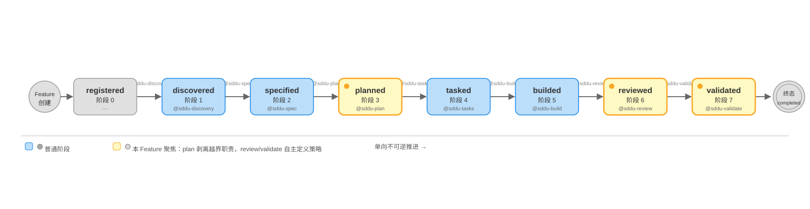

# Feature Specification：plan/review/validate 职责回归改造

> **文档定位**: SDDU 需求规范 — 定义功能需求、非功能需求和边界情况，作为 plan 阶段的输入  
> **前置依赖**: discovery.md（问题清单）  
> **创建人**: SDDU Spec Agent  
> **创建时间**: 2026-07-25  
> **版本**: v1.1  
> **更新人**: SDDU Spec Agent  
> **更新时间**: 2026-08-01  
> **更新说明**: v1.1 — 新增 §2.5 Phase 流转状态机图

## 1. 元数据
> Feature 基本信息

| 字段 | 值 |
|------|-----|
| Feature ID | FR-AGENT-SCOPE-001 |
| 名称 | plan/review/validate 职责回归改造 |
| 优先级 | P0 |
| 目标版本 | v3.0.0 |
| 干系人 | SDDU 框架维护者、所有使用 SDDU 7 阶段工作流的开发者 |

## 2. 上下文
> 回顾问题背景和目标用户

### 2.1 核心问题

本 Feature 解决 SDDU 框架自身的一个结构性缺陷：**plan Agent 越界代笔 review/validate 的审查策略和验证策略，而 review/validate 被动消费这些薄弱的输入，导致质量闭环失效**。

discovery 阶段的实证分析揭示了以下事实（详见 `discovery.md` §3）：

| 核心发现 | 实证 |
|---------|------|
| plan §5.8/§5.9 在 18 个已完成 Feature 中**从未产出过一条具体的 C1~CN 或 V1~VN** | 所有 18 个 plan.md 的 §8/§9 均为相同的 3 行通用表格 |
| review 已有自主产出高质量审查清单的能力（FR-SKILL-001 的 C1~C18），但被"第一步读 plan 策略"的入口依赖掩盖 | `specs-tree-skill-system/review.md` 实证 |
| validate 的 plan 驱动验证场景中 33%（4/12）因过于泛化无法执行 | `specs-tree-skill-system/validation.md` §9 标注 ⏭️ 的证据 |
| 早期架构假设"技术设计师应定义下游审查/验证策略"已被实证证伪 | 见 discovery Q-001/Q-002 分析 |

### 2.2 目标用户

- **主要用户**：SDDU 框架的 3 个核心 Agent（plan / review / validate）——改造它们的职责契约
- **间接用户**：使用 SDDU 7 阶段工作流的开发团队——改造后的 review/validate 将产出更高质量的审查/验证报告
- **维护用户**：SDDU 框架维护者——职责边界划清后，未来修改某个 Agent 不再需要"同步修改上游代笔策略"

### 2.3 相关功能

- FR-TEMPLATE-QUALITY-001（模板质量统一，v3.0.4）：本 Feature 的前提——当前 review/validate 模板已有丰富的静态分析/动态验证方法论（review §5.1~5.4 / validate §5.1~5.5），只需解除入口依赖即可释放
- FR-SKILL-001（Skill 系统）：提供了 review 自主能力的实证——C1~C18 审查清单在没有 plan 策略输入的情况下自主产出

### 2.4 SDDU 主流程 7 阶段认知矩阵

> 本矩阵定义 SDDU 主流程 7 个阶段的认知边界，作为本次改造的职责基准。每个阶段都是"想+做+判"的完整认知循环，"想的产物"是"做"的依据，"做的产物"是"判"的对象。

| Agent | 想的产物 | 沉淀于 | 做的产物 | 沉淀于 | 判 | 视角 |
|-------|---------|--------|---------|--------|----|------|
| **discovery** | 问题框架 | discovery.md | 问题清单 | discovery.md | 挖清了吗 | 问题探索 |
| **spec** | 需求结构 | spec.md | FR/NFR/EC | spec.md | 可验证吗 | 目标定义 |
| **plan** | 策略对比+推荐方案 | plan.md + ADR | 方案细节 | plan.md | 可行吗 | 正向设计 |
| **tasks** | 依赖图+波次 | tasks.md | TASK-xxx 清单 | tasks.md + json | 可执行吗 | 执行规划 |
| **build** | 实现决策 | build.md | 实际产物 | 实际产物 | 自洽吗 | 实现 |
| **review** | C1~CN 审查清单 | review.md（策略段） | 审查结果 | review.md（结果段） | 合格吗 | 逆向·静态 |
| **validate** | V1~VN 验证场景 | validate.md（策略段） | 验证报告 | validate.md（结果段） | 合规吗 | 逆向·动态 |

**矩阵核心约束：**

1. **每个阶段的"想"必须有文档沉淀**--无一例外，包括 build。build 的"想"（实现决策）沉淀到 build.md，不是"内化于执行"。

2. **想的产物是做的依据**--review 必须先产出 C1~CN 审查清单，才能逐项审查；validate 必须先产出 V1~VN 验证场景，才能逐项验证。策略段先于结果段，不能事后倒推。

3. **build.md 重新定位**--从"代码变更清单"（事后记录，无下游消费者）改为"实现决策记录"（build 的"想"的沉淀，review 的输入）。plan 的 ADR 管宏观架构决策，build.md 管微观实现决策，两者层次不同不重叠。

4. **plan 不越界代笔**--plan 的"想"是正向设计（策略对比+推荐方案+技术方案），不为 review/validate 代笔逆向检验策略。review/validate 自主产出 C1~CN / V1~VN。

5. **build 判"自洽"，validate 判"合规"**--build 的"判"是交付物自洽性（产物内部一致、可交付），不越界到 validate 的合规性验证（FR 覆盖、NFR 达标、无漂移）。

6. **review/validate 的文档结构强制三段式**--策略段（想的产物）+ 结果段（做的产物）+ 结论段（判的产物），策略段必须先于结果段完成，不能事后补。

### 2.5 SDDU Phase 流转状态机

> SDDU 主流程 8 阶段单向不可逆推进——每个阶段由对应 Agent 触发，结构上保证"不跳步、不回溯"。本 Feature 涉及 plan（planned）、review（reviewed）、validate（validated）3 个阶段的 Agent 职责回归——图中 🟡 高亮标注。

| 属性 | 说明 |
|:-----|:-----|
| 方向 | **单向不可逆** — phase 只能递增，不允许回退（如需修正 → 走新 Feature） |
| 触发 | 每个阶段由对应 Agent 执行触发，@sddu 入口在全程做关口验证 |
| 终态 | phase=validated + status=completed → Feature 生命周期结束 |
| 跳转约束 | 父 Feature 仅允许至 planned；叶子 Feature 允许全流程 |
| 本 Feature 聚焦 | planned → reviewed → validated 三个阶段的 Agent 职责边界 —— plan 不越界，review/validate 自主 |

## 3. 目标与非目标
> 明确需求范围，防止范围蔓延

### 3.1 目标 (Goals)

| # | 目标描述 |
|---|---------|
| G-001 | plan Agent 回归纯技术设计职责——剥离 §5.8（产物审查策略）和 §5.9（产物验证策略），不再为下游 review/validate 代笔策略 |
| G-002 | review Agent 完全自主定义审查清单 C1~CN——从 spec（需求）+ plan（技术设计/文件影响）+ 实际产物中自主提取审查对象和审查维度 |
| G-003 | validate Agent 完全自主定义验证场景 V1~VN——从 spec（需求/NFR/EC）+ plan（技术设计/文件影响）+ 实际产物中自主提取验证对象和验证场景 |
| G-004 | 3 个 Agent 的职责边界清晰隔离——plan 只管技术设计，review 独立定义审查策略，validate 独立定义验证策略——遵循"谁需要，谁设计"原则 |
| G-005 | 相关输出模板同步变更——plan 输出模板删除审查/验证策略章节，review/validate 输出模板适配自主策略输出 |
| G-006 | Agent 模板的 plugin copies 与 runtime copies 完全同步，不留不一致窗口 |

### 3.2 非目标 (Non-Goals)

| # | 明确不做 |
|---|---------|
| NG-001 | **不改变** plan 的技术设计核心职责（§5.1~§5.7：API 检查、架构分析、方案对比、推荐方案、文件影响分析、风险评估、ADR 生成） |
| NG-002 | **不改变** review 的静态分析职责和 validate 的动态验证职责——两者的分工（review "看"，validate "做"）不变 |
| NG-003 | **不回溯改造** 18 个已完成 Feature 的 plan.md 遗留 §8/§9（除非用户对 Q7.3 做出批量清理决策——见 §8 开放问题） |
| NG-004 | **不修改** SDDU 状态机（`sddu_update_state`）、coordinator（`@sddu` 入口）、或工作流阶段衔接逻辑——改造仅涉及 Agent 模板内容和输出模板格式 |
| NG-005 | **不修改** tasks/build Agent 模板——这两个 Agent 不直接消费或产出审查/验证策略，不受影响（discovery 已确认间接影响面可控） |
| NG-006 | **不引入** 新的产物清单结构化格式（如 `<file_manifest>`）——用户选择了 Q7.1=Option B（完全自主），plan 的 §5.5 文件影响分析保持现有格式，review/validate 不依赖 plan 提供任何产物列表 |

## 4. 用户故事
> dogfooding 场景适配：以 Agent 职责契约视角描述

| # | 作为… | 我想要… | 以便… |
|---|-------|---------|-------|
| US-001 | **sddu-plan** Agent | 专注于技术设计（架构分析、方案对比、ADR、文件影响分析），不再被要求为下游代笔审查策略和验证策略 | 我的输出是纯粹的技术方案，不会因跨领域的薄弱代笔而稀释技术设计质量 |
| US-002 | **sddu-review** Agent | 自主从 spec+plan+产物中提取审查对象，运用自身审查方法论（§5.1~5.4）定义 C1~CN 审查清单 | 我的审查清单直接匹配本 Feature 的实际需求，不再被"等待 plan 派活"的被动入口限制能力 |
| US-003 | **sddu-validate** Agent | 自主从 spec+NFR+产物中提取验证对象，运用自身验证方法论（§5.1~5.5）定义 V1~VN 验证场景 | 我的验证场景是实际可执行的场景矩阵，不再执行 33% 无法执行的泛化指令 |
| US-004 | **SDDU 框架维护者** | 三个核心 Agent 的职责契约清晰："谁需要谁设计"，上游不越界代笔下游策略 | 未来修改任一 Agent 时，变更影响面可预测——不会触发连锁的跨 Agent 策略同步 |
| US-005 | **使用 SDDU 的开发团队** | review 和 validate 产出的审查/验证报告质量一致且具体 | 每个 Feature 的审查都有具体的 C1~CN 检查项、验证都有可执行的 V1~VN 场景——质量闭环真正闭合 |

## 5. 功能需求 (FR)
> 每个需求必须有唯一标识符且可测试

| ID | 需求描述 | 验收标准 | 优先级 |
|----|---------|---------|--------|
| FR-001 | **plan Agent 模板剥离「产物审查策略」**：从 `sddu-plan.md`（plugin copy + runtime copy）中删除 §5.8「产物审查策略」及其全部内容（当前 L112-116），plan 不再输出任何审查策略定义的职责描述 | 在 2 份 plan Agent 模板副本（`.opencode/plugins/sddu/agents/sddu-plan.md` 和 `.opencode/agents/sddu-plan.md`）中，搜索字符串 `5.8` `产物审查策略` 返回 0 结果 | P0 |
| FR-002 | **plan Agent 模板剥离「产物验证策略」**：从 `sddu-plan.md`（plugin copy + runtime copy）中删除 §5.9「产物验证策略」及其全部内容（当前 L117-120），plan 不再输出任何验证策略定义的职责描述 | 在 2 份 plan Agent 模板副本中，搜索字符串 `5.9` `产物验证策略` 返回 0 结果 | P0 |
| FR-003 | **plan 输出模板删除「产物审查策略」章节**：从 `src/templates/outputs/sddu-plan.md.hbs` 中删除 §8「产物审查策略」章节（当前 L65-72）及内容，章节编号重新编排（原 §9 变为 §8，原修订记录变为 §9） | 在 `sddu-plan.md.hbs` 中搜索字符串 `产物审查策略` 返回 0 结果；新 plan.md 产出中不含该章节 | P0 |
| FR-004 | **plan 输出模板删除「产物验证策略」章节**：从 `src/templates/outputs/sddu-plan.md.hbs` 中删除 §9「产物验证策略」章节（当前 L74-80）及内容 | 在 `sddu-plan.md.hbs` 中搜索字符串 `产物验证策略` 返回 0 结果；新 plan.md 产出中不含该章节 | P0 |
| FR-005 | **review Agent §1「角色定位」改为自主策略模式**：当前 §1 中 "审查的产物清单和基准以 plan.md 中「产物审查策略」章节为准，该章节定义的审查清单（C1~CN）是你的首要检查项"（L16）替换为自主描述——review 自主从 spec+plan+产物 中提取审查对象，运用 §5.1~5.4 审查方法论自主定义 C1~CN 审查清单 | 在 2 份 review Agent 模板副本中：不包含对 plan.md「产物审查策略」的引用；包含"自主从 spec+plan+产物中定义审查清单 C1~CN"的语义描述 | P0 |
| FR-006 | **review Agent 解除对 plan 审查策略的结构性依赖**：删除 §3「依赖关系」中对 plan.md「产物审查策略」的引用（L39 "审查的产物清单和基准见 plan.md 中「产物审查策略」章节"）；改写 §6「审查标准」中对 plan.md「产物审查策略」的引用（L82 "审查的产物和基准见 plan.md 中「产物审查策略」章节"），替换为自主策略引用（如"审查对象和基准基于本 Agent 自主定义的 C1~CN 审查清单"） | 在 2 份 review Agent 模板副本中：§3 和 §6 不含对 plan.md「产物审查策略」章节的引用 | P0 |
| FR-007 | **review 输出模板提供自主审查清单输出能力**：在 `src/templates/outputs/sddu-review.md.hbs` 中适配或新增 section，使 review Agent 有地方输出其自主定义的 C1~CN 审查清单及对应的审查结果。当前模板缺乏专门的审查清单 section（§2 审查详情按类型组织但不显式呈现审查清单结构）——需要新增或增强 | 审查产出模板中包含明确标注的审查清单（C1~CN）section，每个 Cx 有审查对象、基准、评估结果的条目 | P0 |
| FR-008 | **validate Agent §1「角色定位」改为自主策略模式**：当前 §1 中 "验证的第一步永远是读取 plan.md 中的「产物验证策略」章节——plan 定义的验证场景是你最重要的任务清单"（L16-17）替换为自主描述——validate 自主从 spec+NFR+产物 中提取验证对象，运用 §5.1~5.5 验证方法论自主定义 V1~VN 验证场景 | 在 2 份 validate Agent 模板副本中：不包含对 plan.md「产物验证策略」的引用作为"第一步"/"最重要的任务清单"；包含"自主从 spec+NFR+产物中定义验证场景 V1~VN"的语义描述 | P0 |
| FR-009 | **validate Agent 解除对 plan 验证策略的结构性依赖**：删除或改写以下 3 处对 plan.md「产物验证策略」的引用：① §3（L35 "验证的产物清单和基准见 plan.md 中「产物验证策略」章节"）；② §5.0「场景验证」整体改为自主场景设计模式——不再以"读取 plan 验证策略"作为入口，改为"自主从 spec+NFR+产物中设计验证场景矩阵"；③ §6「验证标准」（L145 "验证的产物和基准见 plan.md 中「产物验证策略」章节"）替换为自主策略引用 | 在 2 份 validate Agent 模板副本中：§3/§5.0/§6 不含对 plan.md「产物验证策略」章节的引用；§5.0 以自主场景设计为入口而非 plan 策略为入口 | P0 |
| FR-010 | **validate 输出模板提供自主验证场景输出能力**：在 `src/templates/outputs/sddu-validate.md.hbs` 中适配或新增 section，使 validate Agent 有地方输出其自主定义的 V1~VN 验证场景及对应的实测结果。当前模板缺乏专门的验证场景 section——需要新增或增强 | 验证产出模板中包含明确标注的验证场景（V1~VN）section，每个 Vx 有验证对象、验证步骤、预期结果、实测结果的条目 | P0 |
| FR-011 | **Agent 模板 plugin copies 与 runtime copies 同步**：本次改造涉及 3 个 Agent（plan/review/validate）的 2 份副本，共 6 个文件——`.opencode/plugins/sddu/agents/sddu-{plan,review,validate}.md`（plugin copies）和 `.opencode/agents/sddu-{plan,review,validate}.md`（runtime copies）。每个 Agent 的 2 份副本在改造完成后内容必须**完全一致**（除 frontmatter 可能差异外） | 对每个 Agent，`diff` 两副本结果为当前级别的合理差异（如 frontmatter 字段差异）或空；review 模板引用 plan 策略的字符串在两副本中均不存在 | P0 |
| FR-012 | **构建机制兼容改造后的模板**：运行 `node scripts/build-agents.cjs`（或其他构建命令）在改造后的模板上不产生错误，成功完成构建 | 改造完成后执行一遍构建流程，退出码为 0，构建日志无 ERROR | P1 |
| FR-013 | **review Agent 向后兼容已完成 Feature 的旧格式 plan.md**：已完成 Feature 的 plan.md 中包含 §8「产物审查策略」（旧格式，18 个计划均如此）。review Agent 在处理新 Feature 时不依赖 plan 策略章节；若在处理过程中读取到已完成或旧格式的 plan.md（含 §8），应忽略该章节而非报错或尝试解析 | review Agent 模板中不应有"读取 plan 策略"的指令；如 review 工作流包含读取 plan.md 文档的通用步骤，不因 plan.md 包含 §8 而中断或产生错误行为 | P1 |
| FR-014 | **validate Agent 向后兼容已完成 Feature 的旧格式 plan.md**：已完成 Feature 的 plan.md 中包含 §9「产物验证策略」（旧格式，18 个计划均如此）。validate Agent 在处理新 Feature 时不依赖 plan 策略章节；若在处理过程中读取到已完成或旧格式的 plan.md（含 §9），应忽略该章节而非报错或尝试解析 | validate Agent 模板中不应有"读取 plan 验证策略"的指令；如 validate 工作流包含读取 plan.md 文档的通用步骤，不因 plan.md 包含 §9 而中断或产生错误行为 | P1 |

> **FR 编号说明**：共 14 个 FR，覆盖 5 个维度——plan 剥离（FR-001~004）、review 自主（FR-005~007）、validate 自主（FR-008~010）、模板同步（FR-011~012）、向后兼容（FR-013~014）。所有 P0（10 个）为阻塞项，P1（4 个）为重要但非阻塞项。

## 6. 非功能需求 (NFR)
> 跨切面质量需求

| ID | 类别 | 需求描述 | 验收标准 |
|----|------|---------|---------|
| NFR-001 | 一致性 | **3 个 Agent 模板的 2 份副本保持同步**：plan/review/validate 的 plugin copies（`.opencode/plugins/sddu/agents/`）和 runtime copies（`.opencode/agents/`）在本次改造完成后内容一致，不允许出现"plugin copy 已改但 runtime copy 未改"的不一致窗口 | 改造提交前执行全量 diff：`diff -r .opencode/plugins/sddu/agents/ .opencode/agents/` 结果中 plan/review/validate 文件的差异为 0 行或仅含合理的 frontmatter 差异（如 `temperature` 差异） |
| NFR-002 | 兼容性 | **不破坏现有 18 个已完成 Feature 的工作流**：已完成 Feature（phase=validated, status=completed）不再触发 review/validate，改造不应产生任何编译错误、运行时错误或工作流中断。改造仅修改 Agent 模板和输出模板，不修改状态机或 coordinator | 改造完成后的 `@sddu` 入口命令正常运行；状态查询命令正常；已完成 Feature 的目录结构和产物不受影响（文件不被修改） |
| NFR-003 | 兼容性 | **plan §5.5 文件影响分析格式向前兼容**：剥离 §5.8/§5.9 后，plan 的 §5.5 文件影响分析保持现有格式（列表 + 操作标记），不新增结构化字段。这是 Q7.1=Option B 的直接约束——review/validate 不依赖 plan 提供产物清单 | 改造后 plan.md 的 §5（文件影响分析）章节与改造前格式一致，无新增字段 |
| NFR-004 | 可维护性 | **自主策略设计质量指引**：review/validate Agent 模板中新增的自主策略设计描述需包含足够具体的方法论指引——至少应引用自身已有的专家审查/验证方法论（review §5.1~5.4 / validate §5.1~5.5），避免 review/validate 首次自主设计时因指引不足而质量退化（discovery R-001 识别的最高风险） | review/validate 改造后的 §1/§5.0 中包含可供 Agent 直接执行的自主策略设计步骤（非泛化的"请自主定义"），至少包含：(1) 明确从哪些输入中提取审查/验证对象；(2) 对照哪些审查/验证维度（已有维度表的引用）；(3) 输出的最低质量标准（如每个 FR 至少对应 1 个 Cx/1 个 Vx） |
| NFR-005 | 可维护性 | **模板冗余度受控**：plugin copies 和 runtime copies 的同步策略通过 `build-agents.cjs` 或明确的同步说明来保证——未来单次 Agent 模板修改只需修改一份源文件，而非手动同步两份 | 构建脚本中存在明确的同步机制说明（如注释文档），或两副本之一为从另一副本自动生成的目标文件 |
| NFR-006 | 可测试性 | **每个 FR 对应至少一个自动化检查方式**：由于本 Feature 的改造对象是 Markdown Agent 模板文件，FR 的验收标准以文本搜索（grep）和 diff 为主——这些检查应可脚本化 | 存在一个检查脚本或一组 grep/diff 命令，输入为改造后的文件目录，输出为 FR 通过/失败的布尔列表 |

## 7. 边界情况 (EC)
> 异常场景和边界条件的处理方式

| ID | 场景 | 处理方式 |
|----|------|---------|
| EC-001 | **review 自主提取审查对象时，spec/plan 信息不足**：如果 spec 的 FR 描述模糊（无验收标准）或 plan 的文件影响分析未列出关键产物，review 可能遗漏审查对象 | review Agent 模板中应包含兜底策略：(a) 如果 spec 信息不足——标记每个信息不足的 FR 为"无法审查"并注明原因，不编造审查结果；(b) 如果 plan 文件影响分析不完整——review 自行扫描 `src/` 和 `tests/` 目录补全产物清单；(c) 在审查报告中单独列出"信息不足"section 提醒用户补充 spec |
| EC-002 | **validate 自主提取验证对象时，spec 中无 NFR 定义**：如果 spec 仅定义了 FR 而无 NFR（如纯模板/配置型 Feature），validate 的自主场景设计缺少性能/安全维度的输入 | validate Agent 模板中应包含 Feature 类型自适应逻辑：(a) 识别 Feature 类型（代码/模板/配置/文档）；(b) 模板/配置/文档类型 Feature 的验证场景侧重于构建完整性、格式一致性、引用完整性，而非性能/安全；(c) 无 NFR 时标注"本 Feature 无 NFR 定义，跳过性能/安全验证"，不阻塞通过 |
| EC-003 | **已完成 Feature 的 plan.md 遗留 §8/§9**：18 个已完成 Feature 的 plan.md 包含旧格式 §8（产物审查策略）和 §9（产物验证策略）。这些 Feature 已完成（不会再触发 review/validate），但遗留的 §8/§9 可能与改造后的规范语义不匹配——例如，新用户阅读旧 plan.md 时可能疑惑"为什么 plan.md 有审查策略章节，但 @sddu-review 说明它是自主的？" | 处理策略见 §8 开放问题 #1（Q7.3）：待用户决策。当前 spec 的默认策略——不批量清理已完成 Feature 的遗留 §8/§9（已完成 Feature 为 freeze 状态，修改会引入无价值的 diff 和 git 历史膨胀）。可在 `sddu-plan.md.hbs` 模板的 §5.5 下方添加 migration note 说明"§8/§9 已从 plan 模板中移除（v3.0.0+），旧 Feature 的 plan.md 可能仍包含此章节" |
| EC-004 | **plugin copies 与 runtime copies 未来出现不同步**：当前同步通过手动维护两份副本实现，未来如果某个 Agent 模板修改仅更新了一份副本，会导致 Agent 行为不一致 | 处理策略：改造完成后，在 `build-agents.cjs` 或 install 脚本中增加同步说明注释，或明确标注哪一份是源文件（source-of-truth）、哪一份是生成的目标文件。见 §8 开放问题 #2 |
| EC-005 | **review/validate 自主策略定义的"最低质量门槛"未达标**：如果 review/validate 首次自主设计策略时，产出的 C1~CN 或 V1~VN 比改造前"plan 薄策略但 Agent 自己补全"的质量更低——即 discovery R-001 风险（"本来有 50 分底线的纸，撕掉后直接交白卷"） | 处理策略见 §8 开放问题 #3。当前 spec 在 NFR-004 中定义了自主策略设计指引的最低要求，但具体如何量化"最低质量门槛"（如 C1~CN 至少覆盖多少维度、V1~VN 至少覆盖多少 FR/NFR）需要在 plan 阶段设计具体方案 |
| EC-006 | **计划中的 review/validate 输出模板章节编号冲突**：在 `sddu-review.md.hbs` 和 `sddu-validate.md.hbs` 中新增"自主审查清单/验证场景"section 可能导致现有章节编号变动——如果下游 tool 或脚本依赖模板章节编号而非标题搜索，可能解析失败 | 处理方式：新增 section 使用语义化标题（如 `## X. 自主审查清单 (C1~CN)`），优先确保标题搜索（grep）的稳定性；现有章节编号如需变更，在修订记录中注明编号变动映射表 |
| EC-007 | **并发修改冲突**：如果本 Feature 执行期间，另一个 Feature（如 FR-SKILL-* 或 FR-TEMPLATE-*）同时修改了 Agent 模板文件，可能产生 merge conflict | 处理方式：本 Feature 的 plan 阶段需检查当前分支状态，列出所有可能冲突的文件；如果存在冲突，plan 需包含 merge 策略（如基于最新 HEAD 重新应用变更） |

## 8. 开放问题
> 待决策事项和需要进一步调研的内容

| # | 问题 | 状态 | 决策建议 |
|---|------|:--:|---------|
| 1 | **Q7.3：已完成 Feature 的 plan.md 遗留 §8/§9 是否批量清理？** discovery 建议不处理（已完成 Feature 为 freeze 状态）。但需要用户最终确认：(a) 不处理——保持现状，在 plan 模板中加 migration note；(b) 批量清理——对所有已完成 Feature 的 plan.md 删除 §8/§9 章节并重新编号 | ⚠️ 待决策 | 建议 Option (a)：不处理。理由：(1) 18 个 freeze 状态的 plan.md 批量修改引入无价值的 git diff；(2) 已完成 Feature 不会再触发 review/validate；(3) migration note 足以消除未来读者的疑惑 |
| 2 | **Agent 模板的同步机制（plugin copies ↔ runtime copies）是否需要工程化？** 当前两副本手动维护，长期存在不同步风险。改造完成后是否需要：(a) 暂时保持手动同步，在 build-agents.cjs 中添加同步验证逻辑；(b) 实施自动同步机制（如一方向另一方自动生成） | ⚠️ 待决策 | 建议 Option (a) 作为 MVP：在 build-agents.cjs 中添加 diff 对比验证步骤，构建时如果检测到不一致则报 WARNING。完整自动化同步可由后续 Feature 单独处理 |
| 3 | **review/validate 自主策略的"最低质量门槛"如何定义？** NFR-004 提供了指引要求，但未量化。例如：每个 FR 至少对应 1 个 Cx（审查项）和 1 个 Vx（验证场景）？每种审查维度（代码质量/规范符合/架构一致/测试质量）至少产出 N 条审查项？ | ⚠️ 待决策 | 建议在 plan 阶段设计具体方案——但需用户确认质量阈值的严格程度。Plan 可提供 2 个选项：(a) 宽松——不设数量门槛，凭 Agent 判断（利用 FR-AGENT-SCOPE-001 自身作为自举验证）；(b) 严格——定义最低数量门槛（如每个 FR≥1 Cx 且每个 NFR≥1 Vx） |
| 4 | **改造后的 review/validate 输出模板中"自主审查清单/验证场景"section 的命名和结构**：FR-007 和 FR-010 要求输出模板提供自主策略输出能力，但 section 的具体格式（纯表格？分组后的表组？）未定义——这属于 plan 阶段的设计决策 | 待 plan | plan 阶段需要设计 § 结构；当前 spec 不绑定具体格式——只要 review Agent 有地方输出 C1~CN 且 validate Agent 有地方输出 V1~VN 即满足需求 |

## 修订记录
> 记录本文档的版本变更历史

| 版本 | 变更说明 | 日期 | 修订人 |
|------|---------|------|--------|
| v1.0 | 初始创建 — 基于 discovery.md（11 个问题 Q-001~Q-011）和用户决策（Q7.1=Option B, Q7.2=单 Feature），定义 14 FR、6 NFR、7 EC、4 开放问题 | 2026-07-25 | SDDU Spec Agent |
| v1.1 | 新增 §2.5 SDDU Phase 流转状态机（Mermaid 状态图）—— 8 阶段单向不可逆推进可视化，🟡 标注 planned/reviewed/validated 为本 Feature 聚焦的三个阶段 | 2026-08-01 | SDDU Coordinator |
