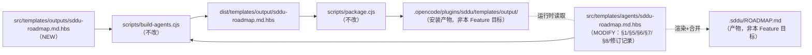

# 技术计划：@sddu-roadmap 输出模板补全

> **文档定位**: SDDU 技术方案 — 记录架构设计、方案对比和 ADR，作为 tasks 阶段的输入  
> **前置依赖**: spec.md（需求规范）  
> **创建人**: SDDU Plan Agent  
> **创建时间**: 2026-09-22  
> **版本**: v1.0  
> **更新人**: SDDU Plan Agent  
> **更新时间**: 2026-09-22  
> **更新说明**: 初始创建 — 落定 OP-002 增量保留区标记语法与合并算法；完成模板分发链路与两级查找机制的源码级验证（FR-011 确认 scripts/ 无需改动）；产出 3 个 ADR

## 1. 前置检查
> 启动技术规划前必须验证的前置条件
| 检查项 | 状态 |
|--------|:--:|
| spec.md 存在 | ✅（`.sddu/specs-tree-root/specs-tree-roadmap-output-template/spec.md`，198 行） |
| 外部 API 文档缓存 | ⚠️ 不适用（本 Feature 为纯模板/指令改造，不引用任何外部服务） |
| 前置依赖已满足 | ✅（FR-TEMPLATE-001 / FR-TPL-001 / FR-DOCS-OPT-001 均已 validated） |
| 工作分支 | ✅ `feature/roadmap-output-template`（禁止切 main、禁止合入 main） |
| 工程边界确认 | ✅ README §209-211：实现目标限于 `src/`；`.opencode/`、`.sddu/` 不作为实现变更目标 |

**补充前置核实（本次新增，非 spec 要求但影响可行性）**：`scripts/generate-tree.cjs`（sddu-tree Skill 引用的脚本）在当前工作区**不存在**（`ls scripts/` 无此文件）。该缺失与本 Feature 无关（属既有框架缺陷），故本阶段 TREE 更新改为**手工定向更新**，并在 §6 R8 记录，**不纳入本 Feature 范围**。

## 2. 架构分析
> 分析现有架构影响和需要的新组件

### 2.1 模板分发链路（源码级验证）

| 环节 | 载体 | 关键行为 | 证据 |
|------|------|---------|------|
| ① 设计态源文件 | `src/templates/outputs/*.hbs` | 既有 9 个根级 + `docs/` 20 个 = **29 个**（本 Feature 新增 `sddu-roadmap.md.hbs` 后：根级 10 / 实测总数 30） | `ls src/templates/outputs/` + `find … -name '*.hbs' \| wc -l` |
| ② Agent 指令构建 | `scripts/build-agents.cjs:118-156` | 7 个主流程 Agent 走 frontmatter 改造；`specialAgents`（含 `sddu-roadmap`）走**裸拷贝** | `readSdduTemplate()` + `generateShortAgentSddu()` |
| ③ 输出模板构建 | `scripts/build-agents.cjs:158-185` | `fs.readdirSync(OUTPUT_SRC_DIR,{recursive:true})` → `.hbs` 过滤 → `copyFileSync` 裸拷贝 | `dist/templates/output/` |
| ④ 打包 | `scripts/package.cjs:126-133` | `dist/templates/output/` 整体 `fs.copy` → `dist/sddu/templates/output/`（**不做 SDD→SDDU 名称替换**） | 逐字复制 |
| ⑤ 安装产物 | `.opencode/plugins/sddu/templates/output/` | 现存 9 根级 + `docs/`，与新模板落点一致 | `ls .opencode/plugins/sddu/templates/output/` |
| ⑥ 运行时渲染 | **无代码** | 模板查找/占位符替换/渲染**全部由 LLM Agent 依 §6 指令执行**（Agent-Native） | `grep -rn "\.hbs" src/ --include='*.ts'` → 仅命中 `src/templates/index.ts:5` 一行注释；`src/**/*.ts` 无 `templates/output` 引用 |

**实测证据（本次执行）**：
1. `npm run build:agents` 输出 `✅ Output templates copied (29 files)` → 链路 ②③ 当前可用。
2. 隔离实测（复制 `src/templates/outputs/` 到临时目录 + 注入一个**根级**新文件 + 逐字复刻 ③ 的拷贝循环）：`copied 30 | roadmap root-level copied: true`、`byte-identical: true` → **根级新增模板会被自动覆盖，`scripts/` 无需改动**（FR-011 结论成立，A-006 验证通过）。
3. 实测后 `git status` 干净、`src/templates/outputs/` 根级 `.hbs` 仍为 9 个（无残留）。

### 2.2 数据流变更

```
[用户/调度] → @sddu-roadmap
   │ 读 agent 指令 §6（两级查找声明）
   ├─① .sddu/templates/agents/output/sddu-roadmap.md.hbs   （用户自定义，优先）
   └─② .opencode/plugins/sddu/templates/output/sddu-roadmap.md.hbs （内置兜底，← src/templates/outputs/ 经 ②③④⑤ 下发）
   │ 读模板 → 按 zone 标记区分 重写区(6)/保留区(3)
   │ 读 既有 .sddu/ROADMAP.md → 解析 zone/entry 快照（OP-002）
   │ 扫描 specs-tree-root/*/state.json + 用户输入 → 刷新重写区 + 生成保留区候选条目
   │ 合并（rewrite 全量替换 / preserve 键控 upsert+保留）
   └→ 写回 .sddu/ROADMAP.md（唯一产物，携带 zone/entry 标记）
```

新增数据：**标记元数据**（`<!-- sddu:zone ... -->` / `<!-- sddu:entry ... -->`）首次进入产物文件，成为「增量合并的定位锚点」。该锚点与 H2 标题解耦（见 §4.2.1 R5），因此不破坏 NFR-006 / EC-010 的可解析性。

### 2.3 依赖关系图



### 2.4 变更边界

| 类别 | 内容 |
|------|------|
| 新增 | 1 个设计态模板文件（`src/templates/outputs/sddu-roadmap.md.hbs`） |
| 修改 | 1 个设计态指令模板（`src/templates/agents/sddu-roadmap.md.hbs`） |
| 不变 | `scripts/`（实测无需改动）、其他 **29** 个输出模板（既有口径 = 9 根级 + 20 `docs/`）、10 个其他 Agent 指令、全部 `src/**/*.ts`（无运行时代码变更）、`.opencode/`、`.sddu/ROADMAP.md` |

## 3. 方案对比
> 2-3 个可行方案的对比分析

### 方案 A：双端 HTML 注释标记 + Agent-Native 合并（推荐）
- **描述**：模板用 `<!-- sddu:zone id=… mode=rewrite|preserve -->` 包裹每个区段，`mode="preserve"` 区内对「块状可独立合并」的内容再加 `<!-- sddu:entry id=版本号 -->`；标记**随产物一并写出**，成为下次运行的定位锚点。合并算法（Step A–D）写进 agent 指令 §5，由 LLM 执行，零代码。
- **优点**：锚点随产物持久化 → 合并确定、可判别、可退化（标记缺失即可检测，绝不静默误重写）；与既有 Agent-Native 模板机制同构（无新增运行时依赖）；工程边界最小（仅 2 个文件）；标记对下游字符串解析无影响。
- **缺点**：合并正确性依赖 LLM 依指令执行（无编译期保证）；产物中引入 16 行标记（视觉噪声，但对 Markdown 渲染不可见）。
- **风险**：中（LLM 遵守度）→ 由 §5.4 强制流程 + §7 规则 + §8 异常表 + validate 幂等/配对测试兜底。
- **工作量**：S（~0.5 人日）

### 方案 B：单端标记（仅模板内）+ 标题驱动合并
- **描述**：模板内以注释标注保留区，但**不写入产物**；合并时按 H2 标题（`## 4. 版本规划详述` 等）定位保留区。
- **优点**：产物干净；模板改动最小。
- **缺点**：① 定位锚点依赖标题字符串 → 一旦用户自定义模板改了标题、或 LLM 微调标题，保留区即失配（与「消除结构漂移」的动机正面冲突）；② 无法区分「旧产物是模板结构」还是「恰好标题相同」，EC-004 判定退化；③ 无机器可判别信号，validate 无法静态验证。
- **风险**：中高（静默丢内容）。
- **工作量**：XS（~0.25 人日）

### 方案 C：运行时代码合并（新增 `scripts/merge-roadmap.cjs` 或 TS 模块）
- **描述**：把渲染/合并做成确定性脚本（解析既有产物 + 模板 → 输出合并结果），agent 只调用脚本。
- **优点**：合并完全确定、可单测、可 CI 回归。
- **缺点**：① 需把模板查找、`<<变量>>` 替换、内容生成（RICE 表等语义内容）一并代码化，而内容生成本质是 LLM 工作 → 会出现「脚本渲染骨架 + LLM 填内容」的混合体，复杂度陡增；② 突破工程边界（新增 `scripts/` 资产，且需进入分发/安装链路，触碰 `.opencode/`）；③ 与现状矛盾：`sddu-tree` Skill 引用的 `scripts/generate-tree.cjs` 已缺失（现状证据），脚本型机制无维护闭环；④ 与 spec 的 C-004 工程边界及 NG-005 冲突风险。
- **风险**：中高（工期与范围蔓延）。
- **工作量**：M/L（≥2 人日）

### 方案对比总览

| 维度 | 方案 A（推荐） | 方案 B | 方案 C |
|------|:--:|:--:|:--:|
| 合并确定性 / 可验证性 | 中高（结构可静态校验 + 幂等可测） | 低 | 高 |
| 抗结构漂移 | 高（锚点与标题解耦） | 低 | 高 |
| 增量内容安全性 | 高（默认≠覆盖；缺失即降级为非模板结构） | 中低 | 高 |
| 工程边界合规 | ✅ 仅 2 个文件 | ✅ 仅 2 个文件 | ❌ 需动 `scripts/` 与分发链路 |
| 实施成本 | S | XS | M/L |
| 与既有机制一致性 | 高（同构 Agent-Native） | 中 | 低 |
| 主要失败模式 | LLM 忽略标记（可检测） | 静默丢内容（不可检测） | 范围蔓延/维护断链 |

## 4. 推荐方案
> 推荐方案及选择理由

**推荐**：方案 A — 双端 HTML 注释标记 + Agent-Native 合并
**理由**：① 唯一能在「不用代码」的前提下把合并锚点**持久化到产物**的方案，从而把不可检测的失败模式（静默丢内容）转化为可检测的失败模式（标记缺失/不成对）；② 与既有 8 个 Agent 的 Agent-Native 模板机制同构，不引入第二套机制；③ 严格遵守 spec 的工程边界（仅 `src/` 两个文件）；④ 满足 FR-005「显式区分重写区/保留区」与 NFR-006/EC-010 可解析性。方案 B 与动机（消除漂移）自相矛盾；方案 C 超出 S 规模且触碰边界（`scripts/generate-tree.cjs` 缺失即为脚本型机制无闭环的现实反证）。

### 4.1 【OP-002 核心交付】增量保留区标记语法与合并算法

#### 4.1.1 标记语法规范（v1）

```text
zone-open   ::= '<!-- sddu:zone id="' ZONE_ID '" mode="' MODE '" -->'
zone-close  ::= '<!-- /sddu:zone -->'
entry-open  ::= '<!-- sddu:entry id="' ENTRY_ID '" -->'      ; 仅允许出现在 mode="preserve" 的 zone 内
entry-close ::= '<!-- /sddu:entry -->'

ZONE_ID  ::= [a-z][a-z0-9-]*        ; 模板内固定、与 H2 标题解耦
MODE     ::= 'rewrite' | 'preserve'
ENTRY_ID ::= 渲染后不含空格/引号/斜杠的稳定键（roadmap 取版本号，如 v4.1.0）
```

| 规则 | 内容 |
|------|------|
| R1 | 前缀 `sddu:` 为**保留命名空间**。非 `sddu:` 前缀的 HTML 注释视为「编写期说明」（如模板末尾 `<!-- NOTE: … -->`），**不得写入产物**。（既有先例：`src/templates/outputs/sddu-plan.md.hbs:51` 的 Migration Note 注释在当前全部 `.sddu/*/plan.md` 产物中均不存在 → 约定已被遵守） |
| R2 | `mode="rewrite"` 区：每次按最新扫描/变量重新生成，不读取既有内容。 |
| R3 | `mode="preserve"` 区：按 §4.1.2 合并；区内既有内容不得静默丢弃。 |
| R4 | zone 必须配对；同一产物内 ZONE_ID 唯一、与模板一致；`entry` 不可嵌套、不可空。 |
| R5 | **标记与 H2 解耦**：H2 标题集合与顺序 100% 由模板产出（NFR-006），标记仅标注**标题之下的内容区**；因此标题变更不影响合并定位，反之亦然。 |
| R6 | `entry` 仅用于**块状可独立合并**的内容。表格类区段（修订记录）**不使用 entry 标记**——HTML 注释行会截断 Markdown 表格，改用「自然键列」合并（键 = `版本` 列）。 |
| R7 | 标记随产物写出（双端）。下游按 H2 字符串解析不受影响（EC-010）；标记在 Markdown 渲染视图中不可见。 |
| R8 | 缺省安全语义：**未标注 == rewrite**。因此标记丢失会退化为「重写」而非「乱合并」；而「既有产物整体无标记」被显式判定为**非模板结构**（EC-004，不静默重写）。 |

**zone 布局（ADR-001 原基线：8 个区段 = 「固化 5 + 保留 3」；经 ADR-004 修订为 9 个区段 = 6 rewrite + 3 preserve，见下方修订说明）**

| # | 区段 | ZONE_ID | MODE | 合并粒度 |
|---|------|---------|------|---------|
| 0 | 元数据头部（blockquote） | `meta` | rewrite | 整块 |
| 1 | §1 项目愿景与定位 | `vision` | rewrite | 整块 |
| 2 | §2 版本总览 | `version-overview` | rewrite | 整块 |
| 3 | §3 优先级（RICE Top N） | `priority` | rewrite | 整块 |
| 4 | §4 版本规划详述 | `version-plan` | **preserve** | **entry 级（键 = 版本号）** |
| 5 | §5 依赖与风险 | `dependencies-risks` | rewrite | 整块 |
| 6 | §6 下一步行动 | `next-actions` | **preserve** | 条目级（键 = 行动项文本） |
| 7 | §7 修订记录 | `revision-log` | **preserve** | 行级（键 = `版本` 列） |

> **修订说明（R3 / ADR-004，2026-09-23；R5 扩写，2026-09-24）**: 上表 zone 布局基线（原 **7 H2 / 8 zone = 5 rewrite + 3 preserve**）经 **ADR-004** 修订为 **8 H2 / 9 zone = 6 rewrite + 3 preserve** —— 新增 `feature-index` 区（`mode="rewrite"`），对应输出模板在「版本总览」之后新增的「**特性索引**」H2 章节；`version-plan` / `next-actions` / `revision-log` 三个保留区与其余 rewrite 区均不变。spec FR-003 的「7 个 H2」已由 `spec.md` §5.1 **SUP-002** 显式修订为 8 个。**R5（2026-09-24）已把本修订的适用范围扩写至全文旧计数位置并逐处更正**：§2.2 数据流「重写区(5)」→ (6)、§2.4 变更边界「28 个输出模板」→ 29、§4.1.2 Step C3-①「7 个」→ 8、§4.2 结构「7 个 H2」→ 8、§4.5 W1（`mode="rewrite"` = 5 → 6）、§5.1 变更清单（「8 个 zone；7 个 H2」→「9 个 zone；8 个 H2」+「其他 28 个」→ 29）、§6 回滚策略（28 → 29）、§7.1 审查清单（7 → 8）、§8 V-04/V-05（28 → 29；V-05 期望值 `3/5/2/7` → `3/6/2/8`）—— 以上各处均已按当前基线更正，本文档不再含「7 个 H2 / 8 个 zone / 5 rewrite」的活动（非历史）表述。模板计数口径统一为：**既有 29 个输出模板**（9 根级 + 20 `docs/`），新增 roadmap 模板后实测总数 **30**。决策全文见 `ADR-004-feature-index-section.md`。

#### 4.1.2 合并算法（agent 指令 §5.4 的正文，逐步可执行）

**输入**：① 模板（新内容骨架）② 既有 `.sddu/ROADMAP.md`（如存在）③ 本次扫描结果 + 用户输入

**Step A — 判定生成方式**
- A1 产物不存在 → `生成方式 = 完整生成`，跳至 Step C3。
- A2 产物存在且含 ≥1 个合法 `sddu:zone` 标记 → `生成方式 = 增量更新`。
- A3 产物存在但**无合法标记** → 判定「非模板结构」：**不修改文件**，提示用户并给出三选项（按新模板重构 / 保留现状 / 仅增量补充），等待决策（EC-004 / FR-012）。禁止自动迁移。

**Step B — 快照既有保留区**
- B1 解析 zone 配对 → `snapshot: zone_id → 原文`。
- B2 `version-plan`：再解析 entry 配对 → 有序列表 `[(entry_id, 原文)]`（保持原相对顺序）。
- B3 `next-actions` → 有序条目列表（键 = 条目文本）；`revision-log` → 有序行列表（键 = `版本` 列）。
- B4 解析失败（标记不成对 / entry 嵌套 / ZONE_ID 非法）→ **中止合并**，输出诊断（含行号）并询问用户；不静默重写。

**Step C — 渲染并合并**
- C1 **rewrite 区**（`meta` / `vision` / `version-overview` / `priority` / `dependencies-risks`）：以最新内容**整块替换**，不读取既有内容。
- C2 **preserve 区**：
  - `version-plan`（**条目级 upsert**）：以 snapshot 顺序为基线 → 同 id 出现在新内容 ⇒ 用新内容替换该 entry（记「更新」）；新 id ⇒ 按版本序追加（记「新增」）；snapshot 中未被提及的 entry ⇒ **一律保留**（记「保留」）。**不删除、不重排既有条目。**
  - `next-actions`（**清单保留式**）：既有条目逐字保留；新行动项追加；已完成项仅在**用户显式确认后**才勾选 ✅ 或移除，否则记「保留」。
  - `revision-log`（**追加式**）：既有行逐字保留；本次变更以新行追加；若同「版本」列已存在 ⇒ 更新该行而非重复追加。
- C3 **结构校验**（失败即中止，不写文件）：
  1. H2 集合与顺序 == 模板定义的 8 个（NFR-006）；
  2. zone/entry 标记全部配对、ZONE_ID 合法且与模板一致；
  3. H2 计数 ≤ 8；行数 > 400 → 提示收敛或外移（EC-007），用户确认后方可写；
  4. 各 Markdown 表格列数与表头一致（避免旧骨架「列数不一致」缺陷复现）。

**Step D — 写出与报告**
- D1 仅写 `.sddu/ROADMAP.md`（唯一产物）。
- D2 更新 `版本` / `更新人` / `更新时间` / `更新说明`；`生成方式` 取 Step A 判定值（`完整生成` / `增量更新`）。
- D3 输出合并摘要：新增 / 更新 / 保留 条目计数 + 冲突项 + 超限提示。

**冲突处理**：同 entry_id 内容冲突 ⇒ 以新内容为准，但**必须在摘要列出差异要点**；无法自动裁决者（如某既有版本被要求移除）⇒ 交用户裁决，不静默处理。

**幂等性要求**：输入未变化时二次运行，rewrite 区与 preserve 区均逐字节一致；**仅当本次确有内容变更时才追加修订记录行**（否则不动 `revision-log`）。→ 该要求直接转化为 validate 阶段的可执行测试（§8 V-06）。

#### 4.1.3 失败模式与护栏

| 失败模式 | 可检测性 | 护栏 |
|---------|:--:|------|
| LLM 忽略标记，整篇重写 | ✅（产物标记消失 / 幂等 diff 失败） | C3 校验 + §7 规则 + §8 异常表 + V-06 幂等测试 |
| 保留区标记丢失 → 误判为非模板结构 | ✅ | R8 缺省语义 + A3 非破坏性三选项（宁可不动，不可乱写） |
| 局部标记不成对 | ✅ | B4 中止 + 诊断行号 |
| 保留区被误当 rewrite 而丢内容 | ✅（diff 可见） | 仅有 `mode="preserve"` 才合并 + 「不静默丢弃」规则 |
| 篇幅/章节膨胀 | ✅ | C3-③ H2 ≤ 8、> 400 行提示（EC-007） |
| 用户自定义模板改动骨架 | ✅ | EC-005 结构漂移提示（写入 §8） |

### 4.2 模板章节骨架设计（`src/templates/outputs/sddu-roadmap.md.hbs`）

- **结构**：元数据头部（blockquote，`meta` zone）+ 8 个 H2（顺序固定，见 §4.1.1 zone 布局表及修订说明）；H2 数 = 8 ≤ 8（FR-006）。
- **元数据头部字段**（12 行，FR-002 + FR-004）：`文档定位` / `输出文件名: .sddu/ROADMAP.md` / `前置依赖`（固定值「无硬性前置依赖（可基于现有 spec/plan 或从零规划）」）/ `创建人` / `创建时间` / `版本` / `更新人` / `更新时间` / `更新说明` + 专属追加 `当前项目版本` / `全局状态` / `生成方式`。`输出文件名` 紧随 `文档定位`（对齐 docs 模板自描述约定，`src/templates/outputs/docs/sddu-docs-api.md.hbs:3-5` 先例）。
- **占位符命名**：采用**中文描述式**（`<<版本号，如 v4.1.0>>`、`<<日期，如 2026-09-22>>`），与 NFR-001 指定的基准文件 `src/templates/outputs/sddu-plan.md.hbs` 逐项一致；spec §5.2 末尾的 snake_case 清单视为**语义方向**，实际命名以「既有模板风格一致性」优先（NFR-001 > 示例方向）。映射：`project_name→项目名称`、`vision→愿景陈述`、`doc_version→版本`、`created_at→创建时间`、`updated_at→更新时间`、`updated_by→更新人`、`update_note→更新说明`、`current_project_version→当前项目版本`、`overall_status→全局状态`、`generation_mode→生成方式`。
- **内容职责**：§2 版本总览 = 5 列表（版本/主题/时间窗/状态/核心目标，修正旧骨架的列数不一致）；§3 = 4 列表（排名/特性/目标版本/RICE Score）；§5 = 4 列表（类型/依赖·风险/影响/缓解措施）。
- **排除项**（不进入模板）：`执行摘要`、`关键警示`、`功能完成时间线`、`已完成版本回顾`、`跨版本 RICE 总排名`、`附录 A 文件覆盖率`、`附录 B 全量审计`、`相关文档`（9 个骨架外章节，RT-005 / FR-006）。
- **模板末尾**：单块 `<!-- NOTE: … -->` 编写期说明（R1 语义，不写入产物），仅承载「章节集合与顺序固定 / 标记必须随产物写出 / 非 `sddu:` 注释不得写入 / 章节变更须记入修订记录」。**篇幅上限与内容准入规则不放入模板**（避免模板中出现「覆盖率 / 全量审计」等被排除章节的关键词而干扰 review 静态检查），改由 agent 指令 §5.5 的「配套规则文本」承载（spec FR-006 明确允许二选一）。
- **篇幅预算**：模板 ≤ 200 行（NFR-007 硬约束），实测目标 ~110–130 行；产物指导上限 ≤ 400 行（FR-006）。

### 4.3 `src/templates/agents/sddu-roadmap.md.hbs` 改造清单

| 节 | 操作 | 具体内容 |
|----|:--:|---------|
| §1 | MODIFY | `- **不负责**: 不目录导航，不输出版本路线图` → `- **不负责**: 不输出目录树与目录导航（归 sddu-tree Skill），不输出 Feature 级实现产物`（FR-009：消除自相矛盾；「不输出版本路线图」不再出现）。可选微调：`**输出**` 追加产物路径 `.sddu/ROADMAP.md` |
| §5 | DELETE | 删除 `### 📊 输出格式` 整节（原 195–247 行的 markdown 格式骨架，含列数不一致的表格示例）+ `### 版本规划示例` code fence（原 249–269 行）。验收：agent 模板中 `## 执行摘要 (前 20%)` 计数 = 0，无第二处格式定义（FR-008） |
| §5 | ADD | `### 🔄 输出生成与增量合并（OP-002）`：写入 §4.1.2 的 Step A–D 全文 + §4.1.1 的标记语法摘要 + 冲突处理 + 幂等要求 |
| §5 | ADD | `### 📝 内容准入与精简约束`：H2 ≤ 8 且集合/顺序固定；单文件篇幅指导上限 ≤ 400 行（超限按 EC-007 提示收敛或外移）；准入 = 仅跨版本/项目级信息；排除 = 单 Feature 实现细节（→ spec/plan）、任务级待办（→ tasks）、现状审计 / 文件覆盖率 / 全量审计（→ @sddu-docs）（FR-006） |
| §5 | MODIFY | 原 `风险预警` / `资源需求分析` / `建议与备注` / `迭代提醒` / `验证标准` → 归并为 `### ⚠️ 风险提示与建议`（要点清单，无格式骨架）+ `### ✅ 生成后自检清单`（原验证标准 + 追加「章节集合与顺序 == 模板」「标记配对完整」「篇幅 ≤ 400 行」） |
| §5 | MODIFY | 原 `第六步：输出生成` 的章节清单 → 改为「按 §6 引用的模板渲染，按 §5.4 增量合并」，不再内联任何格式定义 |
| §6 | REPLACE | 改为与 `src/templates/agents/sddu-plan.md.hbs` §6 **结构完全一致**的统一两级查找声明（用户自定义路径 > 插件内置路径 + 3 条统一使用规则 + `当前 Agent` / `对应模板` 收尾）。**为满足 FR-007 的「结构一致」验收，不在 §6 内追加额外条目**；EC-001/EC-002、标记写出等要求改由 §5.4 / §7 / §8 承载 |
| §7 | ADD | 规则 5「结构不可变」（EC-006：可标注不适用但不删标题）；规则 6「增量不静默重写」（EC-004）；规则 7「篇幅守界」（EC-007）；规则 8「通用模板化判定标准」（FR-010 原文：凡产出固定落盘文档产物的 Agent…零产物或产物路径/结构不固定的 Agent 可豁免（如 `@sddu-fast`、`@sddu`）…） |
| §8 | ADD | 4 行：非模板结构 → 非破坏性三选项（EC-004/FR-012）；模板缺失（两级均无）→ 显式报错终止（EC-001）；自定义模板渲染失败 → 回退内置 + 提示（EC-002）；保留区标记不成对 → 中止并询问。并改写既有「`.sddu/ROADMAP.md` 已存在」行为（由「询问覆盖或增量」→「按 §5.4 判定全量/增量」） |
| 修订记录 | ADD | 追加 v3.1.0 行（本次改造摘要；EC-010 要求模板/结构变更须记录） |
| §9 示例对话 | KEEP | 现有示例不引用被删骨架，无需改动（最小改动原则） |

净行数变化估算：371 → ~345 行（删除 ~75、新增 ~50）。

### 4.4 两级查找机制复用结论（源码验证）

| 问题 | 结论 | 依据 |
|------|------|------|
| 现有 OR/输出模板的加载机制是否有可复用的代码实现？ | **无代码实现**，机制 = Agent 指令文本约定（Agent-Native）。可直接复用：把 `sddu-plan.md.hbs` 的 §6 段落原样换名即为 roadmap 版 | `grep -rn "\.hbs" src/ --include='*.ts'` 仅 1 条注释命中；`src/**/*.ts` 内无 `templates/output`、无 `readFileSync` 模板加载、无 Handlebars 依赖（`package.json` 无 handlebars） |
| 用户自定义路径是否真实存在且被实例化？ | 是 | `.sddu/templates/` 为项目级覆盖目录，约定见其他 8 个 Agent 的 §6（`src/templates/agents/sddu-{spec,plan,tasks,build,review,validate,discovery}.md.hbs` 均声明该路径）+ `.sddu/docs-tree-root/模板体系/docs-overview.md:99-121` |
| 兜底路径是否真实存在？ | 是 | `.opencode/plugins/sddu/templates/output/` 现存 9 根级 + `docs/`（新模板落点一致） |
| 新模板能否到达兜底路径？ | 能，且无需改 `scripts/` | §2.1 实测 ②③④⑤ 链路 + 根级注入实测 `roadmap root-level copied: true` |
| 渲染是否依赖 Handlebars 引擎？ | **否**（`.hbs` 仅为命名约定，`<<变量名>>` 由 LLM 替换，`package.json` 无 handlebars 依赖）→ 因此：**标记必须是纯文本注释，不得使用 `{{#if}}` 等模板逻辑**（与 FR-001「不内嵌渲染期脚本逻辑」一致） | `package.json` dependencies；`build-agents.cjs:158` 注释「raw copy, no Handlebars processing」 |

### 4.5 实现步骤（供 @sddu-tasks 分解）

| 步骤 | 内容 | 完成判据 |
|:--:|------|---------|
| W1 | 新建 `src/templates/outputs/sddu-roadmap.md.hbs`（§4.2 骨架 + §4.1.1 标记；含 NOTE 块） | 文件存在；`grep -c 'mode="preserve"'` = 3、`mode="rewrite"`（zone）= 6、`sddu:entry` = 2；行数 ≤ 200 |
| W2 | 改造 `src/templates/agents/sddu-roadmap.md.hbs` §6（FR-007）、删除 §5 内联骨架（FR-008） | §6 与 `sddu-plan.md.hbs` §6 规范化 diff 为空；`内置固定格式`/`不通过外部模板文件定义`/`## 执行摘要 (前 20%)` 计数均为 0 |
| W3 | 改造 §1（FR-009）、§5 新增 §5.4/§5.5/§5.6/§5.7、§7 追加规则 5–8（FR-010）、§8 追加 4 行、修订记录追加 | 逐条 grep 验收；`不输出版本路线图` 计数 = 0 |
| W4 | `npm run build` 并验证分发（FR-011 / NFR-002 / NFR-008） | `dist/templates/output/sddu-roadmap.md.hbs` 存在且与 src 逐字节一致；连续两次 build 后 dist 哈希一致；其余 29 个 dist 模板哈希不变 |
| W5 | 产出 ADR-001/002/003（本阶段已产出，build 阶段仅复核） | 3 个 ADR 文件存在于 Feature 目录 |
| W6 | 变更集自检与 TREE/state 更新 | `git status` 变更集 ⊆ `{src/templates/outputs/sddu-roadmap.md.hbs, src/templates/agents/sddu-roadmap.md.hbs}` |

> 说明：本 Feature **无运行时代码变更**，因此不存在「改 `src/` + `npm run build` 后行为生效」的 TypeScript 编译环节；W4 的 `npm run build` 作用是把模板资产下发到 `dist/` 供打包（第 3 层安装产物仍由插件安装流程负责，属 NG-005 范围外）。

## 5. 文件影响分析
> 所有需要创建/修改/删除的文件

### 5.1 变更清单（实现目标）

| 操作 | 文件路径 | 说明 |
|:--:|------|------|
| NEW | `src/templates/outputs/sddu-roadmap.md.hbs` | 专属输出模板（~110–130 行；9 个 zone；8 个 H2；≤ 200 行） |
| MODIFY | `src/templates/agents/sddu-roadmap.md.hbs` | §1 笔误修正；§5 删内联骨架 + 新增 §5.4/5.5/5.6/5.7；§6 统一两级引用；§7 追加规则 5–8；§8 追加 4 行；修订记录追加 v3.1.0 |
| — | `scripts/` | **不变**（FR-011 实测确认） |
| — | `src/**/*.ts` / `package.json` / `tsconfig.json` | **不变**（无运行时代码变更；不引入 handlebars 依赖） |
| — | 其他 10 个 Agent 指令 + 29 个输出模板 | **不变**（NFR-008） |

### 5.2 流程产物（非实现目标，属 SDDU 工作流维护）

| 操作 | 文件路径 | 说明 |
|:--:|------|------|
| NEW | `…/specs-tree-roadmap-output-template/ADR-001-roadmap-increment-marker-syntax.md` | 标记语法决策 |
| NEW | `…/specs-tree-roadmap-output-template/ADR-002-roadmap-merge-algorithm.md` | 合并算法决策 |
| NEW | `…/specs-tree-roadmap-output-template/ADR-003-agent-native-zero-code-merge.md` | 载体（零代码）决策 |
| MODIFY | `…/specs-tree-roadmap-output-template/plan.md` | 本文件 |
| MODIFY | `…/specs-tree-roadmap-output-template/state.json` | phase: specified → planned |
| MODIFY | `…/specs-tree-roadmap-output-template/TREE.md` | 目录导航定向更新（新增 plan.md + 3 个 ADR） |
| MODIFY | `.sddu/specs-tree-root/TREE.md` | 补登缺失的 Feature 行（父级导航链，最小改动） |

### 5.3 明确不变内容（防越界）

- `.sddu/ROADMAP.md`（NG-001：不迁移、不重写；仅作反面素材）
- `.opencode/`（NG-005：安装产物，含 `plugins/sddu/templates/output/`）
- 旧 Feature `specs-tree-template-quality-unification/spec.md`（NG-004：EC-004 修订以 SUP-001 声明方式生效）
- `@sddu-fast` / `@sddu` 模板豁免（NG-006）；roadmap ↔ docs 关联（NG-003）；Skill 降级评估（NG-007）

## 6. 风险评估
> 识别技术、依赖和时间风险及缓解措施

| 风险 | 概率 | 影响 | 缓解措施 |
|------|:--:|:--:|----------|
| R1 标记机制无代码强制，LLM 可能忽略标记 | 中 | 高 | 双端标记持久化（失败可检测）+ R8 缺省安全语义 + C3 结构校验 + §7 规则 + §8 异常表 + validate V-05/V-06 静态与幂等测试；权衡记录于 ADR-003 |
| R2 保留区既有内容被判为 rewrite 而丢失 | 中 | 高 | 仅显式 `mode="preserve"` 才合并；条目级键控 upsert；冲突必须报告；「不静默丢弃」入 §7 规则 |
| R3 未来章节膨胀 / 篇幅超限 | 低 | 中 | C3-③ 静态校验（H2 ≤ 8、> 400 行提示）+ EC-010 章节变更须记入修订记录 |
| R4 元数据头部风格基准歧义（主流程中文占位符 vs docs 英文占位符） | 低 | 低 | 明确以 `sddu-plan.md.hbs` 为基准（NFR-001 点名），映射表见 §4.2 |
| R5 用户自定义模板与内置骨架差异大导致结构漂移 | 低 | 中 | EC-005：存在覆盖且骨架差异大时提示漂移风险（写入 §8） |
| R6 改 `src/` 后未重装插件导致「改了不生效」 | 低 | 中 | plan/validate 显式声明链路「改 src → `npm run build` → 重装插件」；validate 只验证 `dist/`（不触碰 `.opencode/`，NG-005） |
| R7 用户对既有旧结构 ROADMAP 的期望为「零操作迁移」 | 中 | 低 | EC-004 非破坏性三选项 + FR-012 明示不自动迁移 |
| R8 `scripts/generate-tree.cjs` 缺失 → TREE 自动化不可用（既有框架缺陷，非本 Feature 引入） | 高 | 低 | 本阶段改手工定向更新 TREE（feature 级 + 父级补登）；该缺陷记为本 Feature 之外的遗留项，不在本次修复（避免范围蔓延） |

**回滚策略**：变更仅 2 个源文件、无运行时代码。回滚 = `git checkout src/templates/agents/sddu-roadmap.md.hbs && rm src/templates/outputs/sddu-roadmap.md.hbs && npm run build`；对既有 29 个模板与其他 Agent 行为零影响（NFR-008），无数据迁移、无不可逆副作用。

## 7. 审查清单（供 sddu-review 阶段逐项勾检）
> 本清单为验证入口，逐项对应 spec 条款

### 7.1 FR（12 项）
- [ ] FR-001 模板文件存在、单文件、含 `<<变量>>` 占位符、无渲染期逻辑（无 `{{#…}}`）
- [ ] FR-002 头部含 `> **文档定位**: …` 与 `> **输出文件名**: .sddu/ROADMAP.md`
- [ ] FR-003 8 个 H2 与 spec FR-003 表**顺序一致**；固化章节含占位符；保留区有显式标注
- [ ] FR-004 统一 8 字段齐全 + 3 个专属字段以**追加**形式出现；`前置依赖` 取固定值
- [ ] FR-005 模板显式区分 rewrite/preserve（`mode` 计数 5/3）
- [ ] FR-006 H2 ≤ 8；篇幅规则与内容准入以「配套规则文本」形式给出（§5.5）；模板不含审计/覆盖率/全量审计章节
- [ ] FR-007 §6 与 `sddu-plan.md.hbs` §6 结构一致；`内置固定格式`/`不通过外部模板文件定义` 计数 0
- [ ] FR-008 §5 无内联格式骨架；`## 执行摘要 (前 20%)` 计数 0；无第二处格式定义
- [ ] FR-009 §1 四字段自洽；`不输出版本路线图` 计数 0
- [ ] FR-010 §7 含通用判定标准原文语义（固定落盘产物 → 必须模板化；零产物/结构不固定可豁免）
- [ ] FR-011 `dist/templates/output/sddu-roadmap.md.hbs` 存在且与 src 逐字节一致；`scripts/` 无 diff
- [ ] FR-012 §8 含非模板结构处理行；全文无「自动迁移/自动重写」要求

### 7.2 NFR（8 项）
- [ ] NFR-001 与 `sddu-plan.md.hbs` 风格逐项比对一致（元数据字段顺序/占位符风格/表格与缩进；无 Tab 缩进）
- [ ] NFR-002 两次 `npm run build` 后 dist 产物 `diff` 无差异
- [ ] NFR-003 变更集 ⊆ `{2 个 src 文件}`（`git status` 核对）
- [ ] NFR-004 放置 `.sddu/templates/agents/output/sddu-roadmap.md.hbs` 后 §6 语义指向用户模板优先
- [ ] NFR-005 EC-001/EC-002 场景在 §8 有明确提示文案
- [ ] NFR-006 章节标题集合与顺序由模板唯一决定（zone 与标题解耦）
- [ ] NFR-007 模板 ≤ 200 行；无 `<script>` / JS 逻辑
- [ ] NFR-008 其他模板文件与其他 Agent 指令哈希不变

### 7.3 EC（10 项）
- [ ] EC-001/002/003/004/005/006/007/008/009/010 在 agent 指令 §5/§7/§8 中有对应处置（EC-006 的「标注不适用但不删标题」、EC-007 的「不静默截断/扩章」、EC-008 的多文件排除、EC-009 的「初步规划」标注、EC-010 的「标题变更须记入修订记录」）

### 7.4 规范一致性（含 SUP-001）
- [ ] SUP-001 生效：`@sddu-roadmap` 不再声明「内置固定格式 / 不走用户自定义模板覆盖路径」；两级路径与 8 个主流程 Agent 完全一致
- [ ] 不因旧 Feature `specs-tree-template-quality-unification/spec.md` 的 EC-004/FR-021 原文而判「规范不一致」（SUP-001 已取代该条款中涉及 roadmap 的部分）
- [ ] NG-004/NG-005：未修改旧 Feature spec、未修改 `.opencode/` 与 `.sddu/` 产物

## 8. 验证场景（供 sddu-validate 阶段执行）

| # | 场景 | 命令 / 方法 | 预期 |
|:--:|------|-----------|------|
| V-01 | 构建下发 | `npm run build` → `ls dist/templates/output/sddu-roadmap.md.hbs` | 存在 |
| V-02 | 逐字节一致（FR-001/FR-011） | `diff src/templates/outputs/sddu-roadmap.md.hbs dist/templates/output/sddu-roadmap.md.hbs` | 无差异（退出码 0） |
| V-03 | 构建幂等（NFR-002） | `npm run build` 两次 → `md5sum dist/templates/output/*.hbs dist/templates/output/docs/*.hbs` 比对 | 哈希一致 |
| V-04 | 既有模板不受影响（NFR-008） | `git stash` 前后对 29 个既有 dist 模板 `md5sum` 比对 | 哈希不变 |
| V-05 | 标记静态校验（FR-005/NFR-006） | `grep -c 'mode="preserve"'` / `mode="rewrite"`（zone）/ `sddu:entry` / H2 计数 / `wc -l` | 3 / 6 / 2 / 8（≤8）/ ≤200 |
| V-06 | 增量合并幂等（OP-002 核心） | 以模板渲染一份产物 → 二次运行合并流程 → `diff` | 除首行时间戳字段外逐字节一致；`revision-log` 未重复追加 |
| V-07 | 保留区保留（OP-002 核心） | 构造含 3 个既有 entry 的产物 → 本次仅新增 1 个版本 | 既有 3 个 entry 逐字保留 + 新 entry 追加（计数 4）；顺序不变 |
| V-08 | 非模板结构非破坏性（EC-004/FR-012） | 用当前 `.sddu/ROADMAP.md`（1382 行、无标记）作为既有产物 | 提示「当前文档非模板结构」+ 三选项；文件 `md5sum` **不变** |
| V-09 | 骨架清除（FR-008） | `grep -c '## 执行摘要 (前 20%)' src/templates/agents/sddu-roadmap.md.hbs` | 0 |
| V-10 | §6 统一（FR-007） | 抽取两文件 §6 段落做规范化 diff | 结构一致 |
| V-11 | 越界检查（NFR-003/NG-005） | `git status --porcelain` | 变更集仅 2 个 `src/` 文件（流程产物除外） |
| V-12 | 旧结构产物零改动（NG-001） | `git status .sddu/ROADMAP.md` | 无变更 |

## 9. 生成的 ADR
> 本次规划产出的架构决策记录

| ADR | 标题 | 状态 |
|-----|------|:--:|
| ADR-001 | roadmap 增量保留区标记语法：双端 HTML 注释 + zone/entry 两级 + 显式 mode | ACCEPTED |
| ADR-002 | roadmap 合并算法：条目级 upsert + 清单保留式 + 表格自然键追加 | ACCEPTED |
| ADR-003 | 合并机制载体：沿用 Agent-Native 零代码路径（不新增运行时脚本） | ACCEPTED |
| ADR-004 | 新增「特性索引」章节：第 8 个 H2 + `feature-index`（`mode="rewrite"`）投影区；修订 ADR-001 的 zone 基线为 9（6+3） | ACCEPTED（R3 增补） |

## 10. 修订记录
> 记录本文档的版本变更历史

| 版本 | 变更说明 | 日期 | 修订人 |
|------|---------|------|--------|
| v1.0 | 初始创建 — 完成 §2 分发链路与两级查找的源码级验证（含根级新模板拷贝实测）；落定 OP-002 标记语法（§4.1.1）与合并算法（§4.1.2）；完成模板骨架设计（§4.2）与 agent 改造清单（§4.3）；产出 3 个 ADR | 2026-09-22 | SDDU Plan Agent |
| v1.1 | post-validation 结构级修复（R3）增补 — zone 布局基线经 ADR-004 修订为 8 H2 / 9 zone（6 rewrite + 3 preserve，新增 `feature-index`）；§4.1.1 加修订说明指向 ADR-004、§9 追加 ADR-004 行；同步 spec §5.1 SUP-002（FR-003 7→8）。定向增补，未重写全文 | 2026-09-23 | SDDU Plan Agent |

---

## ✅ 技术规划完成

### 关键结论
- **OP-002 已闭环**：标记语法（zone/entry + `mode`）+ 合并算法（Step A–D、键控 upsert、非破坏性回退、幂等要求）可直接落地，且失败模式全部可检测。
- **FR-011 已实测确认**：`scripts/` 无需改动（根级新增模板被递归裸拷贝自动覆盖，逐字节一致）。
- **两级查找机制无需代码**：现有 OR/输出模板加载是 Agent-Native 文本约定，直接复用 `sddu-plan.md.hbs` §6 措辞即可。
- **工程边界守住**：实现目标仅 2 个 `src/` 文件，无运行时代码变更。

### 下一步
👉 运行 `@sddu-tasks specs-tree-roadmap-output-template` 开始任务分解（按 §4.5 的 W1–W6 分解为原子任务）。
