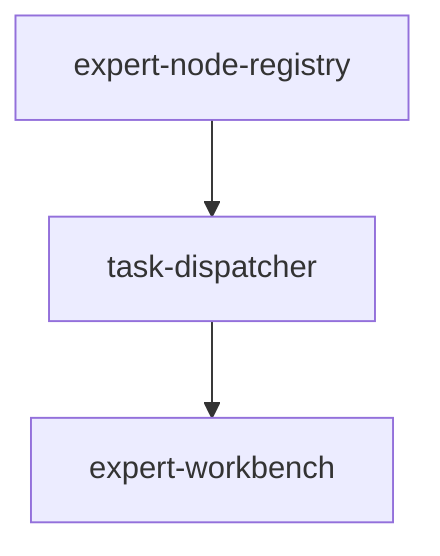
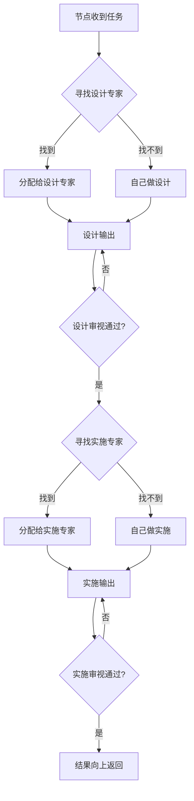

# ETD (Expert Tree Design) - AI执行 × 人类看护

> **Product**: ETD  
> **全称**: Expert Tree Design  
> **状态**: 🔍 discovered (phase 0)  
> **优先级**: P0  
> **类型**: 独立产品  
> **创建日期**: 2026-04-18

## 命名释义

| 字母 | 含义 | 核心特点 |
|------|------|---------|
| **E**xpert | 专家分工 | 专业的事交给专业的 AI/人去做 |
| **T**ree | 树形递归 | 树形递归分配架构 |
| **D**esign | 设计先行 | 所有实施必须先有设计 |

## 概述

ETD 是独立于 SDDU 的团队协作平台。基于树形递归分配架构，AI 执行全流程，人类分领域看护。Solo = 专家节点为空时的特例，Team = 专家节点存在时的常态。

## 目录结构

```
specs-tree-solo-team-flow/              # 当前在 SDDU 仓库中，后续迁移
├── README.md                           # 本文件 - 产品导航
├── discovery.md                        # 需求挖掘报告 v2.2 (phase 0)
├── state.json                          # 产品状态
├── specs-tree-expert-node-registry/    # 子 Feature: 专家节点注册
│   └── state.json
├── specs-tree-task-dispatcher/         # 子 Feature: 任务分配器
│   └── state.json
└── specs-tree-expert-workbench/        # 子 Feature: 专家工作台
    └── state.json
```

## 子 Feature 列表

| 子 Feature | 说明 | 优先级 | 状态 |
|-----------|------|--------|------|
| [expert-node-registry](./specs-tree-expert-node-registry/) | 专家节点注册 - 注册、发现、匹配专家 | P0 | 📝 drafting |
| [task-dispatcher](./specs-tree-task-dispatcher/) | 任务分配器 - 先找专家，找不到才自己做 | P0 | 📝 drafting |
| [expert-workbench](./specs-tree-expert-workbench/) | 专家工作台 - 专家节点的工作界面 | P1 | 📝 drafting |

## 依赖关系



## 核心模型



## 关键能力

- 🧩 专家分工（专业事给专业人/AI）
- 🌳 树形递归分配（先找专家，找不到才自己做）
- 📐 设计先行（设计未完成不允许实施）
- 🤖👁️ 双树并行（AI 执行树 + 人类看护树）
- 🔄 Solo → Team 平滑过渡（引入专家节点即可）

## 与 SDDU 的关系

| | SDDU | ETD |
|---|------|-----|
| 定位 | Solo 开发者工具 | 团队协作平台 |
| 架构 | 线性 6 阶段 | 树形递归分配 |
| 用户 | 独立开发者 | 3-5人小团队 |

## 下一步

👉 创建 ETD 独立代码仓库

## 上级目录

← [返回规范根目录](../README.md)