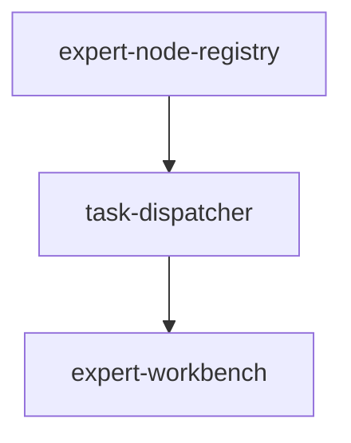
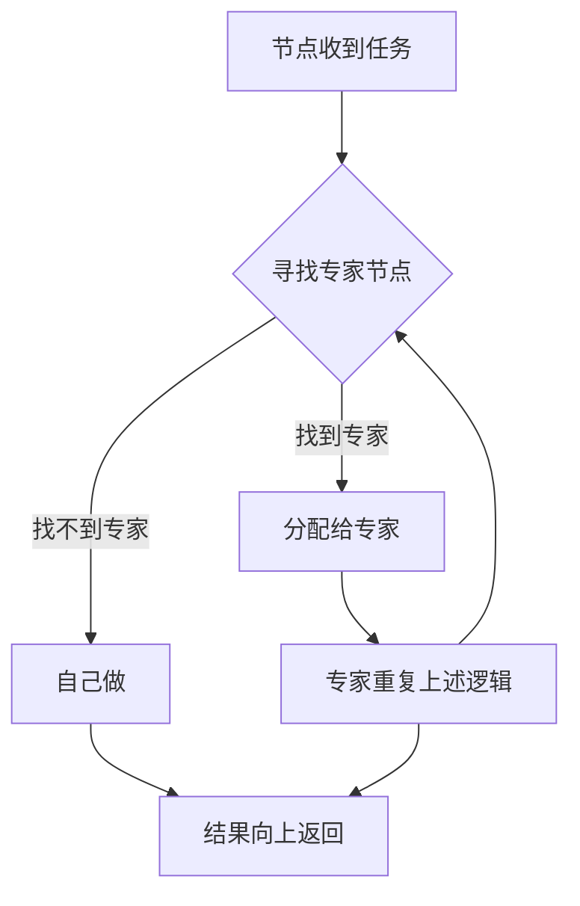

# Solo Team Flow - 专家树协作架构

> **Feature ID**: FR-SOLO-TEAM-FLOW-001  
> **状态**: 🔍 discovered (phase 0/6)  
> **优先级**: P0  
> **类型**: 父 Feature（含 3 个子 Feature）  
> **创建日期**: 2026-04-18

## 概述

构建树形递归分配架构，支撑 AI 执行树 + 人类看护树。核心原则：专业的事交给专业的 AI/人去做。Solo = 专家节点为空时的特例，Team = 专家节点存在时的常态。

## 目录结构

```
specs-tree-solo-team-flow/
├── README.md                              # 本文件 - Feature 导航
├── discovery.md                           # 需求挖掘报告 v2.0 (phase 0)
├── state.json                             # Feature 状态
├── specs-tree-expert-node-registry/       # 子 Feature: 专家节点注册
│   └── state.json
├── specs-tree-task-dispatcher/            # 子 Feature: 任务分配器
│   └── state.json
└── specs-tree-expert-workbench/           # 子 Feature: 专家工作台
    └── state.json
```

## 子 Feature 列表

| 子 Feature | 说明 | 优先级 | 状态 |
|-----------|------|--------|------|
| [expert-node-registry](./specs-tree-expert-node-registry/) | 专家节点注册 - 注册、发现、匹配专家 | P0 | 📝 drafting |
| [task-dispatcher](./specs-tree-task-dispatcher/) | 任务分配器 - 先找专家，找不到才自己做 | P0 | 📝 drafting |
| [expert-workbench](./specs-tree-expert-workbench/) | 专家工作台 - 专家节点的工作界面 | P1 | 📝 drafting |

## 依赖关系



## 核心模型



## 关键能力

- 🌳 树形递归分配（专业事给专业人/AI）
- 🤖 AI 执行树 + 👁️ 人类看护树（双树并行）
- 🧩 专家节点动态注册与发现
- 🔄 Solo → Team 平滑过渡（引入专家节点即可）

## 下一步

👉 运行 `@sddu spec solo-team-flow` 开始规范编写

## 上级目录

← [返回规范根目录](../README.md)