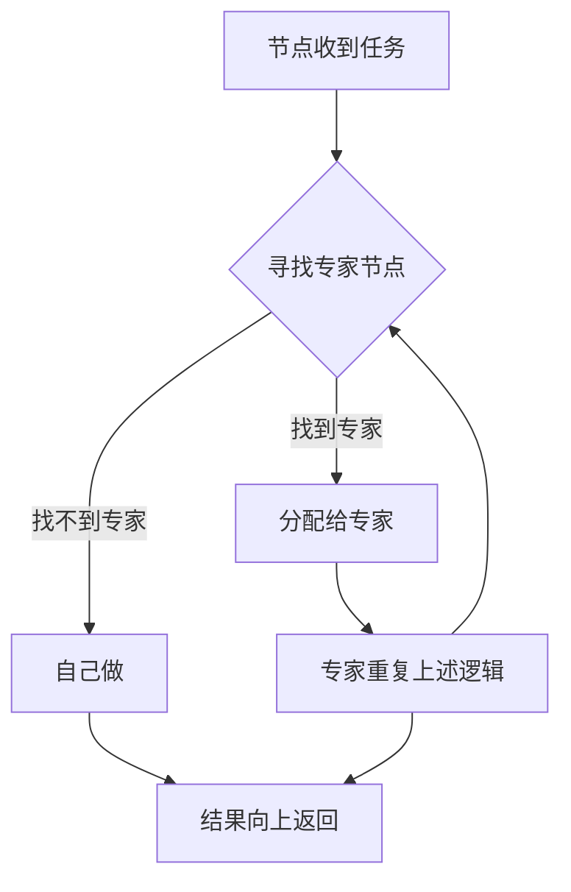
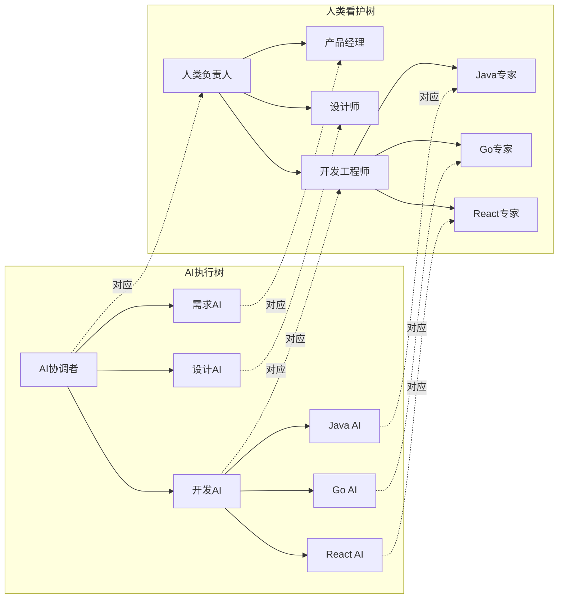
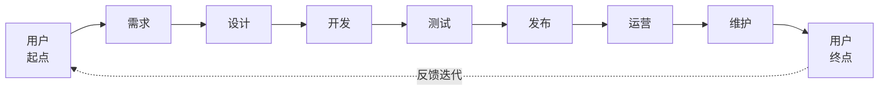
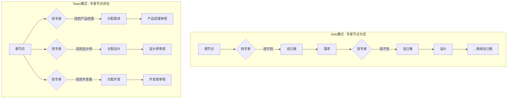
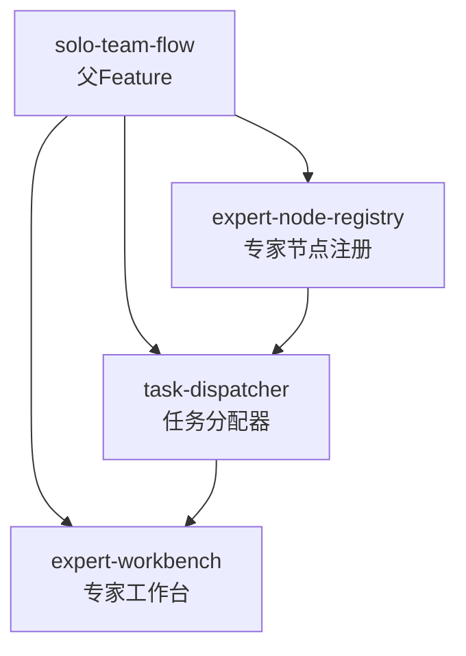

# 需求挖掘报告：专家树协作架构 (Solo Team Flow)

**Feature**: Solo Team Flow  
**版本**: 2.0.0  
**创建日期**: 2026-04-18  
**状态**: discovered  
**优先级**: P0  
**Feature 类型**: 父 Feature（含 3 个子 Feature）

---

## 1. 需求背景

### 为什么需要这个功能

**AI 时代的开发现状：**

AI 能力让一人独立完成产品全生命周期成为可能，SDDU 流程服务于此场景，效率很高。

**核心矛盾：**

| 现状 | 问题 |
|------|------|
| 一人包揽全流程 | 所有阶段自己审视 = 专业度不够 |
| 引入团队成员后 | 无法让专业的人审视专业的事 |
| 当前 SDDU | 缺乏"专家分工看护"机制 |

**本质问题：**

> 不是"模式切换"问题，而是"专家节点分配"问题

### 业务价值

- **专业保障**：每个阶段的 AI 输出都有对应领域的专业人看护
- **效率提升**：专业的事交给专业的人/AI，避免一人全包
- **平滑扩展**：从 Solo 到 Team，只需引入专家节点，无需模式切换
- **质量可控**：AI 执行 + 人类审视，双重保障

### 不做的成本

- 一人审视全流程，专业度不足，质量难以保障
- 团队协作依赖人工协调，效率低下
- AI 输出缺乏专业审视，可能偏离真实预期
- 无法复用团队中各岗位的专业能力

---

## 2. 核心思路

### 树形递归分配模型

**核心原则：**

> 专业的事交给专业的 AI/人去做

**递归逻辑：**

### 双树并行架构

| | AI 执行树 | 人类看护树 |
|---|----------|-----------|
| **职责** | 执行任务 | 审视结果 |
| **原则** | 专业事交给专业 AI | 专业事交给专业人 |
| **根节点** | AI 协调者 | 人类负责人 |
| **专家节点** | 各领域专业 AI Agent | 各领域专业人类角色 |

---

## 3. 产品生命周期 × 专家节点

### 生命周期定义

### 专家节点树形结构

```mermaid
flowchart TD
    ROOT[根节点<br>AI协调者 / 人类负责人] --> REQ[需求专家]
    ROOT --> DES[设计专家]
    ROOT --> DEV[开发专家]
    ROOT --> TEST[测试专家]
    ROOT --> PUB[发布专家]
    ROOT --> OPS[运营专家]
    ROOT --> MNT[维护专家]
    
    REQ --> REQ1[用户研究专家]
    REQ --> REQ2[竞品分析专家]
    REQ --> REQ3[需求文档专家]
    
    DES --> DES1[产品设计专家]
    DES --> DES2[交互设计专家]
    DES --> DES3[视觉设计专家]
    DES --> DES4[架构设计专家]
    DES4 --> DES4A[前端架构专家]
    DES4 --> DES4B[后端架构专家]
    DES4 --> DES4C[数据架构专家]
    
    DEV --> DEV1[前端开发专家]
    DEV --> DEV2[后端开发专家]
    DEV --> DEV3[移动端开发专家]
    DEV --> DEV4[数据库开发专家]
    
    DEV1 --> DEV1A[React专家]
    DEV1 --> DEV1B[Vue专家]
    DEV1 --> DEV1C[小程序专家]
    
    DEV2 --> DEV2A[Java专家]
    DEV2 --> DEV2B[Go专家]
    DEV2 --> DEV2C[Python专家]
    DEV2 --> DEV2D[Node.js专家]
    
    DEV3 --> DEV3A[iOS专家]
    DEV3 --> DEV3B[Android专家]
    
    DEV4 --> DEV4A[MySQL专家]
    DEV4 --> DEV4B[PostgreSQL专家]
    DEV4 --> DEV4C[MongoDB专家]
    
    TEST --> TEST1[功能测试专家]
    TEST --> TEST2[性能测试专家]
    TEST --> TEST3[安全测试专家]
    TEST --> TEST4[自动化测试专家]
    
    PUB --> PUB1[部署专家]
    PUB --> PUB2[监控专家]
    PUB1 --> PUB1A[Docker专家]
    PUB1 --> PUB1B[K8s专家]
    PUB1 --> PUB1C[云平台专家]
    
    OPS --> OPS1[数据分析专家]
    OPS --> OPS2[用户增长专家]
    
    MNT --> MNT1[Bug修复专家]
    MNT --> MNT2[技术债专家]
```

### 生命周期 × AI输出 × 人类审视

| 生命周期 | AI 设计输出 | 人类审视角色 | AI 实施输出 | 人类审视角色 |
|---------|-----------|-------------|-----------|-------------|
| **需求** | 需求文档、用户故事、优先级 | 产品经理 | 用户调研报告、竞品分析 | 用户研究员 |
| **设计** | 产品设计稿、交互稿、架构方案 | 产品设计师、UX设计师、架构师 | 视觉稿、数据模型、原型 | UI设计师、数据库设计师 |
| **开发** | 技术方案、代码架构 | 技术负责人 | 代码、接口实现、数据库脚本 | 前端工程师、后端工程师 |
| **测试** | 测试用例、测试方案 | 测试负责人 | 测试报告、缺陷报告 | 测试工程师 |
| **发布** | 发布方案、回滚预案 | 发布负责人 | 部署结果、监控配置 | 运维工程师、SRE |
| **运营** | 运营策略、增长方案 | 运营负责人 | 数据分析报告、用户反馈报告 | 数据分析师 |
| **维护** | 维护计划、优先级排序 | 技术负责人 | Bug修复代码、技术债处理结果 | 开发工程师 |

---

## 4. Solo vs Team 的本质

### 对比

| | Solo | Team |
|---|------|------|
| **定义** | 根节点找不到下级专家 → 自己做/看全流程 | 根节点找到下级专家 → 分配给专家 |
| **差异** | 专家节点为空 | 专家节点存在 |
| **过渡** | 不是模式切换，而是引入专家节点 |

**一句话定义：**

> Solo = 专家节点为空时的特例  
> Team = 专家节点存在时的常态

---

## 5. Feature 结构设计

### 父 Feature: solo-team-flow

**职责**: 构建树形递归分配架构，支撑 AI 执行树 + 人类看护树

### 子 Feature 结构

### 子 Feature 1: expert-node-registry（专家节点注册）

**Feature ID**: FR-EXPERT-REGISTRY-001  
**职责**: 管理专家节点的注册、发现、匹配  

**关键能力**:

- 专家节点注册（AI Agent / 人类角色）
- 按生命周期 × 技术栈 × 细分领域匹配专家
- 专家节点层级管理（L0/L1/L2/L3）
- 专家能力声明与认证

### 子 Feature 2: task-dispatcher（任务分配器）

**Feature ID**: FR-TASK-DISPATCHER-001  
**职责**: 实现"先找专家，找不到才自己做"的递归分配逻辑  

**关键能力**:

- 任务解析与专家匹配
- 递归向下分配
- 结果向上汇聚
- 支持 AI 执行树 + 人类看护树双树

### 子 Feature 3: expert-workbench（专家工作台）

**Feature ID**: FR-EXPERT-WORKBENCH-001  
**职责**: 每个专家节点的工作界面  

**关键能力**:

- 接收分配的任务
- 继续向下找专家 / 自己处理
- 提交结果
- CLI + Web 界面

---

## 6. 用户价值

| 角色 | 价值 |
|------|------|
| **Solo 开发者** | 一人搞定全流程，未来可平滑引入专家节点 |
| **Team 负责人** | 任务自动分配给对应专家，无需人工协调 |
| **专业角色（产品/设计/开发/测试...）** | 只看护自己专业领域的 AI 输出 |
| **产品** | 每个阶段都有专业人看护，质量有保障 |

---

## 7. 技术方向

- **树形架构**：基于递归分配的专家节点树
- **双树并行**：AI 执行树 + 人类看护树，节点一一对应
- **专家注册**：动态注册专业 AI Agent 和人类角色
- **CLI + Web**：专家工作台支持双通道

---

## 8. 风险与限制

| 风险 | 等级 | 缓解措施 |
|------|------|---------|
| 专家节点匹配精度不足 | 🔴 高 | 建立专家能力声明体系，支持人工干预 |
| 树形结构层级过深 | 🟡 中 | 限制最大层级（如 ≤5），提供扁平化视图 |
| AI 执行树与人类看护树同步 | 🟡 中 | 节点一一对应，状态实时同步 |
| 专家节点动态变更 | 🟡 中 | 支持热注册/注销，缓存失效机制 |
| 向后兼容性 | 🟢 低 | 新架构不影响现有 Solo 开发者使用 |

---

## 9. 待澄清问题

1. **专家节点认证机制**：如何验证人类专家的专业能力？
2. **AI Agent 专家细分**：是否需要为每个技术栈都创建独立 AI Agent？
3. **专家节点发现优先级**：多个专家匹配时如何选择？
4. **任务拆分粒度**：任务在哪个层级拆分？根节点还是专家节点？
5. **外部系统集成**：是否与 GitHub/GitLab 等平台集成？

---

## 10. 下一步建议

### 推荐流程

1. ✅ 需求挖掘完成（当前阶段）
2. 👉 运行 `@sddu spec solo-team-flow` 为父 Feature 编写规范
3. 👉 逐个为子 Feature 编写规范（优先 expert-node-registry）
4. 👉 制定技术规划和任务分解

### 规范编写重点关注

- 专家节点注册与发现的数据模型
- 递归分配算法设计
- AI 执行树与人类看护树的同步机制
- 专家工作台 CLI + Web 界面设计

---

**需求挖掘完成时间**: 2026-04-18  
**需求挖掘状态**: discovered  
**下一步**: 运行 `@sddu spec solo-team-flow` 开始规范编写