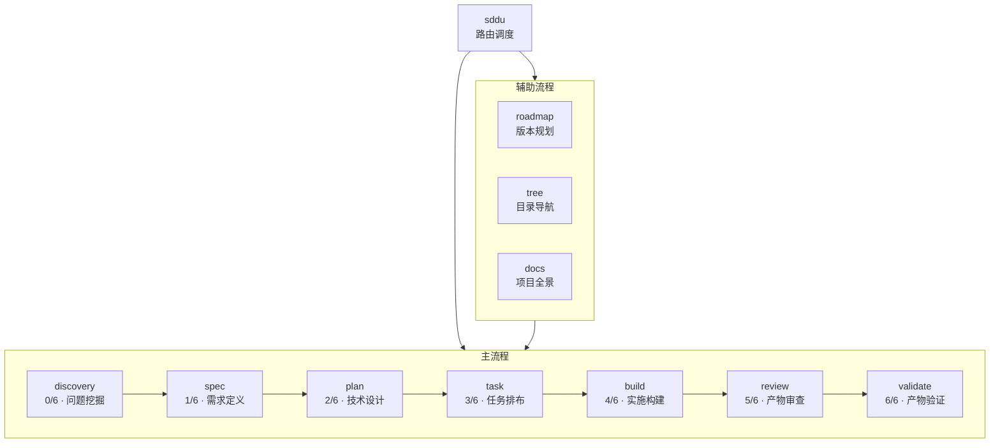

# Feature Specification：预置输出模板质量统一

> **spec 边界**：本文档定义三件事——**目标**（要达成什么）、**需求**（要做哪些事、做成什么样）、**验收标准**（怎样算做完）。核心评判：这件事是不是业务需求——是就写，不是就不写。

## 1. 元数据

| 字段 | 值 |
|------|-----|
| Feature ID | FR-TPL-001 |
| 名称 | 预置输出模板质量统一 |
| 目标版本 | v3.0.1 |
| 优先级 | P1 |
| 创建日期 | 2026-06-13 |
| 作者 | SDDU Team |
| 类型 | 技术债务清理 / 质量改进 |
| 前置依赖 | FR-TEMPLATE-001 (Agent 输出模板化系统) — 已完成 |

---

## 2. 上下文

本 Feature 源于 discovery 识别的两大问题：① 17 个模板文件在 10 个维度格式不一致；② 11 个 Agent 角色定位缺少显式边界声明，存在 7 处职责冲突。

目标用户是 SDDU 插件维护者和最终用户。前置依赖 FR-TEMPLATE-001（模板基础设施）已完成。

---

## 3. 目标

### 模板范围

本次涉及 2 类共 17 个模板文件：

| 类别 | 数量 | 文件 |
|------|:--:|------|
| Agent 指令模板 | 11 | `src/templates/agents/sddu-*.md.hbs` |
| 输出模板 | 6 | `src/templates/agents/output/sddu-*.md.hbs` |

### 整体目标

| G# | 目标 | 对应 discovery |
|----|------|:--:|
| G1 | **有章可循** — 新增或修改模板时有明确规范可参考 | Q1-Q10 |
| G2 | **体验一致** — 打开任意模板结构可预期，切换 Agent 输出格式不突变 | Q1, Q2, Q7, Q10 |
| G3 | **边界分明** — 每个 Agent 清楚自己负责什么不负责什么，Agent 不越界不推诿 | Q11 |
| G4 | **无回归** — 变更后已有功能不受影响 | — |

### Non-Goals

| NG# | 不做 |
|-----|------|
| NG1 | 不改变 Agent 的行为逻辑 |
| NG2 | 不做模板校验工具 |
| NG3 | 不做多套模板风格 |
| NG4 | 不做模板版本管理系统 |

---

## 4. 用户故事

| # | 作为… | 我想要… | 以便… |
|---|-------|---------|-------|
| US1 | 模板维护者 | 打开任意 Agent 模板，第一眼就能定位到对应章节 | 不需要先猜格式，修改效率提升 |
| US2 | 模板维护者 | 新增模板时有明确格式规范可参考 | 不再引入新的一致性问题 |
| US3 | SDDU 用户 | 切换使用不同 Agent 时，输出格式保持一致 | 阅读流畅度不被格式突变打断 |
| US4 | SDDU 用户 | 清楚知道每个 Agent 负责什么、不负责什么 | 不会在两个 Agent 之间犹豫该 @ 谁 |
| US5 | LLM（Agent 执行者） | Agent 指令中的职责边界明确 | 执行时不越界、不推诿 |

---

## 5. 功能需求



### 5.1 Agent 职责边界

| FR# | 变更 | 需求 | 对应 G | 验收标准 |
|-----|:--:|------|:------:|----------|
| FR-001 | ✏️ | **discovery**（0/6 · 问题挖掘）<br>负责：挖掘问题 → 输入：用户原始想法/诉求 → 输出：问题清单<br>不负责：不定义需求，不输出需求规范/技术方案 | G3 | 模板含上述声明 |
| FR-002 | ✏️ | **spec**（1/6 · 需求定义）<br>负责：定义需求 → 输入：问题清单 → 输出：需求规范<br>不负责：不技术设计，不输出技术方案/实施产物 | G3 | 模板含上述声明 |
| FR-003 | ✏️ | **plan**（2/6 · 技术设计）<br>负责：技术设计 → 输入：需求规范 → 输出：技术方案<br>不负责：不任务排布，不输出原子任务/实施产物 | G3 | 模板含上述声明 |
| FR-004 | ✏️ | **task**（3/6 · 任务排布）<br>负责：任务排布 → 输入：技术方案 → 输出：原子任务<br>不负责：不实施构建，不输出实施产物 | G3 | 模板含上述声明 |
| FR-005 | ✏️ | **build**（4/6 · 实施构建）<br>负责：实施构建 → 输入：原子任务 → 输出：实施产物<br>不负责：不审查不验证，不输出审查/验证报告 | G3 | 模板含上述声明 |
| FR-006 | ✏️ | **review**（5/6 · 产物审查）<br>负责：产物审查 → 输入：实施产物+规范 → 输出：审查报告<br>不负责：不产物验证不设计实施，不输出验证报告 | G3 | 模板含上述声明 |
| FR-007 | ✏️ | **validate**（6/6 · 产物验证）<br>负责：产物验证 → 输入：实施产物+规范 → 输出：验证报告<br>不负责：不产物审查不设计实施，不输出审查报告 | G3 | 模板含上述声明 |
| FR-008 | ✏️ | **roadmap**（独立 · 版本规划）<br>负责：版本规划 → 输入：用户零散想法 → 输出：特性清单+版本路线图<br>不负责：不目录导航，不输出目录树 | G3 | 模板含上述声明 |
| FR-009 | ✏️ | **tree**（触发 · 目录导航）更名为 tree（原 docs）<br>负责：目录导航 → 输入：任意目录 → 输出：目录树<br>不负责：不版本规划，不输出版本路线图 | G3 | 模板含上述声明 |
| FR-010 | 🆕 | **docs**（触发 · 项目全景）新增<br>负责：生成项目全景 → 输入：代码、配置、数据库Schema等实际产物 → 输出：①实际业务设计（模块、功能、API、页面、数据表、业务对象及关联）②实际技术设计（架构、技术栈、部署、关键实现）<br>不负责：不依赖过程性文档，不版本规划，不目录导航 | G3 | 模板含上述声明 |
| FR-011 | ✏️ | **sddu**（入口 · 路由建议/调度）<br>负责：路由建议或路由调度 → 输入：用户意图 → 输出：路由建议或路由调度<br>不负责：不做具体设计实施 | G3 | 模板含上述声明 |
| FR-012 | ❌ | 移除 **sddu-help** Agent，其功能由 sddu 和各 Agent 自身承担 | G3 | sddu-help 模板移除或归档 |

### 5.2 Agent 定义模板

| FR# | 需求 | 对应 G | 验收标准 |
|-----|------|:------:|----------|
| FR-013 | **骨架**：统一章节骨架，顺序为：角色定位 → 执行顺序 → 依赖关系 → 前置验证 → 工作流程 → 输出模板 → 规则 → 异常处理 → 示例对话 → 版本信息。同功能章节统一命名。不适用于某 Agent 的章节可标注"不适用"或省略内容，但骨架位置保留 | G1, G2 | 章节序列一致 |
| FR-014 | **标题**：标题格式统一。基准格式：`# 🎯 SDDU [角色名称]`。对主流程 Agent 保留 `阶段 X/6` 后缀 | G1, G2 | 逐文件检查首行标题一致 |
| FR-015 | **依赖关系节**：统一使用四字段格式：`- **前置条件**:`、`- **输入**:`、`- **输出**:`、`- **下游**:` | G1, G2 | 逐节检查四字段存在 |
| FR-016 | **异常处理表格**：统一使用 `| 场景 | 处理方式 |` 两列格式，所有 Agent 包含该表格 | G1, G2 | 逐 Agent 检查表格存在且列数一致 |
| FR-017 | **版本信息**：模板末尾包含 `## 📝 版本信息` 节 | G1 | 逐文件检查版本信息节存在 |
| FR-018 | **代码块**：所有代码块统一使用 3 反引号（```） | G1, G2 | 无 4 反引号代码块 |
| FR-019 | **缩进**：sddu-review 和 sddu-validate 缩进对齐 | G1, G2 | 缩进一致 |

### 5.3 Agent 产物模板

| FR# | 需求 | 对应 G | 验收标准 |
|-----|------|:------:|----------|
| FR-020 | **自动触发块**：「自动触发文档更新」块统一为独立 `### 自动触发文档更新` 小节 | G1, G2 | 逐文件检查该小节独立存在 |
| FR-021 | **双节结构**：统一为「输出格式」+「完成报告」双节结构 | G1, G2 | 逐文件检查双节存在 |

---

## 6. 非功能需求

| NFR# | 类别 | 需求 |
|------|------|------|
| NFR-001 | 可维护性 | 变更后模板格式一致，新增模板时有章可循 |
| NFR-002 | 向后兼容 | 所有 `<<变量名>>` 保持不变，已有模板渲染逻辑不受影响 |
| NFR-003 | 无回归 | 变更后已有功能不受影响 |

---

## 7. 技术设计

### 影响范围

| 类别 | 文件 | 说明 |
|------|------|------|
| Agent 指令模板 | `src/templates/agents/sddu-*.md.hbs`（10 个） | 标题、章节、缩进、代码块、版本信息、角色边界 |
| 输出模板 | `src/templates/agents/output/sddu-*.md.hbs`（6 个） | 章节结构统一、自动触发块位置 |
| 新增文件 | `src/templates/VARIABLES.md` | 变量命名规范 |

### 不变内容

- 所有 `<<变量名>>` 占位符
- 各 Agent 的工作流程内容

---

## 8. 边界情况

| EC# | 场景 | 处理方式 |
|-----|------|----------|
| EC-001 | 模板中存在内容相同但章节名不同的节（如 `约束条件` vs `规则`） | 统一为 `规则`，保留原内容 |
| EC-002 | sddu-discovery 输出模板的双节结构在统一后如何与其他 5 个对齐 | 目标状态下 6 个输出模板均包含「输出格式」+「完成报告」双节 |
| EC-003 | 角色边界声明写入后，AI 可能因"不负责"声明而拒绝执行合理的跨边界任务 | 边界声明使用"主责"而非"唯一/禁止"措辞；允许协作但明确主责归属 |
| EC-004 | 辅助 Agent 的"输出模板"节内容与主流程 Agent 不同 | 声明其输出为内置固定格式，不走用户自定义模板覆盖路径 |

---

## 9. 开放问题

| # | 问题 | 状态 |
|---|------|:--:|
| OQ-001 | VARIABLES.md 是否需要包含模板编写 checklist | 待决策 |

---

## ✅ 规范编写完成

**Feature**: 预置输出模板质量统一  
**Feature ID**: FR-TPL-001  
**阶段**: specified  
**状态**: tracked  
**文件**: `.sddu/specs-tree-root/specs-tree-template-quality-unification/spec.md`
