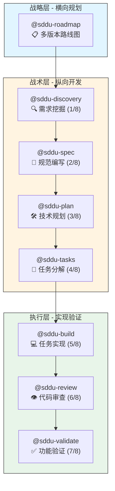
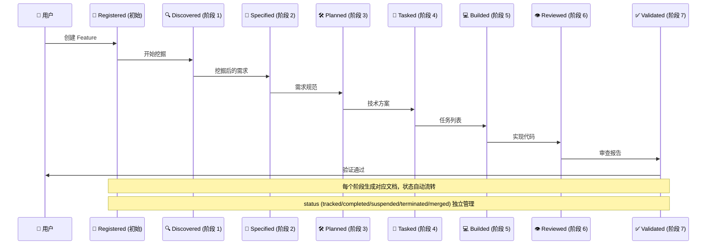
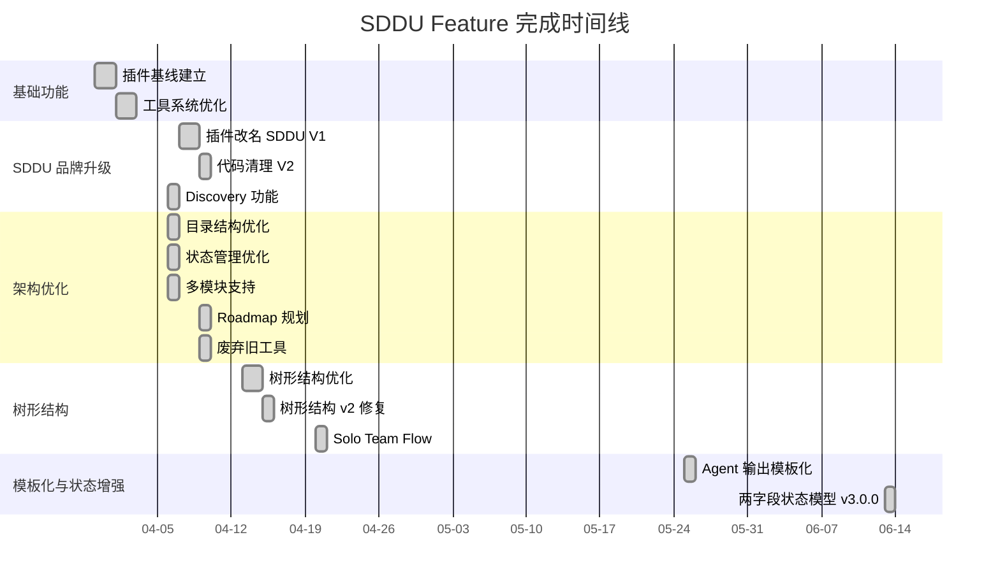
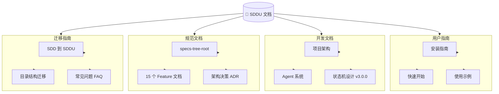

# OpenCode SDDU Plugin

[](https://github.com/THZSummer/sddu/releases)
[](https://github.com/THZSummer/sddu)
[](https://github.com/THZSummer/sddu)
[](https://github.com/THZSummer/sddu/blob/main/LICENSE)

规范驱动开发终极版 (Specification-Driven Development Ultimate) 插件，为 OpenCode 提供结构化的 8 阶段工作流 + 需求挖掘阶段。

## 📁 项目结构

```
opencode-sddu-plugin/
├── src/                        # 源码目录
│   ├── index.ts                # 插件入口
│   ├── types.ts                # 统一类型导出
│   ├── errors.ts               # 统一错误处理
│   ├── agents/                 # Agent 注册
│   │   ├── registry.ts         # Agent 注册表
│   │   ├── sdd-agents.ts       # SDD 兼容 Agent 注册逻辑
│   │   └── sddu-agents.ts      # SDDU Agent 注册逻辑
│   ├── commands/               # 命令定义
│   ├── state/                  # 状态机
│   ├── discovery/              # 发现阶段实现
│   ├── utils/                  # 工具函数
│   │   ├── index.ts            # 统一导出
│   │   ├── tasks-parser.ts
│   │   ├── subfeature-manager.ts
│   │   ├── readme-generator.ts
│   │   └── dependency-notifier.ts
│   └── templates/              # 模板文件
│       └── agents/             # Agent prompt 模板
│
├── scripts/                    # 工具脚本
│   ├── package.cjs             # 打包脚本
│   ├── check-sdd-residue.sh    # SDD 残留检查
│   └── e2e/                    # E2E 测试脚本
│       ├── basic/              # 基础版 (TypeScript + Node.js)
│       └── fullstack/          # 全栈版 (SpringBoot + React + Docker)
│
├── dist/                       # 构建产物
│   ├── sddu/                   # 完整插件包
│   │   ├── src/
│   │   ├── agents/
│   │   ├── ...
│   │   └── package.json
│   └── sddu.zip                # 压缩包
│
├── .sddu/                      # SDDU 工作空间
│   ├── README.md
│   ├── ROADMAP.md              # Roadmap v4.1.0
│   ├── docs/
│   │   └── guide.md
│   └── specs-tree-root/        # 规范目录
│       ├── README.md           # 目录导航
│       ├── state.json          # 全局状态
│       ├── specs-tree-sddu-status-enhancement/
│       │   ├── spec.md
│       │   ├── plan.md
│       │   ├── tasks.md
│       │   ├── review.md
│       │   ├── validation.md
│       │   └── state.json
│       └── ...                 # 其他 14 个 Feature
│
├── tests/                      # 测试目录
│   ├── README.md               # 测试说明文档
│   ├── unit/                   # 单元测试
│   ├── state/                  # 集成测试
│   ├── e2e/                    # E2E 测试
│   └── compatibility/          # 兼容性测试
│
├── install.sh                  # 安装脚本 (Linux/macOS)
├── install.ps1                 # 安装脚本 (Windows)
├── package.json
├── tsconfig.json
└── ...
```

**目录说明：**
| 目录 | 用途 | 是否提交 |
|------|------|----------|
| `src/` | 源码 | ✅ 是 |
| `dist/` | 构建产物 | ✅ 是 |
| `.sddu/` | SDDU 工作空间容器 | ✅ 是 |
| `.sddu/specs-tree-root/` | 规范文件目录 | ✅ 是 |
| `.opencode/` | 本地安装测试 | ❌ 否 |

## 🚀 安装

### 一行安装（无需克隆仓库）

> 需要: git, node, npm。脚本会自动拉取最新 SDDU 源码、构建并安装，完成后清理临时文件。

**Linux/macOS:**
```bash
# 直连
curl -fsSL https://raw.githubusercontent.com/THZSummer/sddu/main/bootstrap.sh | bash -s -- ./my-project

# 或通过镜像
curl -fsSL https://gh-proxy.com/https://raw.githubusercontent.com/THZSummer/sddu/main/bootstrap.sh | bash -s -- ./my-project --proxy https://gh-proxy.com/
```

**Windows (PowerShell):**
```powershell
# 直连
powershell -c "iwr https://raw.githubusercontent.com/THZSummer/sddu/main/bootstrap.ps1 | iex; Install-Sddu ./my-project"

# 或通过镜像
powershell -c "iwr https://gh-proxy.com/https://raw.githubusercontent.com/THZSummer/sddu/main/bootstrap.ps1 | iex; Install-Sddu ./my-project -ProxyUrl https://gh-proxy.com/"
```

### 本地安装（已克隆仓库）

**Linux/macOS:**
```bash
bash install.sh ./my-project
```

**Windows:**
```powershell
powershell -ExecutionPolicy Bypass -File install.ps1 ./my-project
```

### 手动构建 + 安装

```bash
npm install
npm run build
npm run package
bash install.sh ./my-project
```

## 🏗️ 项目架构

```mermaid
graph LR
    subgraph Core[核心层]
        C1["src/index.ts\n插件入口"]
        C2["src/types.ts\n类型定义"]
        C3["src/errors.ts\n错误处理"]
    end

    subgraph Agents[Agent 层]
        A1["src/agents/\n动态注册表"]
        A2["src/templates/agents/\nPrompt 模板"]
    end

    subgraph Commands[命令层]
        CM1["src/commands/\nCLI 命令"]
        CM2["src/discovery/\n发现阶段"]
    end

    subgraph State[状态层]
        S1["src/state/\n状态机 v3.0.0\nphase + status 两字段模型"]
        S2["src/state/\n管理器"]
    end

    subgraph Utils[工具层]
        U1["src/utils/\n任务解析"]
        U2["src/utils/\n子 Feature 管理"]
        U3["src/utils/\nREADME 生成"]
        U4["src/utils/\n依赖通知"]
    end

    Core --> Agents
    Agents --> Commands
    Commands --> State
    State --> Utils

    style Core fill:#ffe0e0
    style Agents fill:#e0ffe0
    style Commands fill:#e0e0ff
    style State fill:#ffffe0
    style Utils fill:#ffe0ff
```



## 🎯 使用方法

### 核心功能
- ✅ v3.0.0 两字段状态模型: `phase` (8 阶段) + `status` (5 状态)
- ✅ `@sddu 标记` 命令 — 结构化 + 自然语言标记 Feature 状态
- ✅ `@sddu 状态` 6 区分类仪表盘
- ✅ R5 一致性检测 — 7 项自动检测 + 修复
- ✅ 子随父归 — 非 tracked 特性归入父节点显示
- ✅ 统一类型导出 (`src/types.ts`)
- ✅ 统一错误处理体系 (`src/errors.ts`)
- ✅ 工具函数统一导出 (`src/utils/index.ts`)
- ✅ Agent 动态注册表 (`src/agents/registry.ts`)
- ✅ 8 个阶段 Agent 使用 `mode: all` 支持双模式
- ✅ Agent 输出模板化系统 — 内置 7 个输出模板，支持用户自定义覆盖
- ✅ Discovery 可选状态联动
- ✅ 安装脚本适配 `dist/sddu/` 结构

### Agent 列表

#### 智能入口
- @sddu — SDDU Master Coordinator — 智能路由助手
- @sddu-help — SDDU Help Assistant — 使用指南

#### 8 阶段标准版 (mode: all 双模式支持)
- @sddu-discovery — SDDU 需求挖掘专家 (阶段 1/8)
- @sddu-spec — SDDU 规范编写专家 (阶段 2/8)
- @sddu-plan — SDDU 技术规划专家 (阶段 3/8)
- @sddu-tasks — SDDU 任务分解专家 (阶段 4/8)
- @sddu-build — SDDU 任务实现专家 (阶段 5/8)
- @sddu-review — SDDU 代码审查专家 (阶段 6/8)
- @sddu-validate — SDDU 验证专家 (阶段 7/8)

#### 特殊功能
- @sddu-roadmap — SDDU Roadmap 规划专家 — 多版本路线图规划
- @sddu-docs — SDDU 目录导航生成器 — 扫描目录结构生成 README 导航

**总计：11 个 Agent** (mode: all 支持双模式)

使用 `@sddu` 作为统一入口，自动根据当前状态路由到正确阶段：

```bash
@sddu 开始 用户登录功能
@sddu 继续
@sddu 状态
@sddu 标记 phase=discovered status=completed
```

### 核心工作流 Agent（阶段性执行）

直接调用特定阶段 Agent：
```bash
@sddu-discovery "用户需要登录和注册功能"    # 需求挖掘 (阶段 1)
@sddu-spec "基于需求完善技术规范"            # 技术规范 (阶段 2)
@sddu-plan "制定实现计划"                   # 技术规划 (阶段 3)
@sddu-tasks "拆解为具体任务"                # 任务分解 (阶段 4)
@sddu-build "实现代码"                      # 任务实现 (阶段 5)
@sddu-review "代码审查"                     # 代码审查 (阶段 6)
@sddu-validate "验证功能"                   # 功能验证 (阶段 7)
```

### 规划辅助 Agent（整体规划支持）

提供跨版本、跨功能的整体规划支持：

```bash
@sddu-roadmap "为整个项目创建 roadmap 规划"
@sddu-roadmap "Q2 上线，2 个人，做什么功能好"
@sddu-roadmap "基于现有 spec 规划版本"
```

`sddu-roadmap` Agent 支持:
- **多版本规划**: 创建包含多个迭代版本的详细路线图
- **功能优先级排序**: 使用 RICE 模型 (Reach, Impact, Confidence, Effort) 评估功能优先级
- **依赖关系分析**: 识别功能开发的依赖关系，优化开发顺序
- **时间表规划**: 基于资源和复杂度预测版本发布周期
- **智能 Feature 整理**: 从用户零散输入中提取和推荐相关功能

## 📚 SDDU 使用指南

完整使用文档请参考 `.sddu/` 目录下的相关文档。

#### 📊 完整 Agent 关系图



#### 📋 Agent 对比表

| Agent | 层次 | 阶段 | 输入 | 输出 | 必需 |
|-------|------|:----:|------|------|:----:|
| `@sddu-roadmap` | 战略层 | — | 零散想法/约束 | 多版本 Roadmap | ❌ 可选 |
| `@sddu-discovery` | 认知层 | 1/8 | 用户初步想法 | discovery.md | ⚠️ 推荐 |
| `@sddu-spec` | 战术层 | 2/8 | 用户需求 | spec.md | ✅ 必需 |
| `@sddu-plan` | 战术层 | 3/8 | spec.md | plan.md | ✅ 必需 |
| `@sddu-tasks` | 战术层 | 4/8 | plan.md | tasks.md | ✅ 必需 |
| `@sddu-build` | 执行层 | 5/8 | tasks.md | 源代码 | ✅ 必需 |
| `@sddu-review` | 执行层 | 6/8 | 代码 | 审查报告 | ✅ 必需 |
| `@sddu-validate` | 执行层 | 7/8 | 审查报告 | 验证结果 | ✅ 必需 |

## 🔄 8 阶段工作流

SDDU 实现从需求到验证的完整 8 阶段工作流 (v3.0.0 两字段模型)：



**阶段说明**:

| 阶段 | Phase 值 | Agent | 输入 | 输出 | 文档 |
|------|----------|-------|------|------|------|
| 初始 | registered | (系统) | 用户想法 | 注册记录 | — |
| 1 | discovered | @sddu-discovery | 用户初步想法 | 挖掘后的需求 | discovery.md |
| 2 | specified | @sddu-spec | 需求文档 | 技术规范 | spec.md |
| 3 | planned | @sddu-plan | 需求规范 | 技术方案 | plan.md |
| 4 | tasked | @sddu-tasks | 技术方案 | 任务列表 | tasks.md |
| 5 | builded | @sddu-build | 任务列表 | 源代码 | build.md |
| 6 | reviewed | @sddu-review | 代码 | 审查报告 | review.md |
| 7 | validated | @sddu-validate | 审查报告 | 验证结果 | validation.md |

## ⚡ 快速开始

### 1. 安装插件
```bash
# 克隆项目
git clone https://github.com/THZSummer/sddu.git
cd sddu

# 构建和打包
npm install
npm run build
npm run package

# 安装到你的项目
bash install.sh /path/to/your/project
```

### 2. 开始第一个 Feature
```bash
cd /path/to/your/project
opencode

# 使用新版智能入口 (唯一推荐)
@sddu 开始 用户登录功能

# 或分阶段执行
@sddu-discovery "用户需要快捷登录"
@sddu-spec "用户登录"
@sddu-plan "用户登录"
@sddu-tasks "用户登录"
@sddu-build "实现 TASK-001"
```

## ✅ 已完成 Feature (15 个)



### v3.0.0 亮点 — specs-tree-sddu-status-enhancement

- **两字段状态模型**: `phase` (8 值: registered → validated) + `status` (5 值: tracked/completed/suspended/terminated/merged) 分离
- **`@sddu 标记` 命令**: 支持结构化参数和自然语言两种方式标记 Feature 状态
- **`@sddu 状态` 仪表盘**: 6 区分类视图 (总览 / 按 phase / 按 status / 待处理 / 异常 / 近期变更)
- **R5 一致性检测**: 7 项自动检测 (phase↔文件、status↔phase、parent-child 一致性等) + 自动修复建议
- **子随父归**: 非 tracked 状态的子 Feature 在父节点下聚合显示
- **Phase 单向推进**: 拒绝回退和跳跃，确保工作流线性

### Feature 完整列表

| # | Feature 目录 | 说明 |
|:--|------|------|
| 1 | specs-tree-sdd-plugin-baseline | 插件基线建立 |
| 2 | specs-tree-sdd-tools-optimization | 工具系统优化 |
| 3 | specs-tree-plugin-rename-sddu | 插件改名 SDDU V1 |
| 4 | specs-tree-plugin-rename-sddu-v2 | 插件改名 SDDU V2 (代码清理) |
| 5 | specs-tree-sdd-discovery-feature | Discovery 需求挖掘功能 |
| 6 | specs-tree-directory-optimization | 目录结构优化 |
| 7 | specs-tree-sdd-workflow-state-optimization | 工作流状态优化 |
| 8 | specs-tree-sdd-multi-module | 子 Feature 并行开发支持 |
| 9 | specs-tree-sdd-plugin-roadmap | Roadmap 规划专家 |
| 10 | specs-tree-deprecate-sdd-tools | 废弃旧工具 |
| 11 | specs-tree-tree-structure-optimization | 树形结构优化 |
| 12 | specs-tree-tree-structure-optimization-v2 | 树形结构优化 v2 (问题修复) |
| 13 | specs-tree-agent-output-templating | Agent 输出模板化系统 |
| 14 | specs-tree-sddu-status-enhancement | 两字段状态模型 v3.0.0 |
| 15 | specs-tree-solo-team-flow | Solo Team Flow |

## 🔨 开发命令

```bash
# 安装依赖
npm install

# 构建（agent + TypeScript）
npm run build

# 打包（生成 dist/sddu/ 和 dist/sddu.zip）
npm run package

# 打包后自动清理冗余文件，保留新版包：
# - dist/sddu/ (新版插件包)
# - dist/sddu.zip (新版压缩包)
npm run build:agents

# 监听 TypeScript 编译
npm run dev

# 清理构建产物
npm run clean

# 本地测试
npm run test
```

## 🧪 测试

### E2E 测试脚本

SDDU 提供两套 E2E 测试脚本，覆盖不同项目类型：

| 脚本 | 路径 | 适用场景 |
|------|------|----------|
| 基础版 | `scripts/e2e/basic/sddu-e2e.sh` | TypeScript + Node.js 项目，零外部依赖 |
| 全栈版 | `scripts/e2e/fullstack/sddu-e2e-fullstack.sh` | SpringBoot + React 前后端分离项目，含 Docker |

```bash
# 运行基础 E2E 测试
bash scripts/e2e/basic/sddu-e2e.sh

# 运行全栈 E2E 测试
bash scripts/e2e/fullstack/sddu-e2e-fullstack.sh
```

### 单元与集成测试

```bash
# 运行所有测试
npm test

# 运行特定测试
npm test -- --testPathPattern=tests/unit
npm test -- --testPathPattern=tests/e2e

# 状态机集成测试
npm run test:state:integration
```

测试目录结构详见 [tests/README.md](tests/README.md)

## 🧹 SDD 残留检查

V2 版本提供了自动化检查工具，用于验证代码中是否还有 SDD 残留：

```bash
# 运行 SDD 残留检查脚本
./scripts/check-sdd-residue.sh

# 输出示例：
# ======================================
# SDD 残留检查工具 v1.0
# ======================================
#
# 扫描范围：src/
# 排除：sddu- (正确的 SDDU 引用)
#
# 📋 扫描模板文件中的 @sdd- 引用...
#   ✅ 无残留
#
# ... (其他类别扫描)
#
# ======================================
# 📊 检查报告总结
# ======================================
#
# 扫描文件总数：52
# 发现残留总数：0
# 残留率：0.00%
#
# ✅ 通过！无 SDD 残留
```

**检查类别**:
- 模板文件中的 `@sdd-` 引用
- 源码注释中的 "SDD" 字眼
- 类型定义中的 `Sdd*` 命名
- 所有 `sdd-` 引用（排除 `sddu-`）
- 测试文件中的 `Sdd*` 命名
- 向后兼容代码（backward compatibility、legacy、deprecated）

**通过标准**: 残留率 ≤ 2%

## 📋 版本历史

| 版本 | 日期 | 说明 |
|------|------|------|
| v1.4.1 | 2026-06-13 | 🔄 v3.0.0 两字段状态模型 — phase(8) + status(5) 分离，`@sddu 标记`/`状态` 命令，R5 一致性检测 |
| v1.4.0 | 2026-04-20 | 🎯 SDDU 品牌升级正式发布 — 插件改名 + 双版本命令兼容 |
| v1.3.0 | 2026-05-25 | 🎨 Agent 输出模板化 — 7 个 Agent 输出固化为可自定义模板，用户自定义覆盖机制 |
| v1.2.0 | 2026-04-12 | 🔄 mode: all 双模式支持 + 移除序号别名简化配置 |
| v1.1.0 | 2026-04-06 | ⚡ SDDU 专业版 - 全新命令行界面 + 优化工作流 |
| v1.0.0 | 2026-04-05 | ✅ SDD 工具系统基础版 - 统一导出层 + Agent 注册表 + 打包优化 |

## 📋 路线图

详见 [.sddu/ROADMAP.md](.sddu/ROADMAP.md) (v4.1.0)：

| 版本 | 主题 | 状态 |
|------|------|:----:|
| v3.0.0 | 质量与工作流改进 (A-F 问题修复) | 📋 规划中 |
| v3.1.0 | 模板质量统一 + Skills/TUI/MCP | 💡 提议中 |
| v3.2.0 | 项目知识基础设施 (全局配置 + 知识沉淀) | 💡 提议中 |

## 🔗 参考链接

- [SDDU 使用指南](.sddu/docs/guide.md)
- [SDDU 功能路线图](.sddu/ROADMAP.md) (v4.1.0)
- [SDDU 工作空间总览](.sddu/README.md)
- [OpenCode 官方文档](https://opencode.ai/docs)
- [OpenCode Plugin 开发](https://opencode.ai/docs/plugins)
- [OpenCode Agent 系统](https://opencode.ai/docs/agents)
- [OpenCode MCP 集成](https://opencode.ai/docs/mcp-servers)

## 📚 文档导航



详细文档请查看：
- 📁 **工作空间**: [.sddu/README.md](.sddu/README.md)
- 📋 **规范目录**: [.sddu/specs-tree-root/README.md](.sddu/specs-tree-root/README.md)
- 🗺️ **路线图**: [.sddu/ROADMAP.md](.sddu/ROADMAP.md)
- 📝 **测试说明**: [tests/README.md](tests/README.md)

## 📄 许可证

MIT License
