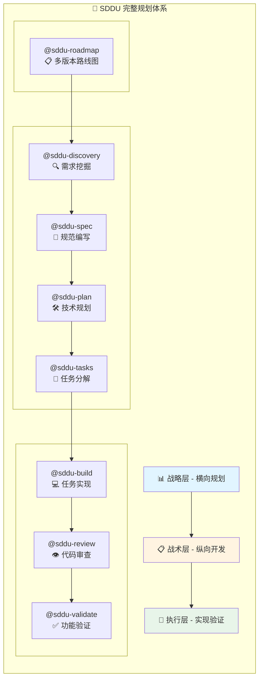
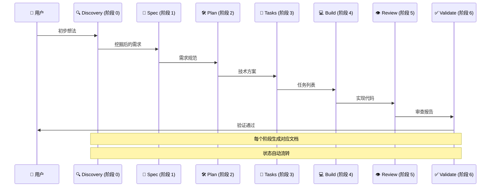
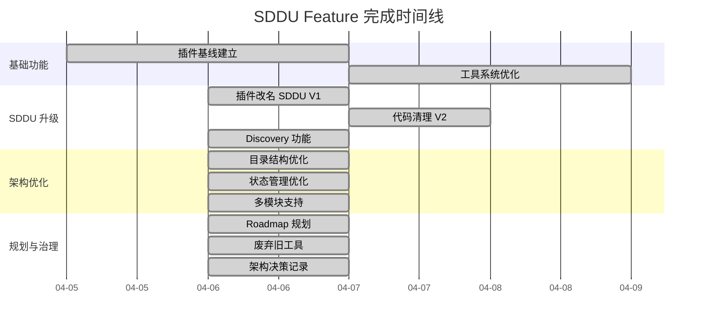
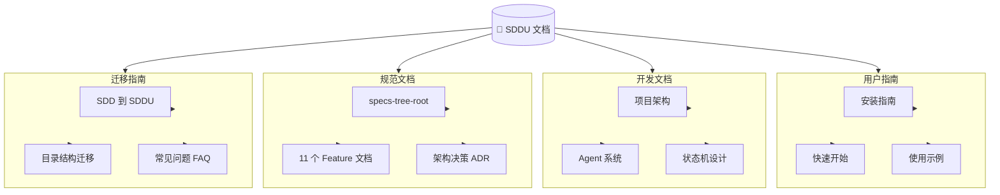

# OpenCode SDDU Plugin

[](https://github.com/THZSummer/sddu/releases)
[](https://github.com/THZSummer/sddu)
[](https://github.com/THZSummer/sddu)
[](https://github.com/THZSummer/sddu/blob/main/LICENSE)

规范驱动开发终极版 (Specification-Driven Development Ultimate) 插件，为 OpenCode 提供结构化的 7 阶段工作流 + 需求挖掘阶段。

## 📁 项目结构

```
opencode-sddu-plugin/
├── src/                        # 源码目录
│   ├── index.ts                # 插件入口
│   ├── types.ts                # 统一类型导出 (新增)
│   ├── errors.ts               # 统一错误处理 (新增)
│   ├── agents/                 # Agent 注册
│   │   ├── registry.ts         # Agent 注册表 (新增)
│   │   └── sdd-agents.ts       # Agent 注册逻辑
│   │   └── sddu-agents.ts      # SDDU Agent 注册逻辑 (新增)
│   ├── commands/               # 命令定义
│   ├── state/                  # 状态机
│   ├── discovery/              # 发现阶段实现
│   ├── utils/                  # 工具函数
│   │   ├── index.ts            # 统一导出 (新增)
│   │   ├── tasks-parser.ts
│   │   ├── subfeature-manager.ts
│   │   ├── readme-generator.ts
│   │   └── dependency-notifier.ts
│   └── templates/              # 模板文件
│       └── agents/             # Agent prompt 模板
│
├── scripts/                    # 工具脚本
│   └── package.cjs             # 打包脚本 (新增)
│
├── dist/                       # 构建产物
│   ├── sddu/                    # 完整插件包
│   │   ├── src/
│   │   ├── agents/
│   │   ├── ...
│   │   └── package.json
│   └── sddu.zip                 # 压缩包
│
├── .sddu/                      # SDDU 工作空间
│   ├── README.md
│   ├── ROADMAP.md
│   ├── docs/
│   │   └── guide.md
│   └── specs-tree-root/        # 规范目录
│       ├── README.md           # 目录导航
│       ├── state.json          # 全局状态
│       ├── specs-tree-plugin-rename-sddu/  
│       │   ├── spec.md         # v1.0.0
│       │   ├── plan.md
│       │   ├── tasks.md
│       │   ├── review.md
│       │   ├── validation.md
│       │   └── state.json
│       └── ...                 # 其他 Feature
│
├── tests/                      # 测试目录
│   ├── README.md               # 测试说明文档
│   ├── unit/                   # 单元测试
│   ├── state/                  # 集成测试
│   ├── e2e/                    # E2E 测试
│   └── compatibility/          # 兼容性测试
│
├── install.sh                  # 安装脚本 (Linux/macOS)
├── install.ps1                 # 安装脚本 (Windows)
├── package.json
├── tsconfig.json
└── ...
```

**目录说明：**
| 目录 | 用途 | 是否提交 |
|------|------|----------|
| `src/` | 源码 | ✅ 是 |
| `dist/` | 构建产物 | ✅ 是 |
| `.sddu/` | SDDU 工作空间容器 | ✅ 是 |
| `.sddu/specs-tree-root/` | 规范文件目录 | ✅ 是 |
| `.opencode/` | 本地安装测试 | ❌ 否 |

## 🚀 安装

### 一键安装（推荐）

**Linux/macOS:**
```bash
bash install.sh <目标项目目录>
# 或 (确保脚本可执行)
chmod +x install.sh
./install.sh <目标项目目录>
```

⚠️ **注意**: 必须使用 `bash`，不要用 `sh install.sh`！

**Windows:**
```powershell
powershell -ExecutionPolicy Bypass -File "install.ps1" <目标项目目录>
```

### 手动安装

```bash
# 构建
npm install
npm run build

# 打包（生成 dist/sddu/ 和 dist/sddu.zip）
npm run package

# 安装
bash install.sh <目标项目>
```

### 打包优化说明
- ✅ 自动清理 dist 目录冗余文件
- ✅ 保留 `dist/sddu/` 新版插件包
- ✅ 生成 `dist/sddu.zip` 新版插件包
- ✅ 支持 ZIP 解压安装

## 🏗️ 项目架构

```mermaid
graph LR
    subgraph Core[核心层]
        C1["src/index.ts\n插件入口"]
        C2["src/types.ts\n类型定义"]
        C3["src/errors.ts\n错误处理"]
    end
    
    subgraph Agents[Agent 层]
        A1["src/agents/\n动态注册表"]
        A2["src/templates/agents/\nPrompt 模板"]
    end
    
    subgraph Commands[命令层]
        CM1["src/commands/\nCLI 命令"]
        CM2["src/discovery/\n发现阶段"]
    end
    
    subgraph State[状态层]
        S1["src/state/\n状态机"]
        S2["src/state/\n管理器"]
    end
    
    subgraph Utils[工具层]
        U1["src/utils/\n任务解析"]
        U2["src/utils/\n子 Feature 管理"]
        U3["src/utils/\nREADME 生成"]
        U4["src/utils/\n依赖通知"]
    end
    
    Core --> Agents
    Agents --> Commands
    Commands --> State
    State --> Utils
    
    style Core fill:#ffe0e0
    style Agents fill:#e0ffe0
    style Commands fill:#e0e0ff
    style State fill:#ffffe0
    style Utils fill:#ffe0ff
```



## 🎯 使用方法

### 核心功能
- ✅ 统一类型导出 (`src/types.ts`)
- ✅ 统一错误处理体系 (`src/errors.ts`)
- ✅ 工具函数统一导出 (`src/utils/index.ts`)
- ✅ Agent 动态注册表 (`src/agents/registry.ts`)
- ✅ SDD → SDDU 迁移支持 (`src/agents/sddu-agents.ts`)  
- ✅ 打包脚本优化 (`scripts/package.cjs`)
- ✅ Discovery 可选状态联动
- ✅ 安装脚本适配 `dist/sddu/` 结构

### Agent 列表

#### 智能入口
- @sddu - SDDU Master Coordinator - 智能路由助手  
- @sddu-help - SDDU Help Assistant - 使用指南  

#### 7 阶段标准版 (含新增阶段 0 - 需求挖掘)
- @sddu-0-discovery - SDDU 需求挖掘专家 (阶段 0/6)  
- @sddu-1-spec - SDDU 规范编写专家 (阶段 1/6)  
- @sddu-2-plan - SDDU 技术规划专家 (阶段 2/6)  
- @sddu-3-tasks - SDDU 任务分解专家 (阶段 3/6)  
- @sddu-4-build - SDDU 任务实现专家 (阶段 4/6)  
- @sddu-5-review - SDDU 代码审查专家 (阶段 5/6)  
- @sddu-6-validate - SDDU 验证专家 (阶段 6/6)  

#### 7 阶段短名版  
- @sddu-discovery - SDDU 需求挖掘 (短名)  
- @sddu-spec - SDDU 规范编写 (短名)  
- @sddu-plan - SDDU 技术规划 (短名)  
- @sddu-tasks - SDDU 任务分解 (短名)  
- @sddu-build - SDDU 任务实现 (短名)  
- @sddu-review - SDDU 代码审查 (短名)  
- @sddu-validate - SDDU 验证 (短名)  

#### 特殊功能
- @sddu-roadmap - SDDU Roadmap 规划专家 - 多版本路线图规划
- @sddu-docs - SDDU 目录导航生成器 - 扫描目录结构生成 README 导航  

使用 `@sddu` 作为统一入口，自动根据当前状态路由到正确阶段：

```bash
@sddu 开始 用户登录功能
@sddu 继续
@sddu 状态
```

### 核心工作流 Agent（阶段性执行）

直接调用特定阶段 Agent：
```bash
@sddu-discovery "用户需要登录和注册功能"      # 需求挖掘 (新增阶段 0)  
@sddu-spec "基于需求完善技术规范"              # 技术规范 (阶段 1) 
@sddu-plan "制定实现计划"                     # 技术规划 (阶段 2)
@sddu-tasks "拆解为具体任务"                 # 任务分解 (阶段 3)
@sddu-build "实现代码"                       # 任务实现 (阶段 4)
@sddu-review "代码审查"                      # 代码审查 (阶段 5)
@sddu-validate "验证功能"                    # 功能验证 (阶段 6)
```

### 规划辅助 Agent（整体规划支持）

提供跨版本、跨功能的整体规划支持：

```bash
@sddu-roadmap "为整个项目创建 roadmap 规划"
@sddu-roadmap "Q2 上线，2 个人，做什么功能好"
@sddu-roadmap "基于现有 spec 规划版本"
```

`sddu-roadmap` Agent 支持:
- **多版本规划**: 创建包含多个迭代版本的详细路线图
- **功能优先级排序**: 使用 RICE 模型 (Reach, Impact, Confidence, Effort) 评估功能优先级
- **依赖关系分析**: 识别功能开发的依赖关系，优化开发顺序
- **时间表规划**: 基于资源和复杂度预测版本发布周期
- **智能 Feature 整理**: 从用户零散输入中提取和推荐相关功能

## 📚 SDDU 使用指南

完整使用文档请参考 `.sddu/` 目录下的相关文档。 

#### 📊 完整 Agent 关系图



#### 📋 Agent 对比表

| Agent | 层次 | 输入 | 输出 | 必需 | 说明 |
|-------|------|------|------|------|------|
| `@sddu-roadmap` | 战略层 | 零散想法/约束 | 多版本 Roadmap | ❌ 可选 | SDDU 版 |
| `@sddu-discovery` | 认知层 | 用户初步想法 | discovery.md | ⚠️ 推荐 | SDDU 版 |
| `@sddu-spec` | 战术层 | 用户需求 (推荐已挖掘的) | spec.md | ✅ 必需 | SDDU 版 |
| `@sddu-plan` | 战术层 | spec.md | plan.md | ✅ 必需 | SDDU 版 |
| `@sddu-tasks` | 战术层 | plan.md | tasks.md | ✅ 必需 | SDDU 版 |
| `@sddu-build` | 执行层 | tasks.md | 源代码 | ✅ 必需 | SDDU 版 |
| `@sddu-review` | 执行层 | 代码 | 审查报告 | ✅ 必需 | SDDU 版 |
| `@sddu-validate` | 执行层 | 审查报告 | 验证结果 | ✅ 必需 | SDDU 版 |

## 🔄 7 阶段工作流

SDDU 实现从需求到验证的完整 7 阶段工作流（含阶段 0：需求挖掘）：



**阶段说明**:

| 阶段 | Agent | 输入 | 输出 | 文档 |
|------|-------|------|------|------|
| 0 | @sddu-discovery | 用户初步想法 | 挖掘后的需求 | discovery.md |
| 1 | @sddu-spec | 需求文档 | 技术规范 | spec.md |
| 2 | @sddu-plan | 需求规范 | 技术方案 | plan.md |
| 3 | @sddu-tasks | 技术方案 | 任务列表 | tasks.md |
| 4 | @sddu-build | 任务列表 | 源代码 | build.md |
| 5 | @sddu-review | 代码 | 审查报告 | review.md |
| 6 | @sddu-validate | 审查报告 | 验证结果 | validation.md |

## ⚡ 快速开始

### 1. 安装插件
```bash
# 克隆项目
git clone https://github.com/THZSummer/sddu.git
cd sddu

# 构建和打包
npm install
npm run build
npm run package

# 安装到你的项目
bash install.sh /path/to/your/project
```

### 2. 开始第一个 Feature
```bash
cd /path/to/your/project
opencode

# 使用新版智能入口 (唯一推荐)
@sddu 开始 用户登录功能

# 或分阶段执行 
@sddu-discovery "用户需要快捷登录"
@sddu-spec "用户登录"
@sddu-plan "用户登录"
@sddu-tasks "用户登录"
@sddu-build "实现 TASK-001"
```

## ✅ 已完成 Feature (11 个)



### SDDU 专业版 (v1.1.0)
- specs-tree-plugin-rename-sddu-v2/ - 插件改名 SDDU V2（代码清理）
- specs-tree-plugin-rename-sddu/ - 插件改名 SDDU V1（历史记录）
- specs-tree-sdd-discovery-feature/ - Discovery 需求挖掘功能
- specs-tree-directory-optimization/ - 目录结构优化
- specs-tree-sdd-multi-module/ - 子 Feature 并行开发支持
- specs-tree-sdd-tools-optimization/ - 工具系统优化
- specs-tree-deprecate-sdd-tools/ - 废弃旧工具
- specs-tree-sdd-workflow-state-optimization/ - 工作流状态优化
- specs-tree-sdd-plugin-roadmap/ - Roadmap 规划专家
- specs-tree-sdd-plugin-baseline/ - 插件基线建立
- architecture/ - 架构决策记录目录

## 🔨 开发命令

```bash
# 安装依赖
npm install

# 构建（agent + TypeScript）
npm run build

# 打包（生成 dist/sddu/ 和 dist/sddu.zip）
npm run package

# 打包后自动清理冗余文件，保留新版包：
# - dist/sddu/ (新版插件包)
# - dist/sddu.zip (新版压缩包)
npm run build:agents

# 监听 TypeScript 编译
npm run dev

# 清理构建产物
npm run clean

# 本地测试
npm run test
```

## 🧪 测试

运行测试：
```bash
# 运行所有测试
npm test

# 运行特定测试
npm test -- --testPathPattern=tests/unit
npm test -- --testPathPattern=tests/e2e
```

测试目录结构详见 [tests/README.md](tests/README.md)

## 🧹 SDD 残留检查

V2 版本提供了自动化检查工具，用于验证代码中是否还有 SDD 残留：

```bash
# 运行 SDD 残留检查脚本
./scripts/check-sdd-residue.sh

# 输出示例：
# ======================================
# SDD 残留检查工具 v1.0
# ======================================
# 
# 扫描范围：src/
# 排除：sddu- (正确的 SDDU 引用)
# 
# 📋 扫描模板文件中的 @sdd- 引用...
#   ✅ 无残留
# 
# ... (其他类别扫描)
# 
# ======================================
# 📊 检查报告总结
# ======================================
# 
# 扫描文件总数：52
# 发现残留总数：0
# 残留率：0.00%
# 
# ✅ 通过！无 SDD 残留
```

**检查类别**:
- 模板文件中的 `@sdd-` 引用
- 源码注释中的 "SDD" 字眼
- 类型定义中的 `Sdd*` 命名
- 所有 `sdd-` 引用（排除 `sddu-`）
- 测试文件中的 `Sdd*` 命名
- 向后兼容代码（backward compatibility、legacy、deprecated）

**通过标准**: 残留率 ≤ 2%

## 📋 版本历史

| 版本 | 日期 | 说明 |
|------|------|------|
| v1.1.0 | 2026-04-06 | ⚡ SDDU 专业版 - 全新命令行界面 + 优化工作流 |
| v1.0.0 | 2026-04-05 | ✅ SDD 工具系统基础版 - 统一导出层 + Agent 注册表 + 打包优化 |

## 🔗 参考链接

- [SDDU 工具系统规范](.sddu/specs-tree-root/specs-tree-plugin-rename-sddu/spec.md)
- [技术规划文档](.sddu/specs-tree-root/specs-tree-plugin-rename-sddu/plan.md) 
- [SDDU 使用指南](.sddu/docs/guide.md)
- [SDDU 功能路线图](.sddu/ROADMAP.md)
- [OpenCode 官方文档](https://opencode.ai/docs)
- [OpenCode Plugin 开发](https://opencode.ai/docs/plugins)
- [OpenCode Agent 系统](https://opencode.ai/docs/agents)
- [OpenCode MCP 集成](https://opencode.ai/docs/mcp-servers)

## 📚 文档导航



详细文档请查看：
- 📁 **工作空间**: [.sddu/README.md](.sddu/README.md)
- 📋 **规范目录**: [.sddu/specs-tree-root/README.md](.sddu/specs-tree-root/README.md)
- 🗺️ **路线图**: [.sddu/ROADMAP.md](.sddu/ROADMAP.md)
- 📝 **测试说明**: [tests/README.md](tests/README.md)

## 📄 许可证

MIT License