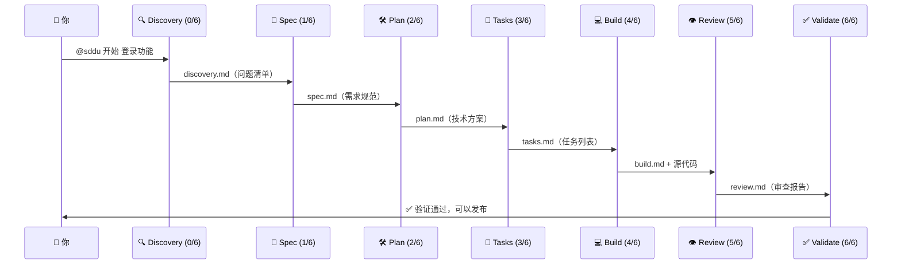

# OpenCode SDDU Plugin

[](https://github.com/THZSummer/sddu/releases)
[](https://github.com/THZSummer/sddu)
[](https://github.com/THZSummer/sddu)
[](https://github.com/THZSummer/sddu/blob/main/LICENSE)

**规范驱动开发** (Specification-Driven Development Ultimate) — 为 OpenCode AI 编程助手提供结构化的 8 阶段工作流。从模糊想法到可交付代码，每一步都有专属 AI Agent 引导，产出标准化文档。

---

## 🎯 什么是 SDDU

SDDU 是一个 OpenCode 插件，用 **AI Agent 协作** 的方式把软件开发变成了一个结构化流程。你不是在和一个万能 AI 对话——你是在和 **11 个专业 AI Agent** 协作，每个负责一个阶段：

| 阶段 | Agent | 做什么 |
|:--:|-------|--------|
| 0 | `@sddu-discovery` | 把模糊想法挖成清晰问题 |
| 1 | `@sddu-spec` | 把问题定义成可测试的需求规范 |
| 2 | `@sddu-plan` | 把需求设计成技术方案 |
| 3 | `@sddu-tasks` | 把方案拆成可并行的原子任务 |
| 4 | `@sddu-build` | 逐任务实现代码 |
| 5 | `@sddu-review` | 静态审查代码质量 |
| 6 | `@sddu-validate` | 动态验证——跑测试、调接口、测性能 |

**三个设计原则**：
- 🚫 **不跳步**：没有 spec 不能 plan，没有 plan 不能 tasks
- 🤝 **不越界**：每个 Agent 只做自己阶段的事，discovery 不定义需求，plan 不写代码
- 📄 **文档即状态**：每个阶段的产出就是下一阶段的输入，全程可追溯

---

## ⚡ 一分钟上手

```bash
# 1. 安装到你的项目（需要 git + node）
curl -fsSL https://raw.githubusercontent.com/THZSummer/sddu/main/bootstrap.sh | bash -s -- ./my-project

# 2. 进入项目，启动 opencode
cd ./my-project
opencode

# 3. 开始你的第一个 Feature
@sddu 开始 用户登录功能
```

就这么简单。`@sddu` 是智能入口，会根据当前状态自动路由到正确的阶段 Agent。

---

## 🔄 工作流全景



每个阶段自动生成对应文档，状态自动推进。支持暂停、终止、迁出等完整生命周期管理。

---

## 🤖 Agent 速览

### 主流程（6 阶段）

| Agent | 阶段 | 输入 | 输出 |
|-------|:--:|------|------|
| `@sddu-discovery` | 0/6 | 模糊想法 | `discovery.md` — 问题清单 |
| `@sddu-spec` | 1/6 | 问题清单 | `spec.md` — 需求规范 |
| `@sddu-plan` | 2/6 | 需求规范 | `plan.md` — 技术方案 + ADR |
| `@sddu-tasks` | 3/6 | 技术方案 | `tasks.md` — 原子任务 |
| `@sddu-build` | 4/6 | 任务列表 | 源代码 + `build.md` |
| `@sddu-review` | 5/6 | 代码 + 规范 | `review.md` — 审查报告 |
| `@sddu-validate` | 6/6 | 审查报告 | `validation.md` — 验证结果 |

### 辅助 Agent

| Agent | 类型 | 做什么 |
|-------|:--:|------|
| `@sddu` | 🚪 入口 | 智能路由、分类仪表盘、状态标记 |
| `@sddu-roadmap` | 📋 独立 | 多版本路线图规划、RICE 优先级排序 |
| `@sddu-tree` | 🔄 自动 | 扫描 `.sddu/` 生成 TREE.md 目录导航 |
| `@sddu-docs` | 📖 独立 | 扫描代码/配置/Schema 生成项目全景文档 |

---

## 📋 常用命令

```bash
# 统一入口（推荐）
@sddu 开始 功能名称          # 启动新 Feature
@sddu 继续                    # 继续当前 Feature
@sddu 状态                    # 查看 6 区分类仪表盘

# 直接调用阶段 Agent
@sddu-discovery "用户需要快捷登录"     # 挖掘需求
@sddu-spec "用户登录"                  # 编写规范
@sddu-plan "用户登录"                  # 技术规划
@sddu-tasks "用户登录"                 # 任务分解
@sddu-build "实现 TASK-001"           # 实施构建

# 状态管理
@sddu 标记 feature-name suspended --until 2026-07-01 --note "等待 API"
@sddu 标记 feature-name terminated

# 规划辅助
@sddu-roadmap "Q2 上线，2 个人，做什么功能好"
```

---

## 📁 产出文件

SDDU 将每个 Feature 的工作产物组织在 `.sddu/specs-tree-root/` 下：

```
.sddu/
├── TREE.md                    # 目录导航（sddu-tree 自动生成）
├── ROADMAP.md                 # 版本路线图
└── specs-tree-root/
    └── specs-tree-<feature>/
        ├── discovery.md       # 阶段 0 产出
        ├── spec.md            # 阶段 1 产出
        ├── plan.md            # 阶段 2 产出
        ├── tasks.md / tasks.json
        ├── build.md           # 阶段 4 产出
        ├── review.md          # 阶段 5 产出
        ├── validation.md      # 阶段 6 产出
        └── state.json         # 状态文件（phase + status）
```

支持**树形嵌套**：Feature 下可拆分子 Feature，每个子 Feature 独立走完整 6 阶段工作流。

---

## 🗺️ 路线图

| 版本 | 主题 | 状态 |
|------|------|:--:|
| v3.0.1 | 模板质量统一 — 17 模板格式骨架 + 11 Agent 职责边界 | ✅ 已完成 |
| v3.0.0 | 两字段状态模型 — phase(8) + status(5) | ✅ 已完成 |
| v3.1.0 | 质量与工作流改进 (A-F 问题修复) | 📋 规划中 |
| v3.2.0 | 项目知识基础设施 (全局配置 + 知识沉淀) | 💡 提议中 |

详见 [.sddu/ROADMAP.md](.sddu/ROADMAP.md)

---

## 🔧 完整安装

### 一行安装（推荐）

**Linux/macOS:**
```bash
curl -fsSL https://raw.githubusercontent.com/THZSummer/sddu/main/bootstrap.sh | bash -s -- ./my-project
```

**Windows (PowerShell):**
```powershell
powershell -c "iwr https://raw.githubusercontent.com/THZSummer/sddu/main/bootstrap.ps1 | iex; Install-Sddu ./my-project"
```

### 本地安装（已克隆仓库）

```bash
bash install.sh ./my-project
```

### 手动构建 + 安装

```bash
npm install
npm run build
npm run package
bash install.sh ./my-project
```

---

## 🏗️ 项目结构

```
opencode-sddu-plugin/
├── src/
│   ├── index.ts                # 插件入口
│   ├── types.ts                # 统一类型导出
│   ├── errors.ts               # 统一错误处理
│   ├── agents/                 # Agent 注册 (registry.ts / sdd-agents.ts / sddu-agents.ts)
│   ├── commands/               # 命令定义
│   ├── state/                  # 状态机 v3.0.0
│   ├── discovery/              # Discovery 阶段
│   ├── utils/                  # 工具函数 (tasks-parser / subfeature-manager / TREE 导航生成)
│   └── templates/agents/       # 11 个指令模板 + 7 个产物模板
├── scripts/                    # 打包 + E2E 测试脚本
├── dist/                       # 构建产物 (dist/sddu/ + dist/sddu.zip)
├── .sddu/                      # SDDU 工作空间（本项目的 Feature 文档）
├── tests/                      # 单元 / 集成 / E2E / 兼容性测试
├── install.sh / install.ps1    # 安装脚本
├── build-agents.cjs            # Agent 模板构建脚本
└── package.json / tsconfig.json
```

---

## 🔨 开发命令

```bash
npm install          # 安装依赖
npm run build        # 构建（agent + TypeScript）
npm run build:agents # 仅构建 Agent 模板
npm run package      # 打包（生成 dist/sddu/ + dist/sddu.zip）
npm run dev          # 监听 TypeScript 编译
npm run clean        # 清理构建产物
npm test             # 运行所有测试
npm run test:state:integration  # 状态机集成测试
```

---

## 🧪 测试

```bash
# 基础 E2E（TypeScript + Node.js，零外部依赖）
bash scripts/e2e/basic/sddu-e2e.sh

# 全栈 E2E（SpringBoot + React，含 Docker）
bash scripts/e2e/fullstack/sddu-e2e-fullstack.sh

# SDD 残留检查
./scripts/check-sdd-residue.sh
```

详见 [tests/README.md](tests/README.md)

---

## 📋 版本历史

| 版本 | 日期 | 说明 |
|------|------|------|
| v3.0.1 | 2026-06-21 | 📐 模板质量统一 — 17 模板格式骨架 + 11 Agent 职责边界声明，sddu-tree 输出 TREE.md |
| v1.4.1 | 2026-06-13 | 🔄 v3.0.0 两字段状态模型 — phase(8) + status(5) 分离，@sddu 标记/状态 命令，R5 一致性检测 |
| v1.4.0 | 2026-04-20 | 🎯 SDDU 品牌升级正式发布 |
| v1.3.0 | 2026-05-25 | 🎨 Agent 输出模板化 — 7 个 Agent 输出固化为可自定义模板 |
| v1.2.0 | 2026-04-12 | 🔄 mode: all 双模式支持 |
| v1.1.0 | 2026-04-06 | ⚡ SDDU 专业版 |
| v1.0.0 | 2026-04-05 | ✅ SDD 工具系统基础版 |

---

## ✅ 已完成 Feature (16 个)

| # | Feature | 说明 |
|:--|------|------|
| 1 | specs-tree-sdd-plugin-baseline | 插件基线建立 |
| 2 | specs-tree-sdd-tools-optimization | 工具系统优化 |
| 3 | specs-tree-plugin-rename-sddu | 插件改名 SDDU V1 |
| 4 | specs-tree-plugin-rename-sddu-v2 | 插件改名 SDDU V2 (代码清理) |
| 5 | specs-tree-sdd-discovery-feature | Discovery 需求挖掘功能 |
| 6 | specs-tree-directory-optimization | 目录结构优化 |
| 7 | specs-tree-sdd-workflow-state-optimization | 工作流状态优化 |
| 8 | specs-tree-sdd-multi-module | 子 Feature 并行开发支持 |
| 9 | specs-tree-sdd-plugin-roadmap | Roadmap 规划专家 |
| 10 | specs-tree-deprecate-sdd-tools | 废弃旧工具 |
| 11 | specs-tree-tree-structure-optimization | 树形结构优化 |
| 12 | specs-tree-tree-structure-optimization-v2 | 树形结构优化 v2 |
| 13 | specs-tree-agent-output-templating | Agent 输出模板化系统 |
| 14 | specs-tree-sddu-status-enhancement | 两字段状态模型 v3.0.0 |
| 15 | specs-tree-solo-team-flow | Solo Team Flow (已终止→ETD) |
| 16 | specs-tree-template-quality-unification | 模板质量统一 (17 模板 + 11 Agent 职责边界) |

---

## 🔗 文档导航

- [SDDU 使用指南](.sddu/docs/guide.md)
- [功能路线图](.sddu/ROADMAP.md) (v4.1.0)
- [工作空间总览](.sddu/TREE.md)
- [OpenCode 官方文档](https://opencode.ai/docs)
- [OpenCode Plugin 开发](https://opencode.ai/docs/plugins)

---

MIT License
