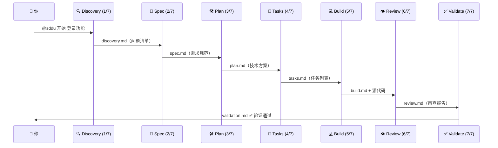

# OpenCode SDDU Plugin

[](https://github.com/THZSummer/sddu/releases)
[](https://github.com/THZSummer/sddu)
[](https://github.com/THZSummer/sddu)
[](https://github.com/THZSummer/sddu/blob/main/LICENSE)

**规范驱动开发** (Specification-Driven Development Ultimate) — 为 OpenCode AI 编程助手提供结构化的 8 阶段工作流。从模糊想法到可交付代码，每一步都有专属 AI Agent 引导，产出标准化文档。

---

## 🎯 什么是 SDDU

SDDU 是一个 OpenCode 插件，用 **AI Agent 协作** 的方式把软件开发变成了一个结构化流程。你不是在和一个万能 AI 对话——你是在和 **12 个专业 AI Agent** 协作，每个负责一个阶段：

| 阶段 | Agent | 做什么 |
|:--:|-------|--------|
| 1/7 | `@sddu-discovery` | 把模糊想法挖成清晰问题 |
| 2/7 | `@sddu-spec` | 把问题定义成可测试的需求规范 |
| 3/7 | `@sddu-plan` | 把需求设计成技术方案 |
| 4/7 | `@sddu-tasks` | 把方案拆成可并行的原子任务 |
| 5/7 | `@sddu-build` | 逐任务实现代码 |
| 6/7 | `@sddu-review` | 静态审查代码质量 |
| 7/7 | `@sddu-validate` | 动态验证——跑测试、调接口、测性能 |

**三个设计原则**：
- 🚫 **不跳步**：没有 spec 不能 plan，没有 plan 不能 tasks
- 🤝 **不越界**：每个 Agent 只做自己阶段的事，discovery 不定义需求，plan 不写代码
- 📄 **文档即状态**：每个阶段的产出就是下一阶段的输入，全程可追溯

---

## ⚡ 双模架构：完整流程 vs 快速模式

SDDU 提供两种入口，根据任务复杂度自由选择：

| 入口 | 定位 | 适合场景 | 产出 |
|------|------|---------|------|
| `@sddu` | 完整 8 阶段流程 | 新 Feature 规划、跨模块重构、API 设计 | 6-8 份标准化文档 + state.json |
| `@sddu-fast` | 快速模式，单会话解决 | bug 修复、配置调整、code review、补充测试 | 直接的问题解决结果（无文档产物） |

**场景示例**：
- 🔧 修一个拼写错误？→ `@sddu-fast "修复 config.ts 中 API_BASE_URL 的拼写"`
- 🏗️ 设计一个新模块？→ `@sddu 开始 用户认证模块`
- 🤔 不确定任务复杂度？→ 先用 `@sddu-fast` 试探，Agent 判断复杂后会建议升级到完整流程

> `@sddu` 协调器也会自动识别简单任务并调度到 `@sddu-fast`，无需手动选择。

---

## ⚡ 一分钟上手

```bash
# 1. 安装到你的项目（需要 git + node）
# 直连
curl -fsSL https://raw.githubusercontent.com/THZSummer/sddu/main/bootstrap.sh | bash -s -- ./my-project
# 或通过镜像（国内加速）
curl -fsSL https://gh-proxy.com/https://raw.githubusercontent.com/THZSummer/sddu/main/bootstrap.sh | bash -s -- ./my-project --proxy https://gh-proxy.com/

# 2. 进入项目，启动 opencode
cd ./my-project
opencode

# 3. 开始你的第一个 Feature
@sddu 开始 用户登录功能
```

就这么简单。`@sddu` 是智能入口，会根据当前状态自动路由到正确的阶段 Agent。

---

## 🔄 工作流全景


```mermaid
sequenceDiagram
    participant U as 👤 你
    participant D as 🔍 Discovery (1/7)
    participant S as 📝 Spec (2/7)
    participant P as 🛠️ Plan (3/7)
    participant T as 📌 Tasks (4/7)
    participant B as 💻 Build (5/7)
    participant R as 👁️ Review (6/7)
    participant V as ✅ Validate (7/7)

    U->>D: @sddu 开始 登录功能
    D->>S: discovery.md（问题清单）
    S->>P: spec.md（需求规范）
    P->>T: plan.md（技术方案）
    T->>B: tasks.md（任务列表）
    B->>R: build.md + 源代码
    R->>V: review.md（审查报告）
    V->>U: validation.md ✅ 验证通过
```

每个阶段自动生成对应文档，状态自动推进。支持暂停、终止、迁出等完整生命周期管理。

---

## 🤖 Agent 速览

### 主流程（7 阶段）

| Agent | 阶段 | 输入 | 输出 |
|-------|:--:|------|------|
| `@sddu-discovery` | 1/7 | 模糊想法 | `discovery.md` — 问题清单 |
| `@sddu-spec` | 2/7 | 问题清单 | `spec.md` — 需求规范 |
| `@sddu-plan` | 3/7 | 需求规范 | `plan.md` — 技术方案 + ADR |
| `@sddu-tasks` | 4/7 | 技术方案 | `tasks.md` — 原子任务 |
| `@sddu-build` | 5/7 | 任务列表 | 源代码 + `build.md` |
| `@sddu-review` | 6/7 | 代码 + 规范 | `review.md` — 审查报告 |
| `@sddu-validate` | 7/7 | 审查报告 | `validation.md` — 验证结果 |

### 辅助 Agent

| Agent | 类型 | 做什么 |
|-------|:--:|------|
| `@sddu` | 🚪 入口 | 智能路由、分类仪表盘、状态标记 |
| `@sddu-fast` | ⚡ 快速 | 轻量任务单会话解决，无状态零产物 |
| `@sddu-roadmap` | 📋 独立 | 多版本路线图规划、RICE 优先级排序 |
| `@sddu-docs` | 📖 独立 | 双模式项目全景：默认扫描 specs-tree 过程产物，支持用户指令扫描代码 |

---

## 📋 常用命令

```bash
# 统一入口（推荐）
@sddu 开始 功能名称          # 启动新 Feature
@sddu 继续                    # 继续当前 Feature
@sddu 状态                    # 查看 6 区分类仪表盘

# 直接调用阶段 Agent
@sddu-discovery "用户需要快捷登录"     # 挖掘需求
@sddu-spec "用户登录"                  # 编写规范
@sddu-plan "用户登录"                  # 技术规划
@sddu-tasks "用户登录"                 # 任务分解
@sddu-build "实现 TASK-001"           # 实施构建

# 状态管理
@sddu 标记 feature-name suspended --until 2026-07-01 --note "等待 API"
@sddu 标记 feature-name terminated

# 规划辅助
@sddu-roadmap "Q2 上线，2 个人，做什么功能好"
```

---

## 📁 产出文件

SDDU 将每个 Feature 的工作产物组织在 `.sddu/specs-tree-root/` 下：

```
.sddu/
├── TREE.md                    # 目录导航（sddu-tree Skill 自动生成）
├── ROADMAP.md                 # 版本路线图
└── specs-tree-root/
    └── specs-tree-<feature>/
        ├── discovery.md       # 阶段 0 产出
        ├── spec.md            # 阶段 1 产出
        ├── plan.md            # 阶段 2 产出
        ├── tasks.md / tasks.json
        ├── build.md           # 阶段 4 产出
        ├── review.md          # 阶段 5 产出
        ├── validation.md      # 阶段 6 产出
        └── state.json         # 状态文件（phase + status）
```

支持**树形嵌套**：Feature 下可拆分子 Feature，每个子 Feature 独立走完整 7 阶段工作流。

---

## 🚧 项目约束（Agent 必读）

本项目是 SDDU 插件自身（dogfooding）。所有 Agent 定义需求/方案/任务时：**修改目标只限设计态源码**（`src/`、`scripts/`、`e2e/`、`docs/`、`examples/`、`package.json`、`tsconfig.json` 等）。`.opencode/`（含 `opencode.json` + `agents/` + `plugins/`）是编译产物（`src/` build 生成），`.sddu/` 是流程产物——**二者不得列为修改/创建/删除目标**。改运行时行为请走「改 `src/` + `npm run build`」。

---

## 🗺️ 路线图

| 版本 | 主题 | 状态 |
|------|------|:--:|
| v3.3.0 | Skill 系统 + Fast 模式 — 三元自举闭环 + 轻量快速通道 | ✅ 已完成 |
| v3.1.0 | @sddu-tree Agent->Skill 降级 — 脚本化 + 定向扫描优化 | ✅ 已完成 |
| v3.0.1 | 模板质量统一 — 17 模板格式骨架 + 11 Agent 职责边界（sddu-tree 后降级为 Skill，现 10 Agent） | ✅ 已完成 |
| v3.0.0 | 两字段状态模型 — phase(8) + status(5) | ✅ 已完成 |
| v3.1.0 | 质量与工作流改进 (A-F 问题修复) | 📋 规划中 |
| v3.2.0 | 项目知识基础设施 (全局配置 + 知识沉淀) | 💡 提议中 |

详见 [.sddu/ROADMAP.md](.sddu/ROADMAP.md)

---

## 🔧 完整安装

### 一行安装（推荐）

**Linux/macOS:**
```bash
# 直连
curl -fsSL https://raw.githubusercontent.com/THZSummer/sddu/main/bootstrap.sh | bash -s -- ./my-project
# 或通过镜像（国内加速）
curl -fsSL https://gh-proxy.com/https://raw.githubusercontent.com/THZSummer/sddu/main/bootstrap.sh | bash -s -- ./my-project --proxy https://gh-proxy.com/
```

**Windows (PowerShell):**
```powershell
# 直连
powershell -c "iwr https://raw.githubusercontent.com/THZSummer/sddu/main/bootstrap.ps1 | iex; Install-Sddu ./my-project"
# 或通过镜像（国内加速）
powershell -c "iwr https://gh-proxy.com/https://raw.githubusercontent.com/THZSummer/sddu/main/bootstrap.ps1 | iex; Install-Sddu ./my-project -ProxyUrl https://gh-proxy.com/"
```

### 本地安装（已克隆仓库）

```bash
bash install.sh ./my-project
```

### 手动构建 + 安装

```bash
npm install
npm run build
npm run package
bash install.sh ./my-project
```

---

## 🏗️ 项目结构

```
sddu/
├── src/
│   ├── pipeline/              # 管线定义（阶段流转规则）
│   ├── state/                 # 状态追踪（状态机 v3.0.0）
│   ├── discovery/             # 需求挖掘引擎（7 步子工作流）
│   ├── agents/                # Agent 注册表
│   ├── templates/             # 模板引擎 + 方法论资产（18 .hbs）
│   ├── adapters/opencode/     # OpenCode 平台适配器
│   ├── shared/                # 跨域共享（类型/错误/接口契约）
│   ├── __tests__/             # 统一测试目录（unit + integration）
│   └── index.ts               # 薄桶公共 API
├── e2e/                       # 端到端测试（Jest + Shell 编排脚本）
│   ├── scripts/basic/         # 基础 E2E（TypeScript 单项目）
│   └── scripts/fullstack/     # 全栈 E2E（SpringBoot + React）
├── scripts/                   # 构建/验证/迁移脚本
├── docs/                      # 文档
├── examples/                  # 示例项目
├── dist/                      # 构建产物
├── .sddu/                     # SDDU 工作空间（本项目的 Feature 文档）
├── install.sh / install.ps1   # 安装脚本
├── bootstrap.sh / bootstrap.ps1  # 一键引导脚本
└── package.json / tsconfig.json
```

---

## 🔨 开发命令

```bash
npm install          # 安装依赖
npm run build        # 构建（agent + TypeScript）
npm run build:agents # 仅构建 Agent 模板
npm run package      # 打包（生成 dist/sddu/ + dist/sddu.zip）
npm run dev          # 监听 TypeScript 编译
npm run clean        # 清理构建产物
npm test             # 运行所有测试
npm run test:state:integration  # 状态机集成测试
```

---

## 🧪 测试

```bash
# 基础 E2E（TypeScript + Node.js，零外部依赖）
bash e2e/scripts/basic/sddu-e2e.sh

# 全栈 E2E（SpringBoot + React，含 Docker）
bash e2e/scripts/fullstack/sddu-e2e-fullstack.sh

# SDD 残留检查
./scripts/check-sdd-residue.sh
```

详见 [tests/README.md](tests/README.md)

---

## 🧩 Skill 系统

SDDU 采用「固定 Agent + 可扩展 Skill」的双层架构。Skill 是 SDDU 能力扩展的核心路径。

### 三元自举闭环

| Skill | 职责 |
|-------|------|
| `sddu-skill-discovery` | 发现 Skill — 三阶段渐进披露模型 |
| `sddu-skill-creator` | 创建 Skill — 对话式引导工作流 |
| `sddu-skill-sync` | 同步 Skill — 源目录到实际目录 |
| `sddu-tree` | 目录导航 — 扫描 Feature 目录及父目录链生成 TREE.md |

### Skill 存放

| 层级 | 源目录 | 说明 |
|------|--------|------|
| 用户级 | `.sddu/skills/` | 项目特有业务流程，git 管理 |
| 框架级 | `.opencode/plugins/sddu/skills/` | SDDU 内置，随插件分发 |
| 实际运行 | `.opencode/skills/` | 通过 sddu-skill-sync 同步 |

### 使用方式

- 用户级 Skill：在 `.sddu/skills/` 下手写 SKILL.md，Agent 自动发现
- 框架级 Skill：安装即就绪，通过 `sddu-skill-sync` 同步到实际目录
- 创建新 Skill：加载 `sddu-skill-creator` Skill，对话式引导创建

---

## 📋 版本历史

| 版本 | 日期 | 说明 |
|------|------|------|
| v3.1.0 | 2026-06-21 | 🏗️ FR-FRAMEWORK-ARCH-001 源码架构重组 — 业务对象分层 + 平台适配器隔离 |
| v3.0.1 | 2026-06-21 | 📐 模板质量统一 — 17 模板格式骨架 + 11 Agent 职责边界声明 |
| v1.4.1 | 2026-06-13 | 🔄 v3.0.0 两字段状态模型 — phase(8) + status(5) 分离，@sddu 标记/状态 命令，R5 一致性检测 |
| v1.4.0 | 2026-04-20 | 🎯 SDDU 品牌升级正式发布 |
| v1.3.0 | 2026-05-25 | 🎨 Agent 输出模板化 — 7 个 Agent 输出固化为可自定义模板 |
| v1.2.0 | 2026-04-12 | 🔄 mode: all 双模式支持 |
| v1.1.0 | 2026-04-06 | ⚡ SDDU 专业版 |
| v1.0.0 | 2026-04-05 | ✅ SDD 工具系统基础版 |

---

## ✅ 已完成 Feature (20 个)

| # | Feature | 说明 |
|:--|------|------|
| 1 | specs-tree-sdd-plugin-baseline | 插件基线建立 |
| 2 | specs-tree-sdd-tools-optimization | 工具系统优化 |
| 3 | specs-tree-plugin-rename-sddu | 插件改名 SDDU V1 |
| 4 | specs-tree-plugin-rename-sddu-v2 | 插件改名 SDDU V2 (代码清理) |
| 5 | specs-tree-sdd-discovery-feature | Discovery 需求挖掘功能 |
| 6 | specs-tree-directory-optimization | 目录结构优化 |
| 7 | specs-tree-sdd-workflow-state-optimization | 工作流状态优化 |
| 8 | specs-tree-sdd-multi-module | 子 Feature 并行开发支持 |
| 9 | specs-tree-sdd-plugin-roadmap | Roadmap 规划专家 |
| 10 | specs-tree-deprecate-sdd-tools | 废弃旧工具 |
| 11 | specs-tree-tree-structure-optimization | 树形结构优化 |
| 12 | specs-tree-tree-structure-optimization-v2 | 树形结构优化 v2 |
| 13 | specs-tree-agent-output-templating | Agent 输出模板化系统 |
| 14 | specs-tree-sddu-status-enhancement | 两字段状态模型 v3.0.0 |
| 15 | specs-tree-solo-team-flow | Solo Team Flow (已终止→ETD) |
| 16 | specs-tree-template-quality-unification | 模板质量统一 (17 模板 + 11 Agent 职责边界) |
| 17 | specs-tree-framework-architecture | 框架源码架构重组 |
| 18 | specs-tree-docs-agent-optimization | 文档 Agent 优化 (@sddu-docs 双模式) |
| 19 | specs-tree-sddu-fast | @sddu-fast 快速模式 (轻量任务单会话解决) |
| 20 | specs-tree-skill-system | Skill 系统 (三元自举闭环 + 双层架构) |

---

## 🔗 文档导航

- [SDDU 使用指南](.sddu/docs/guide.md)
- [功能路线图](.sddu/ROADMAP.md) (v4.1.0)
- [工作空间总览](.sddu/TREE.md)
- [OpenCode 官方文档](https://opencode.ai/docs)
- [OpenCode Plugin 开发](https://opencode.ai/docs/plugins)

---

MIT License
