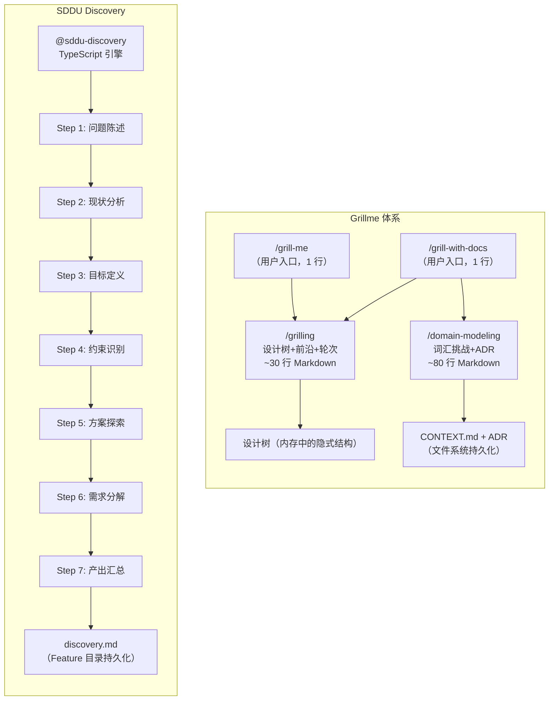

# Grillme 深度调研报告

> 调研对象：[mattpocock/skills](https://github.com/mattpocock/skills) 中的 `/grill-me` 技能体系
> 调研日期：2026-08-05
> 调研人：opencode (SDDU team)
> 对标项目：SDDU (本项目) — 重点对标 `@sddu-discovery` 需求挖掘引擎

---

## 1. 项目概览

| 维度 | Grillme 体系 | SDDU Discovery |
|------|-------------|----------------|
| 定位 | Agent 驱动的苏格拉底式需求访谈（"grilling"= 烤问/盘问） | 结构化 7 步需求挖掘引擎 |
| 作者 | Matt Pocock (独立开发者 / Total TypeScript) | THZSummer |
| 许可证 | MIT | MIT |
| 仓库 Stars | ~204k (整个 skills 仓库) | — |
| 平台支持 | Claude Code, Codex, 及其他支持 skill 的 Agent | OpenCode 专属 |
| 核心形态 | 纯 Markdown SKILL.md（零代码） | TypeScript 插件 + 状态机 |
| 触发方式 | 用户键入 `/grill-me` 或 `/grill-with-docs` | `@sddu-discovery [feature-name]` |

**一句话总结**：Grillme 是一套**轻量、可组合的 Agent 访谈协议**，通过"设计树 + 前沿 + 轮次"三要素让 Agent 系统性地盘问用户需求；SDDU Discovery 是一个**重型的结构化挖掘引擎**，用 7 步子工作流 + 状态机实现深度需求澄清。两者的本质差异是"轻量协议"vs"重型框架"。

---

## 2. 技能架构

### 2.1 Grillme 三层技能体系

Grillme 不是一个孤立的技能，而是一个三层技能体系的**用户可见入口**：

```
┌─────────────────────────────────────────────────────┐
│  用户入口层（User-invoked，disable-model-invocation）   │
│                                                     │
│  /grill-me          /grill-with-docs                │
│  "盘问我的计划"      "盘问 + 建立领域模型"             │
│                                                     │
│  职责：用户主动触发，Agent 不自动调用                   │
├─────────────────────────────────────────────────────┤
│  核心原语层（Model-invoked）                           │
│                                                     │
│  /grilling          /domain-modeling                │
│  "设计树 + 前沿 + 轮次"  "领域建模 + ADR + 词汇表"      │
│                                                     │
│  职责：Agent 可自动调用，是可复用的 discipline           │
├─────────────────────────────────────────────────────┤
│  基础设施层                                           │
│                                                     │
│  CONTEXT.md         ADR (docs/adr/)                 │
│  "项目词汇表/共享语言"  "架构决策记录"                   │
│                                                     │
│  职责：持久化的共享语言与决策知识库                       │
└─────────────────────────────────────────────────────┘
```

**关键设计**：Grillme 体系区分了"谁来触发"——用户调用的 skill 只做编排（`grill-me` 调用 `grilling`），模型可自动调用的 skill 包含可复用的纪律（`grilling` 本身）。这与 SDDU 的 `@sddu` 智能路由 → 阶段 Agent 的分发模式形成对照。

### 2.2 技能清单

| 文件 | 层级 | 触发者 | 描述 |
|------|------|--------|------|
| `skills/productivity/grill-me/SKILL.md` | 入口 | 用户 | 一行委托：`Run a /grilling session.` |
| `skills/engineering/grill-with-docs/SKILL.md` | 入口 | 用户 | 一行委托：`Run a /grilling session, using the /domain-modeling skill.` |
| `skills/productivity/grilling/SKILL.md` | 核心原语 | 模型 | 完整的"设计树 + 前沿 + 轮次"访谈协议，~30 行 Markdown |
| `skills/engineering/domain-modeling/SKILL.md` | 核心原语 | 模型 | 主动构建领域模型，词条挑战、术语消歧、场景压力测试、ADR 判定，~80 行 Markdown |

---

## 3. Grilling 核心协议深度分析

### 3.1 设计树 (Design Tree)

Grilling 的核心抽象是一棵**设计树**——每个决策节点下面挂着依赖该决策的子决策：

```
                    [用户原始想法]
                   /        |        \
              Q1:用什么框架  Q2:目标用户  Q3:数据存储
              /    \         /   \        /   |   \
          Next.js Remix   个人 企业  PostgreSQL SQLite MongoDB
          /   \     \
        SSR? 部署?  ...
```

**与 SDDU Discovery 的对比**：
- SDDU Discovery 用 7 步线性子工作流（问题陈述→现状分析→目标定义→约束识别→方案探索→需求分解→产出汇总），**不显式建模依赖关系**
- Grilling 用树结构显式表达决策间的依赖，**前沿机制保证问问题的顺序正确**

### 3.2 前沿 (Frontier) 与轮次 (Rounds)

这是 Grilling 最精妙的设计：

> **前沿 (Frontier)** = 所有前置条件已满足、可以"现在"就问的决策节点。
> 每一轮，将整个前沿一次性抛出给用户。

```
Round 1 — 前沿: {Q1, Q2, Q3}（三个都不互相依赖）
  → 用户回答 Q1=Next.js, Q2=企业, Q3=PostgreSQL

Round 2 — 前沿: {Q4(SSR?), Q5(认证方案), Q6(表结构)}（现在这些可以问了）
  → ...
```

**关键约束**：
- 一个问题的答案如果依赖另一个还没回答的问题 → 放到**后续轮次**
- 事实性问题由 Agent 自己去查（dispatch sub-agent），**不扔给用户**
- 决策性问题是用户的职责，"把每个决定抛给他们，然后等待"

**与 SDDU 的对比**：

| 维度 | Grilling 前沿机制 | SDDU Discovery 7 步 |
|------|-------------------|---------------------|
| 问题排序 | 依赖驱动，自动计算前沿 | 固定线性流程 |
| 批量提问 | 一轮抛出所有可问问题 | 逐步引导式 |
| 事实获取 | Agent 自己查，不占用户 | 同样强调"不替用户决定，但帮用户找事实" |
| 会话效率 | 高（批量提问减少往返） | 中（线性步进，逐一确认） |
| 适用场景 | 需求已部分成形，需快速对齐 | 需求模糊，需从零梳理 |

### 3.3 问答格式规范

每个问题的标准格式：

```markdown
❓ **Q1** - **<question title>**: <question body, might be multiple paragraphs, 
including multiple choices>

➡️ <your recommended answer>
```

**设计意图**：
- `❓` 前缀明确标识这是一个问题
- 推荐答案降低用户决策成本（Agent 给建议，用户做决定）
- 多段落支持复杂问题的充分展开

### 3.4 终止条件

> "The session is done when the frontier is empty: every branch of the design tree visited, nothing left silently assumed."

**关键洞察**：终止条件不是"用户说 OK"，而是**设计树遍历完毕、没有尚未探访的分支、没有静默假设**。这与 SDDU Discovery 的"产出 discovery.md 即完成"形成对比——Grilling 以**覆盖度**为完成标准，SDDU 以**文档产出的完整性**为标准。

---

## 4. Grill-with-docs：从访谈升级到持久化知识

### 4.1 叠加领域建模

`/grill-with-docs` 在 grilling 的基础上叠加 `/domain-modeling`，将访谈过程中形成的共识**持久化为项目资产**：

| 资产 | 位置 | 内容 |
|------|------|------|
| **词汇表 (Glossary)** | `CONTEXT.md` | 项目共享语言 → 消除 Agent 和用户对术语的理解偏差 |
| **架构决策记录 (ADR)** | `docs/adr/0001-xxx.md` | 不可逆的、有意外性的、经过权衡的设计决策 |

### 4.2 领域建模的五个主动行为

Domain-modeling skill 定义了 Agent 在对话中应主动执行的五种行为：

| # | 行为 | 示例 | SDDU 对应 |
|---|------|------|----------|
| 1 | **挑战词汇表** | "你的 glossary 里 'cancellation' 是 X，但你现在似乎指 Y — 到底是哪个？" | Discovery Step 3: 约束识别 |
| 2 | **消歧模糊语言** | "你说 'account' — 是 Customer 还是 User？这是两个不同的东西" | Discovery Step 2: 现状分析 |
| 3 | **讨论具体场景** | "如果用户取消了一个包含 3 件商品的订单，其中 1 件已发货 — 系统应该怎么做？" | Discovery Step 4: 方案探索（但 SDDU 更偏可行性，Grilling 更偏边界压力测试） |
| 4 | **对照代码** | "你的代码里取消的是整个 Order，但你刚说支持部分取消 — 哪个是对的？" | Validate 阶段（但 Grilling 在访谈阶段就做，前置反馈） |
| 5 | **即时更新 CONTEXT.md** | "术语确定了就立刻写进去，不要攒着批量更新" | SDDU 的中间产物不即时更新（按阶段产出） |

### 4.3 ADR 的判定标准（三条必须同时满足）

```
Only offer to create an ADR when all three are true:
1. Hard to reverse — 变更成本有实际意义
2. Surprising without context — 未来读者会好奇"为什么这么做"
3. The result of a real trade-off — 有真实备选，且你为特定理由选择了其中之一
```

**设计哲学**：ADR 不是越多越好。三条标准构成一个精密的过滤器——大多数日常决策会被过滤掉，只有真正需要记录的架构决策才会进入 ADR。

### 4.4 多上下文支持

Domain-modeling 支持通过 `CONTEXT-MAP.md` 管理多个上下文的场景（如 monorepo 中 `src/ordering/` 和 `src/billing/` 各有独立的 `CONTEXT.md` 和 `docs/adr/`）：

```
/
├── CONTEXT-MAP.md           ← 多上下文索引
├── docs/adr/                ← 系统级 ADR
├── src/ordering/
│   ├── CONTEXT.md           ← ordering domain 词汇表
│   └── docs/adr/            ← ordering domain ADR
└── src/billing/
    ├── CONTEXT.md           ← billing domain 词汇表
    └── docs/adr/
```

**SDDU 对比**：SDDU 的 specs-tree-root 天然支持 Feature 树形嵌套（子 Feature 各自独立走完整流程），但 SDDU 的 Feature 划分是**按功能边界**，Grilling 的多上下文是按**领域语言边界**。两者可以互补——SDDU 的 Feature 目录下也可以有 CONTEXT.md。

---

## 5. Grillme 与 Superpowers Brainstorming 对比

> 注：Superpowers 的 brainstorming 已在 [superpowers-competitor-analysis.md](./superpowers-competitor-analysis.md) 中分析，此处聚焦与 grillme 的对比。

| 维度 | Superpowers Brainstorming | Grillme (grilling) |
|------|---------------------------|---------------------|
| **访谈策略** | 苏格拉底式：一次一个问题，逐步精炼 | 前沿批量式：一整轮多问题同时抛 |
| **会话效率** | 低（单问题往返多轮） | 高（批量提问，减少往返） |
| **依赖建模** | 隐式（通过对话自然推进） | 显式（设计树 + 前沿机制） |
| **推荐答案** | 有（给出 2-3 方案 + 推荐） | 有（每个问题都带 `➡️ 推荐答案`） |
| **自审查** | 有（placeholder / 一致性 / 范围 / 歧义检查） | 无显式自审步骤（依赖领域建模的词汇挑战） |
| **产出物** | design doc | grill-me: 无产出（纯理解对齐）; grill-with-docs: CONTEXT.md + ADR |
| **规模** | ~150 行 SKILL.md（含示例、模板、self-review 等） | grilling 本体仅 ~30 行；叠加 domain-modeling ~80 行 |
| **复杂度** | 中 | 极简（grilling 核心协议 30 行） |

### 核心差异判断

| 判断 | Superpowers Brainstorming | Grillme |
|------|---------------------------|---------|
| 适合场景 | 从零构思全新 Feature，用户自己也说不清楚要什么 | 用户已有初步想法，需要 Agent 系统性地追问和消歧 |
| 设计哲学 | "I'll ask one question at a time" — 降低认知负荷 | "Ask the whole frontier in one round" — 最大化信息密度 |
| 产出定位 | 产出正式的设计文档（design doc）供后续 plan 消费 | 产出共享语言（glossary）供后续所有会话消费 |

---

## 6. Grillme 与 SDDU Discovery 对比

### 6.1 架构对比



### 6.2 维度对比

| 维度 | Grillme | SDDU Discovery |
|------|---------|----------------|
| **实现方式** | 纯 Markdown Prompt（零代码） | TypeScript 引擎 + 状态机 |
| **核心抽象** | 设计树（决策依赖图） | 7 步线性工作流 |
| **问题排序** | 依赖驱动（前沿机制自动计算） | 固定线性顺序 |
| **提问密度** | 整轮批量（一次 3-8 个问题） | 逐步引导（每次 1-2 个问题） |
| **事实获取** | Agent dispatch sub-agent 自查 | Agent 通过工具自查（类似） |
| **推荐意见** | 每个问题都带推荐答案 | 在步骤 5（方案探索）给出建议 |
| **产出物** | grill-me: 无文件产出; grill-with-docs: CONTEXT.md + ADR | discovery.md（结构化需求文档） |
| **领域建模** | 内嵌（domain-modeling 作为独立 discipline） | 内嵌（约束识别 + 方案探索中包含领域分析，但无独立词汇表管理） |
| **持久化策略** | 即时写入（"capture them as they happen"） | 按阶段写入（7 步全部完成后产出文档） |
| **代码对照** | 访谈阶段即对照代码（"check whether the code agrees"） | validate 阶段才对照（晚了 6 个阶段） |
| **前置条件** | 无（可在任何项目中运行） | 需 `.sddu/` 目录 + Feature 注册 |
| **文档重量** | 极轻（grilling 核心 30 行） | 重（Discovery 引擎 + 模板系统） |

### 6.3 流程效率对比

以"用户想做一个用户权限系统"为例：

**Grillme 流程（grill-with-docs）**：
```
Round 1: 前沿批量提问（5-8 个问题，1 轮）
  Q1: 权限模型？RBAC / ABAC / ReBAC → 推荐 RBAC
  Q2: 权限粒度？资源级 / 操作级 → 推荐操作级
  Q3: 用户类型？内部员工 / 外部客户 → 推荐内部员工
  Q4: 认证方式？JWT / Session / OAuth → 推荐 JWT
  Q5: 需要审计日志吗？ → 推荐需要
  Q6: 与现有 User 模块的关系？→ Agent 自查代码

Round 2: 前沿推进（3-5 个问题，1 轮）
  Q7: 角色层级？扁平 / 树形 → 推荐树形，最多 3 层
  Q8: 权限缓存策略？→ 推荐 Redis + 热更新
  Q9: 超级管理员绕过？→ 推荐有，但需审计

Round 3: 前沿收尾（1-2 个问题，1 轮）
  Q10: 权限变更通知机制？→ 推荐 WebSocket 推送

→ 完成（3 轮），同时产出：
  - CONTEXT.md（role, permission, policy, assignment... 术语表）
  - docs/adr/0001-rbac-over-abac.md
  - docs/adr/0002-tree-role-hierarchy.md
```

**SDDU Discovery 流程**：
```
Step 1: 问题陈述 → 与用户确认"用户权限系统"的范围描述
Step 2: 现状分析   → 扫描现有代码中的认证相关模块
Step 3: 目标定义   → 定义权限系统的功能/非功能目标
Step 4: 约束识别   → 技术约束、业务约束、时间约束
Step 5: 方案探索   → RBAC vs ABAC vs ReBAC 对比分析
Step 6: 需求分解   → 将需求拆为子需求
Step 7: 产出汇总   → 生成 discovery.md

→ 完成（7 步），产出：
  - .sddu/specs-tree-root/<feature>/discovery.md
  - state.json (phase: discovered)
```

**效率对比**：

| 指标 | Grillme | SDDU Discovery |
|------|---------|----------------|
| 用户交互轮次 | 3-5 轮 | 7-14 轮（每步 1-2 次确认） |
| 完成时间估计 | 5-10 分钟 | 15-30 分钟 |
| 产出深度 | 中（术语表 + 关键 ADR） | 深（完整结构化需求文档） |
| 可追溯性 | 中（CONTEXT.md + ADR） | 高（discovery.md 在 Feature 目录中，可被后续阶段引用） |
| 适合的后续流程 | 直接进入 to-spec / implement | 进入 spec → plan → tasks → build → review → validate |

---

## 7. Grillme 的可借鉴之处

### 7.1 高优先级（建议短期借鉴）

#### 7.1.1 设计树 + 前沿机制 → 优化 Discovery 访谈效率

**现状**：SDDU Discovery 的 7 步是固定线性流程，每步逐一确认。在用户已有明确想法时，线性流程会产生过多往返。

**借鉴方案**：
- 在 Discovery Step 5（方案探索）中引入"前沿"概念：将所有不互相依赖的决策问题批量抛出
- 不改变 7 步结构，但在每步内部允许批量提问
- 保持"推荐答案"机制（SDDU 已有，可强化格式）

**收益**：减少需求明确的场景下的沟通往返次数，提升 Discovery 效率。

#### 7.1.2 共享语言机制 → SDDU 引入 CONTEXT.md / 词汇表

**现状**：SDDU 的 Feature 产物（discovery.md / spec.md / plan.md）记录的是需求和技术方案，但缺少一个**跨会话持久化的领域词汇表**。Agent 每次进入新会话都需要重新理解术语。

**借鉴方案**：
- 在每个 Feature 目录下支持 `CONTEXT.md`，记录该 Feature 的共享语言
- `@sddu-docs` 在扫描时自动聚合各 Feature 的 CONTEXT.md 到项目级词汇表
- `@sddu` 入口在路由到阶段 Agent 时，注入相关 CONTEXT.md 作为上下文

**收益**：显著降低 Agent 对项目术语的理解偏差，减少跨会话的重复解释。

#### 7.1.3 即时写入策略 → SDDU 考虑增量产物更新

**现状**：SDDU 的产物（discovery.md / spec.md / plan.md 等）是**按阶段完成后一次性产出**的。这意味着阶段进行中的洞察和决策不立即可追溯。

**借鉴方案**：
- 在阶段 Agent 的 Prompt 中增加"即时记录关键决策"的指令
- 不必改变整体的阶段流转模型，但允许在阶段内部进行增量写入
- 特别适用于 discovery 和 spec 阶段——这两个阶段的信息密度最高

**收益**：防止 Agent 在长会话中遗忘早期决策（尤其是在 context compaction 之后）。

### 7.2 中优先级（建议中期借鉴）

#### 7.2.1 代码对照前置 → 在 Discovery/Spec 阶段即验证一致性

**现状**：SDDU 的代码一致性检查主要发生在 validate 阶段（最后一步）。这意味着需求与代码之间的偏差可能在 6 个阶段后才被发现。

**借鉴方案**：
- 在 `@sddu-discovery` 和 `@sddu-spec` 的 Prompt 中增加"对照现有代码"的指令
- 不是做完整的代码审查，而是检查用户描述与代码现实之间是否有明显矛盾
- 发现矛盾时立即向用户提出，而非等到 validate 阶段

**收益**：早期发现认知偏差，避免在错误的假设上构建整个 Feature。

#### 7.2.2 ADR 判定标准 → 为 SDDU 的 plan 阶段增加 ADR 触发条件

**现状**：SDDU 的 plan 阶段产出 plan.md 和技术方案，但没有区分"常规技术决策"和"需要正式记录的架构决策"。

**借鉴方案**：
- 借鉴 Grillme 的三条 ADR 判定标准，在 `@sddu-plan` 的 Prompt 中增加 ADR 触发逻辑
- 当决策满足"不可逆 + 有意外性 + 经过权衡"时，自动建议创建 ADR
- ADR 可直接放在 Feature 目录下（如 `adr/0001-xxx.md`）

**收益**：提升技术决策的可追溯性，让未来开发者理解"为什么这么设计"。

### 7.3 低优先级（长期参考）

#### 7.3.1 纯 Markdown 技能模式 → SDDU Skill 系统参考

Grillme 的 grilling 核心协议仅 30 行 Markdown。SDDU 可以借鉴这种极简风格来设计 SDDU Skill（`.sddu/skills/`），确保 Skill 轻量、可读、无编译开销。

#### 7.3.2 多上下文支持 → SDDU monorepo 支持

Grillme 的 `CONTEXT-MAP.md` 多上下文索引机制可作为 SDDU 未来支持 monorepo 的参考——每个 sub-project 各有独立的 specs-tree-root + CONTEXT.md。

---

## 8. SDDU 的差异化优势（应保持）

以下是 SDDU 相对 Grillme 的优势：

| 优势 | 说明 |
|------|------|
| **状态机保障** | Grillme 的访谈质量完全依赖 Agent 是否按 Prompt 执行（无代码强制）；SDDU 的 Discovery 受状态机管理，`PhaseReversalError` 和 `PhaseSkipError` 提供代码级约束 |
| **结构化产物** | Grillme 的产出是 CONTEXT.md + ADR（松散自由格式）；SDDU 的 discovery.md 是结构化文档（含问题陈述、现状、目标、约束、方案、需求分解） |
| **完整流程衔接** | Grillme 访谈后需用户手动驱动后续流程；SDDU 的 Discovery 是 8 阶段管道的第一环，`state.json` 自动路由到下一阶段 |
| **Feature 嵌套** | Grillme 无 Feature 树概念；SDDU 支持 Feature → 子 Feature 的树形嵌套，每个节点独立走完整流程 |
| **项目级管理** | Grillme 是会话级工具；SDDU 提供 Roadmap + Tree + Docs 的项目级管理能力 |

---

## 9. 量化对比总表

| 维度 | Grillme (grilling) | Superpowers Brainstorming | SDDU Discovery |
|------|-------------------|---------------------------|----------------|
| 核心协议行数 | ~30 行 Markdown | ~150 行 Markdown | ~500+ 行 TypeScript |
| 依赖建模 | 设计树（显式 DAG） | 隐式（对话自然推进） | 无显式依赖图 |
| 提问策略 | 前沿批量（1 轮 N 问题） | 单问题逐步（1 轮 1 问题） | 逐步引导（1 步 1-2 问题） |
| 推荐答案 | 每题必带推荐 | 2-3 方案 + 推荐 | 方案探索时给出建议 |
| 自审查 | 无显式（依赖 domain-modeling） | 有（placeholder / 一致性 / 范围 / 歧义） | 无显式（依赖 review Agent） |
| 产出深度 | 浅→中（词汇表 + ADR） | 中（design doc） | 深（结构化需求文档） |
| 持久化策略 | 即时写入 | 按阶段写入 | 按阶段写入 |
| 代码对照时机 | 访谈阶段 | 无明显机制 | validate 阶段 |
| 共享语言管理 | 强（CONTEXT.md + 即时更新） | 无明显机制 | 弱（依赖 discovery.md 中的术语描述） |
| 多项目/多上下文 | 支持（CONTEXT-MAP.md） | 无明显机制 | 支持（specs-tree-root 的树形 Feature 嵌套） |
| 流程强制力 | Prompt 层 | Prompt 层（`<HARD-GATE>` 等） | 代码层（状态机 + 异常） |
| 可组合性 | 极强（grilling 作为可复用原语，被多个入口调用） | 中（skill 间用 `REQUIRED SUB-SKILL` 交叉引用） | 弱（Agent 间靠 `@sddu` 路由，无 sub-skill 级别的复用） |
| 学习成本 | 极低（30 行协议） | 低（读 SKILL.md 即可） | 中（需理解 8 阶段 + 状态机 + 模板系统） |

---

## 10. 建议行动项

基于以上分析，建议在 SDDU 路线图中考虑以下行动项（按优先级排序）：

### P0：Discovery 访谈效率优化 — 引入"前沿批量提问"
- 在 `@sddu-discovery` 的 Step 5（方案探索）中，识别不互相依赖的决策问题，成批抛出
- 每个问题附带推荐答案
- 不影响 7 步结构，在步骤内部优化交互模式
- **目标**：将有明确想法的用户的 Discovery 时间从 15-30 分钟降低到 10-15 分钟

### P0：引入 Feature 级 CONTEXT.md — 共享语言管理
- 在每个 Feature 目录下支持可选 `CONTEXT.md`
- 记录该 Feature 的术语表（词条 + 定义）
- `@sddu-docs` 聚合全项目词汇表
- `@sddu` 路由时注入相关 CONTEXT.md
- **目标**：消除 Agent 跨会话的术语理解偏差

### P1：Discovery/Spec 阶段增加代码一致性预检
- 在 `@sddu-discovery` 和 `@sddu-spec` 的 Prompt 中增加"对照现有代码"指令
- 不做完整审查，只检查用户描述与代码现实之间是否有**明显矛盾**
- 发现矛盾时立即抛出，不等到 validate 阶段
- **目标**：早期发现认知偏差，减少 6 阶段后的返工

### P1：Plan 阶段增加 ADR 触发条件
- 借鉴 Grillme 三条 ADR 判定标准（不可逆 + 有意外性 + 经过权衡）
- 在 `@sddu-plan` 中，当决策满足条件时自动建议创建 ADR
- ADR 存储在 Feature 目录的 `adr/` 子目录
- **目标**：提升技术决策的可追溯性

### P2：SDDU Skill 系统 — 参考 Grillme 的极简风格
- SDDU Skill（`.sddu/skills/`）的 SKILL.md 参考 grilling 的 30 行极简风格
- 强调可组合性（将一个 Skill 作为原语被其他 Skill 调用）
- 区分 User-invoked 和 Model-invoked
- **目标**：降低创建 SDDU Skill 的门槛

---

## 11. 附录

### 11.1 Grillme 完整技能文件索引

| 文件路径 | 行数估计 | 核心内容 |
|---------|---------|---------|
| `skills/productivity/grill-me/SKILL.md` | ~10 行 | 入口，委托到 `/grilling` |
| `skills/productivity/grilling/SKILL.md` | ~30 行 | 核心协议：设计树、前沿、轮次、问答格式、终止条件 |
| `skills/engineering/grill-with-docs/SKILL.md` | ~10 行 | 入口，委托到 `/grilling` + `/domain-modeling` |
| `skills/engineering/domain-modeling/SKILL.md` | ~80 行 | 领域建模：词汇挑战、消歧、场景测试、代码对照、ADR 判定 |
| `CONTEXT.md`（仓库级） | ~30 行 | 仓库自身的词汇表示例 |
| `AGENTS.md` | 未知 | Agent 全局指令 |

### 11.2 关键设计原则提取

从 Grillme 体系中提取的、可作为 SDDU 设计参考的关键原则：

1. **"把事实查找留给 Agent，把决策留给用户"** — `Finding facts is your job, never the user's.`
2. **"即时捕获，不要攒着"** — `Capture them as they happen. Don't batch these up.`
3. **"ADR 不是越多越好"** — 三条标准严格过滤，只有真正需要记录的决策才进入 ADR。
4. **"前沿为空即完成"** — 完成标准是覆盖度，不是用户说 OK。
5. **"区分谁来触发"** — User-invoked 只做编排，Model-invoked 包含可复用纪律。
6. **"一个术语确定就立刻写进词汇表"** — `When a term is resolved, update CONTEXT.md right there.`
7. **"在访谈阶段就对照代码"** — `When the user states how something works, check whether the code agrees.`

### 11.3 参考链接

- Matt Pocock Skills 仓库: https://github.com/mattpocock/skills
- Grill-me SKILL.md: https://github.com/mattpocock/skills/blob/main/skills/productivity/grill-me/SKILL.md
- Grilling SKILL.md: https://github.com/mattpocock/skills/blob/main/skills/productivity/grilling/SKILL.md
- Grill-with-docs SKILL.md: https://github.com/mattpocock/skills/blob/main/skills/engineering/grill-with-docs/SKILL.md
- Domain-modeling SKILL.md: https://github.com/mattpocock/skills/blob/main/skills/engineering/domain-modeling/SKILL.md
- Skills Newsletter: https://www.aihero.dev/s/skills-newsletter
- Skills.sh: https://skills.sh/mattpocock/skills
