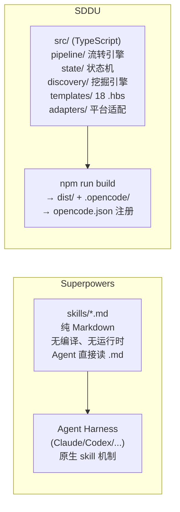
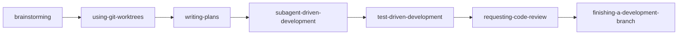
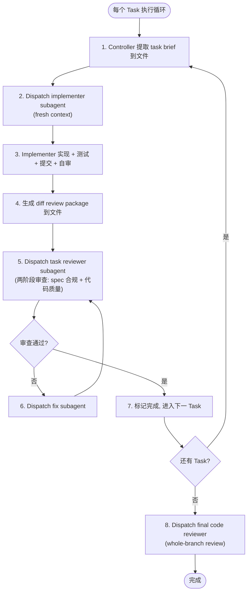
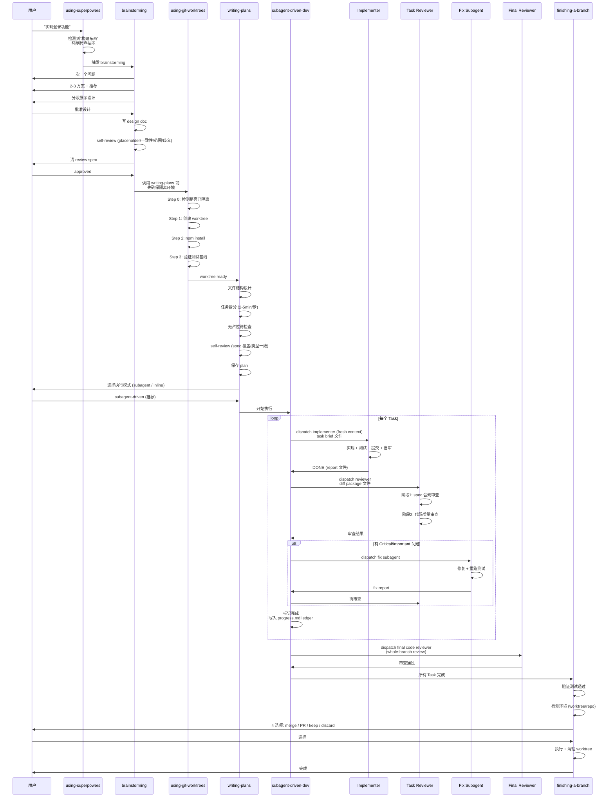

# Superpowers 竞品调研报告

> 调研对象：[obra/superpowers](https://github.com/obra/superpowers)
> 调研日期：2026-07-11
> 调研人：opencode (SDDU team)
> 对标项目：SDDU (本项目)

---

## 1. 项目概览

| 维度 | Superpowers | SDDU |
|------|-------------|------|
| 定位 | AI 编程 Agent 的「软件开发方法论」技能集 | OpenCode 插件，规范驱动开发 8 阶段工作流 |
| 作者 | Jesse Vincent / Prime Radiant Inc. | THZSummer |
| 许可证 | MIT | MIT |
| GitHub Stars | ~252k | — |
| 平台支持 | Claude Code, Codex, Cursor, Copilot, OpenCode, Antigravity, Factory Droid, Kimi Code, Pi (11+ 平台) | OpenCode 专属 |
| 核心形态 | 纯 Markdown 技能文件 (SKILL.md)，无运行时代码 | TypeScript 插件 + 状态机 + 模板引擎 |
| 安装方式 | 各平台插件市场 / `opencode.json` plugin 数组 | `bootstrap.sh` 一键安装到项目 |

**一句话总结**：Superpowers 是一个**平台无关的 AI 编程方法论技能库**，用纯 Markdown 文件让任意 AI Agent 获得 TDD、计划驱动、子代理协作等能力；SDDU 是一个**OpenCode 专属的结构化开发框架**，用状态机 + Agent 编排实现强制的阶段流转。

---

## 2. 架构深度对比

### 2.1 技术架构



**关键差异**：

| 维度 | Superpowers | SDDU |
|------|-------------|------|
| 实现语言 | 纯 Markdown（零代码） | TypeScript（状态机 + 编译） |
| 运行时依赖 | 无（Agent 原生读取） | Node.js + OpenCode Plugin SDK |
| 状态管理 | 文件系统（git + ledger 文件） | JSON Schema 状态机（v3.0.0, phase(8) + status(5)） |
| 阶段流转强制力 | Prompt 层强制（`<HARD-GATE>` 标签 + 理性化对抗表） | 代码层强制（`PhaseReversalError` + `PhaseSkipError` + 依赖检查） |
| 模板系统 | 无模板引擎，直接在 SKILL.md 中写死结构 | Handlebars (.hbs) 模板引擎，18 个模板 |
| 构建步骤 | 无 | `npm run build` + `npm run package` |

### 2.2 工作流对比

#### Superpowers 工作流（7 步，隐式流转）



- **隐式流转**：没有状态机，靠 SKILL.md 之间的 `REQUIRED SUB-SKILL` 交叉引用形成链
- **入口**：`using-superpowers` skill 在会话启动时注入，强制 Agent 在任何行动前检查技能
- **流转触发**：上一个 skill 的终态明确指向下一个 skill（如 brainstorming 终态 = "invoke writing-plans"）

#### SDDU 工作流（8 阶段，显式状态机）


- **显式流转**：`StateMachine` 类管理 `state.json`，`phase` 字段记录当前位置
- **入口**：`@sddu` 智能路由，根据 `state.json` 的 phase 自动分发到阶段 Agent
- **流转触发**：`validateStageTransition()` 检查 phase 顺序 + 必需文件 + 依赖关系，通过后 `updateState()` 写入新 phase
- **强制约束**：`PhaseReversalError`（不可回退）、`PhaseSkipError`（不可跳步）、`DependencyChecker`（依赖未满足则阻塞）

### 2.3 阶段映射

| Superpowers 步骤 | SDDU 阶段 | 对应关系 |
|-----------------|-----------|----------|
| brainstorming | discovery (0) + spec (1) | SP 合并为一个 brainstorming；SDDU 拆为挖掘 + 规范 |
| using-git-worktrees | — | SDDU 无 worktree 管理（设计选择） |
| writing-plans | plan (2) + tasks (3) | SP 合并为一个 writing-plans；SDDU 拆为方案 + 任务 |
| subagent-driven-development | build (4) | 核心对应：SP 用子代理逐任务执行 |
| test-driven-development | — | SDDU 无独立 TDD 阶段（融入 build） |
| requesting-code-review | review (5) | 直接对应 |
| verification-before-completion | validate (6) | 直接对应 |
| finishing-a-development-branch | — | SDDU 无分支收尾（设计选择） |
| systematic-debugging | — | SDDU 无调试技能 |
| — | registered (-1) | SDDU 独有：Feature 注册阶段 |
| — | roadmap / tree / docs | SDDU 独有：辅助 Agent |

---

## 3. 核心机制深度分析

### 3.1 Superpowers 的核心创新

#### 3.1.1 子代理驱动开发 (Subagent-Driven Development)

这是 Superpowers 最核心、最成熟的能力，也是 SDDU 当前缺失的：



**关键设计点**：
- **Fresh context per task**：每个子代理从零开始，Controller 精心构建上下文
- **File-based handoff**：所有传递物（task brief、report、diff）走文件而非粘贴，避免 Controller 上下文膨胀
- **两阶段审查**：先查 spec 合规（不多做不少做），再查代码质量
- **Model selection**：按任务复杂度选模型（机械任务用便宜模型，架构任务用强模型）
- **Durable progress ledger**：`progress.md` 文件记录已完成 Task，防 compaction 后丢失
- **Pre-flight plan review**：执行前扫描 plan 冲突，批量提问

#### 3.1.2 理性化对抗 (Rationalization Bulletproofing)

Superpowers 在每个纪律性 skill 中都内置了**理性化对抗机制**：

```markdown
## Common Rationalizations
| Excuse | Reality |
|--------|---------|
| "Too simple to test" | Simple code breaks. Test takes 30 seconds. |
| "I'll test after" | Tests passing immediately prove nothing. |
| "TDD is dogmatic" | TDD IS pragmatic. |
```

- 每个 "借口" 都有对应的 "现实" 反驳
- `Red Flags - STOP and Start Over` 列表
- `<HARD-GATE>` / `<EXTREMELY-IMPORTANT>` XML 标签强化权威性
- `writing-skills` skill 将此方法论系统化：TDD for Skills（RED-GREEN-REFACTOR 应用于文档）

#### 3.1.3 技能自动触发 (Automatic Skill Triggering)

`using-superpowers` skill 在会话启动时注入：

```
If you think there is even a 1% chance a skill might apply, you ABSOLUTELY MUST invoke it.
```

- Agent 在**任何响应前**（包括澄清问题）都必须检查技能
- `Skill Priority`：process skills 优先于 implementation skills
- 平台适配文件：Codex / Pi / Antigravity 各有 `references/xxx-tools.md`

#### 3.1.4 Git Worktree 隔离

`using-git-worktrees` skill 实现了完整的 worktree 生命周期管理：
- Step 0: 检测是否已在隔离环境（避免嵌套）
- Step 1a: 优先用平台原生 worktree 工具
- Step 1b: 降级到 `git worktree add`
- Step 2: 自动检测项目类型并安装依赖
- Step 3: 验证测试基线
- `finishing-a-development-branch` 负责收尾（merge/PR/keep/discard + worktree 清理）

#### 3.1.5 TDD 铁律

```markdown
NO PRODUCTION CODE WITHOUT A FAILING TEST FIRST
```

- 先写测试，看它失败，再写代码
- 写了代码再写测试？删除代码，重来
- 包含完整的 anti-pattern 参考和 "为什么顺序重要" 的论证
- `writing-skills` 将 TDD 方法论应用于技能本身（skill 创建也走 RED-GREEN-REFACTOR）

### 3.2 SDDU 的核心优势

#### 3.2.1 强类型状态机

SDDU 有代码级的状态管理，Superpowers 没有：

```typescript
// SDDU: 代码强制的阶段流转
validatePhaseTransition(currentPhase, targetPhase): {
  if (targetOrder < currentOrder) throw PhaseReversalError;
  if (targetOrder > currentOrder + 1) throw PhaseSkipError;
}
```

- `state.json` 记录 phase + status + phaseHistory
- AJV JSON Schema 校验
- 依赖检查器（Feature 间依赖）
- 状态迁移工具（v1→v2→v3）
- 多 Feature 管理 + 树形结构

#### 3.2.2 Discovery 需求挖掘引擎

SDDU 有独立的 7 步 Discovery 子工作流，Superpowers 的 brainstorming 是对话式的：
- SDDU: `src/discovery/` 独立模块，结构化挖掘
- Superpowers: `brainstorming/SKILL.md` 对话式引导，一次一个问题

#### 3.2.3 树形 Feature 嵌套

SDDU 支持 Feature 下拆子 Feature，每个子 Feature 独立走完整 6 阶段：
- `tree-scanner.ts` / `tree-state-validator.ts` / `parent-state-manager.ts`
- Superpowers 的 `brainstorming` 提到 "decompose into sub-projects" 但无结构化支持

#### 3.2.4 辅助 Agent 体系

| Agent | 功能 | Superpowers 对应 |
|-------|------|-----------------|
| `@sddu-roadmap` | RICE 优先级排序 + 版本路线图 | 无 |
| `@sddu-tree` | 自动扫描 `.sddu/` 生成 TREE.md | 无 |
| `@sddu-docs` | 双模式项目全景文档 | 无 |
| `@sddu` (入口) | 智能路由 + 状态仪表盘 | `using-superpowers`（弱对应） |

#### 3.2.5 模板引擎 + 方法论资产

SDDU 用 Handlebars 模板 (`src/templates/agents/*.hbs`) 生成 Agent 定义，可自定义；Superpowers 的 SKILL.md 是静态 Markdown，修改需直接编辑文件。

---

## 4. 设计哲学对比

| 维度 | Superpowers | SDDU |
|------|-------------|------|
| **核心理念** | 方法论 > 工具；Agent 自律 > 代码强制 | 结构化 > 对话式；代码强制 > Prompt 约束 |
| **强制性来源** | Prompt 层（`<HARD-GATE>` + 理性化对抗表） | 代码层（状态机 + 异常 + 依赖检查） |
| **文档即状态** | `docs/superpowers/specs/` + `plans/` + git | `.sddu/specs-tree-root/` + `state.json` |
| **进度持久化** | `progress.md` ledger 文件（git-ignored） | `state.json`（tracked） |
| **测试哲学** | TDD 铁律，先测试后代码 | 测试在 validate 阶段（非强制 TDD） |
| **子代理** | 核心模式，逐任务 fresh subagent | 有 Task 工具但无系统化子代理驱动 |
| **平台策略** | 多平台（11+），一套 skill 全通用 | OpenCode 专属 |
| **可扩展性** | `writing-skills` 教用户写新 skill（TDD for skills） | 模板引擎 + Agent 注册表 |
| **上下文管理** | File-based handoff，防 Controller 膨胀 | 未显式管理（依赖 Agent 自身） |
| **协作模式** | subagent-driven（自动连续执行）| 人机协作（每阶段用户参与） |

---

## 5. Superpowers 的可借鉴之处

### 5.1 高优先级（建议短期借鉴）

#### 5.1.1 子代理驱动开发模式

**现状**：SDDU 的 `@sddu-build` 是单 Agent 逐任务实现，无系统化的子代理分发 + 两阶段审查。

**借鉴方案**：
- 在 `sddu-build.md.hbs` 中引入 subagent-driven 模式
- 每个 TASK 分发独立子代理执行（fresh context）
- 实现后分发审查子代理（spec 合规 + 代码质量双阶段）
- 用文件传递 task brief / report / diff，避免上下文膨胀
- 引入 `progress.md` ledger 防 compaction 丢失

**预期收益**：大幅提升 build 阶段代码质量，减少人为干预，支持更长时间自主运行。

#### 5.1.2 理性化对抗机制

**现状**：SDDU 的 Agent 模板有阶段约束（"不跳步""不越界"），但缺乏对 Agent 理性化借口的系统性对抗。

**借鉴方案**：
- 在每个阶段 Agent 的 `.hbs` 模板中增加 `Common Rationalizations` 表
- 增加 `Red Flags - STOP` 列表
- 用 `<HARD-GATE>` 类标签强化关键约束
- 参考 `writing-skills` 的 "Match the Form to the Failure" 方法论

#### 5.1.3 TDD 强化

**现状**：SDDU 没有独立的 TDD 约束，测试在 validate 阶段才系统执行。

**借鉴方案**：
- 在 `sddu-build.md.hbs` 中增加 TDD 约束（RED-GREEN-REFACTOR）
- 或新增 `@sddu-tdd` 辅助 Agent
- 至少在 build 阶段增加 "先写失败测试" 的 gate

### 5.2 中优先级（建议中期借鉴）

#### 5.2.1 Git Worktree 隔离

**现状**：SDDU 无 worktree 管理，Feature 开发直接在当前分支。

**借鉴方案**：
- 新增 `@sddu-worktree` 辅助 Agent 或在 `@sddu` 入口中集成
- 实现 worktree 创建 → 项目初始化 → 测试基线验证 → 开发 → 收尾
- 支持平台原生工具优先 + git 降级

#### 5.2.2 系统化调试技能

**现状**：SDDU 无调试技能，debug 依赖 Agent 自身能力。

**借鉴方案**：
- 新增 `@sddu-debug` Agent，实现 4 阶段根因分析
- 或在 `@sddu-validate` 中集成调试流程

#### 5.2.3 File-Based Context Handoff

**现状**：SDDU 未显式管理 Agent 间上下文传递。

**借鉴方案**：
- Controller Agent（`@sddu`）分发任务时将上下文写入文件
- 子代理读取文件而非继承会话历史
- 报告也写入文件，Controller 只读摘要

### 5.3 低优先级（长期参考）

#### 5.3.1 多平台支持

**现状**：SDDU 仅支持 OpenCode。

**参考**：Superpowers 的多平台适配策略（每个平台一个 `references/xxx-tools.md`）可作为未来扩展参考，但非当前优先级。

#### 5.3.2 技能自动触发机制

**现状**：SDDU 靠 `@sddu` 入口 + 用户显式调用。

**参考**：Superpowers 的 `using-superpowers` 会话启动注入 + "1% 可能就要调用" 策略，可作为提升 Agent 主动性的参考。

#### 5.3.3 Skill 编写方法论

**现状**：SDDU 用 `.hbs` 模板引擎，修改需改 `src/` + rebuild。

**参考**：Superpowers 的 `writing-skills` skill 将 TDD 应用于技能创建（RED-GREEN-REFACTOR for docs），以及 SDO（Skill Discovery Optimization）方法论，可提升 SDDU 模板质量。

---

## 6. SDDU 的差异化优势（应保持）

以下是 SDDU 相对 Superpowers 的优势，应在路线图中保持和强化：

| 优势 | 说明 |
|------|------|
| **代码级状态机** | `PhaseReversalError` + `PhaseSkipError` + AJV 校验比 Prompt 层约束更可靠 |
| **树形 Feature 嵌套** | 支持 Feature→子 Feature 的完整工作流，Superpowers 只建议拆分但无结构化支持 |
| **Discovery 挖掘引擎** | 独立 7 步结构化挖掘，比 brainstorming 的对话式更系统 |
| **Roadmap + Tree + Docs** | 三个辅助 Agent 提供 Superpowers 没有的项目级管理能力 |
| **模板引擎** | `.hbs` 可自定义，比静态 Markdown 更灵活 |
| **状态仪表盘** | `@sddu 状态` 6 区分类仪表盘，Superpowers 无项目级状态视图 |

---

## 7. 量化对比总表

| 维度 | Superpowers | SDDU | 优势方 |
|------|-------------|------|--------|
| 平台覆盖 | 11+ 平台 | 1 (OpenCode) | SP |
| GitHub 社区 | 252k stars | — | SP |
| 安装复杂度 | 极低（一行配置） | 低（bootstrap.sh） | SP |
| 状态管理可靠性 | Prompt 层 | 代码层 (JSON Schema + 异常) | SDDU |
| 阶段流转强制力 | Prompt 层 (<HARD-GATE>) | 代码层 (PhaseReversalError) | SDDU |
| 子代理驱动 | 成熟（两阶段审查 + model selection） | 无系统化实现 | SP |
| TDD 强制 | 铁律级（先测试后代码） | 非强制（validate 阶段） | SP |
| 调试方法论 | 4 阶段根因分析 | 无 | SP |
| Git Worktree | 完整生命周期 | 无 | SP |
| 理性化对抗 | 系统化（借口表 + Red Flags） | 基础约束 | SP |
| 上下文管理 | File-based handoff | 未显式管理 | SP |
| Feature 嵌套 | 建议拆分但无支持 | 树形结构化支持 | SDDU |
| 需求挖掘 | 对话式 brainstorming | 7 步结构化引擎 | SDDU |
| 项目级管理 | 无 | Roadmap + Tree + Docs | SDDU |
| 模板可定制 | 静态 Markdown | Handlebars 引擎 | SDDU |
| 状态可视化 | 无 | 6 区仪表盘 | SDDU |
| 构建复杂度 | 零编译 | tsc + build:agents | SP |
| 可测试性 | drill eval harness | Jest + E2E | 平 |

---

## 8. 建议行动项

基于以上分析，建议在 SDDU 路线图中考虑以下行动项（按优先级排序）：

### P0: 子代理驱动 Build 阶段
- 在 `sddu-build.md.hbs` 中实现 subagent-driven 模式
- 逐任务 fresh subagent + 两阶段审查（spec 合规 + 代码质量）
- File-based handoff（task brief / report / diff 走文件）
- `progress.md` ledger 防 compaction

### P1: 理性化对抗 + TDD 强化
- 各阶段 `.hbs` 模板增加 `Common Rationalizations` 表 + `Red Flags` 列表
- Build 阶段增加 TDD gate（先写失败测试）
- 关键约束用 `<HARD-GATE>` 类标签强化

### P2: Git Worktree 隔离
- 新增 worktree 管理 Agent 或集成到入口
- 实现 worktree 全生命周期（创建→初始化→基线→开发→收尾）

### P3: 系统化调试
- 新增 debug Agent 或集成到 validate
- 4 阶段根因分析（调查→模式→假设→实现）

### P4: 上下文管理优化
- Controller Agent 用文件传递上下文
- 子代理读文件而非继承会话
- 报告写入文件，Controller 只读摘要

---

## 9. 附录

### 9.1 Superpowers 技能清单（14 个）

| 类别 | 技能 | 描述 |
|------|------|------|
| 协作 | brainstorming | 苏格拉底式设计精炼 |
| 协作 | writing-plans | 详细实现计划（bite-sized tasks） |
| 协作 | executing-plans | 批量执行 + 检查点 |
| 协作 | subagent-driven-development | 子代理逐任务 + 两阶段审查 |
| 协作 | dispatching-parallel-agents | 并行子代理 |
| 协作 | requesting-code-review | 代码审查模板 |
| 协作 | receiving-code-review | 审查反馈响应 |
| 协作 | using-git-worktrees | 隔离工作区 |
| 协作 | finishing-a-development-branch | 分支收尾 |
| 测试 | test-driven-development | RED-GREEN-REFACTOR 铁律 |
| 调试 | systematic-debugging | 4 阶段根因分析 |
| 调试 | verification-before-completion | 完成前验证 |
| 元 | writing-skills | TDD for Skills（技能创建方法论） |
| 元 | using-superpowers | 技能系统引导（会话启动注入） |

### 9.2 Superpowers 工作流序列图



### 9.3 参考链接

- Superpowers 仓库: https://github.com/obra/superpowers
- 发布公告: https://blog.fsck.com/2025/10/09/superpowers/
- Prime Radiant (公司): https://primeradiant.com
- 招聘信息: https://primeradiant.com/jobs/superpowers-community-engineer/
- OpenCode 安装指南: https://github.com/obra/superpowers/blob/main/docs/README.opencode.md
- Skill 规范: https://agentskills.io/specification
- Eval 工具: https://github.com/prime-radiant-inc/superpowers-evals/
